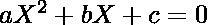
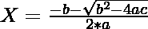
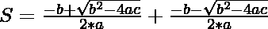
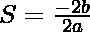
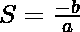
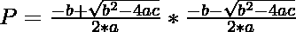
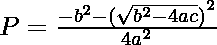
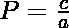

# 生成给定根的和与积的二次方程

> 原文:[https://www . geeksforgeeks . org/generate-二次方程-具有给定的根式和与积/](https://www.geeksforgeeks.org/generate-quadratic-equation-having-given-sum-and-product-of-roots/)

给定两个整数 **S** 和 **M** ，任务是求[二次方程](https://www.geeksforgeeks.org/program-to-find-the-roots-of-quadratic-equation/)的系数，使得根的和与积分别为 **S** 和 **M** 。

**示例:**

> **输入:** S = 5，M = 6
> **输出:** 1 -5 6
> **说明:**
> 对于二次方程 x<sup>2</sup>–5x+6 = 0。方程的根是 2 和 3。所以根的和是 2 + 3 = 5，根的积是 2*3 = 6。
> 
> **输入:** S = -2，M = 1
> T3】输出: 1 2 1

**方法:**给定的问题可以通过使用如下所示的**二次方程**的性质来解决:

> 
> 
> 对于上述二次方程，根由下式给出:
> 
> 和

> 根的总和由下式给出:
> 
> = >
> =>
> =>

> 根的乘积由下式给出:
> 
> 
> = > 
> = > 

从以上两个等式可知，如果 **a** 的值为 **1** ，那么 **b** 的值为 **(-1)*S** ，而 **c** 为 **P** 。因此，等式由下式给出:


下面是上述方法的实现:

## C++

```
// C++ program for the above approach

#include <bits/stdc++.h>
using namespace std;

// Function to find the quadratic
// equation from the given sum and
// products of roots
void findEquation(int S, int M)
{
    // Print the coefficients
    cout << "1 " << (-1) * S << " "
         << M << endl;
}

// Driver Code
int main()
{
    int S = 5, M = 6;
    findEquation(S, M);

    return 0;
}
```

## Java 语言(一种计算机语言，尤用于创建网站)

```
// Java program for the above approach
import java.io.*;

class GFG{

// Function to find the quadratic
// equation from the given sum and
// products of roots
public static void findEquation(int S, int M)
{

    // Print the coefficients
    System.out.println("1 " + ((-1) * S) + " " + M);   
}

// Driver code
public static void main(String[] args)
{
      int S = 5, M = 6;

    findEquation(S, M);
}
}

// This code is contributed by user_qa7r
```

## 蟒蛇 3

```
# Python3 program for the above approach

# Function to find the quadratic
# equation from the given sum and
# products of roots
def findEquation(S, M):

    # Print the coefficients
    print("1 ", ((-1) * S), " " , M)

# Driver Code
S = 5
M = 6

findEquation(S, M)

# This code is contributed by Ankita saini
```

## C#

```
// C# program for the above approach
using System;

class GFG{

// Function to find the quadratic
// equation from the given sum and
// products of roots
public static void findEquation(int S, int M)
{

    // Print the coefficients
    Console.Write("1 " + ((-1) * S) + " " + M);  
}

// Driver code
static void Main()
{
    int S = 5, M = 6;

    findEquation(S, M);
}
}

// This code is contributed by code_hunt
```

## java 描述语言

```
<script>

// Javascript program for the above approach

// Function to find the quadratic
// equation from the given sum and
// products of roots
function findEquation(S, M)
{

    // Print the coefficients
    document.write("1 " + ((-1) * S) + " " + M);   
}

// Driver Code
var S = 5, M = 6;

findEquation(S, M);

// This code is contributed by Ankita saini

</script>
```

**Output:** 

```
1 -5 6
```

***时间复杂度:**O(1)*
T5**辅助空间:** O(1)