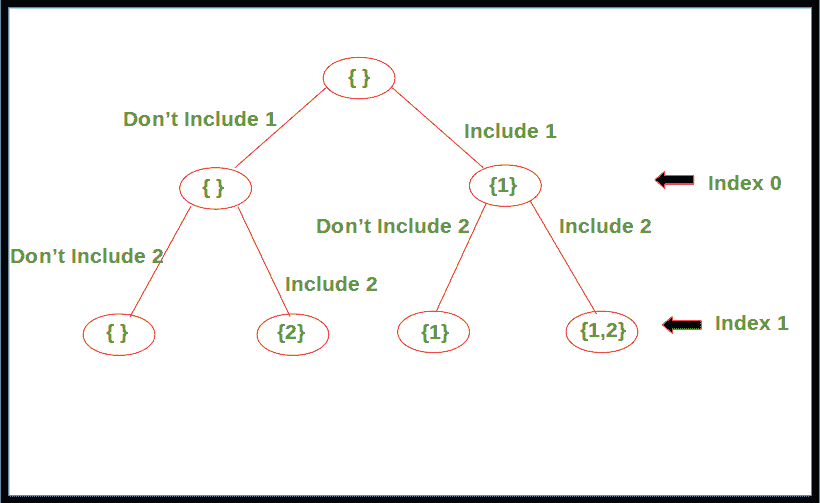

# 使用递归生成所有可能的子序列

> 原文:[https://www . geesforgeks . org/generating-all-可能的子序列-使用-递归/](https://www.geeksforgeeks.org/generating-all-possible-subsequences-using-recursion/)

给定一个数组。任务是使用递归生成并打印给定数组的所有可能的子序列。

**示例:**

```
Input : [1, 2, 3]
Output : [3], [2], [2, 3], [1], [1, 3], [1, 2], [1, 2, 3]

Input : [1, 2]
Output : [2], [1], [1, 2]

```

**方法:**对于数组中的每个元素，都有两种选择，要么包含在子序列中，要么不包含。从索引 0 开始，对数组中的每个元素应用这个，直到到达最后一个索引。一旦到达最后一个索引，打印子序列。

下图显示了数组的递归树， **arr[] = {1，2}** 。



下面是上述方法的实现。

## C++

```
// C++ code to print all possible
// subsequences for given array using
// recursion
#include <bits/stdc++.h>
using namespace std;

void printArray(vector<int> arr, int n)
{
    for (int i = 0; i < n; i++)
        cout << arr[i] << " ";
    cout << endl;
}

// Recursive function to print all
// possible subsequences for given array
void printSubsequences(vector<int> arr, int index,
                       vector<int> subarr)
{
    // Print the subsequence when reach
    // the leaf of recursion tree
    if (index == arr.size())
    {
        int l = subarr.size();

        // Condition to avoid printing
        // empty subsequence
        if (l != 0)
            printArray(subarr, l);
    }
    else
    {
        // Subsequence without including
        // the element at current index
        printSubsequences(arr, index + 1, subarr);

        subarr.push_back(arr[index]);

        // Subsequence including the element
        // at current index
        printSubsequences(arr, index + 1, subarr);
    }
    return;
}

// Driver Code
int main()
{
    vector<int> arr{1, 2, 3};
    vector<int> b;

    printSubsequences(arr, 0, b);

    return 0;
}

// This code is contributed by
// sanjeev2552
```

## Java 语言(一种计算机语言，尤用于创建网站)

```
// Java code to print all possible
// subsequences for given array using
// recursion
import java.io.*;
import java.util.*;

class GFG{

// Recursive function to print all
// possible subsequences for given array
public static void printSubsequences(int[] arr, int index,
                                     ArrayList<Integer> path)
{

    // Print the subsequence when reach
    // the leaf of recursion tree
    if (index == arr.length)
    {

        // Condition to avoid printing
        // empty subsequence
        if (path.size() > 0)
            System.out.println(path);
    }

    else
    {

        // Subsequence without including
        // the element at current index
        printSubsequences(arr, index + 1, path);

        path.add(arr[index]);

        // Subsequence including the element
        // at current index
        printSubsequences(arr, index + 1, path);

        // Backtrack to remove the recently
        // inserted element
        path.remove(path.size() - 1);
    }
    return;
}

// Driver code
public static void main(String[] args)
{
    int[] arr = { 1, 2, 3 };

      // Auxiliary space to store each path
      ArrayList<Integer> path = new ArrayList<>();

      printSubsequences(arr, 0, path);
}
}

// This code is contributed by Mukul Sharma
```

## 蟒蛇 3

```
# Python3 code to print all possible 
# subsequences for given array using 
# recursion

# Recursive function to print all
# possible subsequences for given array
def printSubsequences(arr, index, subarr):

    # Print the subsequence when reach 
    # the leaf of recursion tree
    if index == len(arr):

        # Condition to avoid printing
        # empty subsequence
        if len(subarr) != 0:
            print(subarr)

    else:
        # Subsequence without including 
        # the element at current index
        printSubsequences(arr, index + 1, subarr)

        # Subsequence including the element
        # at current index
        printSubsequences(arr, index + 1, 
                            subarr+[arr[index]])

    return

arr = [1, 2, 3]

printSubsequences(arr, 0, [])

#This code is contributed by Mayank Tyagi
```

## C#

```
// C# code to print all possible
// subsequences for given array using
// recursion
using System;
using System.Collections.Generic;
class GFG {

    // Recursive function to print all
    // possible subsequences for given array
    static void printSubsequences(int[] arr, int index, List<int> path)
    {

        // Print the subsequence when reach
        // the leaf of recursion tree
        if (index == arr.Length)
        {

            // Condition to avoid printing
            // empty subsequence
            if (path.Count > 0)
            {
                Console.Write("[");
                for(int i = 0; i < path.Count - 1; i++)
                {
                    Console.Write(path[i] + ", ");
                }
                Console.WriteLine(path[path.Count - 1] + "]");
            }
        }

        else
        {

            // Subsequence without including
            // the element at current index
            printSubsequences(arr, index + 1, path);

            path.Add(arr[index]);

            // Subsequence including the element
            // at current index
            printSubsequences(arr, index + 1, path);

            // Backtrack to remove the recently
            // inserted element
            path.RemoveAt(path.Count - 1);
        }
        return;
    }

  static void Main() {
      int[] arr = { 1, 2, 3 };

      // Auxiliary space to store each path
      List<int> path = new List<int>();

      printSubsequences(arr, 0, path);
  }
}

// This code is contributed by rameshtravel07.
```

## java 描述语言

```
<script>
// Javascript code to print all possible
// subsequences for given array using
// recursion

// Recursive function to print all
// possible subsequences for given array
function printSubsequences(arr, index, path)
{

  // Print the subsequence when reach
  // the leaf of recursion tree
  if (index == arr.length)
  {

    // Condition to avoid printing
    // empty subsequence
    if (path.length > 0) document.write(`[${path}]<br>`);
  }
  else
  {

    // Subsequence without including
    // the element at current index
    printSubsequences(arr, index + 1, path);

    path.push(arr[index]);

    // Subsequence including the element
    // at current index
    printSubsequences(arr, index + 1, path);

    // Backtrack to remove the recently
    // inserted element
    path.pop();
  }
  return;
}

// Driver code
let arr = [1, 2, 3];

// Auxiliary space to store each path
let path = new Array();

printSubsequences(arr, 0, path);

// This code is contributed by gfgking
</script>
```

**Output:** 

```
[3]
[2]
[2, 3]
[1]
[1, 3]
[1, 2]
[1, 2, 3]
```

**时间复杂度:**
