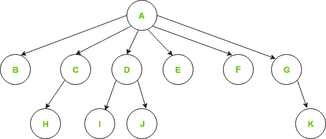

# 类属树(N-数组树)

> 原文:[https://www.geeksforgeeks.org/generic-treesn-array-trees/](https://www.geeksforgeeks.org/generic-treesn-array-trees/)

泛型树是节点的集合，其中每个节点都是一个数据结构，由记录和其子节点的引用列表组成(不允许重复引用)。与链表不同，每个节点存储多个节点的地址。每个节点都存储其子节点的地址，第一个节点的地址将存储在一个名为 root 的独立指针中。

类属树是具有以下属性的 N 元树:

1.每个节点都有很多孩子。

2.每个节点的节点数事先未知。

**例:**

> 
> 
> Generic tree

为了表示上面的树，我们必须考虑最坏的情况，即具有最多子节点的节点(在上面的例子中，6 个子节点)，并为每个节点分配那么多指针。
基于该方法的节点表示可以写成:

## C

```
//Node declaration
struct Node{
   int data;
   struct Node *firstchild;
   struct Node *secondchild;
   struct Node *thirdchild;
   struct Node *fourthchild;
   struct Node *fifthchild;
   struct Node *sixthchild;
}
```

**上述表示的缺点是:**

1.  **内存浪费**–并非所有情况下都需要所有指针。因此，存在大量的内存浪费。
2.  **未知子节点数**–每个节点的子节点数事先未知。

**简单方法:**

为了在节点中存储子节点的地址，我们可以使用数组或链表。但是我们会面临他们两个的一些问题。

1.  在**链表**中，我们不能随意访问任何孩子的地址。所以会很贵。
2.  在**数组**中，我们可以随机访问任意一个孩子的地址，但只能在其中存储固定数量的孩子地址。

**更好的方法:**

我们可以使用[动态数组](https://www.geeksforgeeks.org/how-do-dynamic-arrays-work/)来存储孩子地址的地址。我们可以随机访问任何孩子的地址，向量的大小也不是固定的。

## C

```
//Node declaration
struct Node{
    int data;
    vector<Node*> children;
}
```