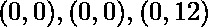
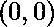
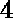

# 几何中间值

> 原文:[https://www.geeksforgeeks.org/geometric-median/](https://www.geeksforgeeks.org/geometric-median/)

在正常[中值](https://www.geeksforgeeks.org/program-for-mean-and-median-of-an-unsorted-array/)中，我们找到一个距离和最小的点。类似的概念也适用于二维空间。
给定**二维空间**中的 **N** 点，任务是找出单个点 **(x，y)** ，从该点到输入点的**距离总和**最小化**(也称为最小距离中心)。
**举例:**** 

> ****输入:** (1，1)，(3，3)
> **输出:**几何中值= (2，2)最小距离= 2.82843
> **输入:** (0，0)，(0，0)，(0，12)
> **输出:**几何中值= (0，0)最小距离= 12**

****逼近:**
乍一想，似乎问题要求我们找到给定输入点的几何中心点(换句话说，质心)的中点。因为它是输入的“中心”点，所以从中心到所有给定输入点的距离总和应该自动最小化。这个过程类似于寻找离散质量粒子的重心。第一个示例测试用例甚至给出了正确的答案。但是，当我们将同样的逻辑应用于第二个例子时，会发生什么呢？
我们可以清楚地看到的几何中心或质心位于。所以根据欧氏距离公式，从质心到所有 3 个输入点的总行程距离是但是最佳点应该是，给我们一个的总距离那么，我们错在哪里呢？
直观来看，你可以认为输入点的质心给了我们输入点的算术平均值。但是我们需要的是输入点的中心趋势，这样达到该中心趋势的成本(或者换句话说，欧几里德距离)就最小化了。这被称为一组点的[几何中间值](https://en.wikipedia.org/wiki/Geometric_median)。这有点像概念上的[中值](https://en.wikipedia.org/wiki/Median)与给定输入的[平均值](https://en.wikipedia.org/wiki/Mean)完全不同。
没有定义任何正确的算法来寻找几何中值。我们处理这类问题的方法是逼近一个解，并确定我们的解是否真的是几何中值。
**算法**
有两个重要变量:** 

*   **current _ point–存储点的 x 和 y 坐标，该点可能是几何中值。**
*   **最小距离–存储从当前点到所有输入点的欧几里德距离的总和。**

**在每次近似之后，如果我们找到距离总和较低的新点，那么我们更新当前点和到新点和新点的最小距离的值。
首先，我们找到给定点的质心，将其作为 current_point(或中值)，并将距离之和存储在最小距离中。然后，我们迭代给定的输入点，依次假设每个输入点都是中值，然后计算到其他点的距离。如果该距离小于最小距离，则我们将当前点和最小距离的旧值更新为新值。否则，旧的价值观保持不变。
然后我们进入一个 while 循环。在该循环中，我们在所有方向(左、上、右、下)从当前点移动一段距离 test_distance(本例中假设 test_distance 为 1000)。因此我们获得新积分。然后我们计算从这些新点到给定输入点的距离。如果这个距离的总和低于先前的最小距离，那么我们将当前点和最小距离的旧值更新为新值，并重复 while 循环。否则，我们将测试距离除以，然后重复 while 循环。
while 循环的终止条件是称为“下限”的某个值。数值越低，我们的近似精度越高。当下限超过测试距离时，循环终止。
以下是上述方法的实现:** 

## **卡片打印处理机（Card Print Processor 的缩写）**

```
// C++ implementation of the approach
#include <bits/stdc++.h>
using namespace std;

// To store a point in 2-D space
struct Point {
    double x, y;
};

// Test points. These points are the left,
// up, right and down relative neighbours
// (arranged circularly) to the
// current_point at a distance of
// test_distance from current_point
Point test_point[] = { { -1.0, 0.0 },
                       { 0.0, 1.0 },
                       { 1.0, 0.0 },
                       { 0.0, -1.0 } };

// Lowest Limit till which we are going
// to run the main while loop
// Lower the Limit higher the accuracy
double lower_limit = 0.01;

// Function to return the sum of Euclidean
// Distances
double distSum(Point p,
                        Point arr[], int n)
{
    double sum = 0;
    for (int i = 0; i < n; i++) {
        double distx = abs(arr[i].x - p.x);
        double disty = abs(arr[i].y - p.y);
        sum += sqrt((distx * distx) + (disty * disty));
    }

    // Return the sum of Euclidean Distances
    return sum;
}

// Function to calculate the required
// geometric median
void geometricMedian(Point arr[], int n)
{

    // Current x coordinate and y coordinate
    Point current_point;

    for (int i = 0; i < n; i++) {
        current_point.x += arr[i].x;
        current_point.y += arr[i].y;
    }

    // Here current_point becomes the
    // Geographic MidPoint
    // Or Center of Gravity of equal
    // discrete mass distributions
    current_point.x /= n;
    current_point.y /= n;

    // minimum_distance becomes sum of
    // all distances from MidPoint to
    // all given points
    double minimum_distance =
       distSum(current_point, arr, n);

    int k = 0;
    while (k < n) {
        for (int i = 0; i < n, i != k; i++) {
            Point newpoint;
            newpoint.x = arr[i].x;
            newpoint.y = arr[i].y;
            double newd =
                   distSum(newpoint, arr, n);
            if (newd < minimum_distance) {
                minimum_distance = newd;
                current_point.x = newpoint.x;
                current_point.y = newpoint.y;
            }
        }
        k++;
    }

    // Assume test_distance to be 1000
    double test_distance = 1000;
    int flag = 0;

    // Test loop for approximation starts here
    while (test_distance > lower_limit) {

        flag = 0;

        // Loop for iterating over all 4 neighbours
        for (int i = 0; i < 4; i++) {

            // Finding Neighbours done
            Point newpoint;
            newpoint.x = current_point.x
                 + (double)test_distance * test_point[i].x;
            newpoint.y = current_point.y
                 + (double)test_distance * test_point[i].y;

            // New sum of Euclidean distances
            // from the neighbor to the given
            // data points
            double newd = distSum(newpoint, arr, n);

            if (newd < minimum_distance) {

                // Approximating and changing
                // current_point
                minimum_distance = newd;
                current_point.x = newpoint.x;
                current_point.y = newpoint.y;
                flag = 1;
                break;
            }
        }

        // This means none of the 4 neighbours
        // has the new minimum distance, hence
        // we divide by 2 and reiterate while
        // loop for better approximation
        if (flag == 0)
            test_distance /= 2;
    }

    cout << "Geometric Median = ("
         << current_point.x << ", "
         << current_point.y << ")";
    cout << " with minimum distance = "
         << minimum_distance;
}

// Driver code
int main()
{

    int n = 2;
    Point arr[n];
    arr[0].x = 1;
    arr[0].y = 1;
    arr[1].x = 3;
    arr[1].y = 3;
    geometricMedian(arr, n);

    return 0;
}
```

****Output:** 

```
Geometric Median = (2, 2) with minimum distance = 2.82843
```** 

**参考:[几何中心线](https://en.wikipedia.org/wiki/Geometric_median)，[最小距离中心](http://www.geomidpoint.com/calculation.html)**