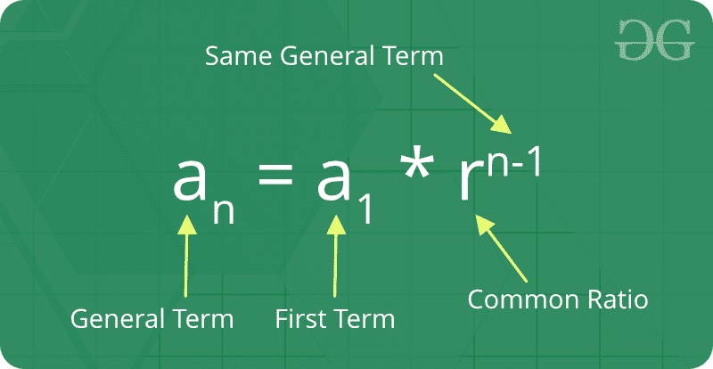
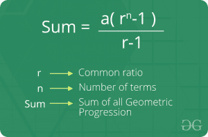

# 几何级数

> 原文:[https://www.geeksforgeeks.org/geometric-progression/](https://www.geeksforgeeks.org/geometric-progression/)

如果任意两个连续项的比率总是相同的，那么一系列数字被称为*几何级数*。简单地说，它意味着数列中的下一个数是通过将一个固定数乘以数列中的前一个数来计算的。例如，2，4，8，16 是一个 GP，因为序列中任意两个连续项的比率(公差)是相同的(4 / 2 = 8 / 4 = 16 / 8 = 2)。


**关于几何级数的事实:**

1.  **初项:**在几何级数中，第一个数称为初项。
2.  **公比:**序列中某项与其前一项的比值称为“公比”
3.  几何序列的行为取决于公比的值。如果常见比率为:
    *   正的，这些项都是与初始项相同的符号。
    *   否定，术语将在肯定和否定之间交替。
    *   大于 1 时，将呈指数增长向正或负无穷大(取决于初始项的符号)。
    *   1、级数是一个常数序列。
    *   在-1 和 1 之间，但不是零，会有指数衰减到零。
    *   -1，级数是一个交替的序列。
    *   小于-1 时，由于交替符号，绝对值呈指数增长(无符号)无穷大。

**n 的公式<sup>几何级数的第</sup>项:**
如果‘a’是第一项，‘r’是公比。因此，显式公式为



**几何级数第 n <sup>个</sup>项之和的公式:**T4】



**我们如何检验一个数列是否是几何级数？**
我们来求连续项的比值，这样就可以说给定序列的连续项的比值是 13 或者一个常数。所以这个序列形成了一个几何级数。

## C++

```
// C++ program to check if a given array
// can form geometric progression
#include <bits/stdc++.h>
using namespace std;

bool is_geometric(int arr[], int n)
{
    if (n == 1)
        return true;

    // Calculate ratio
    int ratio = arr[1] / (arr[0]);

    // Check the ratio of the remaining
    for (int i = 1; i < n; i++) {
        if ((arr[i] / (arr[i - 1])) != ratio) {
            return false;
        }
    }
    return true;
}

// Driven Program
int main()
{
    int arr[] = { 2, 6, 18, 54 };
    int n = sizeof(arr) / sizeof(arr[0]);

    (is_geometric(arr, n)) ? (cout << "True" << endl) : (cout << "False" << endl);

    return 0;
}
```

## Java 语言(一种计算机语言，尤用于创建网站)

```
// Java program to check if a given array
// can form geometric progression
import java.util.Arrays;

class GFG {

    // function to check series is
    // geometric progression or not
    static boolean is_geometric(int arr[], int n)
    {
        if (n == 1)
            return true;

        // Calculate ratio
        int ratio = arr[1] / (arr[0]);

        // Check the ratio of the remaining
        for (int i = 1; i < n; i++) {
            if ((arr[i] / (arr[i - 1])) != ratio) {
                return false;
            }
        }
        return true;
    }

    // driver code
    public static void main(String[] args)
    {
        int arr[] = { 2, 6, 18, 54 };
        int n = arr.length;

        if (is_geometric(arr, n))
            System.out.println("True");
        else
            System.out.println("False");
    }
}
```

## 蟒蛇 3

```
def is_geometric(li):
    if len(li) <= 1:
        return True

    # Calculate ratio
    ratio = li[1]/float(li[0])

    # Check the ratio of the remaining
    for i in range(1, len(li)):
        if li[i]/float(li[i-1]) != ratio:
            return False
    return True

print(is_geometric([2, 6, 18, 54]))
```

## C#

```
// C# program to check if a given array
// can form geometric progression
using System;

class Geeks {

    static bool is_geometric(int[] arr, int n)
    {
        if (n == 1)
            return true;

        // Calculate ratio
        int ratio = arr[1] / (arr[0]);

        // Check the ratio of the remaining
        for (int i = 1; i < n; i++) {
            if ((arr[i] / (arr[i - 1])) != ratio) {
                return false;
            }
        }
        return true;
    }

    // Driven Program
    public static void Main(String[] args)
    {
        int[] arr = new int[] { 2, 6, 18, 54 };
        int n = arr.Length;

        if (is_geometric(arr, n))
            Console.WriteLine("True");
        else
            Console.WriteLine("False");
    }
}
```

## 服务器端编程语言（Professional Hypertext Preprocessor 的缩写）

```
<?php
function is_geometric($arr)
{
    if (sizeof($arr) <= 1)
        return True;
    # Calculate ratio
    $ratio = $arr[1]/$arr[0];

    # Check the ratio of the remaining
    for($i=1; $i<sizeof($arr); $i++)
    {
        if (($arr[$i]/($arr[$i-1])) != $ratio)
        {
            return "Not a geometric sequence";
        }
    }       
  return "Geometric  sequence";
}
$my_arr1 = array(2, 6, 18, 54);

print_r(is_geometric($my_arr1)."\n");
print_r(is_geometric($my_arr2)."\n");
?>
```

## java 描述语言

```
<script>

// Javascript program to check if a given array
// can form geometric progression

// Function to check series is
// geometric progression or not
function is_geometric(arr, n)
{
    if (n == 1)
        return true;

    // Calculate ratio
    let ratio = parseInt(arr[1] / (arr[0]));

    // Check the ratio of the remaining
    for(let i = 1; i < n; i++)
    {
        if (parseInt((arr[i] /
                     (arr[i - 1]))) != ratio)
        {
            return false;
        }
    }
    return true;
}

// Driver code
let arr = [ 2, 6, 18, 54 ];
let n = arr.length;

(is_geometric(arr, n)) ?
(document.write("True")) :
(document.write("False"));

// This code is contributed by souravmahato348

</script>
```

**输出:**

```
True
```

**几何级数相关基础程序**

*   [打印几何级数的程序](https://www.geeksforgeeks.org/program-to-print-gp-geometric-progression/)
*   [几何级数求和程序](https://www.geeksforgeeks.org/program-sum-geometric-series/)
*   [求几何级数中缺失的数](https://www.geeksforgeeks.org/find-missing-number-geometric-progression/)
*   [几何级数第 N 项程序](https://www.geeksforgeeks.org/find-nth-term-geometric-progression-series/)
*   [在形成几何级数的排序数组中找到所有三元组](https://www.geeksforgeeks.org/find-all-triplets-in-a-sorted-array-that-forms-geometric-progression/)
*   [从数组中移除一个数字，使其成为几何级数](https://www.geeksforgeeks.org/remove-number-array-make-geometric-progression/)
*   [将给定序列转换为几何级数的最小运算次数](https://www.geeksforgeeks.org/minimum-number-of-operations-to-convert-a-given-sequence-into-a-geometric-progression/)
*   [大小为 3 的 GP(几何级数)子序列的数量](https://www.geeksforgeeks.org/number-gp-geometric-progression-subsequences-size-3/)

**更多几何级数相关问题**

*   [求数列 3，-6，12，-24 的和。。。最新条款](https://www.geeksforgeeks.org/find-the-sum-of-series-3-6-12-24-upto-n-terms/)
*   [求数列 2、5、13、35、97 的和](https://www.geeksforgeeks.org/find-the-sum-of-the-series-2-5-13-35-97/)
*   [重复连接中点形成的正方形面积](https://www.geeksforgeeks.org/area-of-squares-formed-by-joining-mid-points-repeatedly/)
*   [最长几何级数](https://www.geeksforgeeks.org/longest-geometric-progression/)

[**几何级数近期文章！**](https://www.geeksforgeeks.org/tag/geometric-progression/)