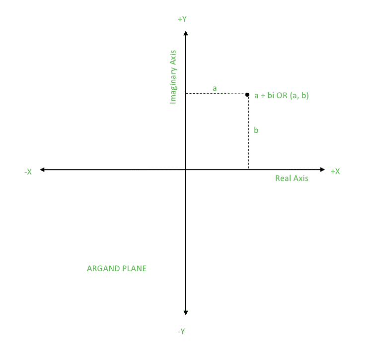
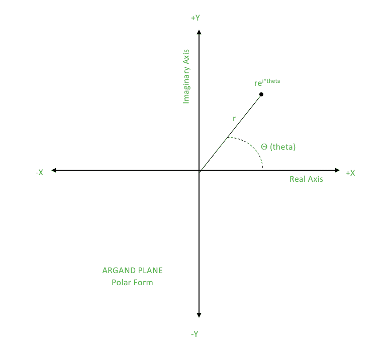

# 在 C++中使用复数的几何<:complex>|集合 1

> 原文:[https://www . geesforgeks . org/geometry-use-complex-numbers-stdcomplex-in-c/](https://www.geeksforgeeks.org/geometry-using-complex-numbers-stdcomplex-in-c/)

在解决几何问题时，定义用于在 2D 平面或欧几里得平面上指定点的点类是非常耗时的。因此，本文指定了一种更快、更聪明的方法，在 C++中使用来自 STL 的复杂类来实现同样的功能。
在实现之前，必须了解什么是复数，以及它们如何帮助表示 2D 平面上的点。

**什么是复数？**

复数的形式是

```
a + bi
where, a is the real part
b is the imaginary part
```


从图中我们可以看到，2D 平面上可以表示一个复数。因此对于一个点(a，b)，我们可以有一个复数 a + bi，其中 a 是 X 坐标，b 是 Y 坐标。
T3【重要提示: i <sup>2</sup> = -1

*   **Polar Form of Complex Number:** An alternative way of visualizing and representing complex numbers is the polar form. The polar form uses the magnitude of the complex number in form of ‘r’ and the direction of complex number in form of ‘θ’.
    A complex number with these parameters is then r(cosθ + isinθ).
    Note: θ is considered to be in radians.

    王〔t1〕= r(cosθ+isinθ)

    

*   **复数的共轭:**
    如果 z = a + bi，那么 z 的共轭就是 z’= a–bi。
    如果 z = (r，θ)，那么 z 的共轭就是 z’=(r，-θ)
    复数的共轭可以用来获得某些特殊性质，如下所示:
    *   z+z’=(a+bi)+(a–bi)= 2a
        实部=(复数+共轭)/2
    *   z–z ' =(a+bi)–(a–bi)= 2b
        虚部=(复数–共轭)/2
    *   z * z ' =(a+bi)*(a–bi)= a2–b2i 2+2abi–2abi = a2+B2
        星等 <sup>2</sup> =复数*共轭

**如何使用复数？**

让我们考虑欧几里得平面上的点 P (a，b)。现在我们做一个复数 z = a + bi，并给出两者之间的等价性。与 P 相关的一些属性有:

1.  **P 的 X 坐标:**我们可以简单地说 X 坐标= a，这样，返回 z 的实部。
2.  **P 的 Y 坐标:**我们可以简单地说 Y 坐标= b，这样，返回 z 的虚部。
3.  **P 距原点的距离(0，0):**P 距原点的距离= sqrt((a-0)<sup>2</sup>+(B- 0)<sup>2</sup>)= sqrt(a<sup>2</sup>+b<sup>2</sup>)
    z 的大小= sqrt(a<sup>2</sup>+b<sup>2</sup>)
    这样，返回 z 的大小。
4.  **OP 与 X 轴形成的角度，其中 O 为原点:**OP 与 X 轴形成的角度= tan <sup>-1</sup> (b/a)
    参数即 z 的参数θ可推导如下:
    rcosθ = a …..(i)
    rsinθ = b …..(ii)
    将(ii)除以(I)
    tanθ=(b/a)
    θ= tan<sup>-1</sup>(b/a)
    这样，返回 z 的自变量。
5.  **P 绕原点旋转:**点绕原点旋转不会改变其与原点的距离，只会改变 PO 与 X 轴的夹角。
    所以，如果我们考虑极坐标形式的复数，可以更好地理解旋转等价。
    z = re <sup>iθ</sup>
    让点逆时针旋转‘α’。
    该点现在变为 re<sup>I(θ+α)</sup>= re<sup>Iθ</sup>* 1e<sup>Iα</sup>= z * 1e<sup>Iα</sup>
    因此，返回 z *极坐标(1，α)。
    其中，极坐标(r，θ)为一般表示。

让我们考虑欧几里得平面上的点 P (a，b)和 Q (c，d)。这些基本上可以认为是向量，其长度等于从原点到 X 轴方向的距离。(如果将点作为向量，可以更好地理解许多属性，这是各种几何算法中的关键思想之一)。
现在我们考虑 z1 = a + bi，z2 = c + di。
**一些与 P 和 Q 相关的属性是:**

1.  **Vector Addition:**

    ```
    (a, b) + (c, d) = (a + c, b + d)
    z1 + z2 = (a + bi) + (c + di) = (a + c) + (b + d)i
    ```

    因此，返回 z1 + z2。

2.  **向量减法:**只需返回

    ```
    z1 – z2
    ```

3.  **Slope of line PQ:** The argument of

    ```
    z2 – z1 gives the angle of elevation
    ```

    所以，直线 PQ 的斜率由仰角的切线给出。
    因此，返回 z2–Z1 自变量的正切值。

4.  **Euclidean Distance:**

    ```
    Distance of P from Q = sqrt((a-c)2 + (b-d)2)
    Magnitude of z1 – z2 = sqrt((a-c)2 + (b-d)2)
    ```

    因此，返回 Z1–z2 的幅度。

    ```
    An important construction which will be used frequently in geometric problems is z1’z2.
    Let’s compute this:
    z1’ = a – bi
    z1’z2 = (a – bi)*(c + di) = ac + adi – bci + bd = (ac + bd) + (ad – bc)i

    ```

5.  **Dot Product:** Dot product for vectors P and Q is

    ```
    (ac + bd)
    ```

    这与上述构造的真实部分相同。因此，返回 Z1’z2 的实部。

6.  **Cross Product:** The magnitude of cross product for vectors P and Q is

    ```
    (ad – bc)
    ```

    这与上述结构的虚部相同。因此，返回 Z1’z2 的虚部。

复杂类的实现部分包含在[集合 2](https://www.geeksforgeeks.org/geometry-using-complex-numbers-c-set-2/) 中

本文由**安雅金达尔**供稿。如果你喜欢 GeeksforGeeks 并想投稿，你也可以使用[contribute.geeksforgeeks.org](http://www.contribute.geeksforgeeks.org)写一篇文章或者把你的文章邮寄到 contribute@geeksforgeeks.org。看到你的文章出现在极客博客主页上，帮助其他极客。

如果你发现任何不正确的地方，或者你想分享更多关于上面讨论的话题的信息，请写评论。