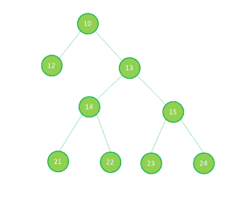
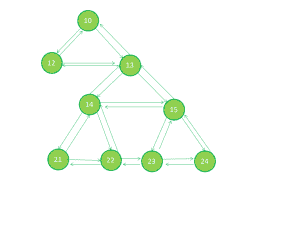

# 从 X

开始按照给定的模式获取二叉树的最后一个节点

> 原文:[https://www . geesforgeks . org/get-二叉树的最后一个节点-遵循给定的模式-从-x 开始/](https://www.geeksforgeeks.org/get-last-node-of-the-binary-tree-following-given-pattern-starting-from-x/)

给定一个二叉树，目标节点 **X** 和一个字符串 **patt** 。任务是按照从 **X** 开始的模式找到二叉树的最后一个节点。模式只能包含五种类型的字符**【p】****【l】****【r】****【m】**和**【n】**。对于遇到的任何字符:

*   **p:** 到达当前节点的父节点。
*   **l:** 到达当前节点的左子节点。
*   **r:** 到达当前节点的右子节点。
*   **m:** 到同级别左边的兄弟。
*   **n:** 到达同级别中正确的兄弟。

**注意**如果对应任何字符的节点不存在，则跳过该字符并保留在当前节点上。



**例:**

```
Input:
         10 
        /   \ 
      12    13 
           /   \ 
         14     15 
        /  \    /  \ 
       21  22  23  24 

X = 14, patt = "npmrprrlm"
Output: 22
Starting from the target node 14
n: 14 -> 15
p: 15 -> 13
m: 13 -> 12
r: 12 -> 12 (there is no right child)
p: 12 -> 10
r: 10 -> 13
r: 13 -> 15
l: 15 -> 23
m: 23 -> 22

Input:
         5
        /  \ 
      16    8

X = 16, patt = "pppp"
Output: 5
```

**进场:**

1.  从原始树创建一个辅助树，但包括三个额外的指针(父指针、左右兄弟指针)。
    *   父指针将指向当前节点的父节点。
    *   左指针将指向左兄弟。
    *   右指针将指向右边的兄弟。
2.  查看上图:
3.  创建此树后，我们可以轻松遍历给定的模式。
4.  如果任何节点不存在对应的任何字符，那么简单地跳过该字符。

以下是上述方法的实现:

## C++

```
// C++ implementation of the approach
#include <bits/stdc++.h>
using namespace std;

// A Tree node
struct Node 
{
    int key;
    struct Node *left, *right;
};

// Utility function to create a new node
Node* newNode(int key)
{
    Node* temp = new Node;
    temp->key = key;
    temp->left = temp->right = NULL;
    return (temp);
}

struct auxNode 
{
    int key;
    auxNode *left, *right, *parent;

    // Pointer will point the left node
    // at the same level in the tree
    auxNode* llNode;

    // Pointer will point the right node
    // at the same level in the tree
    auxNode* rlNode;
};

auxNode* newAuxNode(int key)
{
    auxNode* temp = new auxNode;
    temp->key = key;
    temp->left = temp->right = temp->parent
        = temp->llNode = temp->rlNode = NULL;
    return temp;
}

// Function to create the auxiliary tree
auxNode* createAuxTree(Node* root)
{
    if (root == NULL)
        return NULL;
    auxNode* auxTree = newAuxNode(root->key);

    auxTree->left = createAuxTree(root->left);
    auxTree->right = createAuxTree(root->right);
    return auxTree;
}

// Function for arranging the parent node for every node
void makeParentNodePoint(auxNode* auxTree, 
                         auxNode* prev_ptr)
{
    if (auxTree == NULL)
        return;

    // Set the parent
    if (prev_ptr != NULL) 
    {
        auxTree->parent = prev_ptr;
    }

    // Recur for left and right sub-trees
    makeParentNodePoint(auxTree->left, auxTree);
    makeParentNodePoint(auxTree->right, auxTree);
}

// Function for arranging the left and right
// node for every node at the same level
void makeSameLevelNodePoint(auxNode* auxTree)
{
    queue<auxNode*> qu;
    qu.push(auxTree);
    while (!qu.empty())
    {
        int qsize = qu.size();
        while (qsize--) 
        {
            auxNode* top_ele;
            top_ele = qu.front();
            qu.pop();
            if (qsize)
            {
                top_ele->rlNode = qu.front();
                qu.front()->llNode = top_ele;
            }
            if (top_ele->left != NULL)
            {
                qu.push(top_ele->left);
            }
            if (top_ele->right != NULL) 
            {
                qu.push(top_ele->right);
            }
        }
    }
}

// Function to return the target node address
auxNode* getTargetNodeAddress(auxNode* auxTree, int tNode)
{
    if (auxTree == NULL)
        return NULL;

    if (auxTree->key == tNode)
    {
        return auxTree;
    }
    auxNode* is_null = getTargetNodeAddress(auxTree->left, tNode);
    if (is_null != NULL)
        return is_null;
    return getTargetNodeAddress(auxTree->right, tNode);
}

// Utility function to print the last node
void printNode(auxNode* auxTree, 
               auxNode* target_node, 
               string pattern)
{

    // Perform the movement
    for (int i = 0; i < pattern.length(); i++) 
    {
        switch (pattern[i])
        {

        // Get to the parent
        case 'p':
        case 'P':
            if (target_node->parent != NULL)
            {
                target_node = target_node->parent;
            }
            break;

        // Get to the left child
        case 'l':
        case 'L':
            if (target_node->left != NULL) 
            {
                target_node = target_node->left;
            }
            break;

        // Get to the right child
        case 'r':
        case 'R':
            if (target_node->right != NULL)
                target_node = target_node->right;
            break;

        // Get to the left sibling in the same level
        case 'm':
        case 'M':
            if (target_node->llNode != NULL)
                target_node = target_node->llNode;
            break;

        // Get to the right sibling in the same level
        case 'n':
        case 'N':
            if (target_node->rlNode != NULL)
                target_node = target_node->rlNode;
            break;
        default:
            return;
        }
    }
    cout << target_node->key;
}

// Function to print the last node 
// according to the pattern
void printNodeUsingPattern(Node* root, 
                           string pattern, int tNode)
{
    // Function will create auxiliary tree same as
    // original tree with left child and right child
    auxNode* auxTree = createAuxTree(root);

    // Function will make every node 
    // point to its parent node
    makeParentNodePoint(auxTree, NULL);

    // Function will make every node point to its
    // left and right node at the same level
    makeSameLevelNodePoint(auxTree);

    // Function will give the address of the target node
    auxNode* target_node = getTargetNodeAddress(auxTree, tNode);

    // If target node found
    if (target_node != NULL)
    {

        // Function call to print the last node
        // according to the given pattern
        printNode(auxTree, target_node, pattern);
    }
    else
        cout << "-1"; 
} 

// Driver code 
int main() 
{ 
    Node* root = newNode(10); 
    root->left = newNode(12); 
    root->right = newNode(13); 
    root->right->left = newNode(14); 
    root->right->right = newNode(15); 
    root->right->left->left = newNode(21); 
    root->right->left->right = newNode(22); 
    root->right->right->left = newNode(23); 
    root->right->right->right = newNode(24); 
    int target_node = 14; 
    string str = "npmrprrlm"; 
    printNodeUsingPattern(root, str, target_node); 

    return 0; 
} 
```

## 蟒蛇 3

```
# Python3 implementation of the approach
import queue

# A Tree node
class Node: 
    def __init__(self,key): 
        self.left = None
        self.right = None
        self.key = key

class auxNode:
    def __init__(self,key):
        self.left = None
        self.right = None
        self.key = key
        self.parent = None

        # Pointer will point the left node
        # at the same level in the tree
        self.llNode = None

        # Pointer will point the right node
        # at the same level in the tree
        self.rlNode = None

def newAuxNode(key):

    temp = auxNode(key)
    return temp

def createAuxTree(root):

    if (root == None) :
        return None

    auxTree = auxNode(root.key)

    auxTree.left = createAuxTree(root.left)
    auxTree.right = createAuxTree(root.right)
    return auxTree

# Function for arranging the 
# parent node for every node
def makeParentNodePoint(auxTree, prev_ptr):

    if (auxTree == None):
        return;

    # Set the parent
    if (prev_ptr != None) :
        auxTree.parent = prev_ptr
        #print("Parent : ",auxTree.parent.key)

    # Recur for left and right sub-trees
    makeParentNodePoint(auxTree.left, auxTree)
    makeParentNodePoint(auxTree.right, auxTree)

# Function for arranging the left and right
# node for every node at the same level
def makeSameLevelNodePoint(auxTree):

    qu = queue.Queue(maxsize = 50)
    qu.put(auxTree)
    while (not qu.empty()) :
        size = qu.qsize()
        while (size) :
            size -= 1

            top_ele = qu.get();

            if (size) :
                front = qu.get()
                top_ele.rlNode = front
                front.llNode = top_ele

                # since we don't have peek function 
                # in python creating 2nd queue 
                # to store elements below peek element
                qu2 = queue.Queue(maxsize = 50)
                while not qu.empty():
                    a = qu.get()
                    qu2.put(a)

                # putting back front element 
                # in queue 1 all elements which 
                # were behind it in original queue
                qu.put(front)
                while not qu2.empty():
                    qu.put(qu2.get())

            if (top_ele.left != None) :
                qu.put(top_ele.left)

            if (top_ele.right != None) :
                qu.put(top_ele.right)

# Function to return the target node address
def getTargetNodeAddress(auxTree, tNode):

    if (auxTree == None):
        return None

    if (auxTree.key == tNode) :
        return auxTree

    is_null = getTargetNodeAddress(auxTree.left, tNode)
    if (is_null != None):
        return is_null
    return getTargetNodeAddress(auxTree.right, tNode)

# Utility function to print the last node
def printNode(auxTree, target_node, pattern):

    # Perform the movement
    for i in range(len(pattern)) :

        # Get to the parent
        if pattern[i] == 'p' or pattern[i] == 'P':

            if (target_node.parent != None): 
                target_node = target_node.parent

        # Get to the left child
        elif pattern[i] == 'l' or pattern[i] == 'L':
            if (target_node.left != None) :
                target_node = target_node.left

        # Get to the right child
        elif pattern[i] == 'r' or pattern[i] == 'R':
            if (target_node.right != None):
                target_node = target_node.right

        # Get to the left sibling in the same level
        elif pattern[i] == 'm' or pattern[i] == 'M':
            if (target_node.llNode != None):
                target_node = target_node.llNode

        # Get to the right sibling in the same level
        elif pattern[i] == 'n' or pattern[i] == 'N':
            if (target_node.rlNode != None):
                target_node = target_node.rlNode
        else:
            return

    print(target_node.key, end = ' ')

# Function to print the last node 
# according to the pattern
def printNodeUsingPattern(root, pattern, tNode):

    # Function will create auxiliary tree same as
    # original tree with left child and right child
    auxTree = createAuxTree(root)

    # Function will make every node
    # point to its parent node
    makeParentNodePoint(auxTree, None)

    # Function will make every node point to its
    # left and right node at the same level
    makeSameLevelNodePoint(auxTree)

    # Function will give the address of the target node
    target_node = getTargetNodeAddress(auxTree, tNode)

    # If target node found
    if (target_node != None) :

        # Function call to print the last node
        # according to the given pattern
        printNode(auxTree, target_node, pattern);

    else :
        print("-1")

# Driver Code
root = Node(10) 
root.left = Node(12)
root.right = Node(13)
root.right.left = Node(14)
root.right.right = Node(15)
root.right.left.left = Node(21)
root.right.left.right = Node(22)
root.right.right.left = Node(23)
root.right.right.right = Node(24)
target_node = 14
string = "npmrprrlm"

printNodeUsingPattern(root, string, target_node)

# This code is contributed by Sadik Ali 
```

## java 描述语言

```
<script>

    // JavaScript implementation of the approach

    // Node structure of the tree
    class Node
    {
        constructor(key) {
           this.left = null;
           this.right = null;
           this.key = key;
        }
    }

    // Utility function to create a new node
    function newNode(key)
    {
        let temp = new Node(key);
        return (temp);
    }

    class auxNode 
    {
        constructor(key) {
           this.left = null;
           this.right = null;
           this.parent = null;
           this.llNode = null;
           this.rlNode = null;
           this.key = key;
        }
    }

    function newAuxNode(key)
    {
        let temp = new auxNode(key);
        return temp;
    }

    // Function to create the auxiliary tree
    function createAuxTree(root)
    {
        if (root == null)
            return null;
        let auxTree = newAuxNode(root.key);

        auxTree.left = createAuxTree(root.left);
        auxTree.right = createAuxTree(root.right);
        return auxTree;
    }

    // Function for arranging the parent node for every node
    function makeParentNodePoint(auxTree, prev_ptr)
    {
        if (auxTree == null)
            return;

        // Set the parent
        if (prev_ptr != null) 
        {
            auxTree.parent = prev_ptr;
        }

        // Recur for left and right sub-trees
        makeParentNodePoint(auxTree.left, auxTree);
        makeParentNodePoint(auxTree.right, auxTree);
    }

    // Function for arranging the left and right
    // node for every node at the same level
    function makeSameLevelNodePoint(auxTree)
    {
        let qu = [];
        qu.push(auxTree);
        while (qu.length > 0)
        {
            let qsize = qu.length;
            while (qsize-- > 0) 
            {
                let top_ele;
                top_ele = qu[0];
                qu.shift();
                if (qsize > 0)
                {
                    top_ele.rlNode = qu[0];
                    qu[0].llNode = top_ele;
                }
                if (top_ele.left != null)
                {
                    qu.push(top_ele.left);
                }
                if (top_ele.right != null) 
                {
                    qu.push(top_ele.right);
                }
            }
        }
    }

    // Function to return the target node address
    function getTargetNodeAddress(auxTree, tNode)
    {
        if (auxTree == null)
            return null;

        if (auxTree.key == tNode)
        {
            return auxTree;
        }
        let is_null = getTargetNodeAddress(auxTree.left, tNode);
        if (is_null != null)
            return is_null;
        return getTargetNodeAddress(auxTree.right, tNode);
    }

    // Utility function to print the last node
    function printNode(auxTree, target_node, pattern)
    {

        // Perform the movement
        for (let i = 0; i < pattern.length; i++) 
        {
            switch (pattern[i])
            {

                // Get to the parent
                case 'p':
                case 'P':
                    if (target_node.parent != null)
                    {
                        target_node = target_node.parent;
                    }
                    break;

                // Get to the left child
                case 'l':
                case 'L':
                    if (target_node.left != null) 
                    {
                        target_node = target_node.left;
                    }
                    break;

                // Get to the right child
                case 'r':
                case 'R':
                    if (target_node.right != null)
                        target_node = target_node.right;
                    break;

                // Get to the left sibling in the same level
                case 'm':
                case 'M':
                    if (target_node.llNode != null)
                        target_node = target_node.llNode;
                    break;

                // Get to the right sibling in the same level
                case 'n':
                case 'N':
                    if (target_node.rlNode != null)
                        target_node = target_node.rlNode;
                    break;
                default:
                return;
            }
        }
        document.write(target_node.key);
    }

    // Function to print the last node 
    // according to the pattern
    function printNodeUsingPattern(root, pattern, tNode)
    {
        // Function will create auxiliary tree same as
        // original tree with left child and right child
        let auxTree = createAuxTree(root);

        // Function will make every node 
        // point to its parent node
        makeParentNodePoint(auxTree, null);

        // Function will make every node point to its
        // left and right node at the same level
        makeSameLevelNodePoint(auxTree);

        // Function will give the address of the target node
        let target_node = getTargetNodeAddress(auxTree, tNode);

        // If target node found
        if (target_node != null)
        {

            // Function call to print the last node
            // according to the given pattern
            printNode(auxTree, target_node, pattern);
        }
        else
            document.write("-1"); 
    } 

    let root = newNode(10); 
    root.left = newNode(12); 
    root.right = newNode(13); 
    root.right.left = newNode(14); 
    root.right.right = newNode(15); 
    root.right.left.left = newNode(21); 
    root.right.left.right = newNode(22); 
    root.right.right.left = newNode(23); 
    root.right.right.right = newNode(24); 
    let target_node = 14; 
    let str = "npmrprrlm"; 
    printNodeUsingPattern(root, str, target_node); 

</script>
```

**Output:** 

```
22
```