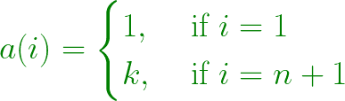

# Gijswijt 的序列

> 原文:[https://www.geeksforgeeks.org/gijswijts-sequence/](https://www.geeksforgeeks.org/gijswijts-sequence/)

[Gijswijt 的序列](https://en.wikipedia.org/wiki/Gijswijt%27s_sequence)是一个自描述的序列，其中每个项的值等于该数字前面的序列中重复的数字块的最大数量。
让我们取序列 a(i)的第 i <sup>个</sup>项，那么对于这个 Gijswijt 的序列:



其中 **k** 是最大的自然数，因此单词 **a(1)a(2)..a(n)** 可以表示为 **x*(y^k)** ，其中 **y** 的长度不为零。
**Gijswijt 的顺序**如下:

```
1, 1, 2, 1, 1, 2, 2, 2, 3, 1, ...
```

可以证明，每个自然数在这个序列中至少出现一次，但序列的增长非常缓慢。第 220 <sup>个</sup>项是 4，而第 5 项出现在靠近第**个<sup>项</sup>项**的序列中。
**示例:**

> **输入:** n = 10
> **输出:** 1，1，2，1，2，2，3，1
> **输入:** n = 220
> **输出:** 1，1，2，1，1，2，2，2，2，3，1，…，3，2，1，2，1，1，2，1，2，2，2，3，1，2，1，1，1，2，2，2

**进场:**我们要打印系列的前 n 个条款。我们将保留一个向量，它将存储序列的所有先前元素。下一项将是任何长度的重复块的最大计数。所以我们将改变长度从 1 到 n-1，然后用一个循环找出计数。
T3】例:

*   让序列是 1，1，2，1，1，2
*   取值 I 从 0 到 5 第一个模式包含“2”。
*   2 从数组末尾开始只重复一次，下一个模式是“1，2”。
*   1，2 从数组末尾开始只重复一次，下一个模式是“1，1，2”。
*   1，1，2 从数组末尾重复两次，因此计数为 2。

下面是上述方法的实现:

## C++

```
// C++ program to demonstrate
// Gijswijt's sequence

#include <bits/stdc++.h>
using namespace std;

// if the sequence is a(1)a(2)a(3)..a(n-1)
// check if the sequence can be represented as
// x*(y^k) find the largest value of k
int find_count(vector<int> ele)
{

    // count
    int count = 0;

    for (int i = 0; i < ele.size(); i++) {

        // pattern of elements of size
        // i from the end of sequence
        vector<int> p;

        // count
        int c = 0;

        // extract the pattern in a reverse order
        for (int j = ele.size() - 1;
             j >= (ele.size() - 1 - i) && j >= 0;
             j--)
            p.push_back(ele[j]);

        int j = ele.size() - 1, k = 0;

        // check how many times
        // the pattern is repeated
        while (j >= 0) {

            // if the element dosent match
            if (ele[j] != p[k])
                break;

            j--;
            k++;

            // if the end of pattern is reached
            // set value of k=0 and
            // increase the count
            if (k == p.size()) {
                c++;
                k = 0;
            }
        }
        count = max(count, c);
    }

    // return the max count
    return count;
}

// print first n terms of
// Gijswijt's sequence
void solve(int n)
{
    // set the count
    int count = 1;

    // stores the element
    vector<int> ele;

    // print the first n terms of
    // the sequence
    for (int i = 0; i < n; i++) {
        cout << count << ", ";

        // push the element
        ele.push_back(count);

        // find the count for next number
        count = find_count(ele);
    }
}

// Driver code
int main()
{
    int n = 10;

    solve(n);

    return 0;
}
```

## Java 语言(一种计算机语言，尤用于创建网站)

```
// Java program to demonstrate
// Gijswijt's sequence
import java.util.*;

class GFG
{

    // if the sequence is a(1)a(2)a(3)..a(n-1)
    // check if the sequence can be represented as
    // x*(y^k) find the largest value of k
    static int find_count(Vector<Integer> ele)
    {

        // count
        int count = 0;

        for (int i = 0; i < ele.size(); i++)
        {

            // pattern of elements of size
            // i from the end of sequence
            Vector<Integer> p = new Vector<Integer>();

            // count
            int c = 0;

            // extract the pattern in a reverse order
            for (int j = ele.size() - 1;
                     j >= (ele.size() - 1 - i) && j >= 0;
                     j--)
            {
                p.add(ele.get(j));
            }

            int j = ele.size() - 1, k = 0;

            // check how many times
            // the pattern is repeated
            while (j >= 0)
            {

                // if the element dosent match
                if (ele.get(j) != p.get(k))
                {
                    break;
                }

                j--;
                k++;

                // if the end of pattern is reached
                // set value of k=0 and
                // increase the count
                if (k == p.size())
                {
                    c++;
                    k = 0;
                }
            }
            count = Math.max(count, c);
        }

        // return the max count
        return count;
    }

    // print first n terms of
    // Gijswijt's sequence
    static void solve(int n)
    {

        // set the count
        int count = 1;

        // stores the element
        Vector<Integer> ele = new Vector<Integer>();

        // print the first n terms of
        // the sequence
        for (int i = 0; i < n; i++)
        {
            System.out.print(count + ", ");

            // push the element
            ele.add(count);

            // find the count for next number
            count = find_count(ele);
        }
    }

    // Driver code
    public static void main(String[] args)
    {
        int n = 10;

        solve(n);
    }
}

// This code is contributed by PrinciRaj1992
```

## 蟒蛇 3

```
# Python3 program to demonstrate
# Gijswijt's sequence

# if the sequence is a(1)a(2)a(3)..a(n-1)
# check if the sequence can be represented as
# x*(y^k) find the largest value of k
def find_count(ele):

    # count
    count = 0

    for i in range(len(ele)):

        # pattern of elements of size
        # i from the end of sequence
        p = []

        # count
        c = 0
        j = len(ele) - 1

        # extract the pattern in a reverse order
        while j >= (len(ele) - 1 - i) and j >= 0:
            p.append(ele[j])
            j -= 1

        j = len(ele) - 1
        k = 0

        # check how many times
        # the pattern is repeated
        while j >= 0:

            # if the element dosent match
            if ele[j] != p[k]:
                break

            j -= 1
            k += 1

            # if the end of pattern is reached
            # set value of k=0 and
            # increase the count
            if k == len(p):
                c += 1
                k = 0

        count = max(count, c)

    # return the max count
    return count

# print first n terms of
# Gijswijt's sequence
def solve(n):

    # set the count
    count = 1

    # stores the element
    ele = []

    # print the first n terms of
    # the sequence
    for i in range(n):
        print(count, end = " ")

        # push the element
        ele.append(count)

        # find the count for next number
        count = find_count(ele)

# Driver Code
if __name__ == "__main__":
    n = 10

    solve(n)

# This code is contributed by
# sanjeev2552
```

## C#

```
// C# program to demonstrate
// Gijswijt's sequence
using System;
using System.Collections.Generic;

class GFG
{

    // if the sequence is a(1)a(2)a(3)..a(n-1)
    // check if the sequence can be represented as
    // x*(y^k) find the largest value of k
    static int find_count(List<int> ele)
    {

        // count
        int count = 0;

        for (int i = 0; i < ele.Count; i++)
        {

            // pattern of elements of size
            // i from the end of sequence
            List<int> p = new List<int>();

            // count
            int c = 0, j;

            // extract the pattern in a reverse order
            for (j = ele.Count - 1;
                 j >= (ele.Count - 1 - i) && j >= 0;
                 j--)
            {
                p.Add(ele[j]);
            }
            j = ele.Count - 1;
            int k = 0;

            // check how many times
            // the pattern is repeated
            while (j >= 0)
            {

                // if the element doesn't match
                if (ele[j] != p[k])
                {
                    break;
                }

                j--;
                k++;

                // if the end of pattern is reached
                // set value of k=0 and
                // increase the count
                if (k == p.Count)
                {
                    c++;
                    k = 0;
                }
            }
            count = Math.Max(count, c);
        }

        // return the max count
        return count;
    }

    // print first n terms of
    // Gijswijt's sequence
    static void solve(int n)
    {

        // set the count
        int count = 1;

        // stores the element
        List<int> ele = new List<int>();

        // print the first n terms of
        // the sequence
        for (int i = 0; i < n; i++)
        {
            Console.Write(count + ", ");

            // push the element
            ele.Add(count);

            // find the count for next number
            count = find_count(ele);
        }
    }

    // Driver code
    public static void Main(String[] args)
    {
        int n = 10;

        solve(n);
    }
}

// This code is contributed by Rajput-Ji
```

## java 描述语言

```
<script>

// Javascript program to demonstrate
// Gijswijt's sequence

// if the sequence is a(1)a(2)a(3)..a(n-1)
// check if the sequence can be represented as
// x*(y^k) find the largest value of k
function find_count(ele)
{

    // count
    let count = 0;

    for (let i = 0; i < ele.length; i++) {

        // pattern of elements of size
        // i from the end of sequence
        let p = [];

        // count
        let c = 0;

        // extract the pattern in a reverse order
        for (let j = ele.length - 1;
             j >= (ele.length - 1 - i) && j >= 0;
             j--)
            p.push(ele[j]);

        let j = ele.length - 1, k = 0;

        // check how many times
        // the pattern is repeated
        while (j >= 0) {

            // if the element dosent match
            if (ele[j] != p[k])
                break;

            j--;
            k++;

            // if the end of pattern is reached
            // set value of k=0 and
            // increase the count
            if (k == p.length) {
                c++;
                k = 0;
            }
        }
        count = Math.max(count, c);
    }

    // return the max count
    return count;
}

// print first n terms of
// Gijswijt's sequence
function solve(n)
{
    // set the count
    let count = 1;

    // stores the element
    let ele = [];

    // print the first n terms of
    // the sequence
    for (let i = 0; i < n; i++) {
        document.write(count + ", ");

        // push the element
        ele.push(count);

        // find the count for next number
        count = find_count(ele);
    }
}

// Driver code
    let n = 10;

    solve(n);

</script>
```

**输出:**

```
1, 1, 2, 1, 1, 2, 2, 2, 3, 1, 
```