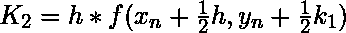
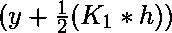
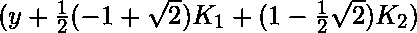
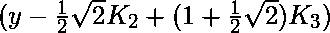

# 求解微分方程的吉尔四阶方法

> 原文:[https://www . geeksforgeeks . org/gills-四阶方法求解微分方程/](https://www.geeksforgeeks.org/gills-4th-order-method-to-solve-differential-equations/)

给定以下输入:

*   一个普通的[微分方程](https://www.geeksforgeeks.org/second-order-linear-differential-equations/)，定义 **dy/dx** 的值，形式为 **x** 和 **y** 。
    
*   y 的初始值，即 **y(0)** 。
    T3】

任务是求未知函数 y 在给定点 x 处的值，即 **y(x)** 。
**例:**

> **输入:** x0 = 0，y = 3.0，x = 5.0，h = 0.2
> **输出:** y(x) = 3.410426
> **输入:** x0 = 0，y = 1，x = 3，h = 0.3
> **输出:** y(x) = 1.669395

**方法:**
吉尔的方法用于为给定的 x 找到 y 的近似值。下面是用于根据前一个值 **y <sub>n</sub>** 计算下一个值 **y <sub>n+1</sub>** 的公式。
因此:

```
y<sub>n+1</sub> = value of y at (x = n + 1)
y<sub>n</sub> = value of y at (x = n)
where
  0 ≤ n ≤ (x - x0)/h
  h is step height
  xn+1 = x0 + h
```

计算 **y(n+1)** 值的基本公式:


![\LARGE K_{3} = h*f[x_n + \frac{1}{2}h, y_n + \frac{1}{2}(-1 + \sqrt{2})k_1 + (1 - \frac{1}{2}\sqrt{2})k_2]](img/4c4813769208f5e17160071f74a1563d.png "Rendered by QuickLaTeX.com")
![\LARGE K_{4} = h*f[x_n + h, y_n - \frac{1}{2}\sqrt{2}k_2 + (1 + \frac{1}{2}\sqrt{2})k_3] ](img/85743bc96b01cb19ad2f66c7d1d660ee.png "Rendered by QuickLaTeX.com")
![\LARGE y_{n+1} = y_{n} + \frac{1}/{6}[K_1 + (2 - \sqrt{2})K_{2} + (2 + \sqrt{2})K_3 + K_4 ] + Error Terms](img/afa1ecb5cbf025199ab7dda646789638.png "Rendered by QuickLaTeX.com")
该公式基本上使用当前的 **y <sub>n</sub>** :

*   **K <sub>1</sub>** 是基于区间开始时斜率的增量，使用 **y** 。
*   **K <sub>2</sub>** 是基于斜率的增量，使用
    
*   **K <sub>3</sub>** 是基于斜率的增量，使用
    
*   **K <sub>4</sub>** 是基于斜率的增量，使用
    

该方法为四阶方法，意味着局部截断误差为 **O(h <sup>5</sup> )** 量级。
以下是上述方法的实施:

## C++

```
// C++ program to implement Gill's method

#include <bits/stdc++.h>
using namespace std;

// A sample differential equation
// "dy/dx = (x - y)/2"
float dydx(float x, float y)
{
    return (x - y) / 2;
}

// Finds value of y for a given x
// using step size h and initial
// value y0 at x0
float Gill(float x0, float y0,
        float x, float h)
{
    // Count number of iterations
    // using step size or height h
    int n = (int)((x - x0) / h);

    // Value of K_i
    float k1, k2, k3, k4;

    // Initial value of y(0)
    float y = y0;

    // Iterate for number of iteration
    for (int i = 1; i <= n; i++) {

        // Apply Gill's Formulas to
        // find next value of y

        // Value of K1
        k1 = h * dydx(x0, y);

        // Value of K2
        k2 = h * dydx(x0 + 0.5 * h,
                    y + 0.5 * k1);

        // Value of K3
        k3 = h * dydx(x0 + 0.5 * h,
                    y + 0.5 * (-1 + sqrt(2)) * k1
                        + k2 * (1 - 0.5 * sqrt(2)));

        // Value of K4
        k4 = h * dydx(x0 + h,
                    y - (0.5 * sqrt(2)) * k2
                        + k3 * (1 + 0.5 * sqrt(2)));

        // Find the next value of y(n+1)
        // using y(n) and values of K in
        // the above steps
        y = y + (1.0 / 6) * (k1 + (2 - sqrt(2)) * k2
                            + (2 + sqrt(2)) * k3 + k4);

        // Update next value of x
        x0 = x0 + h;
    }

    // Return the final value of dy/dx
    return y;
}

// Driver Code
int main()
{
    float x0 = 0, y = 3.0,
        x = 5.0, h = 0.2;

    printf("y(x) = %.6f",
        Gill(x0, y, x, h));
    return 0;
}
```

## Java 语言(一种计算机语言，尤用于创建网站)

```
// Java program to implement Gill's method
class GFG{

// A sample differential equation
// "dy/dx = (x - y)/2"
static double dydx(double x, double y)
{
    return (x - y) / 2;
}

// Finds value of y for a given x
// using step size h and initial
// value y0 at x0
static double Gill(double x0, double y0,
                   double x, double h)
{

    // Count number of iterations
    // using step size or height h
    int n = (int)((x - x0) / h);

    // Value of K_i
    double k1, k2, k3, k4;

    // Initial value of y(0)
    double y = y0;

    // Iterate for number of iteration
    for(int i = 1; i <= n; i++)
    {

       // Apply Gill's Formulas to
       // find next value of y

       // Value of K1
       k1 = h * dydx(x0, y);

       // Value of K2
       k2 = h * dydx(x0 + 0.5 * h,
                      y + 0.5 * k1);

       // Value of K3
       k3 = h * dydx(x0 + 0.5 * h,
                      y + 0.5 * (-1 + Math.sqrt(2)) *
                     k1 + k2 * (1 - 0.5 * Math.sqrt(2)));

       // Value of K4
       k4 = h * dydx(x0 + h,
                      y - (0.5 * Math.sqrt(2)) *
                     k2 + k3 * (1 + 0.5 * Math.sqrt(2)));

       // Find the next value of y(n+1)
       // using y(n) and values of K in
       // the above steps
       y = y + (1.0 / 6) * (k1 + (2 - Math.sqrt(2)) *
                            k2 + (2 + Math.sqrt(2)) *
                            k3 + k4);

       // Update next value of x
       x0 = x0 + h;
    }

    // Return the final value of dy/dx
    return y;
}

// Driver Code
public static void main(String[] args)
{
    double x0 = 0, y = 3.0,
            x = 5.0, h = 0.2;

    System.out.printf("y(x) = %.6f", Gill(x0, y, x, h));
}
}

// This code is contributed by Amit Katiyar
```

## 蟒蛇 3

```
# Python3 program to implement Gill's method
from math import sqrt

# A sample differential equation
# "dy/dx = (x - y)/2"
def dydx(x, y):
    return (x - y) / 2

# Finds value of y for a given x
# using step size h and initial
# value y0 at x0
def Gill(x0, y0, x, h):

    # Count number of iterations
    # using step size or height h
    n = ((x - x0) / h)

    # Initial value of y(0)
    y = y0

    # Iterate for number of iteration
    for i in range(1, int(n + 1), 1):

        # Apply Gill's Formulas to
        # find next value of y

        # Value of K1
        k1 = h * dydx(x0, y)

        # Value of K2
        k2 = h * dydx(x0 + 0.5 * h,
                       y + 0.5 * k1)

        # Value of K3
        k3 = h * dydx(x0 + 0.5 * h,
                       y + 0.5 * (-1 + sqrt(2)) *
                      k1 + k2 * (1 - 0.5 * sqrt(2)))

        # Value of K4
        k4 = h * dydx(x0 + h, y - (0.5 * sqrt(2)) *
                    k2 + k3 * (1 + 0.5 * sqrt(2)))

        # Find the next value of y(n+1)
        # using y(n) and values of K in
        # the above steps
        y = y + (1 / 6) * (k1 + (2 - sqrt(2)) *
                           k2 + (2 + sqrt(2)) *
                           k3 + k4)

        # Update next value of x
        x0 = x0 + h

    # Return the final value of dy/dx
    return y

# Driver Code
if __name__ == '__main__':

    x0 = 0
    y = 3.0
    x = 5.0
    h = 0.2

    print("y(x) =", round(Gill(x0, y, x, h), 6))

# This code is contributed by Surendra_Gangwar
```

## C#

```
// C# program to implement Gill's method
using System;

class GFG{

// A sample differential equation
// "dy/dx = (x - y)/2"
static double dydx(double x, double y)
{
    return (x - y) / 2;
}

// Finds value of y for a given x
// using step size h and initial
// value y0 at x0
static double Gill(double x0, double y0,
                   double x, double h)
{

    // Count number of iterations
    // using step size or height h
    int n = (int)((x - x0) / h);

    // Value of K_i
    double k1, k2, k3, k4;

    // Initial value of y(0)
    double y = y0;

    // Iterate for number of iteration
    for(int i = 1; i <= n; i++)
    {

       // Apply Gill's Formulas to
       // find next value of y

       // Value of K1
       k1 = h * dydx(x0, y);

       // Value of K2
       k2 = h * dydx(x0 + 0.5 * h,
                      y + 0.5 * k1);

       // Value of K3
       k3 = h * dydx(x0 + 0.5 * h,
                      y + 0.5 * (-1 + Math.Sqrt(2)) *
                     k1 + k2 * (1 - 0.5 * Math.Sqrt(2)));

       // Value of K4
       k4 = h * dydx(x0 + h,
                      y - (0.5 * Math.Sqrt(2)) *
                     k2 + k3 * (1 + 0.5 * Math.Sqrt(2)));

       // Find the next value of y(n+1)
       // using y(n) and values of K in
       // the above steps
       y = y + (1.0 / 6) * (k1 + (2 - Math.Sqrt(2)) *
                            k2 + (2 + Math.Sqrt(2)) *
                            k3 + k4);

       // Update next value of x
       x0 = x0 + h;
    }

    // Return the final value of dy/dx
    return y;
}

// Driver Code
public static void Main(String[] args)
{
    double x0 = 0, y = 3.0,
            x = 5.0, h = 0.2;

    Console.Write("y(x) = {0:F6}", Gill(x0, y, x, h));
}
}

// This code is contributed by Amit Katiyar
```

## java 描述语言

```
<script>

// Javascript program to implement Gill's method

// A sample differential equation
// "dy/dx = (x - y)/2"
function dydx(x, y)
{
    return (x - y) / 2;
}

// Finds value of y for a given x
// using step size h and initial
// value y0 at x0
function Gill(x0, y0, x, h)
{

    // Count number of iterations
    // using step size or height h
    let n = ((x - x0) / h);

    // Value of K_i
    let k1, k2, k3, k4;

    // Initial value of y(0)
    let y = y0;

    // Iterate for number of iteration
    for(let i = 1; i <= n; i++)
    {

       // Apply Gill's Formulas to
       // find next value of y

       // Value of K1
       k1 = h * dydx(x0, y);

       // Value of K2
       k2 = h * dydx(x0 + 0.5 * h,
                      y + 0.5 * k1);

       // Value of K3
       k3 = h * dydx(x0 + 0.5 * h,
                      y + 0.5 * (-1 + Math.sqrt(2)) *
                     k1 + k2 * (1 - 0.5 * Math.sqrt(2)));

       // Value of K4
       k4 = h * dydx(x0 + h,
                      y - (0.5 * Math.sqrt(2)) *
                     k2 + k3 * (1 + 0.5 * Math.sqrt(2)));

       // Find the next value of y(n+1)
       // using y(n) and values of K in
       // the above steps
       y = y + (1.0 / 6) * (k1 + (2 - Math.sqrt(2)) *
                            k2 + (2 + Math.sqrt(2)) *
                            k3 + k4);

       // Update next value of x
       x0 = x0 + h;
    }

    // Return the final value of dy/dx
    return y;
}

// Driver Code

    let x0 = 0, y = 3.0,
            x = 5.0, h = 0.2;

    document.write("y(x) = ", Gill(x0, y, x, h).toFixed(6));

</script>
```

**Output:** 

```
y(x) = 3.410426
```

时间复杂度:O(n <sup>3/2</sup> )

辅助空间:0(1)