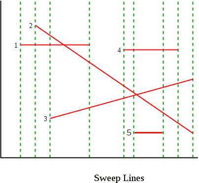

# 给定 n 条线段，找出任意两条线段是否相交

> 原文:[https://www . geesforgeks . org/给定一组线段-查找任意两个线段-相交/](https://www.geeksforgeeks.org/given-a-set-of-line-segments-find-if-any-two-segments-intersect/)

我们已经讨论了检测两个给定线段是否相交的问题。在这篇文章中，我们扩展了这个问题。这里给我们 n 条线段，我们需要找出任意两条线段是否相交。
**天真算法**解决这个问题的天真方法是检查每对线，并检查这对线是否相交。[我们可以在 O(1)时刻](https://www.geeksforgeeks.org/check-if-two-given-line-segments-intersect/)检查两条线段。因此，这种方法采用 O(n <sup>2</sup> )。
**扫线算法:**我们可以利用扫线算法在 **O(nLogn)** 时间内解决这个问题。该算法首先从左到右对沿 x 轴的端点进行排序，然后从左到右通过一条穿过所有点的垂直线，并检查交点。以下是详细的步骤。
**(1)**给定 n 行。必须有 2n 个端点来表示 n 条线。根据 x 坐标对所有点进行排序。排序时保持一个标志，以指示该点是其直线的左点还是右点。
**2)** 从最左边的点开始。每一点都要遵循
….. **a)** 如果当前点是其线段的左点，检查其线段与其上下线段的交点。并将其直线添加到*激活的*线段(可以看到左端点，但还看不到右端点的线段)。请注意，我们只考虑那些仍然活跃的邻居。
…。 **b)** 如果当前点是右点，则从活动列表中移除其线段，并检查其两个活动邻居(正上方和正下方的点)是否相交。
第二步就像从最左边点到最右边点的所有点通过一条垂直线。这就是为什么这个算法被称为扫描线算法。扫描线技术在许多其他几何算法中是有用的，例如计算 2D 沃罗诺伊图
**为了高效实现，应该使用什么数据结构？**
在步骤 2 中，我们需要存储所有活动线段。我们需要高效的做以下操作:
a)插入一条新线段
b)删除一条线段
c)根据 y 坐标值找到前任和继任者
以上操作显而易见的选择就是像 AVL 树、红黑树这样的自平衡二叉查找树。有了自平衡 BST，我们可以在 O(Logn)时间内完成上述所有操作。
同样，在步骤 1 中，我们可以使用 min heap 数据结构来代替排序。建立一个最小堆需要 O(n)个时间，每个提取最小操作需要 O(Logn)个时间(见[这个](http://courses.csail.mit.edu/6.006/spring11/lectures/lec24.pdf))。
**伪代码:**
以下伪代码不使用堆。它只是对数组进行排序。

```
sweepLineIntersection(Points[0..2n-1]):
1. Sort Points[] from left to right (according to x coordinate)

2. Create an empty Self-Balancing BST T. It will contain 
  all active line Segments ordered by y coordinate.

// Process all 2n points 
3. for i = 0 to 2n-1

    // If this point is left end of its line  
    if (Points[i].isLeft) 
       T.insert(Points[i].line())  // Insert into the tree

       // Check if this points intersects with its predecessor and successor
       if ( doIntersect(Points[i].line(), T.pred(Points[i].line()) )
         return true
       if ( doIntersect(Points[i].line(), T.succ(Points[i].line()) )
         return true

    else  // If it's a right end of its line
       // Check if its predecessor and successor intersect with each other
       if ( doIntersect(T.pred(Points[i].line(), T.succ(Points[i].line()))
         return true
       T.delete(Points[i].line())  // Delete from tree

4\. return False
```

**例:**
下面我们来考虑一下取自[这里](http://www.eecs.wsu.edu/~cook/aa/lectures/l25/node10.html)的例子。共有 5 个线段 1 、 2 、 3 、 4 、 5 。绿色虚线表示扫描线。



下面是算法遵循的步骤。从左到右的所有点都被逐一处理。我们保持一个自我平衡的二叉查找树。

*处理线段 1 的左端点*:将 1 插入到树中。该树包含 1 。没有交集。

*处理线段 2 的左端点*:检查 1 与 2 的交点。 2 插入树中。1 的交集& 2 找到了(“注意上面的伪代码在这一点返回”)。我们可以从这里继续报告所有交叉点。该树包含 1 、 2 。

*处理线段 3 的左端点:* 检查 3 与 1 的交点。没有交集。 3 插入树中。该树包含 2 、 1 、 3 。

*处理线段 1 的右端点:* 1 从树中删除。检查 2 和 3 的交点。报告 2 与 3 相交。该树包含 2 、 3。

*线段 4 左端点加工*:检查 4 线与 2 和 3 线的交点。没有交集。 4 插入到树中。该树包含 2 、 4 、 3 。

*处理线段 5 的左端点*:检查 5 与 3 的交点。没有交集。 5 插入树中。该树包含 2、4、3、5 。

*处理线段 5 的右端点:* 5 从树中删除。树上有 2 、 4 、 3 。

*处理线段 4 的右端点:* 4 从树中删除。该树包含 2 、 4 、 3 。检查 2 与 3 的交点。报告 2 与 3 的交点(注意再次报告 2 和 3 的交点。我们可以添加一些逻辑来检查重复)。树内有23。

*线段 2 和 3 的右端点被处理:* 两者都从树中删除，树变空。

## C++14

```
#include <bits/stdc++.h>
using namespace std;

// A point in 2D plane
struct Point
{
    int x, y;
};

// A line segment with left as Point
// with smaller x value and right with
// larger x value.
struct Segment
{
    Point left, right;
};

// An event for sweep line algorithm
// An event has a point, the position
// of point (whether left or right) and
// index of point in the original input
// array of segments.
struct Event {
    int x, y;
    bool isLeft;
    int index;
    Event(int x, int y, bool l, int i) : x(x), y(y), isLeft(l), index(i) {}

    // This is for maintaining the order in set.
    bool operator<(const Event& e) const {
            if(y==e.y)return x<e.x;
            return y < e.y;
    }
};

// Given three collinear points p, q, r, the function checks if
// point q lies on line segment 'pr'
bool onSegment(Point p, Point q, Point r)
{
    if (q.x <= max(p.x, r.x) && q.x >= min(p.x, r.x) &&
        q.y <= max(p.y, r.y) && q.y >= min(p.y, r.y))
       return true;

    return false;
}

// To find orientation of ordered triplet (p, q, r).
// The function returns following values
// 0 --> p, q and r are collinear
// 1 --> Clockwise
// 2 --> Counterclockwise
int orientation(Point p, Point q, Point r)
{
    // See https://www.geeksforgeeks.org/orientation-3-ordered-points/
    // for details of below formula.
    int val = (q.y - p.y) * (r.x - q.x) -
              (q.x - p.x) * (r.y - q.y);

    if (val == 0) return 0;  // collinear

    return (val > 0)? 1: 2; // clock or counterclock wise
}

// The main function that returns true if line segment 'p1q1'
// and 'p2q2' intersect.
bool doIntersect(Segment s1, Segment s2)
{
    Point p1 = s1.left, q1 = s1.right, p2 = s2.left, q2 = s2.right;

    // Find the four orientations needed for general and
    // special cases
    int o1 = orientation(p1, q1, p2);
    int o2 = orientation(p1, q1, q2);
    int o3 = orientation(p2, q2, p1);
    int o4 = orientation(p2, q2, q1);

    // General case
    if (o1 != o2 && o3 != o4)
        return true;

    // Special Cases
    // p1, q1 and p2 are collinear and p2 lies on segment p1q1
    if (o1 == 0 && onSegment(p1, p2, q1)) return true;

    // p1, q1 and q2 are collinear and q2 lies on segment p1q1
    if (o2 == 0 && onSegment(p1, q2, q1)) return true;

    // p2, q2 and p1 are collinear and p1 lies on segment p2q2
    if (o3 == 0 && onSegment(p2, p1, q2)) return true;

     // p2, q2 and q1 are collinear and q1 lies on segment p2q2
    if (o4 == 0 && onSegment(p2, q1, q2)) return true;

    return false; // Doesn't fall in any of the above cases
}

// Find predecessor of iterator in s.
 set<Event>::iterator pred(set<Event> &s, set<Event>::iterator it) {
    return it == s.begin() ? s.end() : --it;
}

// Find successor of iterator in s.
set<Event>::iterator succ(set<Event> &s, set<Event>::iterator it) {
    return ++it;
}

// Returns true if any two lines intersect.
int isIntersect(Segment arr[], int n)
{
    unordered_map<string,int> mp;  // to note the pair for which intersection is checked already
    // Pushing all points to a vector of events
    vector<Event> e;
    for (int i = 0; i < n; ++i) {
        e.push_back(Event(arr[i].left.x, arr[i].left.y, true, i));
        e.push_back(Event(arr[i].right.x, arr[i].right.y, false, i));
    }

    // Sorting all events according to x coordinate.
    sort(e.begin(), e.end(), [](Event &e1, Event &e2) {return e1.x < e2.x;});

    // For storing active segments.
    set<Event> s;
     int ans=0;
    // Traversing through sorted points
    for (int i=0; i<2*n; i++)
    {
        Event curr = e[i];
        int index = curr.index;

        // If current point is left of its segment
        if (curr.isLeft)
        {
            // Get above and below points
            auto next = s.lower_bound(curr);
            auto prev = pred(s, next);
            // Check if current point intersects with
            // any of its adjacent
            bool flag=false;
            if (next != s.end() && doIntersect(arr[next->index], arr[index])){
                string s=to_string(next->index+1)+" "+to_string(index+1);
                if(mp.count(s)==0){mp[s]++;ans++;} //if not already checked we can increase count in map
            }
            if (prev != s.end() && doIntersect(arr[prev->index], arr[index])){
                    string s=to_string(prev->index+1)+" "+to_string(index+1);
                if(mp.count(s)==0){mp[s]++;ans++;} //if not already checked we can increase count in map
            }
            // if same line segment is there then decrease answer as it got increased twice
            if(prev != s.end() && next != s.end() && next->index==prev->index)ans--;

            // Insert current point (or event)
            s.insert(curr);
        }

        // If current point is right of its segment
        else
        {
            // Find the iterator
            auto it=s.find(Event(arr[index].left.x, arr[index].left.y, true, index));
            // Find above and below points
            auto next = succ(s, it);
            auto prev = pred(s, it);

            // If above and below point intersect
            if (next != s.end() && prev != s.end())
               {  string s=to_string(next->index+1)+" "+to_string(prev->index+1);
                    string s1=to_string(prev->index+1)+" "+to_string(next->index+1);
                   if (mp.count(s)==0&&mp.count(s1)==0&&doIntersect(arr[prev->index], arr[next->index]))
                    ans++;
                    mp[s]++;
                  }

            // Remove current segment
            s.erase(it);

        }
    }
    //print pair of lines having intersection

    for(auto &pr:mp){
        cout<<pr.first<<"\n";
    }
    return ans;
}

// Driver code
int main() {
    Segment arr[] = { {{1, 5}, {4, 5}}, {{2, 5}, {10, 1}},{{3, 2}, {10, 3}},{{6, 4}, {9, 4}},{{7, 1}, {8, 1}}};
    int n = sizeof(arr)/sizeof(arr[0]);
    cout<<isIntersect(arr, n);
    return 0;
}
```

**输出:**

```
0
```

**时间复杂度:**第一步是排序，需要 O(nLogn)时间。第二步处理 2n 个点，对于处理每个点，需要 O(Logn)时间。因此，整体时间复杂度为 O(nLogn)
**参考文献:**
[http://www . cs . uiuc . edu/~ jeffe/teaching/373/notes/x06-sweepline . pdf](http://www.cs.uiuc.edu/~jeffe/teaching/373/notes/x06-sweepline.pdf)
[http://courses . csail . MIT . edu/6.006/spring 11/讲课/LEC 24 . pdf](http://courses.csail.mit.edu/6.006/spring11/lectures/lec24.pdf)
T12】http://www.youtube.com/watch?v=dePDHVovJlE
http://www.eecs.wsu.edu/~cook/aa/lectures/l25/node10.html [](http://www.eecs.wsu.edu/~cook/aa/lectures/l25/node10.html)