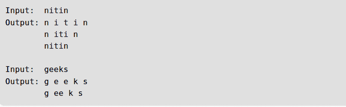

# 给定一个字符串，打印所有可能的回文分区

> 原文:[https://www . geesforgeks . org/给定-字符串-打印-所有可能-回文-分区/](https://www.geeksforgeeks.org/given-a-string-print-all-possible-palindromic-partition/)

给定一个字符串，找到给定字符串的所有可能的回文分区。
**例:**



请注意，这个问题不同于[回文分区问题](https://www.geeksforgeeks.org/dynamic-programming-set-17-palindrome-partitioning/)，这里的任务是找到输入字符串中切割最小的分区。这里我们需要打印所有可能的分区。
思路是从第一个字符开始遍历每一个子串，检查是否是回文。如果是，则将子字符串添加到解决方案中，并对剩余部分重复出现。下面是完整的算法。
以下是以上思路的实现。

## C++

```
// C++ program to print all palindromic partitions of a given string
#include<bits/stdc++.h>
using namespace std;

// A utility function to check if str is palindrome
bool isPalindrome(string str, int low, int high)
{
    while (low < high)
    {
        if (str[low] != str[high])
            return false;
        low++;
        high--;
    }
    return true;
}

// Recursive function to find all palindromic partitions of str[start..n-1]
// allPart --> A vector of vector of strings. Every vector inside it stores
//             a partition
// currPart --> A vector of strings to store current partition
void allPalPartUtil(vector<vector<string> >&allPart, vector<string> &currPart,
                   int start, int n, string str)
{
    // If 'start' has reached len
    if (start >= n)
    {
        allPart.push_back(currPart);
        return;
    }

    // Pick all possible ending points for substrings
    for (int i=start; i<n; i++)
    {
        // If substring str[start..i] is palindrome
        if (isPalindrome(str, start, i))
        {
            // Add the substring to result
            currPart.push_back(str.substr(start, i-start+1));

            // Recur for remaining remaining substring
            allPalPartUtil(allPart, currPart, i+1, n, str);

            // Remove substring str[start..i] from current
            // partition
            currPart.pop_back();
        }
    }
}

// Function to print all possible palindromic partitions of
// str. It mainly creates vectors and calls allPalPartUtil()
void allPalPartitions(string str)
{
    int n = str.length();

    // To Store all palindromic partitions
    vector<vector<string> > allPart;

    // To store current palindromic partition
    vector<string> currPart;

    // Call recursive function to generate all partitions
    // and store in allPart
    allPalPartUtil(allPart, currPart, 0, n, str);

    // Print all partitions generated by above call
    for (int i=0; i< allPart.size(); i++ )
    {
        for (int j=0; j<allPart[i].size(); j++)
            cout << allPart[i][j] << " ";
        cout << "\n";
    }
}

// Driver program
int main()
{
    string str = "nitin";
    allPalPartitions(str);
    return 0;
}
```

## Java 语言(一种计算机语言，尤用于创建网站)

```
// Java program to print all palindromic
// partitions of a given string
import java.util.ArrayList;
import java.util.Deque;
import java.util.LinkedList;

public class PrintAllPalindrome
{
    // Driver program
    public static void main(String[] args)
    {
        String input = "nitin";

        System.out.println("All possible palindrome" +
                            "partitions for " + input
                            + " are :");

        allPalPartitions(input);
    }

    // Function to print all possible
    // palindromic partitions of str.
    // It mainly creates vectors and
    // calls allPalPartUtil()
    private static void allPalPartitions(String input)
    {
        int n = input.length();

        // To Store all palindromic partitions
        ArrayList<ArrayList<String>> allPart = new ArrayList<>();

        // To store current palindromic partition
        Deque<String> currPart = new LinkedList<String>();

        // Call recursive function to generate
        // all partitions and store in allPart
        allPalPartitonsUtil(allPart, currPart, 0, n, input);

        // Print all partitions generated by above call
        for (int i = 0; i < allPart.size(); i++)
        {
            for (int j = 0; j < allPart.get(i).size(); j++)
            {
                System.out.print(allPart.get(i).get(j) + " ");
            }
            System.out.println();
        }

    }

    // Recursive function to find all palindromic
    // partitions of input[start..n-1] allPart --> A
    // ArrayList of Deque of strings. Every Deque
    // inside it stores a partition currPart --> A
    // Deque of strings to store current partition
    private static void allPalPartitonsUtil(ArrayList<ArrayList<String>> allPart,
            Deque<String> currPart, int start, int n, String input)
    {
        // If 'start' has reached len
        if (start >= n)
        {
            allPart.add(new ArrayList<>(currPart));
            return;
        }

        // Pick all possible ending points for substrings
        for (int i = start; i < n; i++)
        {

            // If substring str[start..i] is palindrome
            if (isPalindrome(input, start, i))
            {

                // Add the substring to result
                currPart.addLast(input.substring(start, i + 1));

                // Recur for remaining remaining substring
                allPalPartitonsUtil(allPart, currPart, i + 1, n, input);

                // Remove substring str[start..i] from current
                // partition
                currPart.removeLast();
            }
        }
    }

    // A utility function to check
    // if input is Palindrome
    private static boolean isPalindrome(String input,
                                    int start, int i)
    {
        while (start < i)
        {
            if (input.charAt(start++) != input.charAt(i--))
                return false;
        }
        return true;
    }
}

// This code is contributed by Prerna Saini
```

## 蟒蛇 3

```
# Python3 program to print all
# palindromic partitions of a given string

# A utility function to check if
# str is palindrome
def isPalindrome(string: str,
                 low: int, high: int):
    while low < high:
        if string[low] != string[high]:
            return False
        low += 1
        high -= 1
    return True

# Recursive function to find all
# palindromic partitions of str[start..n-1]
# allPart --> A vector of vector of strings.
#             Every vector inside it stores a partition
# currPart --> A vector of strings to store current partition
def allPalPartUtil(allPart: list, currPart: list,
                   start: int, n: int, string: str):

    # If 'start' has reached len
    if start >= n:

        # In Python list are passed by reference
        # that is why it is needed to copy first
        # and then append
        x = currPart.copy()

        allPart.append(x)
        return

    # Pick all possible ending points for substrings
    for i in range(start, n):

        # If substring str[start..i] is palindrome
        if isPalindrome(string, start, i):

            # Add the substring to result
            currPart.append(string[start:i + 1])

            # Recur for remaining remaining substring
            allPalPartUtil(allPart, currPart,
                            i + 1, n, string)

            # Remove substring str[start..i]
            # from current partition
            currPart.pop()

# Function to print all possible
# palindromic partitions of str.
# It mainly creates vectors and
# calls allPalPartUtil()
def allPalPartitions(string: str):

    n = len(string)

    # To Store all palindromic partitions
    allPart = []

    # To store current palindromic partition
    currPart = []

    # Call recursive function to generate
    # all partitions and store in allPart
    allPalPartUtil(allPart, currPart, 0, n, string)

    # Print all partitions generated by above call
    for i in range(len(allPart)):
        for j in range(len(allPart[i])):
            print(allPart[i][j], end = " ")
        print()

# Driver Code
if __name__ == "__main__":
    string = "nitin"
    allPalPartitions(string)

# This code is contributed by
# sanjeev2552
```

## C#

```
// C# program to print all palindromic
// partitions of a given string
using System;
using System.Collections.Generic;

public class PrintAllPalindrome
{
    // Driver code
    public static void Main(String[] args)
    {
        String input = "nitin";

        Console.WriteLine("All possible palindrome" +
                            "partitions for " + input
                            + " are :");

        allPalPartitions(input);
    }

    // Function to print all possible
    // palindromic partitions of str.
    // It mainly creates vectors and
    // calls allPalPartUtil()
    private static void allPalPartitions(String input)
    {
        int n = input.Length;

        // To Store all palindromic partitions
        List<List<String>> allPart = new List<List<String>>();

        // To store current palindromic partition
        List<String> currPart = new List<String>();

        // Call recursive function to generate
        // all partitions and store in allPart
        allPalPartitonsUtil(allPart, currPart, 0, n, input);

        // Print all partitions generated by above call
        for (int i = 0; i < allPart.Count; i++)
        {
            for (int j = 0; j < allPart[i].Count; j++)
            {
                Console.Write(allPart[i][j] + " ");
            }
            Console.WriteLine();
        }

    }

    // Recursive function to find all palindromic
    // partitions of input[start..n-1] allPart --> A
    // List of Deque of strings. Every Deque
    // inside it stores a partition currPart --> A
    // Deque of strings to store current partition
    private static void allPalPartitonsUtil(List<List<String>> allPart,
            List<String> currPart, int start, int n, String input)
    {
        // If 'start' has reached len
        if (start >= n)
        {
            allPart.Add(new List<String>(currPart));
            return;
        }

        // Pick all possible ending points for substrings
        for (int i = start; i < n; i++)
        {

            // If substring str[start..i] is palindrome
            if (isPalindrome(input, start, i))
            {

                // Add the substring to result
                currPart.Add(input.Substring(start, i + 1 - start));

                // Recur for remaining remaining substring
                allPalPartitonsUtil(allPart, currPart, i + 1, n, input);

                // Remove substring str[start..i] from current
                // partition
                currPart.RemoveAt(currPart.Count - 1);
            }
        }
    }

    // A utility function to check
    // if input is Palindrome
    private static bool isPalindrome(String input,
                                    int start, int i)
    {
        while (start < i)
        {
            if (input[start++] != input[i--])
                return false;
        }
        return true;
    }
}

// This code is contributed by PrinciRaj1992
```

## java 描述语言

```
<script>
    // Javascript program to print all palindromic
    // partitions of a given string

    // Function to print all possible
    // palindromic partitions of str.
    // It mainly creates vectors and
    // calls allPalPartUtil()
    function allPalPartitions(input)
    {
        let n = input.length;

        // To Store all palindromic partitions
        let allPart = [];

        // To store current palindromic partition
        let currPart = [];

        // Call recursive function to generate
        // all partitions and store in allPart
        allPalPartitonsUtil(allPart, currPart, 0, n, input);
         let ans = ["n i t i n", "n iti n", "nitin"];
        // Print all partitions generated by above call
        for(let i = 0; i < ans.length; i++)
        {   
            document.write(ans[i] + "</br>");
        }
    }

    // Recursive function to find all palindromic
    // partitions of input[start..n-1] allPart --> A
    // List of Deque of strings. Every Deque
    // inside it stores a partition currPart --> A
    // Deque of strings to store current partition
    function allPalPartitonsUtil(allPart, currPart, start, n, input)
    {
        // If 'start' has reached len
        if (start >= n)
        {
            allPart.push(currPart);
            return;
        }

        // Pick all possible ending points for substrings
        for (let i = start; i < n; i++)
        {

            // If substring str[start..i] is palindrome
            if (isPalindrome(input, start, i))
            {

                // Add the substring to result
                currPart.push(input.substring(start, i + 1 - start));

                // Recur for remaining remaining substring
                allPalPartitonsUtil(allPart, currPart, i + 1, n, input);

                // Remove substring str[start..i] from current
                // partition
                currPart.pop();
            }
        }
    }

    // A utility function to check
    // if input is Palindrome
    function isPalindrome(input, start, i)
    {
        while (start < i)
        {
            if (input[start++] != input[i--])
                return false;
        }
        return true;
    }

    let input = "nitin";

    allPalPartitions(input);

    // This code is contributed by divyesh072019.
</script>
```

**Output**

```
n i t i n 
n iti n 
nitin 
```

**输出:**

```
n i t i n
n iti n
nitin
```

**方法二:围绕每个回文展开**

其思想是将字符串拆分为长度为 1 的所有回文，即将字符串转换为其字符列表(但作为字符串数据类型)，然后通过检查其左回文和右回文(反转)是否相等来将较小的回文扩展为较大的回文。如果相等，则合并它们并递归求解新列表。此外，如果这个列表中的两个相邻字符串相等(当其中一个反转时)，合并它们也会产生回文，所以合并它们并递归求解。

## 蟒蛇 3

```
class GFG:
    def solve(self, arr):
        self.res.add(tuple(arr)) # add current partitioning to result
        if len(arr)<=1:  # Base case when there is nothing to merge
            return
        for i in range(1,len(arr)):
            if arr[i-1]==arr[i][::-1]: # When two adjacent such that one is reverse of another
                brr = arr[:i-1] + [arr[i-1]+arr[i]] + arr[i+1:]
                self.solve(brr)
            if i+1<len(arr) and arr[i-1]==arr[i+1][::-1]:  # All are individually palindrome,
              # when one left and one right of i are reverse of each other then we can merge
              # the three of them to form a new partitioning way
                brr = arr[:i-1] + [arr[i-1]+arr[i]+arr[i+1]] + arr[i+2:]
                self.solve(brr)
    def getGray(self, S):
        self.res = set()  # result is a set of tuples to avoid same partition multiple times
        self.solve(list(S)) # Call recursive function to solve for S
        return sorted(list(self.res))
# Driver Code
if __name__ == '__main__':
    ob = GFG()
    allPart = ob.getGray("geeks")
    for i in range(len(allPart)):
        for j in range(len(allPart[i])):
            print(allPart[i][j], end = " ")
        print()
# This code is contributed by Gautam Wadhwani
```

**Output**

```
g e e k s 
g ee k s 
```

本文由 [Ekta Goel](https://www.linkedin.com/pub/ekta-goel/75/12a/3a6) 供稿。如果你发现任何不正确的地方，或者你想分享更多关于上面讨论的话题的信息，请写评论。