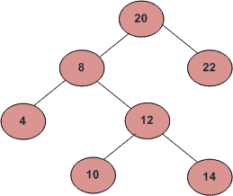

# 打印二叉树两个给定级别号之间的节点

> 原文:[https://www . geesforgeks . org/给定-二叉树-打印-节点-两个给定级别-数字/](https://www.geeksforgeeks.org/given-binary-tree-print-nodes-two-given-level-numbers/)

给定一个二叉树和两个级别号“低”和“高”，从低级别到高级别打印节点。

```
For example consider the binary tree given in below diagram. 

Input: Root of below tree, low = 2, high = 4

Output:
8 22
4 12
10 14
```



一个**简单方法**是先写一个递归函数，打印给定级别数的节点。然后从低到高循环调用递归函数。该方法的时间复杂度为 O(n)<sup>2</sup>)
我们可以使用基于队列的迭代级序遍历在 O(n)时间内打印节点**。这个想法是做简单的基于队列的级别顺序遍历。在进行有序遍历时，在末尾添加一个标记节点。每当我们看到一个标记节点，我们就增加级别号。如果级别号介于低和高之间，则打印节点。
以下是上述思路的实现。** 

## C++

```
// A C++ program to print Nodes level by level between given two levels.
#include <bits/stdc++.h>
using namespace std;

/* A binary tree Node has key, pointer to left and right children */
struct Node
{
    int key;
    struct Node* left, *right;
};

/* Given a binary tree, print nodes from level number 'low' to level
   number 'high'*/
void printLevels(Node* root, int low, int high)
{
    queue <Node *> Q;

    Node *marker = new Node; // Marker node to indicate end of level

    int level = 1;   // Initialize level number

    // Enqueue the only first level node and marker node for end of level
    Q.push(root);
    Q.push(marker);

    // Simple level order traversal loop
    while (Q.empty() == false)
    {
        // Remove the front item from queue
        Node *n = Q.front();
        Q.pop();

        // Check if end of level is reached
        if (n == marker)
        {
            // print a new line and increment level number
            cout << endl;
            level++;

            // Check if marker node was last node in queue or
            // level number is beyond the given upper limit
            if (Q.empty() == true || level > high) break;

            // Enqueue the marker for end of next level
            Q.push(marker);

            // If this is marker, then we don't need print it
            // and enqueue its children
            continue;
        }

        // If level is equal to or greater than given lower level,
        // print it
        if (level >= low)
            cout << n->key << " ";

        // Enqueue children of non-marker node
        if (n->left != NULL)  Q.push(n->left);
        if (n->right != NULL) Q.push(n->right);
    }
}

/* Helper function that allocates a new Node with the
   given key and NULL left and right pointers. */
Node* newNode(int key)
{
    Node* temp = new Node;
    temp->key = key;
    temp->left = temp->right = NULL;
    return (temp);
}

/* Driver program to test above functions*/
int main()
{
    // Let us construct the BST shown in the above figure
    struct Node *root        = newNode(20);
    root->left               = newNode(8);
    root->right              = newNode(22);
    root->left->left         = newNode(4);
    root->left->right        = newNode(12);
    root->left->right->left  = newNode(10);
    root->left->right->right = newNode(14);

    cout << "Level Order traversal between given two levels is";
    printLevels(root, 2, 3);

    return 0;
}
```

## Java 语言(一种计算机语言，尤用于创建网站)

```
// Java program to print Nodes level by level between given two levels
import java.util.LinkedList;
import java.util.Queue;

/* A binary tree Node has key, pointer to left and right children */
class Node
{
    int data;
    Node left, right;

    public Node(int item)
    {
        data = item;
        left = right = null;
    }
}

class BinaryTree
{
    Node root;

    /* Given a binary tree, print nodes from level number 'low' to level
       number 'high'*/
    void printLevels(Node node, int low, int high)
    {
        Queue<Node> Q = new LinkedList<>();

        Node  marker = new Node(4); // Marker node to indicate end of level

        int level = 1;   // Initialize level number

        // Enqueue the only first level node and marker node for end of level
        Q.add(node);
        Q.add(marker);

        // Simple level order traversal loop
        while (Q.isEmpty() == false)
        {
            // Remove the front item from queue
            Node  n = Q.peek();
            Q.remove();

            // Check if end of level is reached
            if (n == marker)
            {
                // print a new line and increment level number
                System.out.println("");
                level++;

                // Check if marker node was last node in queue or
                // level number is beyond the given upper limit
                if (Q.isEmpty() == true || level > high)
                    break;

                // Enqueue the marker for end of next level
                Q.add(marker);

                // If this is marker, then we don't need print it
                // and enqueue its children
                continue;
            }

            // If level is equal to or greater than given lower level,
            // print it
            if (level >= low)
                System.out.print( n.data + " ");

            // Enqueue children of non-marker node
            if (n.left != null)
                Q.add(n.left);

            if (n.right != null)
                Q.add(n.right);

        }
    }

    // Driver program to test for above functions
    public static void main(String args[])
    {
        BinaryTree tree = new BinaryTree();
        tree.root = new Node(20);
        tree.root.left = new Node(8);
        tree.root.right = new Node(22);

        tree.root.left.left = new Node(4);
        tree.root.left.right = new Node(12);
        tree.root.left.right.left = new Node(10);
        tree.root.left.right.right = new Node(14);

        System.out.print("Level Order traversal between given two levels is ");
        tree.printLevels(tree.root, 2, 3);

    }
}

// This code has been contributed by Mayank Jaiswal
```

## 计算机编程语言

```
# Python program to print nodes level by level between
# given two levels

# A binary tree node
class Node:
    # Constructor tor create a new node
    def __init__(self, key):
        self.key = key
        self.left = None
        self.right = None

# Given a binary tree, print nodes form level number 'low'
# to level number 'high'

def printLevels(root, low, high):
    Q = []

    marker  = Node(11114) # Marker node to indicate end of level

    level = 1 # Initialize level number

    # Enqueue the only first level node and marker node for
    # end of level
    Q.append(root)
    Q.append(marker)

    #print Q
    # Simple level order traversal loop
    while(len(Q) >0):
        # Remove the front item from queue
        n = Q[0]
        Q.pop(0)
        #print Q
        # Check if end of level is reached
        if n == marker:
            # print a new line and increment level number
            print
            level += 1

            # Check if marker node was last node in queue
            # or level number is beyond the given upper limit
            if len(Q) == 0 or level > high:
                break

            # Enqueue the marker for end of next level
            Q.append(marker)

            # If this is marker, then we don't need print it
            # and enqueue its children
            continue
        if level >= low:
                print n.key,

        # Enqueue children of non-marker node
        if n.left is not None:
            Q.append(n.left)
            Q.append(n.right)

# Driver program to test the above function
root = Node(20)
root.left = Node(8)
root.right = Node(22)
root.left.left = Node(4)
root.left.right = Node(12)
root.left.right.left = Node(10)
root.left.right.right = Node(14)

print "Level Order Traversal between given two levels is",
printLevels(root,2,3)

# This code is contributed by Nikhil Kumar Singh(nickzuck_007)
```

## C#

```
using System;
using System.Collections.Generic;

// c# program to print Nodes level by level between given two levels

/* A binary tree Node has key, pointer to left and right children */
public class Node
{
    public int data;
    public Node left, right;

    public Node(int item)
    {
        data = item;
        left = right = null;
    }
}

public class BinaryTree
{
    public Node root;

    /* Given a binary tree, print nodes from level number 'low' to level
       number 'high'*/
    public virtual void printLevels(Node node, int low, int high)
    {
        LinkedList<Node> Q = new LinkedList<Node>();

        Node marker = new Node(4); // Marker node to indicate end of level

        int level = 1; // Initialize level number

        // Enqueue the only first level node and marker node for end of level
        Q.AddLast(node);
        Q.AddLast(marker);

        // Simple level order traversal loop
        while (Q.Count > 0)
        {
            // Remove the front item from queue
            Node n = Q.First.Value;
            Q.RemoveFirst();

            // Check if end of level is reached
            if (n == marker)
            {
                // print a new line and increment level number
                Console.WriteLine("");
                level++;

                // Check if marker node was last node in queue or
                // level number is beyond the given upper limit
                if (Q.Count == 0 || level > high)
                {
                    break;
                }

                // Enqueue the marker for end of next level
                Q.AddLast(marker);

                // If this is marker, then we don't need print it
                // and enqueue its children
                continue;
            }

            // If level is equal to or greater than given lower level,
            // print it
            if (level >= low)
            {
                Console.Write(n.data + " ");
            }

            // Enqueue children of non-marker node
            if (n.left != null)
            {
                Q.AddLast(n.left);
            }

            if (n.right != null)
            {
                Q.AddLast(n.right);
            }

        }
    }

    // Driver program to test for above functions
    public static void Main(string[] args)
    {
        BinaryTree tree = new BinaryTree();
        tree.root = new Node(20);
        tree.root.left = new Node(8);
        tree.root.right = new Node(22);

        tree.root.left.left = new Node(4);
        tree.root.left.right = new Node(12);
        tree.root.left.right.left = new Node(10);
        tree.root.left.right.right = new Node(14);

        Console.Write("Level Order traversal between given two levels is ");
        tree.printLevels(tree.root, 2, 3);

    }
}

// This code is contributed by Shrikant13
```

## java 描述语言

```
<script>

// JavaScript program to print Nodes
// level by level between given two levels

/* A binary tree Node has key, pointer to
left and right children */
class Node
{
  constructor(item)
  {
    this.data = item;
    this.left = null;
    this.right = null;
  }
}

var root = null;
/* Given a binary tree, print nodes
from level number 'low' to level
   number 'high'*/
function printLevels(node, low, high)
{
    var Q = [];
    var marker = new Node(4); // Marker node to indicate end of level
    var level = 1; // Initialize level number
    // Enqueue the only first level node and
    // marker node for end of level
    Q.push(node);
    Q.push(marker);
    // Simple level order traversal loop
    while (Q.length > 0)
    {
        // Remove the front item from queue
        var n = Q[0];
        Q.shift();
        // Check if end of level is reached
        if (n == marker)
        {
            // print a new line and increment level number
            document.write("<br>");
            level++;
            // Check if marker node was last node in queue or
            // level number is beyond the given upper limit
            if (Q.length == 0 || level > high)
            {
                break;
            }
            // Enqueue the marker for end of next level
            Q.push(marker);
            // If this is marker, then we don't need print it
            // and enqueue its children
            continue;
        }
        // If level is equal to or greater than given lower level,
        // print it
        if (level >= low)
        {
            document.write(n.data + " ");
        }
        // Enqueue children of non-marker node
        if (n.left != null)
        {
            Q.push(n.left);
        }
        if (n.right != null)
        {
            Q.push(n.right);
        }
    }
}
// Driver program to test for above functions
root = new Node(20);
root.left = new Node(8);
root.right = new Node(22);
root.left.left = new Node(4);
root.left.right = new Node(12);
root.left.right.left = new Node(10);
root.left.right.right = new Node(14);
document.write("Level Order traversal between given two levels is ");
printLevels(root, 2, 3);

</script>
```

**输出**

```
Level Order traversal between given two levels is
8 22
4 12 
```

上述方法的时间复杂度为 0(n)，因为它执行简单的级别顺序遍历。

本文由**弗兰克**供稿。如果你发现任何不正确的地方，请写评论，或者你想分享更多关于上面讨论的话题的信息