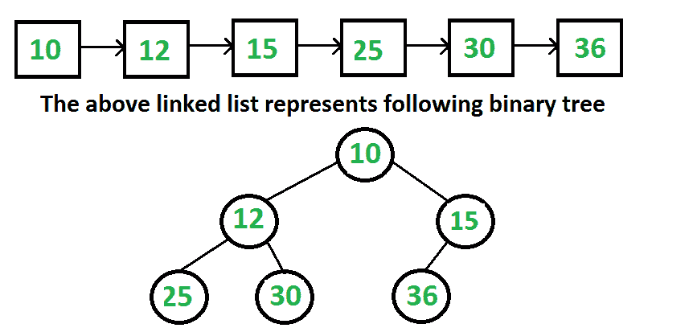

# 从链表表示中构造完整的二叉树

> 原文:[https://www . geesforgeks . org/给定-链表-完整树的表示-将其转换为链接表示/](https://www.geeksforgeeks.org/given-linked-list-representation-of-complete-tree-convert-it-to-linked-representation/)

给定完全二叉树的链表表示，构造二叉树。完整的二叉树可以用下面的方法在数组中表示。
如果根节点存储在索引 I，则其左、右子节点分别存储在索引 2*i+1、2*i+2。
假设树是用链表以同样的方式表示的，我们如何将其转换为二叉树的正常链接表示，其中每个节点都有数据、左右指针？在链表表示中，除非遍历列表，否则我们不能直接访问当前节点的子节点。



我们主要以顺序访问的形式给出层次顺序遍历。我们知道链表的头永远是树根。我们把第一个节点作为根，我们也知道接下来的两个节点是根的左右子节点。所以我们知道部分二叉树。其思想是使用队列对部分构建的二叉树进行级别顺序遍历，同时遍历链表。在每一步中，我们从队列中取出父节点，将链表的下两个节点作为父节点的子节点，并将下两个节点排队。
**1。**创建一个空队列。
T4【2】。将列表的第一个节点作为根节点，入队到队列中。
**3。**直到我们到达列表的末尾，请执行以下操作。
……**a .**从队列中取出一个节点。这是当前的父级。
……**b .**遍历列表中的两个节点，将它们添加为当前父节点的子节点。
……**c .**将两个节点排入队列。
下面是在 C++中实现相同功能的代码。

## C++

```
// C++ program to create a Complete Binary tree from its Linked List
// Representation
#include <iostream>
#include <string>
#include <queue>
using namespace std;

// Linked list node
struct ListNode
{
    int data;
    ListNode* next;
};

// Binary tree node structure
struct BinaryTreeNode
{
    int data;
    BinaryTreeNode *left, *right;
};

// Function to insert a node at the beginning of the Linked List
void push(struct ListNode** head_ref, int new_data)
{
    // allocate node and assign data
    struct ListNode* new_node = new ListNode;
    new_node->data = new_data;

    // link the old list off the new node
    new_node->next = (*head_ref);

    // move the head to point to the new node
    (*head_ref)    = new_node;
}

// method to create a new binary tree node from the given data
BinaryTreeNode* newBinaryTreeNode(int data)
{
    BinaryTreeNode *temp = new BinaryTreeNode;
    temp->data = data;
    temp->left = temp->right = NULL;
    return temp;
}

// converts a given linked list representing a complete binary tree into the
// linked representation of binary tree.
void convertList2Binary(ListNode *head, BinaryTreeNode* &root)
{
    // queue to store the parent nodes
    queue<BinaryTreeNode *> q;

    // Base Case
    if (head == NULL)
    {
        root = NULL; // Note that root is passed by reference
        return;
    }

    // 1.) The first node is always the root node, and add it to the queue
    root = newBinaryTreeNode(head->data);
    q.push(root);

    // advance the pointer to the next node
    head = head->next;

    // until the end of linked list is reached, do the following steps
    while (head)
    {
        // 2.a) take the parent node from the q and remove it from q
        BinaryTreeNode* parent = q.front();
        q.pop();

        // 2.c) take next two nodes from the linked list. We will add
        // them as children of the current parent node in step 2.b. Push them
        // into the queue so that they will be parents to the future nodes
        BinaryTreeNode *leftChild = NULL, *rightChild = NULL;
        leftChild = newBinaryTreeNode(head->data);
        q.push(leftChild);
        head = head->next;
        if (head)
        {
            rightChild = newBinaryTreeNode(head->data);
            q.push(rightChild);
            head = head->next;
        }

        // 2.b) assign the left and right children of parent
        parent->left = leftChild;
        parent->right = rightChild;
    }
}

// Utility function to traverse the binary tree after conversion
void inorderTraversal(BinaryTreeNode* root)
{
    if (root)
    {
        inorderTraversal( root->left );
        cout << root->data << " ";
        inorderTraversal( root->right );
    }
}

// Driver program to test above functions
int main()
{
    // create a linked list shown in above diagram
    struct ListNode* head = NULL;
    push(&head, 36);  /* Last node of Linked List */
    push(&head, 30);
    push(&head, 25);
    push(&head, 15);
    push(&head, 12);
    push(&head, 10); /* First node of Linked List */

    BinaryTreeNode *root;
    convertList2Binary(head, root);

    cout << "Inorder Traversal of the constructed Binary Tree is: \n";
    inorderTraversal(root);
    return 0;
}
```

## Java 语言(一种计算机语言，尤用于创建网站)

```
// Java program to create complete Binary Tree from its Linked List
// representation

// importing necessary classes
import java.util.*;

// A linked list node
class ListNode
{
    int data;
    ListNode next;
    ListNode(int d)
    {
        data = d;
        next = null;
    }
}

// A binary tree node
class BinaryTreeNode
{
    int data;
    BinaryTreeNode left, right = null;
    BinaryTreeNode(int data)
    {
        this.data = data;
        left = right = null;
    }
}

class BinaryTree
{
    ListNode head;
    BinaryTreeNode root;

    // Function to insert a node at the beginning of
    // the Linked List
    void push(int new_data)
    {
        // allocate node and assign data
        ListNode new_node = new ListNode(new_data);

        // link the old list off the new node
        new_node.next = head;

        // move the head to point to the new node
        head = new_node;
    }

    // converts a given linked list representing a
    // complete binary tree into the linked
    // representation of binary tree.
    BinaryTreeNode convertList2Binary(BinaryTreeNode node)
    {
        // queue to store the parent nodes
        Queue<BinaryTreeNode> q =
                       new LinkedList<BinaryTreeNode>();

        // Base Case
        if (head == null)
        {
            node = null;
            return null;
        }

        // 1.) The first node is always the root node, and
        //     add it to the queue
        node = new BinaryTreeNode(head.data);
        q.add(node);

        // advance the pointer to the next node
        head = head.next;

        // until the end of linked list is reached, do the
        // following steps
        while (head != null)
        {
            // 2.a) take the parent node from the q and
            //      remove it from q
            BinaryTreeNode parent = q.peek();

            // 2.c) take next two nodes from the linked list.
            // We will add them as children of the current
            // parent node in step 2.b. Push them into the
            // queue so that they will be parents to the
            // future nodes
            BinaryTreeNode leftChild = null, rightChild = null;
            leftChild = new BinaryTreeNode(head.data);
            q.add(leftChild);
            head = head.next;
            if (head != null)
            {
                rightChild = new BinaryTreeNode(head.data);
                q.add(rightChild);
                head = head.next;
            }

            // 2.b) assign the left and right children of
            //      parent
            parent.left = leftChild;
            parent.right = rightChild;
        }

        return node;
    }

    // Utility function to traverse the binary tree
    // after conversion
    void inorderTraversal(BinaryTreeNode node)
    {
        if (node != null)
        {
            inorderTraversal(node.left);
            System.out.print(node.data + " ");
            inorderTraversal(node.right);
        }
    }

    // Driver program to test above functions
    public static void main(String[] args)
    {
        BinaryTree tree = new BinaryTree();
        tree.push(36); /* Last node of Linked List */
        tree.push(30);
        tree.push(25);
        tree.push(15);
        tree.push(12);
        tree.push(10); /* First node of Linked List */
        BinaryTreeNode node = tree.convertList2Binary(tree.root);

        System.out.println("Inorder Traversal of the"+
                        " constructed Binary Tree is:");
        tree.inorderTraversal(node);
    }
}
// This code has been contributed by Mayank Jaiswal
```

## 计算机编程语言

```
# Python program to create a Complete Binary Tree from
# its linked list representation

# Linked List node
class ListNode:

        # Constructor to create a new node
        def __init__(self, data):
            self.data = data
            self.next = None

# Binary Tree Node structure
class BinaryTreeNode:

    # Constructor to create a new node
    def __init__(self, data):
        self.data = data
        self.left = None
        self.right = None

# Class to convert the linked list to Binary Tree
class Conversion:

    # Constructor for storing head of linked list
    # and root for the Binary Tree
    def __init__(self, data = None):
        self.head = None
        self.root = None

    def push(self, new_data):

        # Creating a new linked list node and storing data
        new_node = ListNode(new_data)

        # Make next of new node as head
        new_node.next = self.head

        # Move the head to point to new node
        self.head = new_node

    def convertList2Binary(self):

        # Queue to store the parent nodes
        q = []

        # Base Case
        if self.head is None:
            self.root = None
            return

        # 1.) The first node is always the root node,
        # and add it to the queue
        self.root = BinaryTreeNode(self.head.data)
        q.append(self.root)

        # Advance the pointer to the next node
        self.head = self.head.next

        # Until th end of linked list is reached, do:
        while(self.head):

            # 2.a) Take the parent node from the q and
            # and remove it from q
            parent = q.pop(0) # Front of queue

            # 2.c) Take next two nodes from the linked list.
            # We will add them as children of the current
            # parent node in step 2.b.
            # Push them into the queue so that they will be
            # parent to the future node
            leftChild= None
            rightChild = None

            leftChild = BinaryTreeNode(self.head.data)
            q.append(leftChild)
            self.head = self.head.next
            if(self.head):
                rightChild = BinaryTreeNode(self.head.data)
                q.append(rightChild)
                self.head = self.head.next

            #2.b) Assign the left and right children of parent
            parent.left = leftChild
            parent.right = rightChild

    def inorderTraversal(self, root):
        if(root):
            self.inorderTraversal(root.left)
            print root.data,
            self.inorderTraversal(root.right)

# Driver Program to test above function

# Object of conversion class
conv = Conversion()
conv.push(36)
conv.push(30)
conv.push(25)
conv.push(15)
conv.push(12)
conv.push(10)

conv.convertList2Binary()

print "Inorder Traversal of the contructed Binary Tree is:"
conv.inorderTraversal(conv.root)

# This code is contributed by Nikhil Kumar Singh(nickzuck_007)
```

## C#

```
// C# program to create complete
// Binary Tree from its Linked List
// representation

// importing necessary classes
using System;
using System.Collections.Generic;

// A linked list node
public class ListNode
{
    public int data;
    public ListNode next;
    public ListNode(int d)
    {
        data = d;
        next = null;
    }
}

// A binary tree node
public class BinaryTreeNode
{
    public int data;
    public BinaryTreeNode left, right = null;
    public BinaryTreeNode(int data)
    {
        this.data = data;
        left = right = null;
    }
}

public class BinaryTree
{
    ListNode head;
    BinaryTreeNode root;

    // Function to insert a node at
    // the beginning of the Linked List
    void push(int new_data)
    {
        // allocate node and assign data
        ListNode new_node = new ListNode(new_data);

        // link the old list off the new node
        new_node.next = head;

        // move the head to point to the new node
        head = new_node;
    }

    // converts a given linked list representing a
    // complete binary tree into the linked
    // representation of binary tree.
    BinaryTreeNode convertList2Binary(BinaryTreeNode node)
    {
        // queue to store the parent nodes
        Queue<BinaryTreeNode> q =
                    new Queue<BinaryTreeNode>();

        // Base Case
        if (head == null)
        {
            node = null;
            return null;
        }

        // 1.) The first node is always the root node, and
        //     add it to the queue
        node = new BinaryTreeNode(head.data);
        q.Enqueue(node);

        // advance the pointer to the next node
        head = head.next;

        // until the end of linked list is reached,
        //  do the following steps
        while (head != null)
        {
            // 2.a) take the parent node from the q and
            //     remove it from q
            BinaryTreeNode parent = q.Peek();
            BinaryTreeNode pp = q.Dequeue();

            // 2.c) take next two nodes from the linked list.
            // We will add them as children of the current
            // parent node in step 2.b. Push them into the
            // queue so that they will be parents to the
            // future nodes
            BinaryTreeNode leftChild = null, rightChild = null;

            leftChild = new BinaryTreeNode(head.data);
            q.Enqueue(leftChild);
            head = head.next;

            if (head != null)
            {
                rightChild = new BinaryTreeNode(head.data);
                q.Enqueue(rightChild);
                head = head.next;
            }

            // 2.b) assign the left and right children of
            //     parent
            parent.left = leftChild;
            parent.right = rightChild;
        }

        return node;
    }

    // Utility function to traverse the binary tree
    // after conversion
    void inorderTraversal(BinaryTreeNode node)
    {
        if (node != null)
        {
            inorderTraversal(node.left);
            Console.Write(node.data + " ");
            inorderTraversal(node.right);
        }
    }

    // Driver code
    public static void Main()
    {
        BinaryTree tree = new BinaryTree();

        /* Last node of Linked List */
        tree.push(36);
        tree.push(30);
        tree.push(25);
        tree.push(15);
        tree.push(12);

        /* First node of Linked List */
        tree.push(10);
        BinaryTreeNode node = tree.convertList2Binary(tree.root);

        Console.WriteLine("Inorder Traversal of the"+
                        " constructed Binary Tree is:");
        tree.inorderTraversal(node);
    }
}

/* This code is contributed PrinciRaj1992 */
```

## java 描述语言

```
<script>

      // JavaScript program to create complete
      // Binary Tree from its Linked List
      // representation

      // importing necessary classes
      // A linked list node
      class ListNode {
        constructor(d) {
          this.data = d;
          this.next = null;
        }
      }

      // A binary tree node
      class BinaryTreeNode {
        constructor(data) {
          this.data = data;
          this.left = null;
          this.right = null;
        }
      }

      class BinaryTree {
        constructor() {
          this.head = null;
          this.root = null;
        }

        // Function to insert a node at
        // the beginning of the Linked List
        push(new_data) {
          // allocate node and assign data
          var new_node = new ListNode(new_data);

          // link the old list off the new node
          new_node.next = this.head;

          // move the head to point to the new node
          this.head = new_node;
        }

        // converts a given linked list representing a
        // complete binary tree into the linked
        // representation of binary tree.
        convertList2Binary(node) {
          // queue to store the parent nodes
          var q = [];

          // Base Case
          if (this.head == null) {
            node = null;
            return null;
          }

          // 1.) The first node is always the root node, and
          //     add it to the queue
          node = new BinaryTreeNode(this.head.data);
          q.push(node);

          // advance the pointer to the next node
          this.head = this.head.next;

          // until the end of linked list is reached,
          //  do the following steps
          while (this.head != null) {
            // 2.a) take the parent node from the q and
            //     remove it from q

            var parent = q.shift();

            // 2.c) take next two nodes from the linked list.
            // We will add them as children of the current
            // parent node in step 2.b. Push them into the
            // queue so that they will be parents to the
            // future nodes
            var leftChild = null,
              rightChild = null;

            leftChild = new BinaryTreeNode(this.head.data);
            q.push(leftChild);
            this.head = this.head.next;

            if (this.head != null) {
              rightChild = new BinaryTreeNode(this.head.data);
              q.push(rightChild);
              this.head = this.head.next;
            }

            // 2.b) assign the left and right children of
            //     parent
            parent.left = leftChild;
            parent.right = rightChild;
          }

          return node;
        }

        // Utility function to traverse the binary tree
        // after conversion
        inorderTraversal(node) {
          if (node != null) {
            this.inorderTraversal(node.left);
            document.write(node.data + " ");
            this.inorderTraversal(node.right);
          }
        }
      }

      // Driver code
      var tree = new BinaryTree();

      /* Last node of Linked List */
      tree.push(36);
      tree.push(30);
      tree.push(25);
      tree.push(15);
      tree.push(12);

      /* First node of Linked List */
      tree.push(10);
      var node = tree.convertList2Binary(tree.root);

      document.write(
     "Inorder Traversal of the" + " constructed Binary Tree is:<br>"
      );
      tree.inorderTraversal(node);

</script>
```

**Output**

```
Inorder Traversal of the constructed Binary Tree is: 
25 12 30 10 36 15 
```

**时间复杂度:**上述解的时间复杂度为 O(n)，其中 n 为节点数。

本文由 **Ravi Chandra Enaganti** 整理。如果你发现任何不正确的地方，或者你想分享更多关于上面讨论的话题的信息，请写评论。