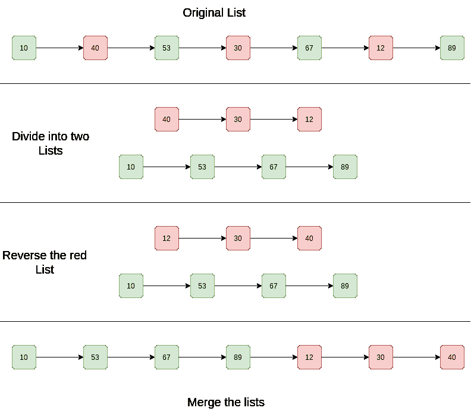

# 给定一个链表，交替反转节点并在末尾附加

> 原文：[https://www.geeksforgeeks.org/given-linked-list-reverse-alternate-nodes-append-end/](https://www.geeksforgeeks.org/given-linked-list-reverse-alternate-nodes-append-end/)

给定一个链表，交替反转节点并将其附加到列表末尾。 允许的额外空间为`O(1)`

**示例**：

```
Input: 1->2->3->4->5->6
Output: 1->3->5->6->4->2
Explanation: Two lists are 1->3->5 and 2->4->6, 
reverse the 2nd list: 6->4->2\. 
Merge the lists 

Input: 12->14->16->18->20
Output: 12->16->20->18->14
Explanation: Two lists are 12->16->20 and 14->18, 
reverse the 2nd list: 18->14\. 
Merge the lists 

```

**方法**：

1.  这个想法是要维护两个链表，一个是所有奇数位置节点的列表，另一个是所有偶数位置节点的列表。

2.  遍历给定的链表，该链表被视为奇数列表或奇数位置的节点。

3.  如果该节点是偶数节点，请将其从奇数列表中删除，并将其添加到偶数节点列表的前面。 节点添加在最前面，以保持相反的顺序。

4.  将偶数节点列表追加到奇数节点列表的末尾。

**示意图**：



## C++

```cpp

// C++ program to reverse alternate 
// nodes of a linked list and append 
// at the end 
#include <bits/stdc++.h> 
using namespace std; 

/* A linked list node */
class Node { 
public: 
    int data; 
    Node* next; 
}; 

/* Function to reverse all even positioned 
node and append at the end odd is the head  
node of given linked list */
void rearrange(Node* odd) 
{ 
    // If linked list has less than 3 
    // nodes, no change is required 
    if (odd == NULL || odd->next == NULL || odd->next->next == NULL) 
        return; 

    // even points to the beginning of even list 
    Node* even = odd->next; 

    // Remove the first even node 
    odd->next = odd->next->next; 

    // odd points to next node in odd list 
    odd = odd->next; 

    // Set terminator for even list 
    even->next = NULL; 

    // Traverse the list 
    while (odd && odd->next) { 
        // Store the next node in odd list 
        Node* temp = odd->next->next; 

        // Link the next even node at 
        // the beginning of even list 
        odd->next->next = even; 
        even = odd->next; 

        // Remove the even node from middle 
        odd->next = temp; 

        // Move odd to the next odd node 
        if (temp != NULL) 
            odd = temp; 
    } 

    // Append the even list at the end of odd list 
    odd->next = even; 
} 

/* Function to add a node at  
the beginning of Linked List */
void push(Node** head_ref, int new_data) 
{ 
    Node* new_node = new Node(); 
    new_node->data = new_data; 
    new_node->next = (*head_ref); 
    (*head_ref) = new_node; 
} 

/* Function to print nodes 
in a given linked list */
void printList(Node* node) 
{ 
    while (node != NULL) { 
        cout << node->data << " "; 
        node = node->next; 
    } 
} 

/* Driver code */
int main() 
{ 
    Node* start = NULL; 

    /* The constructed linked list is:  
    1->2->3->4->5->6->7 */
    push(&start, 7); 
    push(&start, 6); 
    push(&start, 5); 
    push(&start, 4); 
    push(&start, 3); 
    push(&start, 2); 
    push(&start, 1); 

    cout << "Linked list before calling rearrange() "; 
    printList(start); 

    rearrange(start); 

    cout << "\nLinked list after calling rearrange() "; 
    printList(start); 

    return 0; 
} 

// This code is contributed by rathbhupendra 

```

## C

```c

#include <stdio.h> 
#include <stdlib.h> 

/* A linked list node */
struct Node { 
    int data; 
    struct Node* next; 
}; 

/* Function to reverse all even positioned  
   node and append at the end 
   odd is the head node of given linked list */
void rearrange(struct Node* odd) 
{ 
    // If linked list has less than 3 nodes, 
    // no change is required 
    if (odd == NULL || odd->next == NULL 
        || odd->next->next == NULL) 
        return; 

    // even points to the beginning of even list 
    struct Node* even = odd->next; 

    // Remove the first even node 
    odd->next = odd->next->next; 

    // odd points to next node in odd list 
    odd = odd->next; 

    // Set terminator for even list 
    even->next = NULL; 

    // Traverse the  list 
    while (odd && odd->next) { 
        // Store the next node in odd list 
        struct Node* temp = odd->next->next; 

        // Link the next even node at the 
        // beginning of even list 
        odd->next->next = even; 
        even = odd->next; 

        // Remove the even node from middle 
        odd->next = temp; 

        // Move odd to the next odd node 
        if (temp != NULL) 
            odd = temp; 
    } 

    // Append the even list at the end of odd list 
    odd->next = even; 
} 

/* Function to add a node at the  
   beginning of Linked List */
void push(struct Node** head_ref, 
          int new_data) 
{ 
    struct Node* new_node 
        = (struct Node*)malloc( 
            sizeof(struct Node)); 
    new_node->data = new_data; 
    new_node->next = (*head_ref); 
    (*head_ref) = new_node; 
} 

/* Function to print nodes in a  
   given linked list */
void printList(struct Node* node) 
{ 
    while (node != NULL) { 
        printf("%d ", node->data); 
        node = node->next; 
    } 
} 

/* Driver program to test above function */
int main() 
{ 
    struct Node* start = NULL; 

    /* The constructed linked list is: 
     1->2->3->4->5->6->7 */
    push(&start, 7); 
    push(&start, 6); 
    push(&start, 5); 
    push(&start, 4); 
    push(&start, 3); 
    push(&start, 2); 
    push(&start, 1); 

    printf("\n Linked list before calling  rearrange() "); 
    printList(start); 

    rearrange(start); 

    printf("\n Linked list after calling  rearrange() "); 
    printList(start); 

    return 0; 
} 

```

## Java

```java

// Java program to reverse alternate 
// nodes of a linked list and append 
// at the end 

class LinkedList { 

    static Node head; 

    static class Node { 

        int data; 
        Node next; 

        Node(int item) 
        { 
            data = item; 
            next = null; 
        } 
    } 

    /* Function to reverse all even  
       positioned node and append at the end 
       odd is the head node of given linked list */
    void rearrange(Node odd) 
    { 

        // If linked list has less than 3 nodes, 
        // no change is required 
        if (odd == null || odd.next == null
            || odd.next.next == null) { 
            return; 
        } 

        // even points to the beginning 
        // of even list 
        Node even = odd.next; 

        // Remove the first even node 
        odd.next = odd.next.next; 

        // odd points to next node in odd list 
        odd = odd.next; 

        // Set terminator for even list 
        even.next = null; 

        // Traverse the  list 
        while (odd != null && odd.next != null) { 

            // Store the next node in odd list 
            Node temp = odd.next.next; 

            // Link the next even node at the 
            // beginning of even list 
            odd.next.next = even; 
            even = odd.next; 

            // Remove the even node from middle 
            odd.next = temp; 

            // Move odd to the next odd node 
            if (temp != null) { 
                odd = temp; 
            } 
        } 

        // Append the even list at the end of odd list 
        odd.next = even; 
    } 

    /* Function to print nodes in a given linked list */
    void printList(Node node) 
    { 
        while (node != null) { 
            System.out.print(node.data + " "); 
            node = node.next; 
        } 
    } 

    public static void main(String[] args) 
    { 
        LinkedList list = new LinkedList(); 
        list.head = new Node(1); 
        list.head.next = new Node(2); 
        list.head.next.next = new Node(3); 
        list.head.next.next.next = new Node(4); 
        list.head.next.next.next.next = new Node(5); 
        list.head.next.next.next.next.next = new Node(6); 
        list.head.next.next.next.next.next.next = new Node(7); 

        System.out.println("Linked list before calling rearrange : "); 
        list.printList(head); 

        System.out.println(""); 
        list.rearrange(head); 

        System.out.println("Linked list after calling rearrange : "); 
        list.printList(head); 
    } 
} 

```

## Python

```py

# Python program to reverse alternate nodes and append 
# at end 
# Extra space allowed - O(1) 

# Node Class 
class Node: 

    # Constructor to initialize the node object 
    def  __init__(self, data): 
        self.data = data 
        self.next = None

# Linked list class contains node object 
class LinkedList: 

    # Constructor to initialize head 
    def __init__(self): 
        self.head = None

    # Function to insert a new node at the beginning  
    def push(self, new_data): 
        new_node = Node(new_data) 
        new_node.next = self.head  
        self.head = new_node 

    def printList(self): 
        temp = self.head 
        while(temp): 
            print temp.data, 
            temp = temp.next

    def rearrange(self): 

        # If linked list has less than 3 nodes, no change 
        # is required  
        odd = self.head 
        if (odd is None or odd.next is None or 
            odd.next.next is None): 
            return 

        # Even points to the beginning of even list 
        even = odd.next

        # Remove the first even node 
        odd.next = odd.next.next

        # Odd points to next node in odd list 
        odd = odd.next 

        # Set terminator for even list 
        even.next = None

        # Traverse the list 
        while (odd and odd.next): 
            # Store the next node in odd list 
            temp = odd.next.next

            # Link the next even node at the beginning 
            # of even list 
            odd.next.next = even 
            even = odd.next

            # Remove the even node from middle 
            odd.next = temp 

            # Move odd to the next odd node 
            if temp is not None: 
                odd = temp 

        # Append the even list at the end of odd list  
        odd.next = even  

# Code execution starts here  
if __name__ == '__main__': 
    start = LinkedList() 

    # The constructed linked list is ; 
    # 1->2->3->4->5->6->7  
    start.push(7)  
    start.push(6) 
    start.push(5) 
    start.push(4) 
    start.push(3) 
    start.push(2) 
    start.push(1) 

    print "Linked list before calling  rearrange() "
    start.printList() 

    start.rearrange() 

    print "\nLinked list after calling  rearrange()"
    start.printList() 

# This code is contributed by NIkhil Kumar Singh(nickzuck_007) 

```

## C#

```cs

// C# program to reverse alternate 
// nodes of a linked list 
// and append at the end 
using System; 

public class LinkedList { 

    Node head; 

    public class Node { 

        public int data; 
        public Node next; 

        public Node(int item) 
        { 
            data = item; 
            next = null; 
        } 
    } 

    /* Function to reverse all even  
    positioned node and append at the end 
    odd is the head node of given linked list */
    void rearrange(Node odd) 
    { 

        // If linked list has less than 3 
        // nodes, no change is required 
        if (odd == null || odd.next == null || odd.next.next == null) { 
            return; 
        } 

        // even points to the beginning of even list 
        Node even = odd.next; 

        // Remove the first even node 
        odd.next = odd.next.next; 

        // odd points to next node in odd list 
        odd = odd.next; 

        // Set terminator for even list 
        even.next = null; 

        // Traverse the list 
        while (odd != null && odd.next != null) { 

            // Store the next node in odd list 
            Node temp = odd.next.next; 

            // Link the next even node at 
            // the beginning of even list 
            odd.next.next = even; 
            even = odd.next; 

            // Remove the even node from middle 
            odd.next = temp; 

            // Move odd to the next odd node 
            if (temp != null) { 
                odd = temp; 
            } 
        } 

        // Append the even list at the end of odd list 
        odd.next = even; 
    } 

    /* Function to print nodes in a given linked list */
    void printList(Node node) 
    { 
        while (node != null) { 
            Console.Write(node.data + " "); 
            node = node.next; 
        } 
    } 

    // Driver code 
    public static void Main() 
    { 
        LinkedList list = new LinkedList(); 
        list.head = new Node(1); 
        list.head.next = new Node(2); 
        list.head.next.next = new Node(3); 
        list.head.next.next.next = new Node(4); 
        list.head.next.next.next.next = new Node(5); 
        list.head.next.next.next.next.next = new Node(6); 
        list.head.next.next.next.next.next.next = new Node(7); 

        Console.WriteLine("Linked list before calling rearrange : "); 
        list.printList(list.head); 

        Console.WriteLine(""); 
        list.rearrange(list.head); 

        Console.WriteLine("Linked list after calling rearrange : "); 
        list.printList(list.head); 
    } 
} 

/* This code contributed by PrinciRaj1992 */

```

**输出**：

```
Linked list before calling  rearrange() 1 2 3 4 5 6 7
Linked list after calling  rearrange()  1 3 5 7 6 4 2

```

**复杂度分析**：

*   **时间复杂度**：`O(n)`。

    上面的代码仅遍历给定的链表。 所以时间复杂度是`O(n)`

*   **辅助空间**：`O(1)`。

    不需要多余的空间。

本文由 **Aman Gupta** 提供。 如果发现任何不正确的地方，或者您想分享有关上述主题的更多信息，请发表评论

