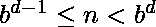
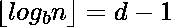
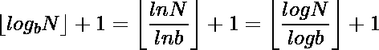

# 给定一个以十进制为基数的数 N，求其任意基数(基数 b)的位数

> 原文:[https://www . geesforgeks . org/给定-number-n-十进制-base-find-number-digits-base-b/](https://www.geeksforgeeks.org/given-number-n-decimal-base-find-number-digits-base-base-b/)

给定一个以 10 为底的数 n，求其以 b 为底的数。
约束:整体
T3】举例:T5】

```
Input : Number = 48 
        Base = 4
Output: 3
Explanation : (48)10 = (300)4

Input : Number = 1446
        Base = 7
Output: 4
Explanation : (446)10 = (4134)7
```

A **简单方法:**将十进制数转换成给定的基数 r，然后计算位数。
一种**有效的方法**:它基于数字的基数和该数字的位数之间的关系。
通常:让 n 为正整数。如果是，则的基础表示有位数字，如果是或就是这种情况。因此，n 的基数 b 表示中的位数是

在上面的等式中，使用了基数变化对数特性。所以我们计算基数的对数，我们想计算位数。取其地板值，然后加 1。
这个思路还可以进一步用于求基数 r 中给定的基数 b 的数字 n 的位数，所要做的就是将基数 10 中的数字进行转换，然后应用上面的求位数公式。当数字以 10 为基数时，计算任何基数的对数会更容易。

## C++

```
// C++ program to Find Number of digits
// in base b.
#include <iostream>
#include <math.h>
using namespace std;

// function to print number of
// digits
void findNumberOfDigits(long n, int base)
{
    // Calculating log using base
    // changing property and then
    // taking it floor and then
    // adding 1.
    int dig = (int)(floor( log(n) /
                         log(base)) + 1);

    // printing output
    cout << "The Number of digits of "
         << "Number " << n << " in base "
         << base << " is " << dig;
}

// Driver method
int main()
{
    // taking inputs
    long n = 1446;
    int base = 7;

    // calling the method
    findNumberOfDigits(n, base);
    return 0;
}

// This code is contributed by Manish Shaw
// (manishshaw1)
```

## Java 语言(一种计算机语言，尤用于创建网站)

```
// Java program to Find Number
// of digits in base b.
class GFG {

    // function to print number of digits
    static void findNumberOfDigits(long n, int base)
    {

        // Calculating log using base changing
        // property and then taking it
        // floor and then adding 1.
        int dig = (int)(Math.floor(
                        Math.log(n) / Math.log(base))
                        + 1);

        // printing output
        System.out.println("The Number of digits of Number "
                            + n + " in base " + base
                            + " is " + dig);
    }

    // Driver method   
    public static void main(String[] args)
    {
        // taking inputs
        long n = 1446;
        int base = 7;

        // calling the method
        findNumberOfDigits(n, base);
    }
}
```

## 蟒蛇 3

```
# Python3 program to Find Number of digits
# in base b.

import math

# function to print number of
# digits
def findNumberOfDigits(n, base):

    # Calculating log using base
    # changing property and then
    # taking it floor and then
    # adding 1.
    dig = (math.floor(math.log(n) /
                 math.log(base)) + 1)

    # printing output
    print ("The Number of digits of"
      " Number {} in base {} is {}"
            . format(n, base, dig))

# Driver method

# taking inputs
n = 1446
base = 7

# calling the method
findNumberOfDigits(n, base)

# This code is contributed by
# Manish Shaw (manishshaw1)
```

## C#

```
// C# program to Find Number of digits
// in base b.
using System;

class GFG {

    // function to print number of
    // digits
    static void findNumberOfDigits(long n,
                                    int b)
    {
        // Calculating log using base
        // changing property and then
        // taking it floor and then
        // adding 1.
        int dig = (int)(Math.Floor(
          Math.Log(n) / Math.Log(b)) + 1);

        // printing output
        Console.Write("The Number of digits"
           + " of Number " + n + " in base "
                        + b + " is " + dig);
    }

    // Driver method
    public static void Main()
    {
        // taking inputs
        long n = 1446;
        int b = 7;

        // calling the method
        findNumberOfDigits(n, b);
    }
}

// This code is contributed by Manish Shaw
// (manishshaw1)
```

## 服务器端编程语言（Professional Hypertext Preprocessor 的缩写）

```
<?php
// PHP program to Find Number
// of digits in base b.

// function to print
// number of digits
function findNumberOfDigits($n, $b)
{
    // Calculating log using base
    // changing property and then
    // taking it floor and then
    // adding 1.
    $dig = (int)(floor(log($n) /
                       log($b)) + 1);

    // printing output
    echo ("The Number of digits".
               " of Number ". $n.
                  " in base ".$b.
                    " is ".$dig);
}

// Driver Code
$n = 1446;
$b = 7;

// calling the method
findNumberOfDigits($n, $b);

// This code is contributed by
// Manish Shaw (manishshaw1)
?>
```

## java 描述语言

```
<script>

// Javascript program to Find Number of digits
// in base b.

// function to print number of
// digits
function findNumberOfDigits(n, base)
{
    // Calculating log using base
    // changing property and then
    // taking it floor and then
    // adding 1.
    var dig = parseInt(Math.floor( Math.log(n) /
                        Math.log(base)) + 1);

    // printing output
    document.write("The Number of digits of "
        + "Number " + n + " in base "
        + base + " is " + dig);
}

// Driver method

// taking inputs
var n = 1446;
var base = 7;

// calling the method
findNumberOfDigits(n, base);

</script>
```

**输出:**

```
The Number of digits of Number 1446 in base 7 is 4
```