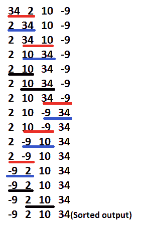

# Gnome 出来

> 原文:[https://www.geeksforgeeks.org/gnome-sort-a-stupid-one/](https://www.geeksforgeeks.org/gnome-sort-a-stupid-one/)

侏儒排序也称为愚蠢排序是基于花园侏儒排序他的花盆的概念。一个花园侏儒用以下方法分类花盆-

*   他看了看旁边的花盆和前一个；如果它们的顺序正确，他就向前踩一个底池，否则他就交换它们，向后踩一个底池。
*   如果没有前一个底池(他在底池线的起点)，他往前走；如果他旁边没有锅(他在锅线的尽头)，他就完了。

**输入**–

```
Array- arr[]  
Total elements - n
```

**算法步骤:**

*   如果你在数组的开始，那么转到右边的元素(从 arr[0]到 arr[1])。
*   如果当前数组元素大于或等于前一个数组元素，则向右移动一步

```
                   if (arr[i] >= arr[i-1])
                      i++;
```

*   如果当前数组元素小于前一个数组元素，则交换这两个元素并向后退一步

```
                       if (arr[i] < arr[i-1])
                       {
                           swap(arr[i], arr[i-1]);
                           i--;
                       } 
```

*   重复步骤 2)和 3)，直到“I”到达数组的末尾(即“n-1”)
*   如果到达数组的末尾，则停止并对数组进行排序。

**示例-**

```
   34 2 10 -9
```

*   **<u>带下划线的</u>元素**是正在考虑的一对。
*   **【红色】** 是需要对调的一对。
*   交换的结果被着色为**“蓝色”**



下面是算法的实现。

## C++

```
// A C++ Program to implement Gnome Sort
#include <iostream>
using namespace std;

// A function to sort the algorithm using gnome sort
void gnomeSort(int arr[], int n)
{
    int index = 0;

    while (index < n) {
        if (index == 0)
            index++;
        if (arr[index] >= arr[index - 1])
            index++;
        else {
            swap(arr[index], arr[index - 1]);
            index--;
        }
    }
    return;
}

// A utility function ot print an array of size n
void printArray(int arr[], int n)
{
    cout << "Sorted sequence after Gnome sort: ";
    for (int i = 0; i < n; i++)
        cout << arr[i] << " ";
    cout << "\n";
}

// Driver program to test above functions.
int main()
{
    int arr[] = { 34, 2, 10, -9 };
    int n = sizeof(arr) / sizeof(arr[0]);

    gnomeSort(arr, n);
    printArray(arr, n);

    return (0);
}
```

## Java 语言(一种计算机语言，尤用于创建网站)

```
// Java Program to implement Gnome Sort

import java.util.Arrays;
public class GFG {
    static void gnomeSort(int arr[], int n)
    {
        int index = 0;

        while (index < n) {
            if (index == 0)
                index++;
            if (arr[index] >= arr[index - 1])
                index++;
            else {
                int temp = 0;
                temp = arr[index];
                arr[index] = arr[index - 1];
                arr[index - 1] = temp;
                index--;
            }
        }
        return;
    }

    // Driver program to test above functions.
    public static void main(String[] args)
    {
        int arr[] = { 34, 2, 10, -9 };

        gnomeSort(arr, arr.length);

        System.out.print("Sorted sequence after applying Gnome sort: ");
        System.out.println(Arrays.toString(arr));
    }
}

// Code Contributed by Mohit Gupta_OMG
```

## 计算机编程语言

```
# Python program to implement Gnome Sort

# A function to sort the given list using Gnome sort
def gnomeSort( arr, n):
    index = 0
    while index < n:
        if index == 0:
            index = index + 1
        if arr[index] >= arr[index - 1]:
            index = index + 1
        else:
            arr[index], arr[index-1] = arr[index-1], arr[index]
            index = index - 1

    return arr

# Driver Code
arr = [ 34, 2, 10, -9]
n = len(arr)

arr = gnomeSort(arr, n)
print "Sorted sequence after applying Gnome Sort :",
for i in arr:
    print i,

# Contributed By Harshit Agrawal
```

## C#

```
// C# Program to implement Gnome Sort
using System;

class GFG {

    static void gnomeSort(int[] arr, int n)
    {
        int index = 0;

        while (index < n)
        {
            if (index == 0)
                index++;
            if (arr[index] >= arr[index - 1])
                index++;
            else {
                int temp = 0;
                temp = arr[index];
                arr[index] = arr[index - 1];
                arr[index - 1] = temp;
                index--;
            }
        }
        return;
    }

    // Driver program to test above functions.
    public static void Main()
    {
        int[] arr = { 34, 2, 10, -9 };

        // Function calling
        gnomeSort(arr, arr.Length);

        Console.Write("Sorted sequence after applying Gnome sort: ");

        for (int i = 0; i < arr.Length; i++)
            Console.Write(arr[i] + " ");
    }
}

// This code is contributed by Sam007
```

## 服务器端编程语言（Professional Hypertext Preprocessor 的缩写）

```
<?php
// PHP Program to implement
// Gnome Sort

// A function to sort the
// algorithm using gnome sort
function gnomeSort($arr, $n)
{
    $index = 0;

    while ($index < $n)
    {
        if ($index == 0)
            $index++;
        if ($arr[$index] >= $arr[$index - 1])
            $index++;
        else
        {
            $temp = 0;
            $temp = $arr[$index];
            $arr[$index] = $arr[$index - 1];
            $arr[$index - 1] = $temp;
            $index--;
        }
    }
    echo "Sorted sequence ",
         "after Gnome sort: ";
    for ($i = 0; $i < $n; $i++)
        echo $arr[$i] . " ";
    echo "\n";
}

// Driver Code
$arr = array(34, 2, 10, -9);
$n = count($arr);

gnomeSort($arr, $n);

// This code is contributed
// by Sam007
?>
```

## java 描述语言

```
<script>

// Javascript Program to implement Gnome Sort

   function gnomeSort(arr, n)
    {
        let index = 0;

        while (index < n) {
            if (index == 0)
                index++;
            if (arr[index] >= arr[index - 1])
                index++;
            else {
                let temp = 0;
                temp = arr[index];
                arr[index] = arr[index - 1];
                arr[index - 1] = temp;
                index--;
            }
        }
        return;
    }

// Driver Code

        let arr = [34, 2, 10, -9 ];

        gnomeSort(arr, arr.length);

        document.write("Sorted sequence after applying Gnome sort: ");
        document.write(arr.toString());

</script>
```

**输出:**

```
Sorted sequence after applying Gnome sort: -9 2 10 34
```

**时间复杂度**–由于没有嵌套循环(只有一个 while)，这似乎是一个线性 O(N)时间算法。但是时间的复杂性是 O(N^2).这是因为我们程序中的变量——索引并不总是递增的，它也会递减。
*然而，这种排序算法是自适应的，如果数组已经/部分排序，性能会更好。*
**辅助空间**–这是一个原地算法。所以需要 O(1)个辅助空间。
本文由 **Rachit Belwariar** 供稿。如果你喜欢极客博客并想投稿，你也可以写一篇文章并把你的文章邮寄到 review-team@geeksforgeeks.org。看到你的文章出现在极客博客主页上，帮助其他极客。
如果发现任何不正确的地方，或者你想分享更多关于上述话题的信息，请写评论