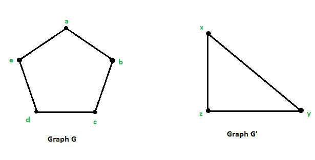
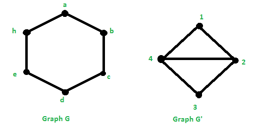
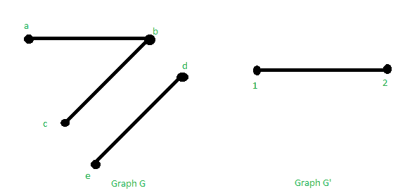

# 图同态

> 原文:[https://www.geeksforgeeks.org/graph-homomorphism/](https://www.geeksforgeeks.org/graph-homomorphism/)

一个[图](https://www.geeksforgeeks.org/graph-data-structure-and-algorithms/) **G** 是一组[顶点](https://www.geeksforgeeks.org/introduction-to-graphs/)和一组连接这些顶点的边的集合。它由两组组成:

*   **顶点集:** V = {v1，v2，…，vn}
*   **边集:** E = {e1，e2，…，en}

图 G 表示为 G = (V，E)。

**图的同态:**图同态是两个图之间尊重其结构的映射，即把一个图的相邻顶点映射到另一个图的相邻顶点。从图 **G** 到图 **H** 的同态是从**V<sub>G</sub>T9】到 **V <sub>H</sub>** 的映射，它取边到边。**

**定义:**从图 **G = (V，E)** 到图**G’=(V，E)**的图同态 **F** 写成:

> f:G–> G '
> 是从 G 的顶点集到 G '的顶点集的映射 f:V–>V ’,使得{u，V }∈E { f(u)，f(v) ∈ E '

将上述定义推广到有向图。那么，对于同态 f:G–> G’是；{f(u)，f(v)}是 **G'** 的弧，只有当 **(u，v)** 是 **G** 的弧。如果存在同态；**f:G–>G '**，则写成**G–>G '**G 据说与 **G'** 同形。

**同构:**如果同态 f:G–>G’是其逆也是图同态的双射(一对一和到映射)，那么 f 是图[同构](https://www.geeksforgeeks.org/mathematics-graph-isomorphisms-connectivity/)。

**例 1:** 下面是两个图 G = (V，E)，其中 V = {a，b，c，d，e}和 E = {(a，b)，(b，c)，(c，d)，(d，E)，(E，a)}和 G' = (V，E ')，其中 V' = {x，y，z}和 E' = {(x，y)，(y，z)，(z，x)}。

[](https://media.geeksforgeeks.org/wp-content/uploads/20210529154541/pic1.png)

存在映射 f:**G–>G’**，使得{u，v }∈E { f(u)，f(v)}∈E’。

**<u>解</u> :**

假设 f(a) = x，f(b) = y，f(c) = z，f(d) = x，f(e) = z。

*   如果(a，b)是 G 中的边，那么(f (a)，f(b))一定是 E’中的边。

```
f(a) = x and f(b) = y  ⇒  (f(a), f(b)) = (x, y) ∈ E'
```

*   如果(b，c)是 G 中的边，那么(f (b)，f(c))一定是 E’中的边。

```
f(b) = y and f(c) = z  ⇒  (f(b), f(c)) = (y, z) ∈ E'
```

*   如果(c，d)是 G 中的边，那么(f (c)，f(d))一定是 E’中的边。

```
f(c) = z and f(d) = x  ⇒  (f(c), f(d)) = (z, x) ∈ E'
```

*   如果(d，E)是 G 中的边，那么(f (d)，f(e))一定是 E’中的边

```
f(d) = x and f(e) = z  ⇒  (f(d), f(e)) = (x, z) ∈ E'
```

*   如果(E，a)是 G 中的边，那么(f (e，f(a))一定是 E’中的边

```
f(e) = z and f(a) = x  ⇒  (f(c), f(d)) = (z, x) ∈ E'
```

由此可见，∀{u，v }∈e ∃{f(u，f(v)}∈e’。所以 f 是同态。

**例 2:** 下面是两个图 G = (V，E)其中 V = {a，b，c，d，E，h}和 E = {(a，b)，(b，c)，(c，d)，(d，E)，(E，h)，(f，a) }和 G' = (V，E ')其中 V' = {1，2，3，4}和
E' = { (1，2)，(2，3)，(3，4)，(4，1)，(4，2)}。

[](https://media.geeksforgeeks.org/wp-content/uploads/20210529161303/img2.png)

存在一个映射:G–> G '这样{u，v }∈E { f(u)，f(v)} ∈ E '。

**<u>解</u> :**

假设 f(a) = 1，f(b) = 4，f(c) = 2，f(d) = 4，f(e) = 2，f(h) = 4。

*   如果(a，b)是 G 中的边，那么(f (a)，f(b))一定是 E’中的边。

```
f(a) = 1 and f(b) = 4  ⇒  (f(a), f(b)) = (1, 4) ∈ E'
```

*   如果(b，c)是 G 中的边，那么(f (b)，f(c))一定是 E’中的边。

```
f(b) = 4 and f(c) = 2  ⇒  (f(b), f(c)) = (4, 2) ∈ E'
```

*   如果(c，d)是 G 中的边，那么(f (c)，f(d))一定是 E’中的边。

```
f(c) = 2 and f(d) = 4  ⇒  (f(c), f(d)) = (2, 4) ∈ E'. 
Note- (2, 4) is the same as (4, 2).
```

*   如果(d，E)是 G 中的边，那么(f (d)，f(e))一定是 E’中的边。

```
f(d) = 4 and f(e) = 2  ⇒  (f(d), f(e)) = (4, 2) ∈ E'
```

*   如果(E，h)是 G 中的边，那么(f (e)，f(h))一定是 E’中的边。

```
f(e) = 2 and f(a) = 4 ⇒  (f(c), f(d)) = (2, 4) ∈ E'
```

*   如果(h，a)是 G 中的边，那么(f (h，f(a))一定是 E’中的边。

```
f(h) = 4 and f(a) = 1 ⇒  (f(c), f(d)) = (4, 1) ∈ E'
```

由此可见，∀{u，v }∈e ∃{f(u，f(v)}∈e’。所以 f 是同态。

> 从图 G 到图 H 的同态是从 V <sub>G</sub> 到 V <sub>H</sub> 的映射，它映射:
> 
> *   边到边。
> *   非边到顶点，边或非边。

**例 3:** 下面是两个图 G = (V，E)，其中 V = {a，b，c，d，e}和 E = {(a，b)，(b，c)，(d，E)，(E，h)}和 G' = (V '，E ')，其中 V' = {1，2}和 E' = { (1，2)}。

[](https://media.geeksforgeeks.org/wp-content/uploads/20210529164211/img3.png)

**<u>解</u> :**

假设 f(a) = 1，f(b) = 2，f(c) = 1，f(d) = 2，f(e) = 1

*   如果(a，b)是 G 中的边，那么(f (a)，f(b))一定是 E’中的边。

```
f(a) = 1 and f(b) = 2 ⇒  (f(a), f(b)) = (1, 2) ∈ E'
```

*   如果(b，c)是 G 中的边，那么(f (b)，f(c))一定是 E’中的边。

```
f(b) = 2 and f(c) = 1  ⇒  (f(b), f(c)) = (2, 1) ∈ E'
```

*   如果(d，E)是 G 中的边，那么(f (d)，f(e))一定是 E’中的边。

```
f(d) = 2 and f(e) = 1  ⇒  (f(d), f(e)) = (2, 1) ∈ E'
```

这里可以看出(b，e)不是 G 中的边，而是(fb)，f(e) ) = (2，1)是图 G’中的边。