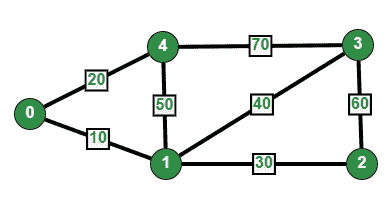

# 使用 STL 进行竞争性编程的图形实现|集合 2(加权图形)

> 原文:[https://www . geesforgeks . org/graph-implementation-use-STL-for-competitive-programming-set-2-weighted-graph/](https://www.geeksforgeeks.org/graph-implementation-using-stl-for-competitive-programming-set-2-weighted-graph/)

在[设置 1](https://www.geeksforgeeks.org/graph-representation-using-stl-for-competitive-programming-set-1-dfs-of-unweighted-and-undirected/) 中，讨论了未加权图。在这篇文章中，讨论了使用 STL 的加权图表示。实现了加权图的邻接表表示。



无向加权图

我们使用两个 STL 容器来表示图形:

*   [载体:](http://quiz.geeksforgeeks.org/vector-sequence-containers-the-c-standard-template-library-stl-set-1/)一个序列容器。这里我们用它来存储所有顶点的邻接表。我们用顶点数作为这个向量的索引。
*   [pair :](http://quiz.geeksforgeeks.org/pair-simple-containers-the-c-standard-template-library-stl/) 存储一对元素的简单容器。这里我们用它来存储相邻顶点数和连接到相邻边的边的权重。

这个想法是使用一对向量的向量。下面的代码实现了同样的功能。

## C++

```
// C++ program to represent undirected and weighted graph
// using STL. The program basically prints adjacency list
// representation of graph
#include <bits/stdc++.h>
using namespace std;

// To add an edge
void addEdge(vector <pair<int, int> > adj[], int u,
                                     int v, int wt)
{
    adj[u].push_back(make_pair(v, wt));
    adj[v].push_back(make_pair(u, wt));
}

// Print adjacency list representation ot graph
void printGraph(vector<pair<int,int> > adj[], int V)
{
    int v, w;
    for (int u = 0; u < V; u++)
    {
        cout << "Node " << u << " makes an edge with \n";
        for (auto it = adj[u].begin(); it!=adj[u].end(); it++)
        {
            v = it->first;
            w = it->second;
            cout << "\tNode " << v << " with edge weight ="
                 << w << "\n";
        }
        cout << "\n";
    }
}

// Driver code
int main()
{
    int V = 5;
    vector<pair<int, int> > adj[V];
    addEdge(adj, 0, 1, 10);
    addEdge(adj, 0, 4, 20);
    addEdge(adj, 1, 2, 30);
    addEdge(adj, 1, 3, 40);
    addEdge(adj, 1, 4, 50);
    addEdge(adj, 2, 3, 60);
    addEdge(adj, 3, 4, 70);
    printGraph(adj, V);
    return 0;
}
```

## 蟒蛇 3

```
# Python3 program to represent undirected
# and weighted graph. The program basically
# prints adjacency list representation of graph

# To add an edge
def addEdge(adj, u, v, wt):

    adj[u].append([v, wt])
    adj[v].append([u, wt])
    return adj

# Print adjacency list representation ot graph
def printGraph(adj, V):

    v, w = 0, 0
    for u in range(V):
        print("Node", u, "makes an edge with")

        for it in adj[u]:
            v = it[0]
            w = it[1]
            print("\tNode", v, "with edge weight =", w)

        print()

# Driver code
if __name__ == '__main__':

    V = 5
    adj = [[] for i in range(V)]

    adj = addEdge(adj, 0, 1, 10)
    adj = addEdge(adj, 0, 4, 20)
    adj = addEdge(adj, 1, 2, 30)
    adj = addEdge(adj, 1, 3, 40)
    adj = addEdge(adj, 1, 4, 50)
    adj = addEdge(adj, 2, 3, 60)
    adj = addEdge(adj, 3, 4, 70)

    printGraph(adj, V)

# This code is contributed by mohit kumar 29
```

## java 描述语言

```
<script>
// Javascript program to represent undirected and weighted graph
// using STL. The program basically prints adjacency list
// representation of graph

    // To add an edge
    function addEdge(adj,u,v,wt)
    {
        adj[u].push([v,wt]);
        adj[v].push([u,wt]);
        return adj;

    }

    //Print adjacency list representation ot graph
    function printGraph(adj, V)
    {
        let v=0,w=0;
        for(let u=0;u<V;u++)
        {
            document.write("Node "+u+ " makes an edge with<br>");
            for(let it=0;it<adj[u].length;it++)
            {
                v=adj[u][it][0];
                w=adj[u][it][1];
                document.write("        Node "+ v+ " with edge weight ="+ w+"<br>")
            }
        }
    }

    // Driver code
    let V = 5;

    // The below line may not work on all
    // compilers.  If it does not work on
    // your compiler, please replace it with
    // following
    // vector<int> *adj = new vector<int>[V];
    let adj=new Array(V);
    for(let i=0;i<V;i++)
    {
        adj[i]=[];
    }

    // Vertex numbers should be from 0 to 4.
    adj = addEdge(adj, 0, 1, 10)
    adj = addEdge(adj, 0, 4, 20)
    adj = addEdge(adj, 1, 2, 30)
    adj = addEdge(adj, 1, 3, 40)
    adj = addEdge(adj, 1, 4, 50)
    adj = addEdge(adj, 2, 3, 60)
    adj = addEdge(adj, 3, 4, 70)
    printGraph(adj, V);

    // This code is contributed by unknown2108
</script>
```

**输出:**

```
Node 0 makes an edge with 
    Node 1 with edge weight =10
    Node 4 with edge weight =20

Node 1 makes an edge with 
    Node 0 with edge weight =10
    Node 2 with edge weight =30
    Node 3 with edge weight =40
    Node 4 with edge weight =50

Node 2 makes an edge with 
    Node 1 with edge weight =30
    Node 3 with edge weight =60

Node 3 makes an edge with 
    Node 1 with edge weight =40
    Node 2 with edge weight =60
    Node 4 with edge weight =70

Node 4 makes an edge with 
    Node 0 with edge weight =20
    Node 1 with edge weight =50
    Node 3 with edge weight =70
```

本文由 [**萨希尔·查布拉(akku)**](https://practice.geeksforgeeks.org/user-profile.php?user=sahil_coder) 供稿。并由 [**库纳尔维尔马**](https://hereiskunalverma.github.io/tlrc/index.html) 改进如果你喜欢 GeeksforGeeks 并想投稿，你也可以使用[write.geeksforgeeks.org](https://write.geeksforgeeks.org)写一篇文章或者把你的文章邮寄到 review-team@geeksforgeeks.org。看到你的文章出现在极客博客主页上，帮助其他极客。
如果发现有不正确的地方，或者想分享更多关于上述话题的信息，请写评论。