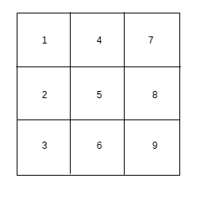
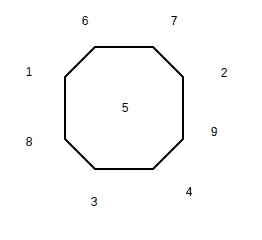
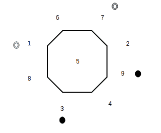

# 数学|图论练习题

> 原文:[https://www . geesforgeks . org/graph-theory-practice-questions/](https://www.geeksforgeeks.org/graph-theory-practice-questions/)

**问题 1–**极客岛有 25 部电话。有没有可能用电线把它们连接起来，这样每部电话正好和另外 7 部电话连接。
**解决方案–**让我们假设这样的安排是可能的。这可以看作是一个图，其中电话用顶点表示，电线用边表示。现在我们在这个图中有 25 个顶点。图中每个顶点的度数是 7。

从[握手引理](https://www.geeksforgeeks.org/handshaking-lemma-and-interesting-tree-properties/)开始，我们知道了。

```
sum of degrees of all vertices = 2*(number of edges)
number of edges = (sum of degrees of all vertices) / 2

```

我们需要理解一条边连接两个顶点。所以所有顶点的度数之和等于边数的两倍。
因此，

```
 25*7 = 2*(number of edges)
number of edges = 25*7 / 2 = 87.5

```

这不是一个整数。因此，我们可以得出结论，我们的假设是错误的，这样的安排是不可能的。

**问题 2–**下图显示了骑士在 3*3 网格上的排列。

**图–**初始状态

使用有效的骑士招式有可能达到如下所示的最终状态吗？


**图–**最终状态

**解决方案–**不，你可能认为要破解以上问题，你需要成为一名优秀的棋手。然而，上述问题可以用图来解决。但是我们应该画什么样的图呢？让 9 个顶点中的每一个都用一个数字来表示，如下所示。



现在我们将网格的每个正方形视为图中的一个顶点。如果在图中相应的方块之间有一个有效的骑士移动，那么图中的两个顶点之间就有一条边。例如——如果我们考虑平方 1。骑士移动有效的可到达方块是 6 和 8。我们可以说，在我们的图中，顶点 1 连接到顶点 6 和 8。

同样，我们可以绘制如下所示的整个图表。很明显，从任何一个方块都无法到达顶点 5。因此，没有一条边连接到顶点 5。



在我们的图中，我们用一个空心圆来描绘一个白骑士，用一个实心圆来描绘一个黑骑士。因此，图的初始状态可以表示为:


**图–**初始状态

最终状态表示为:


**图–**最终状态

请注意，为了达到最终状态，需要存在一个路径，其中两个骑士(一个黑骑士和一个白骑士交叉)。我们只能在图上以顺时针或逆时针的方式移动骑士(如果图上有两个顶点相连:说明网格上存在对应骑士的移动)。然而骑士在图上出现的顺序是不能改变的。骑士不可能为了达到最终状态而跨越(两个骑士不能存在于一个顶点)另一个顶点。因此，我们可以得出结论，无论最后的安排是不可能的。

**问题 3:** 一个平面上画了 9 条线段。有没有可能每条线段正好和另外 3 条相交？
**解决方案:**这个问题最初看起来很难。我们可以考虑用图表来解决这个问题。但是我们怎么画这个图。如果我们试图通过使用线段作为图的边来处理这个问题，我们似乎什么也达不到(这听起来很混乱)。这里我们需要考虑一个图，其中每个线段都表示为一个顶点。如果相应的线段相交，那么这个图的两个顶点是相连的。

现在这个图有 9 个顶点。每个顶点的度数是 3。

我们知道对于一个图
**所有顶点的度数之和= 2*图中的边数**
由于上述问题中顶点的度数之和为 9*3 = 27 即奇数，这样的排列是不可能的。

本文由 [**安基特·贾恩**](https://www.facebook.com/profile.php?id=100000412091676) 供稿。如果你喜欢 GeeksforGeeks 并想投稿，你也可以使用[contribute.geeksforgeeks.org](http://www.contribute.geeksforgeeks.org)写一篇文章或者把你的文章邮寄到 contribute@geeksforgeeks.org。看到你的文章出现在极客博客主页上，帮助其他极客。

如果你发现任何不正确的地方，或者你想分享更多关于上面讨论的话题的信息，请写评论。