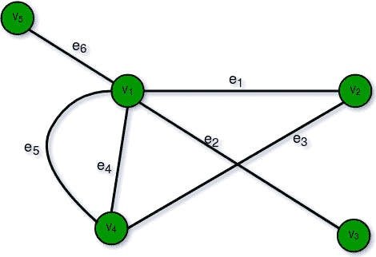
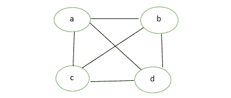
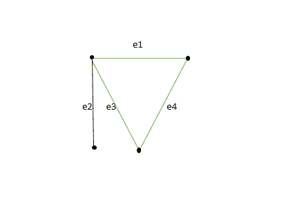

# 图形类型和应用

> 原文:[https://www.geeksforgeeks.org/graph-types-and-applications/](https://www.geeksforgeeks.org/graph-types-and-applications/)

**先决条件:** [图论基础–第 1 集](https://www.geeksforgeeks.org/mathematics-graph-theory-basics-set-1/)[图论基础–第 2 集](https://www.geeksforgeeks.org/mathematics-graph-theory-basics/)

图 G = (V，E)由一组顶点 V = { V1，V2，。。。}和边集 E = { E1，E2，。。。}.不同顶点的无序对的集合，其元素称为图 G 的边，这样每条边都用一对无序的顶点(Vi，Vj)来标识。
如果存在与 Vi 和 Vj 相关联的边 Ek，则顶点(Vi，Vj)被称为是相邻的。在这种情况下，Vi 和 Vj 被称为端点，边缘 Ek 被称为 Vi 和 Vj 的连接/接合。

**图形类型:**

*   **有限图:**如果一个图有有限数量的顶点和有限数量的边，则称它是有限的。
    T3】
*   **无限图:**如果一个图有无限多的顶点和无限多的边，那么这个图就是无限的。
    T3】
*   **平凡图:**如果一个有限图只包含一个顶点而没有边，则称该图为平凡图。
    T3】
*   **简单图:**简单图是在一对顶点之间不包含多于一条边的图。连接不同城市的简单铁轨就是简单图形的一个例子。
    
    
*   **多图:**任何包含一些平行边但不包含任何自循环的图称为多图。例如《路线图》。
    T3】
    *   **平行边:**如果两个顶点与一条以上的边相连，那么这种边称为平行边，即有许多根但只有一个目的地。
    *   **环:**将顶点连接到自身的图的边称为环或自环。
*   **空图:**n 阶且大小为零的图，它是包含 n 个顶点但不包含任何边的图。
    T3】
*   **Complete Graph:** A simple graph with n vertices is called a complete graph if the degree of each vertex is n-1, that is, one vertex is attach with n-1 edges. A complete graph is also called Full Graph.
    

    

*   **伪图:**具有自循环和一些多条边的图 G 称为伪图。
    T3】
*   **正则图:**如果一个图 G 的所有顶点都是等度的，那么简单的图就是正则的。所有完整的图都是规则的，但反之则不可能。
    T3】
*   **Bipartite Graph:** A graph G = (V, E) is said to be bipartite graph if its vertex set V(G) can be partitioned into two non-empty disjoint subsets. V1(G) and V2(G) in such a way that each edge e of E(G) has its one end in V1(G) and other end in V2(G).
    The partition V1 U V2 = V is called Bipartite of G.
    Here in the figure:
    V1(G)={V5, V4, V3}
    V2(G)={V1, V2}

    

*   **标记图:**如果图的顶点和边用名称、数据或权重标记，则称之为标记图。也叫*加权图*。
    
*   **Digraph Graph:** A graph G = (V, E) with a mapping f such that every edge maps onto some ordered pair of vertices (Vi, Vj) is called Digraph. It is also called *Directed Graph*. Ordered pair (Vi, Vj) means an edge between Vi and Vj with an arrow directed from Vi to Vj.
    Here in the figure:
    e1 = (V1, V2)
    e2 = (V2, V3)
    e4 = (V2, V4)

    

*   **Subgraph:** A graph G = (V1, E1) is called subgraph of a graph G(V, E) if V1(G) is a subset of V(G) and E1(G) is a subset of E(G) such that each edge of G1 has same end vertices as in G.
    

    **子图类型:**

    *   **顶点不相交子图:**任意两个图 G1 = (V1，E1)和 G2 = (V2，E2)如果 V1(G1)交集 V2(G2) =空，则称其为图 G = (V，E)的顶点不相交。在图中，G1 和 G2 之间没有公共顶点。
    *   **边不相交子图:**如果 E1(G1)交集 E2(G2) = null，则称子图是边不相交的。在图中，G1 和 G2 没有共同的优势。

    **注:**边不相交子图可能有公共顶点，但顶点不相交图不能有公共边，所以顶点不相交子图永远是边不相交子图。
    T3】

*   **连通或不连通图:**如果图 G 的任意一对顶点(Vi，Vj)彼此可达，则称图 G 是连通的。或者，如果图 G 中的每一对顶点之间至少存在一条路径，则称该图是连通的，否则该图是不连通的。有 n 个顶点的空图是由 n 个分量组成的不连通图。每个组件由一个顶点组成，没有边。
    T3】
*   **循环图:**由 n 个顶点和 n 个> = 3 组成的图 G，即 V1、V2、V3-–––––––Vn 和边(V1、V2)、(V2、V3)、(V3、V4)-–––––––––––---(Vn、V1)称为循环图。
    T3】

    **图形的应用:**

    *   **计算机科学:**在计算机科学中，图形用于表示通信网络、数据组织、计算设备等。
    *   **物理和化学:**图论也用于研究化学和物理中的分子。
    *   **社会科学:**图论在社会学中也有广泛的应用。
    *   **数学:**在这种情况下，图在几何和拓扑的某些部分(如纽结理论)中很有用。
    *   **生物学:**图论在生物学和保护工作中很有用。