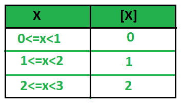
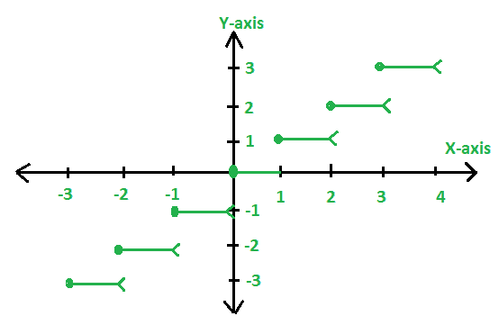

# 最大整数函数

> 原文:[https://www.geeksforgeeks.org/greatest-integer-function/](https://www.geeksforgeeks.org/greatest-integer-function/)

最大整数函数[X]表示实数的整数部分，它是距离最近且较小的整数。它也被称为 X 的地板**。
【x】=小于或等于 x 的最大整数。
**一般来说** : If、 < =  < 。那么，![(n \epsilon Integer)\Longrightarrow [X]=n  ](img/0e1a0e654ff25ac98cfd60bb6972ebb1.png "Rendered by QuickLaTeX.com")
这意味着如果 X 位于[n，n+1]中，那么 X 的最大整数函数将是 n。** 



在上图中，我们每一次都要计算数值。当区间为[n，n+1]形式时，最大整数函数值为 n，其中 n 为整数。

1.  0<=x<1 将始终位于区间[0，0.9]中，因此这里 X 的最大整数函数将为 0。
2.  1<=x<2 将始终位于区间[1，1.9]中，因此这里 X 的最大整数函数将是 1。
3.  2<=x<3 将始终位于区间[2，2.9]中，因此这里 X 的最大整数函数将是 2。

**示例:**

```
Input: X = 2.3
Output: [2.3] = 2

Input: X = -8.0725
Output: [-8.0725] = -9

Input: X = 2
Output: [2] = 2
```

**数线表示**
如果我们检查一条带有整数的数线，并在其上绘制 2.7，我们会看到:


小于 2.7 的最大整数是 2。所以**【2.7】= 2**。
如果我们检查一条带有整数的数字线，并在其上绘制-1.3，我们会看到:


既然小于-1.3 的最大整数是-2，那么 **[-1.3] = 2** 。
这里， **f(x)=[X]** 可以用图形表示为:



**注**:上图中，每一步的左边端点被遮挡(暗点)表示该点是图的成员，另一个右边端点(开圆)表示不属于图的点。

**最大整数函数的性质:**

*   [X]=如果 X 是整数，则 X 成立。
*   [X+I]=[X]+I，如果 I 是整数，那么我们可以在最大整数函数中单独 I。
*   [X+Y]>=[X]+[Y]，表示 X 和 Y 之和的最大整数等于 X 的 GIF 和 Y 的 GIF 之和。
*   如果[f(X)]= 1，那么 f(X)> = 1
*   如果[f(X)]<=I，那么 f(X) < I+1。
*   [-X]= -[X]，If X 整数。
*   [-X]=-[X]-1，如果 X 不是整数。

也称为 X.
的阶梯式**函数**或**楼层**下面的程序显示了使用[楼层()](https://www.geeksforgeeks.org/ceil-floor-functions-cpp/)实现最大整数函数:

## C++

```
// CPP program to illustrate
// greatest integer Function
#include <bits/stdc++.h>
using namespace std;

// Function to calculate the
// GIF value of a number
int GIF(float n)
{
    // GIF is the floor of a number
    return floor(n);
}

// Driver code
int main()
{
    int n = 2.3;

    cout << GIF(n);

    return 0;
}
```

## Java 语言(一种计算机语言，尤用于创建网站)

```
// Java program to illustrate
// greatest integer Function

class GFG{
// Function to calculate the
// GIF value of a number
static int GIF(double n)
{
    // GIF is the floor of a number
    return (int)Math.floor(n);
}

// Driver code
public static void main(String[] args)
{
    double n = 2.3;

    System.out.println(GIF(n));
}
}
// This code is contributed by mits
```

## 蟒蛇 3

```
# Python3 program to illustrate
# greatest integer Function
import math

# Function to calculate the
# GIF value of a number
def GIF(n):

    # GIF is the floor of a number
    return int(math.floor(n));

# Driver code
n = 2.3;

print(GIF(n));

# This code is contributed by mits
```

## C#

```
// C# program to illustrate
// greatest integer Function
using System;

class GFG{
// Function to calculate the
// GIF value of a number
static int GIF(double n)
{
    // GIF is the floor of a number
    return (int)Math.Floor(n);
}

// Driver code
static void Main()
{
    double n = 2.3;

    Console.WriteLine(GIF(n));
}
}

// This code is contributed by mits
```

## 服务器端编程语言（Professional Hypertext Preprocessor 的缩写）

```
<?php

// PHP program to illustrate
// greatest integer Function

// Function to calculate the
// GIF value of a number
function GIF($n)
{
    // GIF is the floor of a number
    return floor($n);
}

// Driver code
    $n = 2.3;

    echo GIF($n);

?>
```

## java 描述语言

```
<script>

// Javascript program to illustrate
// greatest integer Function

// Function to calculate the
// GIF value of a number
function GIF(n)
{
    // GIF is the floor of a number
    return Math.floor(n);
}

// Driver code
var n = 2.3;

document.write(GIF(n));

// This code is contributed by Ankita saini

</script>
```

**Output:** 

```
2
```