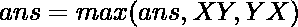

# 给定数组中一对可以形成的最大数目

> 原文:[https://www . geeksforgeeks . org/给定数组中一对可以形成的最大数/](https://www.geeksforgeeks.org/greatest-number-that-can-be-formed-from-a-pair-in-a-given-array/)

给定一个数组 **arr[]** ，任务是找出给定数组中一对可以组成的最大数。
**例:**

> **输入:** arr[] = { 3，1，9，2 }
> **输出:** 93
> 对(3，9)导致形成最大数 93
> **输入:** arr[] = { 23，14，16，25，3，9 }
> **输出:** 2523
> 对(23，25)导致形成最大数 2523

**方法:**想法是形成每一个[可能的阵列对](https://www.geeksforgeeks.org/print-all-possible-combinations-of-r-elements-in-a-given-array-of-size-n/)。然后对于每对 **X** 和 **Y** ，将它们连接为 XY 和 YX，并从所有这些对中取最大值。

> 对于数组(X，Y) 
> 中的每一个可能

以下是上述方法的实现:

## C++

```
// C++ implementation to find the
// greatest number from the
// given pairs of the array

#include <bits/stdc++.h>
using namespace std;

// Function to find the greatest
// number formed from the pairs
string getNumber(int a, int b)
{
    string X = to_string(a);
    string Y = to_string(b);

    // first append Y at
    // the end of X
    string XY = X + Y;

    // then append X at
    // the end of Y
    string YX = Y + X;

    // Now see which of the
    // two formed numbers
    // is greater than other
    return XY > YX ? XY : YX;
}

// Function to find pairs from array
void printMaxPair(int arr[], int n)
{
    int largest = INT_MIN;

    // Iterate through all pairs
    for (int i = 0; i < n; i++)
        for (int j = i + 1; j < n; j++) {
            int number = stoi(
                getNumber(arr[i], arr[j]));
            largest = max(largest, number);
        }
    cout << largest;
}

// Driver code
int main()
{
    int a[] = { 23, 14, 16, 25, 3, 9 };
    int n = sizeof(a) / sizeof(a[0]);
    printMaxPair(a, n);
    return 0;
}
```

## Java 语言(一种计算机语言，尤用于创建网站)

```
// Java implementation to find the
// greatest number from the
// given pairs of the array
import java.util.*;

class GFG{

// Function to find the greatest
// number formed from the pairs
static String getNumber(int a, int b)
{
    String X = Integer.toString(a);
    String Y = Integer.toString(b);

    // First append Y at
    // the end of X
    String XY = X + Y;

    // Then append X at
    // the end of Y
    String YX = Y + X;

    // Now see which of the
    // two formed numbers
    // is greater than other
    return XY.compareTo(YX) > 0 ? XY : YX;

}

// Function to find pairs from array
static void printMaxPair(int arr[], int n)
{
    int largest = Integer.MIN_VALUE;

    // Iterate through all pairs
    for(int i = 0; i < n; i++)
       for(int j = i + 1; j < n; j++)
       {
          int number = Integer.parseInt(getNumber(arr[i],
                                                  arr[j]));
          largest = Math.max(largest, number);
       }
       System.out.println(largest);
}

// Driver code
public static void main(String[] args)
{
    int a[] = { 23, 14, 16, 25, 3, 9 };
    int n = a.length;

    printMaxPair(a, n);
}
}

// This code is contributed by offbeat
```

## 蟒蛇 3

```
# Python3 implementation to find the
# greatest number from the
# given pairs of the array
import sys;

# Function to find the greatest
# number formed from the pairs
def getNumber(a, b):

    X = str(a);
    Y = str(b);

    # first append Y at
    # the end of X
    XY = X + Y;

    # then append X at
    # the end of Y
    YX = Y + X;

    # Now see which of the
    # two formed numbers
    # is greater than other
    if(XY > YX):
        return XY;
    else:
        return YX;

# Function to find pairs from array
def printMaxPair(arr, n):

    largest = -sys.maxsize - 1;

    # Iterate through all pairs
    for i in range(0, n):
        for j in range(i + 1, n):
            number = int(getNumber(arr[i],
                                   arr[j]));
            largest = max(largest, number);

    print(largest);

# Driver code
a = [ 23, 14, 16, 25, 3, 9 ];
n = len(a);
printMaxPair(a, n);

# This code is contributed by Code_Mech
```

## C#

```
// C# implementation to find the
// greatest number from the
// given pairs of the array
using System;

class GFG{

// Function to find the greatest
// number formed from the pairs
static String getNumber(int a, int b)
{
    String X = a.ToString();
    String Y = b.ToString();

    // First append Y at
    // the end of X
    String XY = X + Y;

    // Then append X at
    // the end of Y
    String YX = Y + X;

    // Now see which of the
    // two formed numbers
    // is greater than other
    return XY.CompareTo(YX) > 0 ? XY : YX;

}

// Function to find pairs from array
static void printMaxPair(int []arr, int n)
{
    int largest = int.MinValue;

    // Iterate through all pairs
    for(int i = 0; i < n; i++)
       for(int j = i + 1; j < n; j++)
       {
          int number = Int32.Parse(getNumber(arr[i],
                                             arr[j]));
          largest = Math.Max(largest, number);
       }
       Console.WriteLine(largest);
}

// Driver code
public static void Main(String[] args)
{
    int []a = { 23, 14, 16, 25, 3, 9 };
    int n = a.Length;

    printMaxPair(a, n);
}
}

// This code is contributed by Amit Katiyar
```

## java 描述语言

```
<script>

// Javascript implementation to find the
// greatest number from the
// given pairs of the array

// Function to find the greatest
// number formed from the pairs
function getNumber(a, b)
{
    var X = a.toString();
    var Y = b.toString();

    // first append Y at
    // the end of X
    var XY = X + Y;

    // then append X at
    // the end of Y
    var YX = Y + X;

    // Now see which of the
    // two formed numbers
    // is greater than other
    return XY > YX ? XY : YX;
}

// Function to find pairs from array
function printMaxPair(arr, n)
{
    var largest = -100000000;

    // Iterate through all pairs
    for (var i = 0; i < n; i++)
        for (var j = i + 1; j < n; j++) {
            var number = parseInt(
                getNumber(arr[i], arr[j]));
            largest = Math.max(largest, number);
        }
    document.write( largest);
}

// Driver code
var a = [ 23, 14, 16, 25, 3, 9];
var n = a.length;
printMaxPair(a, n);

</script>
```

**Output:** 

```
2523
```

时间复杂度:O(n <sup>2</sup> )

辅助空间:0(1)