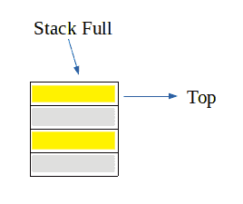
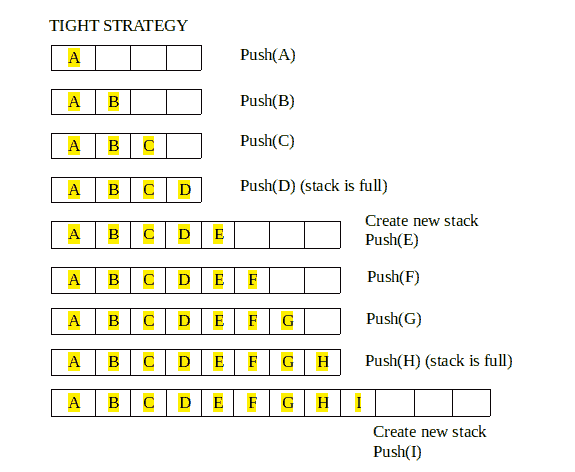

# 基于可生长阵列的堆栈

> 原文:[https://www.geeksforgeeks.org/growable-array-based-stack/](https://www.geeksforgeeks.org/growable-array-based-stack/)

我们都知道[栈](https://www.geeksforgeeks.org/stack-data-structure-introduction-program/)也称为**后进先出(LIFO)** 结构。堆栈主要有两个主要操作，即推送和弹出，推送在顶部插入一个元素，弹出从堆栈顶部移除一个元素。
现在，无论何时考虑堆栈的实现，其大小都是预先确定的或固定的。即使它是动态分配的，但一旦被分配，它的大小就不能改变。因此出现了一种叫做“栈满”的情况。



但是，如果一个堆栈可以随着更多元素的插入而增长，或者将来会有更多元素被插入，该怎么办呢？请记住，我们讨论的是基于阵列的堆栈。**可增长堆栈**是分配更多内存的概念，这样就不会轻易出现“堆栈满”的情况。
可增长的基于阵列的堆栈可以通过分配比以前的堆栈内存更大的新内存并将元素从旧堆栈复制到新堆栈来实现。最后将新栈的名字改为旧栈的名字
可生长栈有两种策略:
1。**紧逼策略**:老叠(N+c)加一个常量
2。**增长策略**:旧栈规模翻倍(2N)



可生长堆栈上有两个操作:
1。常规推送操作:在栈顶增加一个元素
2。特殊推送操作:创建一个比旧堆栈大的新堆栈(根据上面的策略之一)，从旧堆栈中复制所有元素，然后将新元素推送到新堆栈中。

## C++

```
// CPP Program to implement growable array based stack
// using tight strategy
#include <iostream>
using namespace std;

// constant amount at which stack is increased
#define BOUND 4

// top of the stack
int top = -1;

// length of stack
int length = 0;

// function to create new stack
int* create_new(int* a)
{
    // allocate memory for new stack
    int* new_a = new int[length + BOUND];

    // copying the content of old stack
    for (int i = 0; i < length; i++)
        new_a[i] = a[i];

    // re-sizing the length
    length += BOUND;
    return new_a;
}

// function to push new element
int* push(int* a, int element)
{
    // if stack is full, create new one
    if (top == length - 1)
        a = create_new(a);

    // insert element at top of the stack
    a[++top] = element;
    return a;
}

// function to pop an element
void pop(int* a)
{
    top--;
}

// function to display
void display(int* a)
{
    // if top is -1, that means stack is empty
    if (top == -1)
        cout << "Stack is Empty" << endl;
    else {
        cout << "Stack: ";
        for (int i = 0; i <= top; i++)
            cout << a[i] << " ";
        cout << endl;
    }
}

// Driver Code
int main()
{
    // creating initial stack
    int *a = create_new(a);

    // pushing element to top of stack
    a = push(a, 1);
    a = push(a, 2);
    a = push(a, 3);
    a = push(a, 4);
    display(a);

    // pushing more element when stack is full
    a = push(a, 5);
    a = push(a, 6);
    display(a);

    a = push(a, 7);
    a = push(a, 8);
    display(a);

    // pushing more element so that stack can grow
    a = push(a, 9);
    display(a);

    return 0;
}
```

## Java 语言(一种计算机语言，尤用于创建网站)

```
// Java Program to implement growable array based stack
// using tight strategy
class GFG
{

// constant amount at which stack is increased
static final int BOUND = 4;

// top of the stack
static int top = -1;

// length of stack
static int length = 0;

// function to create new stack
static int[] create_new(int[] a)
{
    // allocate memory for new stack
    int[] new_a = new int[length + BOUND];

    // copying the content of old stack
    for (int i = 0; i < length; i++)
        new_a[i] = a[i];

    // re-sizing the length
    length += BOUND;
    return new_a;
}

// function to push new element
static int[] push(int[] a, int element)
{
    // if stack is full, create new one
    if (top == length - 1)
        a = create_new(a);

    // insert element at top of the stack
    a[++top] = element;
    return a;
}

// function to pop an element
static void pop(int[] a)
{
    top--;
}

// function to display
static void display(int[] a)
{
    // if top is -1, that means stack is empty
    if (top == -1)
        System.out.println("Stack is Empty");
    else
    {
        System.out.print("Stack: ");
        for (int i = 0; i <= top; i++)
            System.out.print(a[i] + " ");
        System.out.println();
    }
}

// Driver Code
public static void main(String args[])
{
    // creating initial stack
    int []a = create_new(new int[length + BOUND]);

    // pushing element to top of stack
    a = push(a, 1);
    a = push(a, 2);
    a = push(a, 3);
    a = push(a, 4);
    display(a);

    // pushing more element when stack is full
    a = push(a, 5);
    a = push(a, 6);
    display(a);

    a = push(a, 7);
    a = push(a, 8);
    display(a);

    // pushing more element so that stack can grow
    a = push(a, 9);
    display(a);
}
}

// This code is contributed by Princi Singh
```

## 蟒蛇 3

```
# Python3 Program to implement growable array based stack
# using tight strategy

# constant amount at which stack is increased
BOUND = 4

# top of the stack
top = -1;
a = []

# length of stack
length = 0;

# function to create new stack
def create_new():
    global length;

    # allocate memory for new stack
    new_a = [0 for i in range(length + BOUND)];

    # copying the content of old stack
    for i in range(length):
        new_a[i] = a[i];

    # re-sizing the length
    length += BOUND;
    return new_a

# function to push new element
def push( element):

    global top, a

    # if stack is full, create new one
    if (top == length - 1):
        a = create_new();

    top +=1

    # insert element at top of the stack
    a[top] = element;
    return a;

# function to pop an element
def pop():
    global top
    top -= 1;

# function to display
def display():
    global top

    # if top is -1, that means stack is empty
    if (top == -1):
        print("Stack is Empty")
    else:
        print("Stack: ", end = '')
        for i in range(top + 1):

            print(a[i], end = ' ')
        print()

# Driver Code
if __name__=='__main__':

    # creating initial stack
    a = create_new();

    # pushing element to top of stack
    push(1);
    push(2);
    push(3);
    push(4);
    display();

    # pushing more element when stack is full
    push(5);
    push(6);
    display();

    push(7);
    push(8);
    display();

    # pushing more element so that stack can grow
    push( 9);
    display();

# This code is contributed by rutvik_56.
```

## C#

```
// C# Program to implement growable array based stack
// using tight strategy
using System;

class GFG
{

// constant amount at which stack is increased
static int BOUND = 4;

// top of the stack
static int top = -1;

// length of stack
static int length = 0;

// function to create new stack
static int[] create_new(int[] a)
{
    // allocate memory for new stack
    int[] new_a = new int[length + BOUND];

    // copying the content of old stack
    for (int i = 0; i < length; i++)
        new_a[i] = a[i];

    // re-sizing the length
    length += BOUND;
    return new_a;
}

// function to push new element
static int[] push(int[] a, int element)
{
    // if stack is full, create new one
    if (top == length - 1)
        a = create_new(a);

    // insert element at top of the stack
    a[++top] = element;
    return a;
}

// function to pop an element
static void pop(int[] a)
{
    top--;
}

// function to display
static void display(int[] a)
{
    // if top is -1, that means stack is empty
    if (top == -1)
        Console.WriteLine("Stack is Empty");
    else
    {
        Console.Write("Stack: ");
        for (int i = 0; i <= top; i++)
            Console.Write(a[i] + " ");
        Console.WriteLine();
    }
}

// Driver Code
public static void Main(String []args)
{
    // creating initial stack
    int []a = create_new(new int[length + BOUND]);

    // pushing element to top of stack
    a = push(a, 1);
    a = push(a, 2);
    a = push(a, 3);
    a = push(a, 4);
    display(a);

    // pushing more element when stack is full
    a = push(a, 5);
    a = push(a, 6);
    display(a);

    a = push(a, 7);
    a = push(a, 8);
    display(a);

    // pushing more element so that stack can grow
    a = push(a, 9);
    display(a);
}
}

// This code is contributed by 29AjayKumar
```

## java 描述语言

```
<script>
// Javascript Program to implement growable array based stack
// using tight strategy

// constant amount at which stack is increased
let BOUND = 4;

// s_top of the stack
let s_top = -1;

// length of stack
let length = 0;

// function to create new stack
function create_new(a) {
    // allocate memory for new stack
    let new_a = new Array(length + BOUND);

    // copying the content of old stack
    for (let i = 0; i < length; i++)
        new_a[i] = a[i];

    // re-sizing the length
    length += BOUND;
    return new_a;
}

// function to push new element
function push(a, element) {
    // if stack is full, create new one
    if (s_top == length - 1)
        a = create_new(a);

    // insert element at s_top of the stack
    a[++s_top] = element;
    return a;
}

// function to pop an element
function pop(a) {
    s_top--;
}

// function to display
function display(a) {
    // if s_top is -1, that means stack is empty
    if (s_top == -1)
        document.write("Stack is Empty" + "<br>");
    else {
        document.write("Stack: ");
        for (let i = 0; i <= s_top; i++)
            document.write(a[i] + " ");
        document.write("<br>");
    }
}

// Driver Code

// creating initial stack
let a = create_new(new Array(length + BOUND));

// pushing element to s_top of stack
a = push(a, 1);
a = push(a, 2);
a = push(a, 3);
a = push(a, 4);
display(a);

// pushing more element when stack is full
a = push(a, 5);
a = push(a, 6);
display(a);

a = push(a, 7);
a = push(a, 8);
display(a);

// pushing more element so that stack can grow
a = push(a, 9);
display(a);

// This code is contributed by _saurabh_jaiswal
</script>
```

。

**输出:**

```
Stack: 1 2 3 4 
Stack: 1 2 3 4 5 6
Stack: 1 2 3 4 5 6 7 8
Stack: 1 2 3 4 5 6 7 8 9 
```