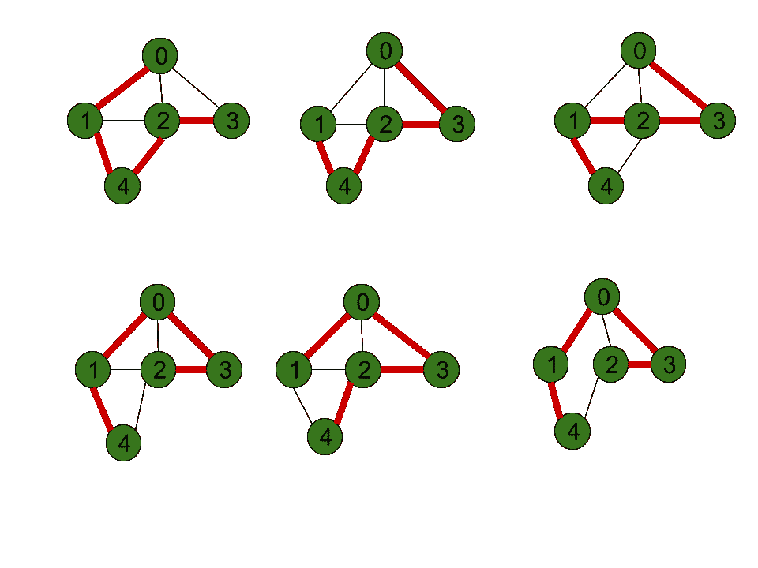

# 哈密顿路径(使用动态规划)

> 原文:[https://www . geesforgeks . org/Hamiltonian-path-use-dynamic-programming/](https://www.geeksforgeeks.org/hamiltonian-path-using-dynamic-programming/)

给定一个由 **N 个**顶点组成的无向图的[邻接矩阵](https://www.geeksforgeeks.org/c-program-to-implement-adjacency-matrix-of-a-given-graph/) **adj[][]** ，任务是找出该图是否包含[哈密顿路径](https://www.geeksforgeeks.org/mathematics-euler-hamiltonian-paths/)。如果发现属实，则打印**“是”**。否则，打印**“否”**。

> 哈密尔顿路径被定义为有向或无向图中恰好访问该图的每个顶点一次的路径。

**示例:**

> **输入:** adj[][] = {{0，1，1，1，0}，{1，0，1，0，1}，{1，1，0，1，1}，{1，0，1，0，0，0}}
> **输出:**是
> **解释:**
> 如下图所示，给定图形存在哈密顿路径:
> 
> [](https://media.geeksforgeeks.org/wp-content/uploads/20210214214718/hamiltonianpath1.png)
> 
> **输入:** adj[][] = {{0，1，0，0}，{1，0，1，1}，{0，1，0，0}，{0，1，0，0}}
> **输出:**否

**天真方法:**解决给定问题的最简单方法是[生成 **N** 个顶点的所有可能排列](https://www.geeksforgeeks.org/write-a-c-program-to-print-all-permutations-of-a-given-string/)。对于每个置换，通过检查相邻顶点之间是否有边来检查它是否是有效的哈密顿路径。如果发现是真的，则打印**“是”**。否则，打印**“否”**。

***时间复杂度:** O(N * N！)*
***辅助空间:** O(1)*

**高效方法:**上述方法可通过使用[动态编程](https://www.geeksforgeeks.org/dynamic-programming/)和[位屏蔽](https://www.geeksforgeeks.org/bitmasking-and-dynamic-programming-set-1-count-ways-to-assign-unique-cap-to-every-person/)进行优化，其基于以下观察:

*   其思想是，对于顶点的每个子集 **S** ，检查在子集 **S** 中是否有一个[哈密顿路径](https://www.geeksforgeeks.org/mathematics-euler-hamiltonian-paths/)，该路径在顶点 **v** 处结束，其中 **v € S** 。
*   如果 **v** 有一个邻居 **u** ，这里**u€S –{ v }**，那么存在一个终止于顶点 **u** 的哈密顿路径。
*   这个问题可以通过推广哈密尔顿路径的顶点子集和结束顶点来解决。

按照以下步骤解决问题:

*   初始化维度**N * 2<sup>N</sup>T5】中的布尔矩阵 **dp[][]** ，其中 **dp[j ][i]** 表示子集中是否存在由掩码 **i** 表示的路径，该路径访问 **i** 中的每个顶点一次，并在顶点 **j** 处结束。**
*   对于基本情况，更新 **dp[i][1 < < i] = true** ，对于范围**【0，N–1】**内的 **i**
*   [使用变量 **i** 迭代范围](https://www.geeksforgeeks.org/range-based-loop-c/)**【1，2<sup>N</sup>–1】**，并执行以下步骤:
    *   掩码 **i、**中设置了[位](https://www.geeksforgeeks.org/count-set-bits-in-an-integer/)的所有顶点都包含在子集内。
    *   [使用变量 **j** 迭代范围](https://www.geeksforgeeks.org/range-based-loop-c/)**【1，N】**，该变量将表示当前子集掩码 **i** 的哈密顿路径的结束顶点，并执行以下步骤:
        *   如果 **i** 和 **2 <sup>j</sup>** 的值为真，则使用变量 **k** 迭代范围**【1，n】**，如果**dp[k][i^2<sup>j</sup>**的值为**真**，则标记**DP【j】【I】**为**真**和[脱离](https://www.geeksforgeeks.org/break-statement-cc/)
        *   否则[继续下一次迭代](https://www.geeksforgeeks.org/continue-statement-cpp/)。
*   [使用变量 **i** 迭代范围](https://www.geeksforgeeks.org/range-based-loop-c/)，如果**DP【I】【2】<sup>N</sup>–1】**的值为**真**，则存在以顶点 **i** 结束的[哈密顿路径](https://www.geeksforgeeks.org/mathematics-euler-hamiltonian-paths/)。因此，打印**“是”**。否则，打印**“否”**。

下面是上述方法的实现:

## C++

```
// C++ program for the above approach

#include <bits/stdc++.h>
using namespace std;
const int N = 5;

// Function to check whether there
// exists a Hamiltonian Path or not
bool Hamiltonian_path(
    vector<vector<int> >& adj, int N)
{
    int dp[N][(1 << N)];

    // Initialize the table
    memset(dp, 0, sizeof dp);

    // Set all dp[i][(1 << i)] to
    // true
    for (int i = 0; i < N; i++)
        dp[i][(1 << i)] = true;

    // Iterate over each subset
    // of nodes
    for (int i = 0; i < (1 << N); i++) {

        for (int j = 0; j < N; j++) {

            // If the jth nodes is included
            // in the current subset
            if (i & (1 << j)) {

                // Find K, neighbour of j
                // also present in the
                // current subset
                for (int k = 0; k < N; k++) {

                    if (i & (1 << k)
                        && adj[k][j]
                        && j != k
                        && dp[k][i ^ (1 << j)]) {

                        // Update dp[j][i]
                        // to true
                        dp[j][i] = true;
                        break;
                    }
                }
            }
        }
    }

    // Traverse the vertices
    for (int i = 0; i < N; i++) {

        // Hamiltonian Path exists
        if (dp[i][(1 << N) - 1])
            return true;
    }

    // Otherwise, return false
    return false;
}

// Driver Code
int main()
{

    // Input
    vector<vector<int> > adj = { { 0, 1, 1, 1, 0 },
                                 { 1, 0, 1, 0, 1 },
                                 { 1, 1, 0, 1, 1 },
                                 { 1, 0, 1, 0, 0 } };
    int N = adj.size();

    // Function Call
    if (Hamiltonian_path(adj, N))
        cout << "YES";
    else
        cout << "NO";

    return 0;
}
```

## Java 语言(一种计算机语言，尤用于创建网站)

```
// Java program for the above approach
import java.io.*;
import java.lang.*;
import java.util.*;

class GFG{

// Function to check whether there
// exists a Hamiltonian Path or not
static boolean Hamiltonian_path(int adj[][], int N)
{
    boolean dp[][] = new boolean[N][(1 << N)];

    // Set all dp[i][(1 << i)] to
    // true
    for(int i = 0; i < N; i++)
        dp[i][(1 << i)] = true;

    // Iterate over each subset
    // of nodes
    for(int i = 0; i < (1 << N); i++)
    {
        for(int j = 0; j < N; j++)
        {

            // If the jth nodes is included
            // in the current subset
            if ((i & (1 << j)) != 0)
            {

                // Find K, neighbour of j
                // also present in the
                // current subset
                for(int k = 0; k < N; k++)
                {

                    if ((i & (1 << k)) != 0 &&
                         adj[k][j] == 1 && j != k &&
                           dp[k][i ^ (1 << j)])
                    {

                        // Update dp[j][i]
                        // to true
                        dp[j][i] = true;
                        break;
                    }
                }
            }
        }
    }

    // Traverse the vertices
    for(int i = 0; i < N; i++)
    {

        // Hamiltonian Path exists
        if (dp[i][(1 << N) - 1])
            return true;
    }

    // Otherwise, return false
    return false;
}

// Driver Code
public static void main(String[] args)
{
    int adj[][] = { { 0, 1, 1, 1, 0 },
                    { 1, 0, 1, 0, 1 },
                    { 1, 1, 0, 1, 1 },
                    { 1, 0, 1, 0, 0 } };
    int N = adj.length;

    // Function Call
    if (Hamiltonian_path(adj, N))
        System.out.println("YES");
    else
        System.out.println("NO");
}
}

// This code is contributed by Kingash
```

## 蟒蛇 3

```
# Python3 program for the above approach

# Function to check whether there
# exists a Hamiltonian Path or not
def Hamiltonian_path(adj, N):

    dp = [[False for i in range(1 << N)]
                 for j in range(N)]

    # Set all dp[i][(1 << i)] to
    # true
    for i in range(N):
        dp[i][1 << i] = True

    # Iterate over each subset
    # of nodes
    for i in range(1 << N):
        for j in range(N):

            # If the jth nodes is included
            # in the current subset
            if ((i & (1 << j)) != 0):

                # Find K, neighbour of j
                # also present in the
                # current subset
                for k in range(N):
                    if ((i & (1 << k)) != 0 and
                             adj[k][j] == 1 and
                                     j != k and
                          dp[k][i ^ (1 << j)]):

                        # Update dp[j][i]
                        # to true
                        dp[j][i] = True
                        break

    # Traverse the vertices
    for i in range(N):

        # Hamiltonian Path exists
        if (dp[i][(1 << N) - 1]):
            return True

    # Otherwise, return false
    return False

# Driver Code
adj = [ [ 0, 1, 1, 1, 0 ] ,
        [ 1, 0, 1, 0, 1 ],
        [ 1, 1, 0, 1, 1 ],
        [ 1, 0, 1, 0, 0 ] ]

N = len(adj)

if (Hamiltonian_path(adj, N)):
    print("YES")
else:
    print("NO")

# This code is contributed by maheshwaripiyush9
```

## C#

```
// C# program for the above approach
using System;

class GFG{

// Function to check whether there
// exists a Hamiltonian Path or not
static bool Hamiltonian_path(int[,] adj, int N)
{
    bool[,] dp = new bool[N, (1 << N)];

    // Set all dp[i][(1 << i)] to
    // true
    for(int i = 0; i < N; i++)
        dp[i, (1 << i)] = true;

    // Iterate over each subset
    // of nodes
    for(int i = 0; i < (1 << N); i++)
    {
        for(int j = 0; j < N; j++)
        {

            // If the jth nodes is included
            // in the current subset
            if ((i & (1 << j)) != 0)
            {

                // Find K, neighbour of j
                // also present in the
                // current subset
                for(int k = 0; k < N; k++)
                {

                    if ((i & (1 << k)) != 0 &&
                        adj[k, j] == 1 && j != k &&
                        dp[k, i ^ (1 << j)])
                    {

                        // Update dp[j][i]
                        // to true
                        dp[j, i] = true;
                        break;
                    }
                }
            }
        }
    }

    // Traverse the vertices
    for(int i = 0; i < N; i++)
    {

        // Hamiltonian Path exists
        if (dp[i, (1 << N) - 1])
            return true;
    }

    // Otherwise, return false
    return false;
}

// Driver Code
public static void Main(String[] args)
{
    int[,] adj = { { 0, 1, 1, 1, 0 },
                   { 1, 0, 1, 0, 1 },
                   { 1, 1, 0, 1, 1 },
                   { 1, 0, 1, 0, 0 } };
    int N = adj.GetLength(0);

    // Function Call
    if (Hamiltonian_path(adj, N))
        Console.WriteLine("YES");
    else
        Console.WriteLine("NO");
}
}

// This code is contributed by ukasp
```

## java 描述语言

```
<script>

// Javascript program for the above approach
var N = 5;

// Function to check whether there
// exists a Hamiltonian Path or not
function Hamiltonian_path( adj, N)
{
    var dp = Array.from(Array(N), ()=> Array(1 << N).fill(0));

    // Set all dp[i][(1 << i)] to
    // true
    for (var i = 0; i < N; i++)
        dp[i][(1 << i)] = true;

    // Iterate over each subset
    // of nodes
    for (var i = 0; i < (1 << N); i++) {

        for (var j = 0; j < N; j++) {

            // If the jth nodes is included
            // in the current subset
            if (i & (1 << j)) {

                // Find K, neighbour of j
                // also present in the
                // current subset
                for (var k = 0; k < N; k++) {

                    if (i & (1 << k)
                        && adj[k][j]
                        && j != k
                        && dp[k][i ^ (1 << j)]) {

                        // Update dp[j][i]
                        // to true
                        dp[j][i] = true;
                        break;
                    }
                }
            }
        }
    }

    // Traverse the vertices
    for (var i = 0; i < N; i++) {

        // Hamiltonian Path exists
        if (dp[i][(1 << N) - 1])
            return true;
    }

    // Otherwise, return false
    return false;
}

// Driver Code
// Input
var adj = [ [ 0, 1, 1, 1, 0 ],
                             [ 1, 0, 1, 0, 1 ],
                             [ 1, 1, 0, 1, 1 ],
                             [ 1, 0, 1, 0, 0 ] ];
var N = adj.length;
// Function Call
if (Hamiltonian_path(adj, N))
    document.write( "YES");
else
    document.write( "NO");

</script>
```

**Output:** 

```
YES
```

***时间复杂度:**O(N * 2<sup>N</sup>)*
***辅助空间:** O(N * 2 <sup>N</sup> )*