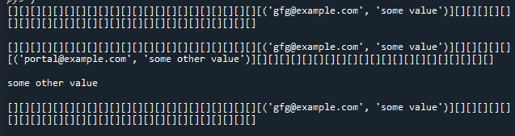

# Python 中的哈希映射

> 原文:[https://www.geeksforgeeks.org/hash-map-in-python/](https://www.geeksforgeeks.org/hash-map-in-python/)

哈希映射是索引数据结构。哈希映射利用[哈希函数](https://www.geeksforgeeks.org/what-are-hash-functions-and-how-to-choose-a-good-hash-function/)计算一个索引，该索引带有一个进入桶或槽数组的键。它的值被映射到具有相应索引的存储桶。密钥是唯一且不可变的。把哈希图想象成一个柜子，柜子里有抽屉，抽屉里存放的东西有标签。例如，存储用户信息-将电子邮件视为关键字，我们可以将与该用户对应的值(如名字、姓氏等)映射到一个桶中。

哈希函数是实现哈希映射的核心。它接收关键字，并将其转换为桶列表中桶的索引。理想的散列应该为每个键产生不同的索引。但是，可能会发生冲突。当散列给出一个现有的索引时，我们可以简单地通过附加一个列表或通过重新散列来为多个值使用一个桶。

在 Python 中，字典是哈希映射的例子。我们将从头开始看到哈希映射的实现，以便了解如何构建和定制这样的数据结构来优化搜索。

哈希映射设计将包括以下功能:

*   **set_val(键，值):**将键-值对插入哈希映射。如果哈希表中已经存在该值，请更新该值。
*   **get_val(键):**返回指定键映射到的值，如果此映射不包含键映射，则返回“未找到记录”。
*   **delete_val(键):**如果哈希映射包含特定键的映射，则删除该键的映射。

下面是实现。

## 蟒蛇 3

```
class HashTable:

    # Create empty bucket list of given size
    def __init__(self, size):
        self.size = size
        self.hash_table = self.create_buckets()

    def create_buckets(self):
        return [[] for _ in range(self.size)]

    # Insert values into hash map
    def set_val(self, key, val):

        # Get the index from the key
        # using hash function
        hashed_key = hash(key) % self.size

        # Get the bucket corresponding to index
        bucket = self.hash_table[hashed_key]

        found_key = False
        for index, record in enumerate(bucket):
            record_key, record_val = record

            # check if the bucket has same key as
            # the key to be inserted
            if record_key == key:
                found_key = True
                break

        # If the bucket has same key as the key to be inserted,
        # Update the key value
        # Otherwise append the new key-value pair to the bucket
        if found_key:
            bucket[index] = (key, val)
        else:
            bucket.append((key, val))

    # Return searched value with specific key
    def get_val(self, key):

        # Get the index from the key using
        # hash function
        hashed_key = hash(key) % self.size

        # Get the bucket corresponding to index
        bucket = self.hash_table[hashed_key]

        found_key = False
        for index, record in enumerate(bucket):
            record_key, record_val = record

            # check if the bucket has same key as 
            # the key being searched
            if record_key == key:
                found_key = True
                break

        # If the bucket has same key as the key being searched,
        # Return the value found
        # Otherwise indicate there was no record found
        if found_key:
            return record_val
        else:
            return "No record found"

    # Remove a value with specific key
    def delete_val(self, key):

        # Get the index from the key using
        # hash function
        hashed_key = hash(key) % self.size

        # Get the bucket corresponding to index
        bucket = self.hash_table[hashed_key]

        found_key = False
        for index, record in enumerate(bucket):
            record_key, record_val = record

            # check if the bucket has same key as
            # the key to be deleted
            if record_key == key:
                found_key = True
                break
        if found_key:
            bucket.pop(index)
        return

    # To print the items of hash map
    def __str__(self):
        return "".join(str(item) for item in self.hash_table)

hash_table = HashTable(50)

# insert some values
hash_table.set_val('gfg@example.com', 'some value')
print(hash_table)
print()

hash_table.set_val('portal@example.com', 'some other value')
print(hash_table)
print()

# search/access a record with key
print(hash_table.get_val('portal@example.com'))
print()

# delete or remove a value
hash_table.delete_val('portal@example.com')
print(hash_table)
```

**输出:**



**时间复杂度:**

内存索引访问需要恒定的时间，散列需要恒定的时间。因此，散列图的搜索复杂度也是常数时间，即 O(1)。