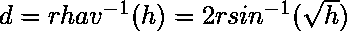
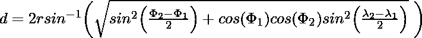

# 求球体上两点间距离的哈弗斯公式

> 原文:[https://www . geesforgeks . org/haversine-公式-寻找球体上两点之间的距离/](https://www.geeksforgeeks.org/haversine-formula-to-find-distance-between-two-points-on-a-sphere/)

**哈弗森**公式使用沿表面测量的纬度和经度来计算球体上两点之间的最短距离。它在导航中很重要。哈弗线可以用三角函数表示为:

中心角的哈弗线(为 d/r)由以下公式计算:

其中 r 为地球半径(6371 km)，d 为两点间的距离，为两点的纬度，分别为两点的经度。
通过应用逆哈弗斯线或使用逆正弦函数求解 d，我们得到:


或者


伦敦大本钟(北纬 51.5007 度，西经 0.1246 度)与纽约自由女神像(北纬 40.6892 度，西经 74.0445 度)之间的距离为 5574.8 公里。这不是精确的测量，因为
公式假设地球是一个完美的球体，而实际上它是一个扁球体。
以下是上述公式的实现:

## C++

```
// C++ program for the haversine formula
// C++ program for the
// haversine formula
#include <iostream>
#include <cmath>
using namespace std;

static double haversine(double lat1, double lon1,
                        double lat2, double lon2)
    {
        // distance between latitudes
        // and longitudes
        double dLat = (lat2 - lat1) *
                      M_PI / 180.0;
        double dLon = (lon2 - lon1) *
                      M_PI / 180.0;

        // convert to radians
        lat1 = (lat1) * M_PI / 180.0;
        lat2 = (lat2) * M_PI / 180.0;

        // apply formulae
        double a = pow(sin(dLat / 2), 2) +
                   pow(sin(dLon / 2), 2) *
                   cos(lat1) * cos(lat2);
        double rad = 6371;
        double c = 2 * asin(sqrt(a));
        return rad * c;
    }

// Driver code
int main()
{
    double lat1 = 51.5007;
    double lon1 = 0.1246;
    double lat2 = 40.6892;
    double lon2 = 74.0445;

    cout << haversine(lat1, lon1,
                      lat2, lon2) << " K.M.";
    return 0;
}

// This code is contributed
// by Mahadev.
```

## Java 语言(一种计算机语言，尤用于创建网站)

```
// Java program for the haversine formula
public class Haversine {

    static double haversine(double lat1, double lon1,
                            double lat2, double lon2)
    {
        // distance between latitudes and longitudes
        double dLat = Math.toRadians(lat2 - lat1);
        double dLon = Math.toRadians(lon2 - lon1);

        // convert to radians
        lat1 = Math.toRadians(lat1);
        lat2 = Math.toRadians(lat2);

        // apply formulae
        double a = Math.pow(Math.sin(dLat / 2), 2) +
                   Math.pow(Math.sin(dLon / 2), 2) *
                   Math.cos(lat1) *
                   Math.cos(lat2);
        double rad = 6371;
        double c = 2 * Math.asin(Math.sqrt(a));
        return rad * c;
    }

    // Driver Code
    public static void main(String[] args)
    {
        double lat1 = 51.5007;
        double lon1 = 0.1246;
        double lat2 = 40.6892;
        double lon2 = 74.0445;
        System.out.println(haversine(lat1, lon1, lat2, lon2) + " K.M.");
    }
}
```

## 蟒蛇 3

```
# Python 3 program for the
# haversine formula
import math

# Python 3 program for the
# haversine formula
def haversine(lat1, lon1, lat2, lon2):

    # distance between latitudes
    # and longitudes
    dLat = (lat2 - lat1) * math.pi / 180.0
    dLon = (lon2 - lon1) * math.pi / 180.0

    # convert to radians
    lat1 = (lat1) * math.pi / 180.0
    lat2 = (lat2) * math.pi / 180.0

    # apply formulae
    a = (pow(math.sin(dLat / 2), 2) +
         pow(math.sin(dLon / 2), 2) *
             math.cos(lat1) * math.cos(lat2));
    rad = 6371
    c = 2 * math.asin(math.sqrt(a))
    return rad * c

# Driver code
if __name__ == "__main__":
    lat1 = 51.5007
    lon1 = 0.1246
    lat2 = 40.6892
    lon2 = 74.0445

    print(haversine(lat1, lon1,lat2, lon2), "K.M.")

# This code is contributed
# by ChitraNayal
```

## C#

```
// C# program for the haversine formula
using System;
class GFG
{

static double haversine(double lat1, double lon1,
                        double lat2, double lon2)
{
    // distance between latitudes and longitudes
    double dLat = (Math.PI / 180) * (lat2 - lat1);
    double dLon = (Math.PI / 180) * (lon2 - lon1);

    // convert to radians
    lat1 = (Math.PI / 180) * (lat1);
    lat2 = (Math.PI / 180) * (lat2);

    // apply formulae
    double a = Math.Pow(Math.Sin(dLat / 2), 2) +
               Math.Pow(Math.Sin(dLon / 2), 2) *
               Math.Cos(lat1) * Math.Cos(lat2);
    double rad = 6371;
    double c = 2 * Math.Asin(Math.Sqrt(a));
    return rad * c;
}

// Driver Code
public static void Main()
{
    double lat1 = 51.5007;
    double lon1 = 0.1246;
    double lat2 = 40.6892;
    double lon2 = 74.0445;
    Console.WriteLine(haversine(lat1, lon1,
                                lat2, lon2) + " K.M.");
}
}

// This code is contributed
// by Akanksha Rai(Abby_akku)
```

## 服务器端编程语言（Professional Hypertext Preprocessor 的缩写）

```
<?php
// PHP program for the
// haversine formula

function haversine($lat1, $lon1,
                   $lat2, $lon2)
{
    // distance between latitudes
    // and longitudes
    $dLat = ($lat2 - $lat1) *
                M_PI / 180.0;
    $dLon = ($lon2 - $lon1) *
                M_PI / 180.0;

    // convert to radians
    $lat1 = ($lat1) * M_PI / 180.0;
    $lat2 = ($lat2) * M_PI / 180.0;

    // apply formulae
    $a = pow(sin($dLat / 2), 2) +
         pow(sin($dLon / 2), 2) *
             cos($lat1) * cos($lat2);
    $rad = 6371;
    $c = 2 * asin(sqrt($a));
    return $rad * $c;
}

// Driver code
$lat1 = 51.5007;
$lon1 = 0.1246;
$lat2 = 40.6892;
$lon2 = 74.0445;

echo haversine($lat1, $lon1,
               $lat2, $lon2) .
                      " K.M.";

// This code is contributed
// by Akanksha Rai(Abby_akku)
?>
```

## java 描述语言

```
<script>

// Javascript program for the haversine formula

    function haversine(lat1, lon1, lat2, lon2)
    {
        // distance between latitudes
        // and longitudes
        let dLat = (lat2 - lat1) * Math.PI / 180.0;
        let dLon = (lon2 - lon1) * Math.PI / 180.0;

        // convert to radiansa
        lat1 = (lat1) * Math.PI / 180.0;
        lat2 = (lat2) * Math.PI / 180.0;

        // apply formulae
        let a = Math.pow(Math.sin(dLat / 2), 2) +
                   Math.pow(Math.sin(dLon / 2), 2) *
                   Math.cos(lat1) *
                   Math.cos(lat2);
        let rad = 6371;
        let c = 2 * Math.asin(Math.sqrt(a));
        return rad * c;

    }
     // Driver Code
     let lat1 = 51.5007;
     let lon1 = 0.1246;
     let lat2 = 40.6892;
     let lon2 = 74.0445;
     document.write(haversine(lat1, lon1, lat2, lon2) + " K.M.");

// This code is contributed by avanitrachhadiya2155
</script>
```

**Output:** 

```
5574.840456848555 K.M.
```