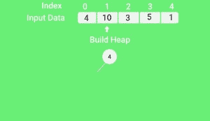
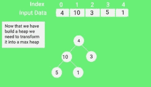
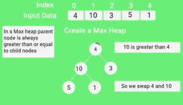
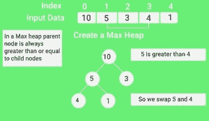
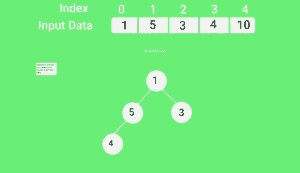
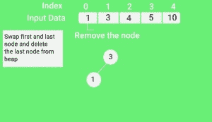

# 沉陷

> 原文:[https://www.geeksforgeeks.org/heap-sort/](https://www.geeksforgeeks.org/heap-sort/)

堆排序是一种基于二进制堆数据结构的基于比较的排序技术。它类似于选择排序，我们首先找到最小元素，并将最小元素放在开头。我们对剩余的元素重复同样的过程。

**什么是** [**二元堆**](https://www.geeksforgeeks.org/binary-heap/) **？**
我们先定义一个完整的二叉树。完全二叉树是这样一种二叉树，其中除了可能的最后一级之外的每一级都被完全填充，并且所有节点都尽可能地向左(来源[维基百科](http://en.wikipedia.org/wiki/Binary_tree#Types_of_binary_trees) )
A [二进制堆](https://www.geeksforgeeks.org/binary-heap/)是一种完全二叉树，其中项目以特殊的顺序存储，使得父节点中的值大于(或小于)其两个子节点中的值。前者称为最大堆，后者称为最小堆。堆可以用二叉树或数组来表示。

**为什么二进制堆采用基于数组的表示法？**
由于二进制堆是一个完整的二叉树，它可以很容易地表示为一个数组，并且基于数组的表示是节省空间的。如果父节点存储在索引 I 处，则可以用 2 * I + 1 计算左子节点，用 2 * I + 2 计算右子节点(假设索引从 0 开始)。

**如何“堆”一棵树？**

将二叉树重塑为堆数据结构的过程称为“堆化”。二叉树是最多有两个子节点的树形数据结构。如果一个节点的子节点是“heapify”，那么只有“heapify”过程可以应用于该节点。堆应该总是一个完整的二叉树。

从一个完整的二叉树开始，我们可以通过对堆的所有非叶元素运行一个名为“heapify”的函数来修改它，使其成为一个 Max-Heap。即“heapify”使用递归。

**堆化算法:**

```
heapify(array)
   Root = array[0]
   Largest = largest( array[0] , array [2 * 0 + 1]. array[2 * 0 + 2])
   if(Root != Largest)
       Swap(Root, Largest)
```

**heapify 的例子:**

```
        30(0)                 
       /   \         
    70(1)   50(2)

Child (70(1)) is greater than the parent (30(0))

Swap Child (70(1)) with the parent (30(0))
        70(0)                 
       /   \         
    30(1)   50(2)
```

**按递增顺序排序的堆排序算法:**
**1。**根据输入数据构建最大堆。
**2。**此时，最大的项目存储在堆的根。用堆的最后一项替换它，然后将堆的大小减少 1。最后，清理树根。
**3。**当堆的大小大于 1 时，重复步骤 2。

**如何建堆？**
只有当一个节点的子节点被 Heapify 时，Heapify 过程才能应用于该节点。因此，堆积必须按照自下而上的顺序进行。
我们借助一个例子来了解一下:

```
Input data: 4, 10, 3, 5, 1
         4(0)
        /   \
     10(1)   3(2)
    /   \
 5(3)    1(4)

The numbers in bracket represent the indices in the array 
representation of data.

Applying heapify procedure to index 1:
         4(0)
        /   \
    10(1)    3(2)
    /   \
5(3)    1(4)

Applying heapify procedure to index 0:
        10(0)
        /  \
     5(1)  3(2)
    /   \
 4(3)    1(4)
The heapify procedure calls itself recursively to build heap
 in top down manner.
```

## C++

```
// C++ program for implementation of Heap Sort
#include <iostream>

using namespace std;

// To heapify a subtree rooted with node i which is
// an index in arr[]. n is size of heap
void heapify(int arr[], int n, int i)
{
    int largest = i; // Initialize largest as root
    int l = 2 * i + 1; // left = 2*i + 1
    int r = 2 * i + 2; // right = 2*i + 2

    // If left child is larger than root
    if (l < n && arr[l] > arr[largest])
        largest = l;

    // If right child is larger than largest so far
    if (r < n && arr[r] > arr[largest])
        largest = r;

    // If largest is not root
    if (largest != i) {
        swap(arr[i], arr[largest]);

        // Recursively heapify the affected sub-tree
        heapify(arr, n, largest);
    }
}

// main function to do heap sort
void heapSort(int arr[], int n)
{
    // Build heap (rearrange array)
    for (int i = n / 2 - 1; i >= 0; i--)
        heapify(arr, n, i);

    // One by one extract an element from heap
    for (int i = n - 1; i > 0; i--) {
        // Move current root to end
        swap(arr[0], arr[i]);

        // call max heapify on the reduced heap
        heapify(arr, i, 0);
    }
}

/* A utility function to print array of size n */
void printArray(int arr[], int n)
{
    for (int i = 0; i < n; ++i)
        cout << arr[i] << " ";
    cout << "\n";
}

// Driver code
int main()
{
    int arr[] = { 12, 11, 13, 5, 6, 7 };
    int n = sizeof(arr) / sizeof(arr[0]);

    heapSort(arr, n);

    cout << "Sorted array is \n";
    printArray(arr, n);
}
```

## Java 语言(一种计算机语言，尤用于创建网站)

```
// Java program for implementation of Heap Sort
public class HeapSort {
    public void sort(int arr[])
    {
        int n = arr.length;

        // Build heap (rearrange array)
        for (int i = n / 2 - 1; i >= 0; i--)
            heapify(arr, n, i);

        // One by one extract an element from heap
        for (int i = n - 1; i > 0; i--) {
            // Move current root to end
            int temp = arr[0];
            arr[0] = arr[i];
            arr[i] = temp;

            // call max heapify on the reduced heap
            heapify(arr, i, 0);
        }
    }

    // To heapify a subtree rooted with node i which is
    // an index in arr[]. n is size of heap
    void heapify(int arr[], int n, int i)
    {
        int largest = i; // Initialize largest as root
        int l = 2 * i + 1; // left = 2*i + 1
        int r = 2 * i + 2; // right = 2*i + 2

        // If left child is larger than root
        if (l < n && arr[l] > arr[largest])
            largest = l;

        // If right child is larger than largest so far
        if (r < n && arr[r] > arr[largest])
            largest = r;

        // If largest is not root
        if (largest != i) {
            int swap = arr[i];
            arr[i] = arr[largest];
            arr[largest] = swap;

            // Recursively heapify the affected sub-tree
            heapify(arr, n, largest);
        }
    }

    /* A utility function to print array of size n */
    static void printArray(int arr[])
    {
        int n = arr.length;
        for (int i = 0; i < n; ++i)
            System.out.print(arr[i] + " ");
        System.out.println();
    }

    // Driver code
    public static void main(String args[])
    {
        int arr[] = { 12, 11, 13, 5, 6, 7 };
        int n = arr.length;

        HeapSort ob = new HeapSort();
        ob.sort(arr);

        System.out.println("Sorted array is");
        printArray(arr);
    }
}
```

## 计算机编程语言

```
# Python program for implementation of heap Sort

# To heapify subtree rooted at index i.
# n is size of heap

def heapify(arr, n, i):
    largest = i  # Initialize largest as root
    l = 2 * i + 1     # left = 2*i + 1
    r = 2 * i + 2     # right = 2*i + 2

    # See if left child of root exists and is
    # greater than root
    if l < n and arr[largest] < arr[l]:
        largest = l

    # See if right child of root exists and is
    # greater than root
    if r < n and arr[largest] < arr[r]:
        largest = r

    # Change root, if needed
    if largest != i:
        arr[i], arr[largest] = arr[largest], arr[i]  # swap

        # Heapify the root.
        heapify(arr, n, largest)

# The main function to sort an array of given size

def heapSort(arr):
    n = len(arr)

    # Build a maxheap.
    for i in range(n//2 - 1, -1, -1):
        heapify(arr, n, i)

    # One by one extract elements
    for i in range(n-1, 0, -1):
        arr[i], arr[0] = arr[0], arr[i]  # swap
        heapify(arr, i, 0)

# Driver code
arr = [12, 11, 13, 5, 6, 7]
heapSort(arr)
n = len(arr)
print("Sorted array is")
for i in range(n):
    print("%d" % arr[i]),
# This code is contributed by Mohit Kumra

```

## C#

```
// C# program for implementation of Heap Sort
using System;

public class HeapSort {
    public void sort(int[] arr)
    {
        int n = arr.Length;

        // Build heap (rearrange array)
        for (int i = n / 2 - 1; i >= 0; i--)
            heapify(arr, n, i);

        // One by one extract an element from heap
        for (int i = n - 1; i > 0; i--) {
            // Move current root to end
            int temp = arr[0];
            arr[0] = arr[i];
            arr[i] = temp;

            // call max heapify on the reduced heap
            heapify(arr, i, 0);
        }
    }

    // To heapify a subtree rooted with node i which is
    // an index in arr[]. n is size of heap
    void heapify(int[] arr, int n, int i)
    {
        int largest = i; // Initialize largest as root
        int l = 2 * i + 1; // left = 2*i + 1
        int r = 2 * i + 2; // right = 2*i + 2

        // If left child is larger than root
        if (l < n && arr[l] > arr[largest])
            largest = l;

        // If right child is larger than largest so far
        if (r < n && arr[r] > arr[largest])
            largest = r;

        // If largest is not root
        if (largest != i) {
            int swap = arr[i];
            arr[i] = arr[largest];
            arr[largest] = swap;

            // Recursively heapify the affected sub-tree
            heapify(arr, n, largest);
        }
    }

    /* A utility function to print array of size n */
    static void printArray(int[] arr)
    {
        int n = arr.Length;
        for (int i = 0; i < n; ++i)
            Console.Write(arr[i] + " ");
        Console.Read();
    }

    // Driver code
    public static void Main()
    {
        int[] arr = { 12, 11, 13, 5, 6, 7 };
        int n = arr.Length;

        HeapSort ob = new HeapSort();
        ob.sort(arr);

        Console.WriteLine("Sorted array is");
        printArray(arr);
    }
}

// This code is contributed
// by Akanksha Rai(Abby_akku)
```

## 服务器端编程语言（Professional Hypertext Preprocessor 的缩写）

```
<?php

// Php program for implementation of Heap Sort

// To heapify a subtree rooted with node i which is
// an index in arr[]. n is size of heap
function heapify(&$arr, $n, $i)
{
    $largest = $i; // Initialize largest as root
    $l = 2*$i + 1; // left = 2*i + 1
    $r = 2*$i + 2; // right = 2*i + 2

    // If left child is larger than root
    if ($l < $n && $arr[$l] > $arr[$largest])
        $largest = $l;

    // If right child is larger than largest so far
    if ($r < $n && $arr[$r] > $arr[$largest])
        $largest = $r;

    // If largest is not root
    if ($largest != $i)
    {
        $swap = $arr[$i];
        $arr[$i] = $arr[$largest];
        $arr[$largest] = $swap;

        // Recursively heapify the affected sub-tree
        heapify($arr, $n, $largest);
    }
}

// main function to do heap sort
function heapSort(&$arr, $n)
{
    // Build heap (rearrange array)
    for ($i = $n / 2 - 1; $i >= 0; $i--)
        heapify($arr, $n, $i);

    // One by one extract an element from heap
    for ($i = $n-1; $i > 0; $i--)
    {
        // Move current root to end
        $temp = $arr[0];
            $arr[0] = $arr[$i];
            $arr[$i] = $temp;

        // call max heapify on the reduced heap
        heapify($arr, $i, 0);
    }
}

/* A utility function to print array of size n */
function printArray(&$arr, $n)
{
    for ($i = 0; $i < $n; ++$i)
        echo ($arr[$i]." ") ; 

} 

// Driver program
    $arr = array(12, 11, 13, 5, 6, 7);
    $n = sizeof($arr)/sizeof($arr[0]);

    heapSort($arr, $n);

    echo 'Sorted array is ' . "\n";

    printArray($arr , $n);

// This code is contributed by Shivi_Aggarwal
?>

```

## java 描述语言

```
<script>

// JavaScript program for implementation
// of Heap Sort

function sort( arr)
    {
        var n = arr.length;

        // Build heap (rearrange array)
        for (var i = Math.floor(n / 2) - 1; i >= 0; i--)
            heapify(arr, n, i);

        // One by one extract an element from heap
        for (var i = n - 1; i > 0; i--) {
            // Move current root to end
            var temp = arr[0];
            arr[0] = arr[i];
            arr[i] = temp;

            // call max heapify on the reduced heap
            heapify(arr, i, 0);
        }
    }

    // To heapify a subtree rooted with node i which is
    // an index in arr[]. n is size of heap
    function heapify(arr, n, i)
    {
        var largest = i; // Initialize largest as root
        var l = 2 * i + 1; // left = 2*i + 1
        var r = 2 * i + 2; // right = 2*i + 2

        // If left child is larger than root
        if (l < n && arr[l] > arr[largest])
            largest = l;

        // If right child is larger than largest so far
        if (r < n && arr[r] > arr[largest])
            largest = r;

        // If largest is not root
        if (largest != i) {
            var swap = arr[i];
            arr[i] = arr[largest];
            arr[largest] = swap;

            // Recursively heapify the affected sub-tree
            heapify(arr, n, largest);
        }
    }

    /* A utility function to print array of size n */
    function printArray(arr)
    {
        var n = arr.length;
        for (var i = 0; i < n; ++i)
            document.write(arr[i] + " ");

    }

    var arr = [ 5, 12, 11, 13, 4, 6, 7 ];
    var n = arr.length;

    sort(arr);

    document.write( "Sorted array is <br>");
    printArray(arr, n);

// This code is contributed by SoumikMondal

</script>

```

**Output**

```
Sorted array is 
5 6 7 11 12 13 
```

[这里](https://ide.geeksforgeeks.org/rFO7Lm)是之前的 C 代码，供参考。

**注意:**
堆排序是一种原地算法。
其典型实现并不稳定，但可以做到稳定(参见[本](https://www.geeksforgeeks.org/stability-in-sorting-algorithms/))

**时间复杂度:**heapify 的时间复杂度为 O(Logn)。createAndBuildHeap()的时间复杂度为 O(n)，堆排序的整体时间复杂度为 O(nLogn)。

heapsort 的优势–

*   **效率–**执行堆排序所需的时间呈对数增长，而其他算法可能会随着要排序的项目数量的增加而呈指数增长。这种排序算法非常高效。
*   **内存使用–**内存使用是最小的，因为除了保存要排序的项目的初始列表所必需的内容之外，它不需要额外的内存空间来工作
*   **简单性–**它比其他同样高效的排序算法更容易理解，因为它没有使用递归等先进的计算机科学概念

**堆的应用**
**1。** [排序一个近排序(或 K 排序)的数组](https://www.geeksforgeeks.org/nearly-sorted-algorithm/)
**2。** [数组中 k 个最大(或最小)的元素](https://www.geeksforgeeks.org/k-largestor-smallest-elements-in-an-array/)
堆排序算法的用途有限，因为快速排序和合并排序在实践中更好。然而，堆数据结构本身被大量使用。参见[堆数据结构的应用](https://www.geeksforgeeks.org/applications-of-heap-data-structure/)
https://youtu.be/MtQL_ll5KhQ
**快照:**













## [堆排序测验](https://www.geeksforgeeks.org/quiz-heapsort-gq/)

**geek forgeeks/geek squiz 上的其他排序算法:**
[【快速排序】](https://www.geeksforgeeks.org/quick-sort/)、[选择排序](https://www.geeksforgeeks.org/selection-sort/)、[冒泡排序](https://www.geeksforgeeks.org/bubble-sort/)、[插入排序](https://www.geeksforgeeks.org/insertion-sort/)、[合并排序](https://www.geeksforgeeks.org/merge-sort/)、[堆排序](https://www.geeksforgeeks.org/heap-sort/)、[快速排序](https://www.geeksforgeeks.org/quick-sort/)、[基数排序](https://www.geeksforgeeks.org/radix-sort/)、[计数排序](https://www.geeksforgeeks.org/counting-sort/)、[桶排序](https://www.geeksforgeeks.org/bucket-sort-2/)、【

[排序的编码练习。](https://practice.geeksforgeeks.org/tag-page.php?tag=sorting&isCmp=0)

如果你发现任何不正确的地方，或者你想分享更多关于上面讨论的话题的信息，请写评论。