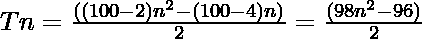

# 赫克塔贡号

> 原文:[https://www.geeksforgeeks.org/hectagon-number/](https://www.geeksforgeeks.org/hectagon-number/)

给定一个数字 **N** ，任务是找到**N<sup>th</sup>T5[he tagon 数字](https://en.wiktionary.org/wiki/hectagon)。** 

> 一个[合数](https://en.wiktionary.org/wiki/hectagon)是一类合数。它有一个 100 边的多边形，叫做 hectagon。第 N 个点的个数是 100 个点的个数，所有其他点都被一个公共的共享角包围并形成一个图案。最初的几个赫克塔格隆数字是 **1，100，297，592……**

**例:**

> **输入:** N = 2
> **输出:** 100
> **说明:**
> 第二个赫克塔格隆数为 100。
> **输入:** N = 3
> **输出:** 297

**方法:**第 N 个 hectagon 数由公式给出:

*   s 边多边形的第 n 项= 

*   因此 100 边多边形的第 n 项为

> 

以下是上述方法的实现:

## C++

```
// C++ program for above approach
#include <bits/stdc++.h>
using namespace std;

// Finding the nth hectagon Number
int hectagonNum(int n)
{
    return (98 * n * n - 96 * n) / 2;
}

// Driver Code
int main()
{
    int n = 3;
    cout << "3rd hectagon Number is = "
         << hectagonNum(n);

    return 0;
}

// This code is contributed by shivanisinghss2110
```

## C

```
// C program for above approach
#include <stdio.h>
#include <stdlib.h>

// Finding the nth hectagon Number
int hectagonNum(int n)
{
    return (98 * n * n - 96 * n) / 2;
}

// Driver program to test above function
int main()
{
    int n = 3;
    printf("3rd hectagon Number is = %d",
           hectagonNum(n));

    return 0;
}
```

## Java 语言(一种计算机语言，尤用于创建网站)

```
// Java program for above approach
import java.util.*;
class GFG{

// Finding the nth hectagon Number
static int hectagonNum(int n)
{
    return (98 * n * n - 96 * n) / 2;
}

// Driver Code
public static void main(String args[])
{
    int n = 3;
    System.out.print("3rd hectagon Number is = " +
                                  hectagonNum(n));
}
}

// This code is contributed by Akanksha_Rai
```

## 蟒蛇 3

```
# Python3 program for above approach

# Finding the nth hectagon number
def hectagonNum(n):

    return (98 * n * n - 96 * n) // 2

# Driver code
n = 3
print("3rd hectagon Number is = ",
                   hectagonNum(n))

# This code is contributed by divyamohan123
```

## C#

```
// C# program for above approach
using System;
class GFG{

// Finding the nth hectagon Number
static int hectagonNum(int n)
{
    return (98 * n * n - 96 * n) / 2;
}

// Driver Code
public static void Main()
{
    int n = 3;
    Console.Write("3rd hectagon Number is = " +
                               hectagonNum(n));
}
}

// This code is contributed by Akanksha_Rai
```

## java 描述语言

```
<script>

// JavaScript program for above approach

// Finding the nth hectagon Number
function hectagonNum(n)
{
    return (98 * n * n - 96 * n) / 2;
}

// Driver Code
var n = 3;
document.write("3rd hectagon Number is = "  + hectagonNum(n));

</script>
```

**Output:** 

```
3rd hectagon Number is = 297
```

***时间复杂度:** O(1)*

***辅助空间:** O(1)*

**参考资料:**[https://en . wieneristary . org/wiki/hectagon](https://en.wiktionary.org/wiki/hectagon)