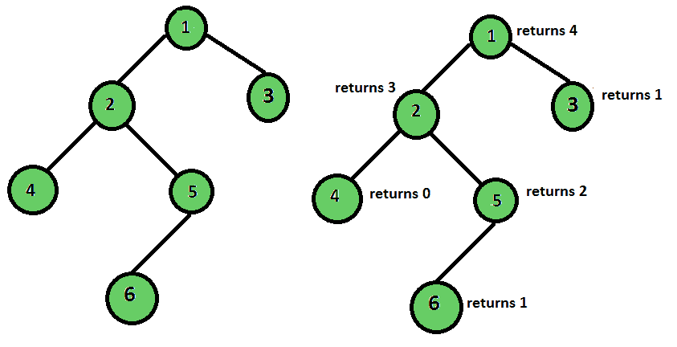
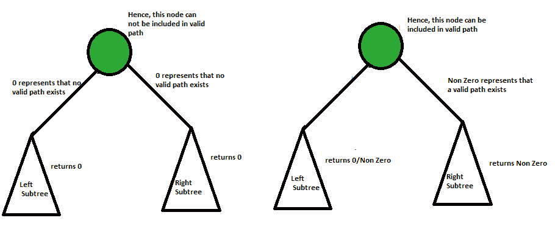

# 仅考虑偶数级叶的二叉树高度

> 原文:[https://www . geesforgeks . org/height-二叉树-考虑-偶数级-叶子/](https://www.geeksforgeeks.org/height-binary-tree-considering-even-level-leaves/)

假设只有偶数层的节点被认为是有效的叶节点，求二叉树的高度。
二叉树的高度是树的根与其最远的叶子之间的边数。但是如果我们改变叶节点的定义会怎么样呢？让我们将有效的叶节点定义为没有子节点并且处于偶数层的节点(将根节点视为奇数层节点)。



**输出:**树高 4

**解决方法:**这个问题的方法与正常的找高方法略有不同。在返回步骤中，我们检查该节点是否是有效的根节点。如果有效，返回 1，否则返回 0。现在在递归步骤中，如果左边和右边的子树都产生 0，那么当前节点也产生 0，因为在这种情况下，没有从当前节点到有效叶节点的路径。但是如果子节点返回的值中至少有一个是非零的，这意味着该路径上的叶节点是有效的叶节点，因此该路径会影响最终结果，因此我们返回当前节点返回的最大值+ 1。



## C++

```
/* Program to find height of the tree considering
   only even level leaves. */
#include <bits/stdc++.h>
using namespace std;

/* A binary tree node has data, pointer to
   left child and a pointer to right child */
struct Node {
    int data;
    struct Node* left;
    struct Node* right;
};

int heightOfTreeUtil(Node* root, bool isEven)
{
    // Base Case
    if (!root)
        return 0;

    if (!root->left && !root->right) {
        if (isEven)
            return 1;
        else
            return 0;
    }

    /*left stores the result of left subtree,
      and right stores the result of right subtree*/
    int left = heightOfTreeUtil(root->left, !isEven);
    int right = heightOfTreeUtil(root->right, !isEven);

    /*If both left and right returns 0, it means
      there is no valid path till leaf node*/
    if (left == 0 && right == 0)
        return 0;

    return (1 + max(left, right));
}

/* Helper function that allocates a new node with the
   given data and NULL left and right pointers. */
struct Node* newNode(int data)
{
    struct Node* node =
              (struct Node*)malloc(sizeof(struct Node));
    node->data = data;
    node->left = NULL;
    node->right = NULL;

    return (node);
}

int heightOfTree(Node* root)
{
    return heightOfTreeUtil(root, false);
}

/* Driver program to test above functions*/
int main()
{
    // Let us create binary tree shown in above diagram
    struct Node* root = newNode(1);

    root->left = newNode(2);
    root->right = newNode(3);
    root->left->left = newNode(4);
    root->left->right = newNode(5);
    root->left->right->left = newNode(6);
    cout << "Height of tree is " << heightOfTree(root);
    return 0;
}
```

## Java 语言(一种计算机语言，尤用于创建网站)

```
/* Java Program to find height of the tree considering
only even level leaves. */
class GfG {

/* A binary tree node has data, pointer to
left child and a pointer to right child */
static class Node {
    int data;
    Node left;
 Node right;
}

static int heightOfTreeUtil(Node root, boolean isEven)
{
    // Base Case
    if (root == null)
        return 0;

    if (root.left == null && root.right == null) {
        if (isEven == true)
            return 1;
        else
            return 0;
    }

    /*left stores the result of left subtree,
    and right stores the result of right subtree*/
    int left = heightOfTreeUtil(root.left, !isEven);
    int right = heightOfTreeUtil(root.right, !isEven);

    /*If both left and right returns 0, it means
    there is no valid path till leaf node*/
    if (left == 0 && right == 0)
        return 0;

    return (1 + Math.max(left, right));
}

/* Helper function that allocates a new node with the
given data and NULL left and right pointers. */
static Node newNode(int data)
{
    Node node = new Node();
    node.data = data;
    node.left = null;
    node.right = null;

    return (node);
}

static int heightOfTree(Node root)
{
    return heightOfTreeUtil(root, false);
}

/* Driver program to test above functions*/
public static void main(String[] args)
{
    // Let us create binary tree shown in above diagram
    Node root = newNode(1);

    root.left = newNode(2);
    root.right = newNode(3);
    root.left.left = newNode(4);
    root.left.right = newNode(5);
    root.left.right.left = newNode(6);
    System.out.println("Height of tree is " + heightOfTree(root));
}
}
```

## 蟒蛇 3

```
# Program to find height of the tree considering
# only even level leaves.

# Helper class that allocates a new node with the
# given data and None left and right pointers.
class newNode:
    def __init__(self, data):
        self.data = data
        self.left = None
        self.right = None

def heightOfTreeUtil(root, isEven):

    # Base Case
    if (not root):
        return 0

    if (not root.left and not root.right):
        if (isEven):
            return 1
        else:
            return 0

    # left stores the result of left subtree,
    # and right stores the result of right subtree
    left = heightOfTreeUtil(root.left, not isEven)
    right = heightOfTreeUtil(root.right, not isEven)

    #If both left and right returns 0, it means
    # there is no valid path till leaf node
    if (left == 0 and right == 0):
        return 0

    return (1 + max(left, right))

def heightOfTree(root):
    return heightOfTreeUtil(root, False)

# Driver Code
if __name__ == '__main__':

    # Let us create binary tree shown
    # in above diagram
    root = newNode(1)

    root.left = newNode(2)
    root.right = newNode(3)
    root.left.left = newNode(4)
    root.left.right = newNode(5)
    root.left.right.left = newNode(6)
    print("Height of tree is",
           heightOfTree(root))

# This code is contributed by PranchalK
```

## C#

```
/* C# Program to find height of the tree considering
only even level leaves. */
using System;

class GfG
{

    /* A binary tree node has data, pointer to
    left child and a pointer to right child */
    class Node
    {
        public int data;
        public Node left;
        public Node right;
    }

    static int heightOfTreeUtil(Node root,
                               bool isEven)
    {
        // Base Case
        if (root == null)
            return 0;

        if (root.left == null &&
            root.right == null)
        {
            if (isEven == true)
                return 1;
            else
                return 0;
        }

        /*left stores the result of left subtree,
        and right stores the result of right subtree*/
        int left = heightOfTreeUtil(root.left, !isEven);
        int right = heightOfTreeUtil(root.right, !isEven);

        /*If both left and right returns 0, it means
        there is no valid path till leaf node*/
        if (left == 0 && right == 0)
            return 0;

        return (1 + Math.Max(left, right));
    }

    /* Helper function that allocates a new node with the
    given data and NULL left and right pointers. */
    static Node newNode(int data)
    {
        Node node = new Node();
        node.data = data;
        node.left = null;
        node.right = null;

        return (node);
    }

    static int heightOfTree(Node root)
    {
        return heightOfTreeUtil(root, false);
    }

    /* Driver code*/
    public static void Main(String[] args)
    {
        // Let us create binary tree
        // shown in above diagram
        Node root = newNode(1);

        root.left = newNode(2);
        root.right = newNode(3);
        root.left.left = newNode(4);
        root.left.right = newNode(5);
        root.left.right.left = newNode(6);
        Console.WriteLine("Height of tree is " +
                            heightOfTree(root));
    }
}

/* This code is contributed by Rajput-Ji*/
```

## java 描述语言

```
<script>
/* javascript Program to find height of the tree considering
only even level leaves. */

    /*
     * A binary tree node has data, pointer to left child and a pointer to right
     * child
     */

     class Node {
            constructor(val) {
                this.data = val;
                this.left = null;
                this.right = null;
            }
        }

    function heightOfTreeUtil(root,  isEven) {
        // Base Case
        if (root == null)
            return 0;

        if (root.left == null && root.right == null) {
            if (isEven == true)
                return 1;
            else
                return 0;
        }

        /*
         * left stores the result of left subtree, and right stores the result of right
         * subtree
         */
        var left = heightOfTreeUtil(root.left, !isEven);
        var right = heightOfTreeUtil(root.right, !isEven);

        /*
         * If both left and right returns 0, it means there is no valid path till leaf
         * node
         */
        if (left == 0 && right == 0)
            return 0;

        return (1 + Math.max(left, right));
    }

    /*
     * Helper function that allocates a new node with the given data and NULL left
     * and right pointers.
     */
    function newNode(data) {
var node = new Node();
        node.data = data;
        node.left = null;
        node.right = null;

        return (node);
    }

    function heightOfTree(root) {
        return heightOfTreeUtil(root, false);
    }

    /* Driver program to test above functions */

        // Let us create binary tree shown in above diagram
var root = newNode(1);

        root.left = newNode(2);
        root.right = newNode(3);
        root.left.left = newNode(4);
        root.left.right = newNode(5);
        root.left.right.left = newNode(6);
        document.write("Height of tree is " + heightOfTree(root));

// This code is contributed by umadevi9616
</script>
```

**输出:**

```
Height of tree is 4
```

**时间复杂度:** O(n)，其中 n 是给定二叉树中的节点数。

？list = plqm 7 alhxfyshcxd 7r 1j0ky 9 ZG _ gbb 1 dbk〖t0〗]