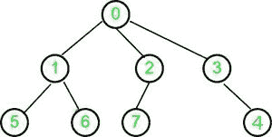

# 类属树距父数组的高度

> 原文:[https://www . geesforgeks . org/height-generic-tree-parent-array/](https://www.geeksforgeeks.org/height-generic-tree-parent-array/)

给定一棵大小为 n 的树作为数组父级[0..n-1]其中父[]中的每个索引 I 代表一个节点，I 处的值代表该节点的直接父节点。对于根节点，值将为-1。给定父链接，找到类属树的高度。
**例:**

```
Input : parent[] = {-1, 0, 0, 0, 3, 1, 1, 2}
Output : 2
```



```
Input  : parent[] = {-1, 0, 1, 2, 3}
Output : 4
```


Here, a generic tree is sometimes also called an N-ary tree or N-way tree where N denotes the maximum number of child a node can have. In this problem, the array represents n number of nodes in the tree.

**方法 1:**
一种解决方案是从节点向上遍历树，直到到达节点值为-1 的根节点。而遍历每个节点存储最大路径长度。
这个解的时间复杂度是 **O(n^2)** 。
**方法 2:**
在 O(n)时间内建立 N 元树的图形，并在 O(n)时间内在存储的图形上应用 BFS，同时执行 BFS 存储最大到达水平。这个解决方案做了两次迭代来寻找 N 元树的高度。

## C++

```
// C++ code to find height of N-ary
// tree in O(n)
#include <bits/stdc++.h>
#define MAX 1001
using namespace std;

// Adjacency list to
// store N-ary tree
vector<int> adj[MAX];

// Build tree in tree in O(n)
int build_tree(int arr[], int n)
{
    int root_index = 0;

    // Iterate for all nodes
    for (int i = 0; i < n; i++) {

        // if root node, store index
        if (arr[i] == -1)
            root_index = i;

        else {
            adj[i].push_back(arr[i]);
            adj[arr[i]].push_back(i);
        }
    }
    return root_index;
}

// Applying BFS
int BFS(int start)
{
    // map is used as visited array
    map<int, int> vis;

    queue<pair<int, int> > q;
    int max_level_reached = 0;

    // height of root node is zero
    q.push({ start, 0 });

    // p.first denotes node in adjacency list
    // p.second denotes level of p.first
    pair<int, int> p;

    while (!q.empty()) {

        p = q.front();
        vis[p.first] = 1;

        // store the maximum level reached
        max_level_reached = max(max_level_reached,
                                p.second);

        q.pop();

        for (int i = 0; i < adj[p.first].size(); i++)

            // adding 1 to previous level
            // stored on node p.first
            // which is parent of node adj[p.first][i]
            // if adj[p.first][i] is not visited
            if (!vis[adj[p.first][i]])
                q.push({ adj[p.first][i], p.second + 1 });
    }

    return max_level_reached;
}

// Driver Function
int main()
{
    // node 0 to node n-1
    int parent[] = { -1, 0, 1, 2, 3 };

    // Number of nodes in tree
    int n = sizeof(parent) / sizeof(parent[0]);

    int root_index = build_tree(parent, n);

    int ma = BFS(root_index);
    cout << "Height of N-ary Tree=" << ma;
    return 0;
}
```

## Java 语言(一种计算机语言，尤用于创建网站)

```
// Java code to find height of N-ary
// tree in O(n)
import java.io.*;
import java.util.*;

class GFG 
{
    static int MAX = 1001;

    // Adjacency list to
    // store N-ary tree
    static ArrayList<ArrayList<Integer>> adj = 
      new ArrayList<ArrayList<Integer>>();

    // Build tree in tree in O(n)
    static int build_tree(int arr[], int n)
    {
        int root_index = 0;

        // Iterate for all nodes
        for (int i = 0; i < n; i++) 
        {

            // if root node, store index
            if (arr[i] == -1)
                root_index = i;

            else 
            {
                adj.get(i).add(arr[i]);
                adj.get(arr[i]).add(i);
            }
        }
        return root_index;
    }

    // Applying BFS
    static int BFS(int start)
    {

        // map is used as visited array
        Map<Integer, Integer> vis = new HashMap<Integer, Integer>(); 
        ArrayList<ArrayList<Integer>> q = new ArrayList<ArrayList<Integer>>();
        int max_level_reached = 0;

        // height of root node is zero
        q.add(new ArrayList<Integer>(Arrays.asList(start, 0 )));

        // p.first denotes node in adjacency list
        // p.second denotes level of p.first
        ArrayList<Integer> p = new ArrayList<Integer>();
        while(q.size() != 0)
        {
            p = q.get(0);
            vis.put(p.get(0),1);

            // store the maximum level reached
            max_level_reached = Math.max(max_level_reached,p.get(1));
            q.remove(0);
            for(int i = 0; i < adj.get(p.get(0)).size(); i++)
            {

                // adding 1 to previous level
                // stored on node p.first
                // which is parent of node adj[p.first][i]
                // if adj[p.first][i] is not visited
                if(!vis.containsKey(adj.get(p.get(0)).get(i)))
                {
                    q.add(new ArrayList<Integer>(Arrays.asList(adj.get(p.get(0)).get(i), p.get(1)+1)));
                }
            }
        }
        return max_level_reached;
    }

    // Driver Function
    public static void main (String[] args)
    {
        for(int i = 0; i < MAX; i++)
        {
            adj.add(new ArrayList<Integer>());
        }

        // node 0 to node n-1
        int parent[] = { -1, 0, 1, 2, 3 };

        // Number of nodes in tree
        int n = parent.length;
        int root_index = build_tree(parent, n);
        int ma = BFS(root_index);
        System.out.println( "Height of N-ary Tree=" + ma);
    }
}

// This code is contributed by rag2127
```

## 蟒蛇 3

```
# Python3 code to find height 
# of N-ary tree in O(n)
from collections import deque

MAX = 1001

# Adjacency list to
# store N-ary tree
adj = [[] for i in range(MAX)]

# Build tree in tree in O(n)
def build_tree(arr, n):

    root_index = 0

    # Iterate for all nodes
    for i in range(n):

        # if root node, store 
        # index
        if (arr[i] == -1):
            root_index = i
        else:
            adj[i].append(arr[i])
            adj[arr[i]].append(i)

    return root_index

# Applying BFS
def BFS(start):

    # map is used as visited 
    # array
    vis = {}

    q = deque()
    max_level_reached = 0

    # height of root node is 
    # zero
    q.append([start, 0])

    # p.first denotes node in 
    # adjacency list
    # p.second denotes level of 
    # p.first
    p = []

    while (len(q) > 0):
        p = q.popleft()
        vis[p[0]] = 1

        # store the maximum level 
        # reached
        max_level_reached = max(max_level_reached,
                                p[1])

        for i in range(len(adj[p[0]])):

            # adding 1 to previous level
            # stored on node p.first
            # which is parent of node 
            # adj[p.first][i]
            # if adj[p.first][i] is not visited
            if (adj[p[0]][i] not in vis ):
                q.append([adj[p[0]][i],
                          p[1] + 1])

    return max_level_reached

# Driver code
if __name__ == '__main__':

    # node 0 to node n-1
    parent = [-1, 0, 1, 2, 3]

    # Number of nodes in tree
    n = len(parent)

    root_index = build_tree(parent, n)
    ma = BFS(root_index)
    print("Height of N-ary Tree=",
          ma)

# This code is contributed by Mohit Kumar 29
```

## C#

```
// C# code to find height of N-ary
// tree in O(n)
using System;
using System.Collections.Generic;

public class GFG
{
  static int MAX = 1001;

  // Adjacency list to
  // store N-ary tree
  static List<List<int>> adj = new List<List<int>>();

  // Build tree in tree in O(n)
  static int build_tree(int[] arr, int n)
  {
    int root_index = 0;

    // Iterate for all nodes
    for (int i = 0; i < n; i++) 
    {

      // if root node, store index
      if (arr[i] == -1)
        root_index = i;
      else
      {
        adj[i].Add(arr[i]);
        adj[arr[i]].Add(i);
      }
    }
    return root_index;    
  }

  // Applying BFS
  static int BFS(int start)
  {
    // map is used as visited array
    Dictionary<int, int> vis = new Dictionary<int, int>();  
    List<List<int>> q= new List<List<int>>();
    int max_level_reached = 0;

    // height of root node is zero
    q.Add(new List<int>(){start, 0});

    // p.first denotes node in adjacency list
    // p.second denotes level of p.first
    List<int> p = new List<int>();

    while(q.Count != 0)
    {
      p = q[0];
      vis.Add(p[0], 1);

      // store the maximum level reached
      max_level_reached = Math.Max(max_level_reached, p[1]);
      q.RemoveAt(0);
      for(int i = 0; i < adj[p[0]].Count; i++)
      {
        // adding 1 to previous level
        // stored on node p.first
        // which is parent of node adj[p.first][i]
        // if adj[p.first][i] is not visited
        if(!vis.ContainsKey(adj[p[0]][i]))
        {
          q.Add(new List<int>(){adj[p[0]][i], p[1] + 1 });
        }
      }
    }
    return max_level_reached;
  }

  // Driver Function
  static public void Main ()
  {
    for(int i = 0; i < MAX; i++)
    {
      adj.Add(new List<int>());
    }

    // node 0 to node n-1
    int[] parent = { -1, 0, 1, 2, 3 };

    // Number of nodes in tree
    int n = parent.Length;
    int root_index = build_tree(parent, n);
    int ma = BFS(root_index);
    Console.Write("Height of N-ary Tree=" + ma);
  }
}

// This code is contributed by avanitrachhadiya2155
```

## java 描述语言

```
<script>

// JavaScript code to find height of N-ary
// tree in O(n)

    let MAX = 1001;
    let adj = [];

    // Adjacency list to
    // store N-ary tree
    function build_tree(arr,n)
    {
        let root_index = 0;

        // Iterate for all nodes
        for (let i = 0; i < n; i++)
        {

            // if root node, store index
            if (arr[i] == -1)
                root_index = i;

            else
            {
                adj[i].push(arr[i]);
                adj[arr[i]].push(i);
            }
        }
        return root_index;
    }

    // Applying BFS
    function BFS(start)
    {
        // map is used as visited array
        let vis = new Map();
        let q = [];
        let max_level_reached = 0;

        // height of root node is zero
        q.push([start, 0 ]);

        // p.first denotes node in adjacency list
        // p.second denotes level of p.first
        let p = [];
        while(q.length != 0)
        {
            p = q[0];
            vis.set(p[0],1);

            // store the maximum level reached
            max_level_reached =
            Math.max(max_level_reached,p[1]);
            q.shift();
            for(let i = 0; i < adj[p[0]].length; i++)
            {

                // adding 1 to previous level
                // stored on node p.first
                // which is parent of node adj[p.first][i]
                // if adj[p.first][i] is not visited
                if(!vis.has(adj[p[0]][i]))
                {
                    q.push([adj[p[0]][i], p[1]+1]);
                }
            }
        }
        return max_level_reached;
    }

     // Driver Function
    for(let i = 0; i < MAX; i++)
        {
            adj.push([]);
        }

        // node 0 to node n-1
        let parent = [ -1, 0, 1, 2, 3 ];

        // Number of nodes in tree
        let n = parent.length;
        let root_index = build_tree(parent, n);
        let ma = BFS(root_index);
        document.write( "Height of N-ary Tree=" + ma);

// This code is contributed by unknown2108

</script>
```

**Output:** 

```
Height of N-ary Tree=4
```

这个解的时间复杂度是 **O(2n)** ，对于非常大的 N，它收敛到 O(N)
**方法 3:**
我们可以只在一次迭代中找到 N 元树的高度。我们从 0 到 n-1 迭代地访问节点，如果在到达被访问的节点或者到达根节点之前没有被访问过，则递归地标记未被访问的祖先。如果我们在使用父链接向上遍历树的同时到达被访问的节点，那么我们使用它的高度，并且不会在递归中走得更远。
**例 1 说明::**


对于**节点 0** :检查根节点是否为真，
返回 0 作为高度，将节点 0 标记为已访问
对于**节点 1** :重现直系祖先，即已经访问过的 0
所以，使用其高度和返回高度(节点 0) +1
将节点 1 标记为已访问
对于**节点 2** :重现直系祖先，即已经访问过的 0
所以， 使用它的高度和返回高度(节点 0) +1
将节点 2 标记为已访问
对于**节点 3** :对于已经访问过的直系祖先，即 0 进行重现
所以，使用它的高度和返回高度(节点 0) +1
将节点 3 标记为已访问
对于**节点 4** :对于已经访问过的直系祖先，即 3 进行重现
所以， 使用它的高度和返回高度(节点 3) +1
将节点 3 标记为已访问
对于**节点 5** :对于一个直系祖先，即 1，已经访问过
所以，使用它的高度和返回高度(节点 1) +1
将节点 5 标记为已访问
对于**节点 6** :对于一个直系祖先，即 1，已经访问过
所以， 使用它的高度和返回高度(节点 1) +1
将节点 6 标记为已访问
对于**节点 7** :对于一个直系祖先，即 2，它已经被访问
所以，使用它的高度和返回高度(节点 2) +1
将节点 7 标记为已访问
因此，我们只处理 N 元树中的每个节点一次。

## C++

```
// C++ code to find height of N-ary
// tree in O(n) (Efficient Approach)
#include <bits/stdc++.h>
using namespace std;

// Recur For Ancestors of node and
// store height of node at last
int fillHeight(int p[], int node, int visited[],
                                   int height[])
{
    // If root node
    if (p[node] == -1) {

        // mark root node as visited
        visited[node] = 1;
        return 0;
    }

    // If node is already visited
    if (visited[node])
        return height[node];

    // Visit node and calculate its height
    visited[node] = 1;

    // recur for the parent node
    height[node] = 1 + fillHeight(p, p[node],
                            visited, height);

    // return calculated height for node
    return height[node];
}

int findHeight(int parent[], int n)
{
    // To store max height
    int ma = 0;

    // To check whether or not node is visited before
    int visited[n];

    // For Storing Height of node
    int height[n];

    memset(visited, 0, sizeof(visited));
    memset(height, 0, sizeof(height));

    for (int i = 0; i < n; i++) {

        // If not visited before
        if (!visited[i])
            height[i] = fillHeight(parent, i,
                             visited, height);

        // store maximum height so far
        ma = max(ma, height[i]);
    }

    return ma;
}

// Driver Function
int main()
{
    int parent[] = { -1, 0, 0, 0, 3, 1, 1, 2 };
    int n = sizeof(parent) / sizeof(parent[0]);

    cout << "Height of N-ary Tree = "
         << findHeight(parent, n);
    return 0;
}
```

## Java 语言(一种计算机语言，尤用于创建网站)

```
// Java code to find height of N-ary
// tree in O(n) (Efficient Approach)
import java.util.*;
class GFG
{

// Recur For Ancestors of node and
// store height of node at last
static int fillHeight(int p[], int node, 
                      int visited[], int height[])
{
    // If root node
    if (p[node] == -1)
    {

        // mark root node as visited
        visited[node] = 1;
        return 0;
    }

    // If node is already visited
    if (visited[node] == 1)
        return height[node];

    // Visit node and calculate its height
    visited[node] = 1;

    // recur for the parent node
    height[node] = 1 + fillHeight(p, p[node],
                            visited, height);

    // return calculated height for node
    return height[node];
}

static int findHeight(int parent[], int n)
{
    // To store max height
    int ma = 0;

    // To check whether or not node is visited before
    int []visited = new int[n];

    // For Storing Height of node
    int []height = new int[n];

    for(int i = 0; i < n; i++)
    {
        visited[i] = 0;
        height[i] = 0;
    }

    for (int i = 0; i < n; i++) 
    {

        // If not visited before
        if (visited[i] != 1)

            height[i] = fillHeight(parent, i,
                            visited, height);

        // store maximum height so far
        ma = Math.max(ma, height[i]);
    }
    return ma;
}

// Driver Code
public static void main(String[] args) 
{
    int parent[] = { -1, 0, 0, 0, 3, 1, 1, 2 };
    int n = parent.length;

    System.out.println("Height of N-ary Tree = " +
                           findHeight(parent, n));
}
}

// This code is contributed by 29AjayKumar
```

## 蟒蛇 3

```
# Python3 code to find height of N-ary 
# tree in O(n) (Efficient Approach) 

# Recur For Ancestors of node and 
# store height of node at last 
def fillHeight(p, node, visited, height):

    # If root node 
    if (p[node] == -1): 

        # mark root node as visited 
        visited[node] = 1
        return 0

    # If node is already visited 
    if (visited[node]): 
        return height[node] 

    # Visit node and calculate its height 
    visited[node] = 1

    # recur for the parent node 
    height[node] = 1 + fillHeight(p, p[node], 
                                  visited, height) 

    # return calculated height for node 
    return height[node]

def findHeight(parent, n):

    # To store max height 
    ma = 0

    # To check whether or not node is 
    # visited before 
    visited = [0] * n

    # For Storing Height of node 
    height = [0] * n 

    for i in range(n):

        # If not visited before 
        if (not visited[i]):
            height[i] = fillHeight(parent, i,
                                   visited, height) 

        # store maximum height so far 
        ma = max(ma, height[i])

    return ma

# Driver Code
if __name__ == '__main__':

    parent = [-1, 0, 0, 0, 3, 1, 1, 2] 
    n = len(parent)

    print("Height of N-ary Tree =",
             findHeight(parent, n))

# This code is contributed by PranchalK
```

## C#

```
// C# code to find height of N-ary
// tree in O(n) (Efficient Approach)
using System;

class GFG
{

// Recur For Ancestors of node and
// store height of node at last
static int fillHeight(int []p, int node, 
                      int []visited, 
                      int []height)
{
    // If root node
    if (p[node] == -1)
    {

        // mark root node as visited
        visited[node] = 1;
        return 0;
    }

    // If node is already visited
    if (visited[node] == 1)
        return height[node];

    // Visit node and calculate its height
    visited[node] = 1;

    // recur for the parent node
    height[node] = 1 + fillHeight(p, p[node],
                            visited, height);

    // return calculated height for node
    return height[node];
}

static int findHeight(int []parent, int n)
{
    // To store max height
    int ma = 0;

    // To check whether or not 
    // node is visited before
    int []visited = new int[n];

    // For Storing Height of node
    int []height = new int[n];

    for(int i = 0; i < n; i++)
    {
        visited[i] = 0;
        height[i] = 0;
    }

    for (int i = 0; i < n; i++) 
    {

        // If not visited before
        if (visited[i] != 1)

            height[i] = fillHeight(parent, i,
                            visited, height);

        // store maximum height so far
        ma = Math.Max(ma, height[i]);
    }
    return ma;
}

// Driver Code
public static void Main(String[] args) 
{
    int []parent = { -1, 0, 0, 0, 3, 1, 1, 2 };
    int n = parent.Length;

    Console.WriteLine("Height of N-ary Tree = " +
                          findHeight(parent, n));
}
}

// This code contributed by Rajput-Ji
```

## java 描述语言

```
<script>
// Javascript code to find height of N-ary
// tree in O(n) (Efficient Approach)

// Recur For Ancestors of node and
// store height of node at last
function fillHeight(p, node, visited, height)
{

    // If root node
    if (p[node] == -1)
    {

        // mark root node as visited
        visited[node] = 1;
        return 0;
    }

    // If node is already visited
    if (visited[node] == 1)
        return height[node];

    // Visit node and calculate its height
    visited[node] = 1;

    // recur for the parent node
    height[node] = 1 + fillHeight(p, p[node],
                            visited, height);

    // return calculated height for node
    return height[node];
}

function findHeight(parent,n)
{
    // To store max height
    let ma = 0;

    // To check whether or not node is visited before
    let visited = new Array(n);

    // For Storing Height of node
    let height = new Array(n);

    for(let i = 0; i < n; i++)
    {
        visited[i] = 0;
        height[i] = 0;
    }

    for (let i = 0; i < n; i++)
    {

        // If not visited before
        if (visited[i] != 1)

            height[i] = fillHeight(parent, i,
                            visited, height);

        // store maximum height so far
        ma = Math.max(ma, height[i]);
    }
    return ma;
}

// Driver Code
let parent = [ -1, 0, 0, 0, 3, 1, 1, 2 ];
let  n = parent.length;
document.write("Height of N-ary Tree = " +
                           findHeight(parent, n));

// This code is contributed by ab2127
</script>
```

**Output:** 

```
Height of N-ary Tree = 2
```

**时间复杂度:** O(n)