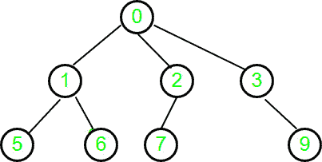

# 通用树距父数组

的高度

> 原文： [https://www.geeksforgeeks.org/height-generic-tree-parent-array/](https://www.geeksforgeeks.org/height-generic-tree-parent-array/)

我们给了一个大小为 n 的树作为数组 parent [0..n-1]，其中 parent []中的每个索引 i 代表一个节点，i 处的值代表该节点的直接父节点。 对于根节点，值将为-1。 在给定父链接的情况下找到通用树的高度。

**范例**：

```
Input : parent[] = {-1, 0, 0, 0, 3, 1, 1, 2}
Output : 2

```



```
Input  : parent[] = {-1, 0, 1, 2, 3}
Output : 4

```


Here, a generic tree is sometimes also called an N-ary tree or N-way tree where N denotes the maximum number of child a node can have. In this problem, the array represents n number of nodes in the tree.

**方法 1**：

一种解决方案是从节点上遍历树，直到达到节点值-1 的根节点为止。 而每个节点的遍历将存储最大路径长度。

该解决方案的时间复杂度为 **`O(N^2)`**。

**方法 2**：

在`O(N)`时间内为 N 元树生成图，并在`O(N)`时间内将 BFS 应用于存储的图，同时执行 BFS 可以存储最大达到的级别。 该解决方案进行了两次迭代以找到 N 元树的高度。

## C++

```cpp

// C++ code to find height of N-ary
// tree in O(n)
#include <bits/stdc++.h>
#define MAX 1001
using namespace std;

// Adjacency list to
// store N-ary tree
vector<int> adj[MAX];

// Build tree in tree in O(n)
int build_tree(int arr[], int n)
{
    int root_index = 0;

    // Iterate for all nodes
    for (int i = 0; i < n; i++) {

        // if root node, store index
        if (arr[i] == -1)
            root_index = i;

        else {
            adj[i].push_back(arr[i]);
            adj[arr[i]].push_back(i);
        }
    }
    return root_index;
}

// Applying BFS
int BFS(int start)
{
    // map is used as visited array
    map<int, int> vis;

    queue<pair<int, int> > q;
    int max_level_reached = 0;

    // height of root node is zero
    q.push({ start, 0 });

    // p.first denotes node in adjacency list
    // p.second denotes level of p.first
    pair<int, int> p;

    while (!q.empty()) {

        p = q.front();
        vis[p.first] = 1;

        // store the maximum level reached
        max_level_reached = max(max_level_reached,
                                p.second);

        q.pop();

        for (int i = 0; i < adj[p.first].size(); i++)

            // adding 1 to previous level
            // stored on node p.first
            // which is parent of node adj[p.first][i]
            // if adj[p.first][i] is not visited
            if (!vis[adj[p.first][i]])
                q.push({ adj[p.first][i], p.second + 1 });
    }

    return max_level_reached;
}

// Driver Function
int main()
{
    // node 0 to node n-1
    int parent[] = { -1, 0, 1, 2, 3 };

    // Number of nodes in tree
    int n = sizeof(parent) / sizeof(parent[0]);

    int root_index = build_tree(parent, n);

    int ma = BFS(root_index);
    cout << "Height of N-ary Tree=" << ma;
    return 0;
}

```

## Python

```py

# Python3 code to find height 
# of N-ary tree in O(n)
from collections import deque

MAX = 1001

# Adjacency list to
# store N-ary tree
adj = [[] for i in range(MAX)]

# Build tree in tree in O(n)
def build_tree(arr, n):

    root_index = 0

    # Iterate for all nodes
    for i in range(n):

        # if root node, store 
        # index
        if (arr[i] == -1):
            root_index = i
        else:
            adj[i].append(arr[i])
            adj[arr[i]].append(i)

    return root_index

# Applying BFS
def BFS(start):

    # map is used as visited 
    # array
    vis = {}

    q = deque()
    max_level_reached = 0

    # height of root node is 
    # zero
    q.append([start, 0])

    # p.first denotes node in 
    # adjacency list
    # p.second denotes level of 
    # p.first
    p = []

    while (len(q) > 0):
        p = q.popleft()
        vis[p[0]] = 1

        # store the maximum level 
        # reached
        max_level_reached = max(max_level_reached,
                                p[1])

        for i in range(len(adj[p[0]])):

            # adding 1 to previous level
            # stored on node p.first
            # which is parent of node 
            # adj[p.first][i]
            # if adj[p.first][i] is not visited
            if (adj[p[0]][i] not in vis ):
                q.append([adj[p[0]][i],
                          p[1] + 1])

    return max_level_reached

# Driver code
if __name__ == '__main__':

    # node 0 to node n-1
    parent = [-1, 0, 1, 2, 3]

    # Number of nodes in tree
    n = len(parent)

    root_index = build_tree(parent, n)
    ma = BFS(root_index)
    print("Height of N-ary Tree=",
          ma)

# This code is contributed by Mohit Kumar 29

```

**Output:** 

```
Height of N-ary Tree=4

```

该解决方案的时间复杂度为 **O（2n）**，对于非常大的 n 收敛到`O(N)`。

**方法 3**：

我们仅需一次迭代即可找到 N 元树的高度。 我们迭代地访问从 0 到 n-1 的节点，如果未访问的祖先直到到达被访问的节点或到达根节点之前才被访问，则以递归方式标记它们。 如果在使用父链接遍历树时到达访问的节点，则我们将使用其高度，并且不会进一步递归。

**示例 1 的说明：:**


对于**节点 0** ：检查 Root 节点是否为真，

返回 0 作为高度，将节点 0 标记为已访问

对于**节点 1** ：递归一个直接祖先，即 0，已经被访问过。

因此，使用其高度和返回高度（节点 0）+1

将节点 1 标记为已访问

对于**节点 2** ：递归为直接祖先， 即 0，已被访问过

因此，使用其高度和返回高度（节点 0）+1

将节点 2 标记为已访问

对于**节点 3** ：立即递归 ，即 0，已经被访问过。

因此，使用其高度和返回高度（节点 0）+1

将节点 3 标记为已访问。

对于**节点 4** ：立即重复 祖先，即已经访问过的 3。

因此，使用其高度和返回高度（节点 3）+1

将节点 3 标记为已访问

对于**节点 5** ： 直接祖先，即已经访问过的 1。

因此，使用其祖先 权重和返回高度（节点 1）+1

将节点 5 标记为已访问

对于**节点 6** ：递归一个直接的祖先，即 1，它已经被访问过。

因此，使用 它的高度和返回高度（节点 1）+1

将节点 6 标记为已访问

对于**节点 7** ：递归一个直接的祖先，即已经访问过的 2，

因此， 使用其高度和返回高度（节点 2）+1

将节点 7 标记为已访问

。因此，我们仅处理一次 N 元树中的每个节点。

## C++

```cpp

// C++ code to find height of N-ary
// tree in O(n) (Efficient Approach)
#include <bits/stdc++.h>
using namespace std;

// Recur For Ancestors of node and
// store height of node at last
int fillHeight(int p[], int node, int visited[],
                                   int height[])
{
    // If root node
    if (p[node] == -1) {

        // mark root node as visited
        visited[node] = 1;
        return 0;
    }

    // If node is already visited
    if (visited[node])
        return height[node];

    // Visit node and calculate its height
    visited[node] = 1;

    // recur for the parent node
    height[node] = 1 + fillHeight(p, p[node],
                            visited, height);

    // return calculated height for node
    return height[node];
}

int findHeight(int parent[], int n)
{
    // To store max height
    int ma = 0;

    // To check whether or not node is visited before
    int visited[n];

    // For Storing Height of node
    int height[n];

    memset(visited, 0, sizeof(visited));
    memset(height, 0, sizeof(height));

    for (int i = 0; i < n; i++) {

        // If not visited before
        if (!visited[i])
            height[i] = fillHeight(parent, i,
                             visited, height);

        // store maximum height so far
        ma = max(ma, height[i]);
    }

    return ma;
}

// Driver Function
int main()
{
    int parent[] = { -1, 0, 0, 0, 3, 1, 1, 2 };
    int n = sizeof(parent) / sizeof(parent[0]);

    cout << "Height of N-ary Tree = "
         << findHeight(parent, n);
    return 0;
}

```

## Java

```java

// Java code to find height of N-ary
// tree in O(n) (Efficient Approach)
import java.util.*;
class GFG
{

// Recur For Ancestors of node and
// store height of node at last
static int fillHeight(int p[], int node, 
                      int visited[], int height[])
{
    // If root node
    if (p[node] == -1)
    {

        // mark root node as visited
        visited[node] = 1;
        return 0;
    }

    // If node is already visited
    if (visited[node] == 1)
        return height[node];

    // Visit node and calculate its height
    visited[node] = 1;

    // recur for the parent node
    height[node] = 1 + fillHeight(p, p[node],
                            visited, height);

    // return calculated height for node
    return height[node];
}

static int findHeight(int parent[], int n)
{
    // To store max height
    int ma = 0;

    // To check whether or not node is visited before
    int []visited = new int[n];

    // For Storing Height of node
    int []height = new int[n];

    for(int i = 0; i < n; i++)
    {
        visited[i] = 0;
        height[i] = 0;
    }

    for (int i = 0; i < n; i++) 
    {

        // If not visited before
        if (visited[i] != 1)

            height[i] = fillHeight(parent, i,
                            visited, height);

        // store maximum height so far
        ma = Math.max(ma, height[i]);
    }
    return ma;
}

// Driver Code
public static void main(String[] args) 
{
    int parent[] = { -1, 0, 0, 0, 3, 1, 1, 2 };
    int n = parent.length;

    System.out.println("Height of N-ary Tree = " +
                           findHeight(parent, n));
}
}

// This code is contributed by 29AjayKumar

```

## Python

```py

# Python3 code to find height of N-ary 
# tree in O(n) (Efficient Approach) 

# Recur For Ancestors of node and 
# store height of node at last 
def fillHeight(p, node, visited, height):

    # If root node 
    if (p[node] == -1): 

        # mark root node as visited 
        visited[node] = 1
        return 0

    # If node is already visited 
    if (visited[node]): 
        return height[node] 

    # Visit node and calculate its height 
    visited[node] = 1

    # recur for the parent node 
    height[node] = 1 + fillHeight(p, p[node], 
                                  visited, height) 

    # return calculated height for node 
    return height[node]

def findHeight(parent, n):

    # To store max height 
    ma = 0

    # To check whether or not node is 
    # visited before 
    visited = [0] * n

    # For Storing Height of node 
    height = [0] * n 

    for i in range(n):

        # If not visited before 
        if (not visited[i]):
            height[i] = fillHeight(parent, i,
                                   visited, height) 

        # store maximum height so far 
        ma = max(ma, height[i])

    return ma

# Driver Code
if __name__ == '__main__':

    parent = [-1, 0, 0, 0, 3, 1, 1, 2] 
    n = len(parent)

    print("Height of N-ary Tree =",
             findHeight(parent, n))

# This code is contributed by PranchalK

```

## C#

```cs

// C# code to find height of N-ary
// tree in O(n) (Efficient Approach)
using System;

class GFG
{

// Recur For Ancestors of node and
// store height of node at last
static int fillHeight(int []p, int node, 
                      int []visited, 
                      int []height)
{
    // If root node
    if (p[node] == -1)
    {

        // mark root node as visited
        visited[node] = 1;
        return 0;
    }

    // If node is already visited
    if (visited[node] == 1)
        return height[node];

    // Visit node and calculate its height
    visited[node] = 1;

    // recur for the parent node
    height[node] = 1 + fillHeight(p, p[node],
                            visited, height);

    // return calculated height for node
    return height[node];
}

static int findHeight(int []parent, int n)
{
    // To store max height
    int ma = 0;

    // To check whether or not 
    // node is visited before
    int []visited = new int[n];

    // For Storing Height of node
    int []height = new int[n];

    for(int i = 0; i < n; i++)
    {
        visited[i] = 0;
        height[i] = 0;
    }

    for (int i = 0; i < n; i++) 
    {

        // If not visited before
        if (visited[i] != 1)

            height[i] = fillHeight(parent, i,
                            visited, height);

        // store maximum height so far
        ma = Math.Max(ma, height[i]);
    }
    return ma;
}

// Driver Code
public static void Main(String[] args) 
{
    int []parent = { -1, 0, 0, 0, 3, 1, 1, 2 };
    int n = parent.Length;

    Console.WriteLine("Height of N-ary Tree = " +
                          findHeight(parent, n));
}
}

// This code contributed by Rajput-Ji

```

**Output:** 

```
Height of N-ary Tree = 2

```

**时间复杂度**：`O(N)`


* * *

* * *

如果您喜欢 GeeksforGeeks 并希望做出贡献，则还可以使用 [tribution.geeksforgeeks.org](https://contribute.geeksforgeeks.org/) 撰写文章，或将您的文章邮寄至 tribution@geeksforgeeks.org。 查看您的文章出现在 GeeksforGeeks 主页上，并帮助其他 Geeks。

如果您发现任何不正确的地方，请单击下面的“改进文章”按钮，以改进本文。