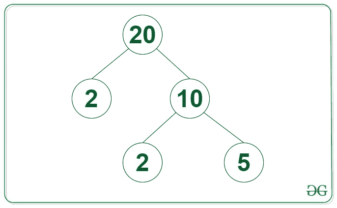

# 给定数字的因子树高度

> 原文:[https://www . geeksforgeeks . org/给定数字的因子树高度/](https://www.geeksforgeeks.org/height-of-factor-tree-for-a-given-number/)

给定一个正整数 **N** ，任务是找到给定整数 **N** [的](https://www.geeksforgeeks.org/factor-tree-of-a-given-number/)[因子树](https://www.geeksforgeeks.org/factor-tree-of-a-given-number/)的高度。

**示例:**

> **输入:** N = 20
> **输出:** 3
> **说明:**下图所示 20 的因子树高度为 3。
> 
> 
> 
> **输入:**N = 48
> T3】输出: 5

**方法:**给定的问题可以通过使用下面讨论的步骤来解决:

*   初始化一个变量，将**高度**设为 **0** ，存储给定整数 **N** 的[因子树](https://www.geeksforgeeks.org/factor-tree-of-a-given-number/)的高度。
*   迭代**【2，√N】**范围内 **i** 的所有值，并执行以下步骤:
    1.  [求 **N**](https://www.geeksforgeeks.org/smallest-prime-divisor-of-a-number/) 的最小除数，如果存在，则将**高度**的值增加 **1** 。
    2.  如果除数 **i** 存在，则重复上述步骤，将 **N** 的值更新为 **N / i** ，直到 **N > 1** 。
    3.  如果不存在 **N** 的除数[打破循环](https://www.geeksforgeeks.org/break-statement-cc/)。
*   完成以上步骤后，打印**高度**的值作为答案。

下面是上述方法的实现:

## C++

```
// C++ program for the above approach

#include <bits/stdc++.h>
using namespace std;

// Function to find the height of the
// Factor Tree of the integer N
int factorTree(int N)
{
    // Stores the height of Factor Tree
    int height = 0;

    // Loop to iterate over values of N
    while (N > 1) {
        // Stores if there exist
        // a factor of N or not
        bool flag = false;

        // Loop to find the smallest
        // factor of N
        for (int i = 2; i <= sqrt(N); i++) {
            // If i is a factor of N
            if (N % i == 0) {
                N = N / i;
                flag = true;
                break;
            }
        }

        // Increment the height
        height++;

        // If there are no factors of N
        // i.e, N is prime, break loop
        if (!flag) {
            break;
        }
    }

    // Return Answer
    return height;
}

// Driver Code
int main()
{
    int N = 48;
    cout << factorTree(N);

    return 0;
}
```

## Java 语言(一种计算机语言，尤用于创建网站)

```
// Java program for the above approach
public class Main
{
    // Function to find the height of the
    // Factor Tree of the integer N
    static int factorTree(int N)
    {

        // Stores the height of Factor Tree
        int height = 0;

        // Loop to iterate over values of N
        while (N > 1)
        {

            // Stores if there exist
            // a factor of N or not
            boolean flag = false;

            // Loop to find the smallest
            // factor of N
            for (int i = 2; i <= Math.sqrt(N); i++)
            {

                // If i is a factor of N
                if (N % i == 0) {
                    N = N / i;
                    flag = true;
                    break;
                }
            }

            // Increment the height
            height++;

            // If there are no factors of N
            // i.e, N is prime, break loop
            if (!flag) {
                break;
            }
        }

        // Return Answer
        return height;
    }

    public static void main(String[] args) {
        int N = 48;
        System.out.println(factorTree(N));
    }
}

// This code is contributed by mukesh07.
```

## 蟒蛇 3

```
# Python 3 program for the above approach
from math import sqrt

# Function to find the height of the
# Factor Tree of the integer N
def factorTree(N):

    # Stores the height of Factor Tree
    height = 0

    # Loop to iterate over values of N
    while (N > 1):

        # Stores if there exist
        # a factor of N or not
        flag = False

        # Loop to find the smallest
        # factor of N
        for i in range(2,int(sqrt(N))+1,1):
            # If i is a factor of N
            if (N % i == 0):
                N = N // i
                flag = True
                break

        # Increment the height
        height += 1

        # If there are no factors of N
        # i.e, N is prime, break loop
        if (flag==False):
            break

    # Return Answer
    return height

# Driver Code
if __name__ == '__main__':
    N = 48
    print(factorTree(N))

    # This code is contributed by SURENDRA_GANGWAR.
```

## C#

```
// C# program for the above approach
using System;
class GFG {

    // Function to find the height of the
    // Factor Tree of the integer N
    static int factorTree(int N)
    {

        // Stores the height of Factor Tree
        int height = 0;

        // Loop to iterate over values of N
        while (N > 1) {
            // Stores if there exist
            // a factor of N or not
            bool flag = false;

            // Loop to find the smallest
            // factor of N
            for (int i = 2; i <= Math.Sqrt(N); i++) {
                // If i is a factor of N
                if (N % i == 0) {
                    N = N / i;
                    flag = true;
                    break;
                }
            }

            // Increment the height
            height++;

            // If there are no factors of N
            // i.e, N is prime, break loop
            if (!flag) {
                break;
            }
        }

        // Return Answer
        return height;
    }

  static void Main() {
    int N = 48;
    Console.Write(factorTree(N));
  }
}

// This code is contributed by decode2207.
```

## java 描述语言

```
<script>
        // JavaScript Program to implement
        // the above approach

        // Function to find the height of the
        // Factor Tree of the integer N
        function factorTree(N)
        {

            // Stores the height of Factor Tree
            let height = 0;

            // Loop to iterate over values of N
            while (N > 1)
            {

                // Stores if there exist
                // a factor of N or not
                let flag = false;

                // Loop to find the smallest
                // factor of N
                for (let i = 2; i <= Math.sqrt(N); i++)
                {

                    // If i is a factor of N
                    if (N % i == 0) {
                        N = Math.floor(N / i);
                        flag = true;
                        break;
                    }
                }

                // Increment the height
                height++;

                // If there are no factors of N
                // i.e, N is prime, break loop
                if (!flag) {
                    break;
                }
            }

            // Return Answer
            return height;
        }

        // Driver Code
        let N = 48;
        document.write(factorTree(N));

// This code is contributed by Potta Lokesh

    </script>
```

**Output:** 

```
5
```

***时间复杂度:** O(√N*log N)*
***辅助空间:** O(1)*