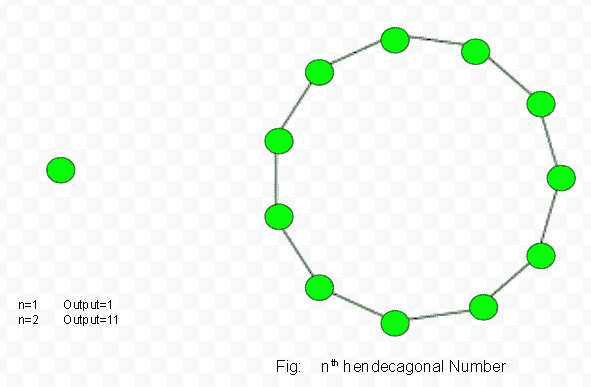

# 亨德卡戈纳尔号

> 原文:[https://www.geeksforgeeks.org/hendecagonal-number/](https://www.geeksforgeeks.org/hendecagonal-number/)

给定一个数 n，任务是找到第 n 个亨德戈纳尔数。
一个亨德戈纳尔数是一个将三角形和正方形的概念扩展到十边形(十一边形)的图形数。第 n 个十边形数计算 n 个嵌套十边形图案中的点数，所有十边形共享一个公共角，其中图案中的第 I 个十边形具有由 I 个点组成的边，这些点彼此间隔开一个单位。
**例:**

> 输入:2
> 输出:11
> 输入:6
> 输出:141



第 n 个正交数的公式:

## C++

```
// C++ program to find nth
// Hendecagonal number
#include <bits/stdc++.h>
using namespace std;

// Function to find
// Hendecagonal number
int hendecagonal_num(int n)
{
    // Formula to calculate nth
    // Hendecagonal number
    return (9 * n * n - 7 * n) / 2;
}

// Driver Code
int main()
{
    int n = 3;
    cout << n << "rd Hendecagonal number: ";
    cout << hendecagonal_num(n);
    cout << endl;
    n = 10;
    cout << n << "th Hendecagonal number: ";
    cout << hendecagonal_num(n);

    return 0;
}
```

## Java 语言(一种计算机语言，尤用于创建网站)

```
// Java program to find nth
// Hendecagonal number
import java.io.*;

class GFG
{

// Function to find
// Hendecagonal number
static int hendecagonal_num(int n)
{
    // Formula to calculate nth
    // Hendecagonal number
    return (9 * n * n -
            7 * n) / 2;
}

// Driver Code
public static void main (String[] args)
{
int n = 3;
System.out.print(n + "rd Hendecagonal " +
                             "number: ");
System.out.println(hendecagonal_num(n));

n = 10;
System.out.print(n + "th Hendecagonal " +
                             "number: ");
System.out.println(hendecagonal_num(n));
}
}

// This code is contributed by ajit
```

## 蟒蛇 3

```
# Program to find nth
# Hendecagonal number

# Function of Hendecagonal
# number
def hendecagonal_num(n) :

    # Formula to calculate nth
    # Hendecagonal number &
    # return it into main function.

    return (9 * n * n -
            7 * n) // 2

# Driver Code
if __name__ == '__main__' :

    n = 3
    print(n,"rd Hendecagonal number : " ,
                    hendecagonal_num(n))

    n = 10
    print(n,"th Hendecagonal number : " ,
                    hendecagonal_num(n))

# This code is contributed by ajit
```

## C#

```
// C# program to find nth
// Hendecagonal number
using System;

class GFG
{
// Function to find
// Hendecagonal number
static int hendecagonal_num(int n)
{
    // Formula to calculate nth
    // Hendecagonal number
    return (9 * n * n - 7 * n) / 2;
}

// Driver Code
static public void Main ()
{
    int n = 3;
    Console.Write(n +
                 "rd Hendecagonal number: ");
    Console.WriteLine( hendecagonal_num(n));

    n = 10;
    Console.Write(n +
                 "th Hendecagonal number: ");
    Console.WriteLine( hendecagonal_num(n));
    }
}

// This code is contributed by aj_36
```

## 服务器端编程语言（Professional Hypertext Preprocessor 的缩写）

```
<?php
// PHP program to find nth
// Hendecagonal number

// Function to find
// Hendecagonal number

function hendecagonal_num($n)
{

    // Formula to calculate nth
    // Hendecagonal number
    return (9 * $n * $n - 7 * $n) / 2;
}

// Driver Code
$n = 3;
echo $n , "th Hendecagonal number: ";
echo hendecagonal_num($n);
echo "\n";

$n = 10;
echo $n , "th Hendecagonal number: ";
echo hendecagonal_num($n);

// This code is contributed by m_kit
?>
```

## java 描述语言

```
<script>
    // Javascript program to find nth
    // Hendecagonal number

    // Function to find
    // Hendecagonal number
    function hendecagonal_num(n)
    {
        // Formula to calculate nth
        // Hendecagonal number
        return (9 * n * n - 7 * n) / 2;
    }

    let n = 3;
    document.write(n + "rd Hendecagonal number: ");
    document.write(hendecagonal_num(n) + "</br>");
    n = 10;
    document.write(n + "th Hendecagonal number: ");
    document.write(hendecagonal_num(n));

// This code is contributed by divyesh072019.
</script>
```

**输出:**

```
3th Hendecagonal number: 30
10th Hendecagonal number: 415
```

**时间复杂度:**O(1)
T3】辅助空间: O(1)

参考:[https://en.wikipedia.org/wiki/Polygonal_number](https://en.wikipedia.org/wiki/Polygonal_number)T2】