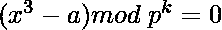
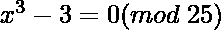
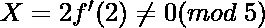
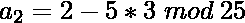
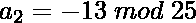
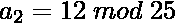
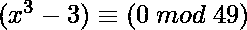

# Hensel 的 Lemma

> 原文:[https://www.geeksforgeeks.org/hensels-lemma/](https://www.geeksforgeeks.org/hensels-lemma/)

**亨塞尔引理**是一个结果，它规定了素数模幂多项式的根被“提升”到模更高幂的根的条件。证明中概述的提升方法让人想起求解方程的**牛顿法**。假设要求解以下类型的方程:



这个想法是用**亨塞尔引理**来求解这种同余。它也被称为亨塞尔的“提升”引理，是[模运算](https://www.geeksforgeeks.org/modular-arithmetic/)的结果。如果 **f** 是多项式函数而 **p** 是[素数](https://www.geeksforgeeks.org/prime-numbers/)，那么如果**f(a<sub>1</sub>)= 0(mod p)**和**【f’(a<sub>1</sub>)mod p！= 0** ，则可以使用下面的[递归](https://www.geeksforgeeks.org/recursion/)将该解“提升”为**f(x)= 0(mod p<sup>k</sup>)**的解。注意**【f】(a<sub>1</sub>)】<sup>-1</sup>**是指**f’(a<sub>1</sub>)模 p** 的[模逆](https://www.geeksforgeeks.org/multiplicative-inverse-under-modulo-m/)。

> ![a_k + 1 = a_k - f(a_k) * [f'(a_1)]^{-1} (mod \; p^{k+1}) ](img/de4ffdbc1fb340cd98d4200c3d7818e8.png "Rendered by QuickLaTeX.com")

**例 1:**

> 

首先，求解(x = 2 是 mod 5 的解)

> = >
> =>
> =>![a_2 = 2 - f(2)[f'(2)]^{-1} mod \; 25            ](img/33891123762182eccf962266581667cd.png "Rendered by QuickLaTeX.com")
> =>
> =>
> =>

**例 2:**

> 

这是无解的，因为(x<sup>3</sup>–3)% mod 7 = 0 无解

以下是**亨塞尔引理**的实现:

## C++

```
// C++ program to illustrate the
// Hensel's Lemma
#include <bits/stdc++.h>
using namespace std;

// Consider f(x) = x ^ 3 - k,
// where k is a constant

// Function to find the modular
// inverse of a modulo m
int inv(int a, int m)
{
    int m0 = m, t, q;
    int x0 = 0, x1 = 1;
    if (m == 1)
        return 0;

    // Apply the Euclidean algorithm,
    // to find the modular inverse
    while (a > 1) {
        q = a / m;
        t = m;
        m = a % m;
        a = t;
        t = x0;
        x0 = x1 - q * x0;
        x1 = t;
    }
    if (x1 < 0)
        x1 += m0;
    return x1;
}

// Function to find the derivative of
// f(x) and f'(x) = 3 * (x ^ 2)
int derivative(int x)
{
    return 3 * x * x;
}

// Function to find the image of
// x in f(x) = x ^ 3 - k.
int Image(int x, int k)
{
    return x * x * x - k;
}

// Function to find the next power
// of the number
int next_power(int a_t, int t, int a1,
               int prime, int k)
{
    // Next power of prime for which
    // solution is to be found
    int power_p = (int)pow(prime, t + 1);

    // Using Hensel's recursion to
    // find the solution (next_a) for
    // next power of prime
    int next_a = (a_t
                  - Image(a_t, k)
                        * inv(derivative(a1),
                              prime))
                 % power_p;

    // If next_a < 0 return equivalent
    // positive remainder modulo p
    if (next_a < 0)
        return next_a += power_p;

    // Return the next power of a
    return next_a;
}

// Function to find the solution of
// the required exponent of prime
int powerOfPrime(int prime, int power,
                 int k, int a1)
{
    // The lemma does not work for
    // derivative of f(x) at a1
    if (derivative(a1) != 0) {
        int a_t = a1;

        // Looping from 1 to power
        // of prime whose solution
        // is to be found
        for (int p = 1; p < power; p++) {
            a_t = next_power(a_t, p,
                             a1, prime, k);
        }

        // Final answer after evaluating
        // all the exponents up till
        // the required exponent
        return a_t;
    }

    return -1;
}

// Driver Code
int main()
{
    int prime = 7, a1 = 3;
    int power = 2, k = 3;

    // Function Call
    cout << powerOfPrime(prime, power,
                         k, a1);

    return 0;
}
```

## Java 语言(一种计算机语言，尤用于创建网站)

```
// Java program to illustrate the
// Hensel's Lemma
import java.util.*;

class GFG{

// Consider f(x) = x ^ 3 - k,
// where k is a constant

// Function to find the modular
// inverse of a modulo m
static int inv(int a, int m)
{
    int m0 = m, t, q;
    int x0 = 0, x1 = 1;

    if (m == 1)
        return 0;

    // Apply the Euclidean algorithm,
    // to find the modular inverse
    while (a > 1)
    {
        q = a / m;
        t = m;
        m = a % m;
        a = t;
        t = x0;
        x0 = x1 - q * x0;
        x1 = t;
    }
    if (x1 < 0)
        x1 += m0;

    return x1;
}

// Function to find the derivative of
// f(x) and f'(x) = 3 * (x ^ 2)
static int derivative(int x)
{
    return 3 * x * x;
}

// Function to find the image of
// x in f(x) = x ^ 3 - k.
static int Image(int x, int k)
{
    return x * x * x - k;
}

// Function to find the next power
// of the number
static int next_power(int a_t, int t, int a1,
                      int prime, int k)
{

    // Next power of prime for which
    // solution is to be found
    int power_p = (int)Math.pow(prime, t + 1);

    // Using Hensel's recursion to
    // find the solution (next_a) for
    // next power of prime
    int next_a = (a_t - Image(a_t, k) *
                  inv(derivative(a1), prime)) %
                  power_p;

    // If next_a < 0 return equivalent
    // positive remainder modulo p
    if (next_a < 0)
        return next_a += power_p;

    // Return the next power of a
    return next_a;
}

// Function to find the solution of
// the required exponent of prime
static int powerOfPrime(int prime, int power,
                        int k, int a1)
{

    // The lemma does not work for
    // derivative of f(x) at a1
    if (derivative(a1) != 0)
    {
        int a_t = a1;

        // Looping from 1 to power
        // of prime whose solution
        // is to be found
        for(int p = 1; p < power; p++)
        {
            a_t = next_power(a_t, p,
                             a1, prime, k);
        }

        // Final answer after evaluating
        // all the exponents up till
        // the required exponent
        return a_t;
    }
    return -1;
}

// Driver Code
public static void main(String []args)
{
    int prime = 7, a1 = 3;
    int power = 2, k = 3;

    // Function Call
    System.out.print(powerOfPrime(prime, power,
                                  k, a1));
}
}

// This code is contributed by rutvik_56
```

## 蟒蛇 3

```
# Python3 program to illustrate the
# Hensel's Lemma

# Consider f(x) = x ^ 3 - k,
# where k is a constant

# Function to find the modular
# inverse of a modulo m
def inv(a, m):

    m0 = m
    x0 = 0
    x1 = 1

    if (m == 1):
        return 0

    # Apply the Euclidean algorithm,
    # to find the modular inverse
    while (a > 1):
        q = a // m
        t = m
        m = a % m
        a = t
        t = x0
        x0 = x1 - q * x0
        x1 = t

    if (x1 < 0):
        x1 += m0

    return x1

# Function to find the derivative of
# f(x) and f'(x) = 3 * (x ^ 2)
def derivative(x):

    return 3 * x * x

# Function to find the image of
# x in f(x) = x ^ 3 - k.
def Image(x, k):

    return x * x * x - k

# Function to find the next power
# of the number
def next_power(a_t, t, a1, prime, k):

    # Next power of prime for which
    # solution is to be found
    power_p = int(pow(prime, t + 1))

    # Using Hensel's recursion to
    # find the solution(next_a) for
    # next power of prime
    next_a = (a_t - Image(a_t, k) *
              inv(derivative(a1), prime)) % power_p

    # If next_a < 0 return equivalent
    # positive remainder modulo p
    if (next_a < 0):
        next_a += power_p
        return next_a

    # Return the next power of a
    return next_a

# Function to find the solution of
# the required exponent of prime
def powerOfPrime(prime, power, k, a1):

    # The lemma does not work for
    # derivative of f(x) at a1
    if (derivative(a1) != 0):
        a_t = a1

        # Looping from 1 to power
        # of prime whose solution
        # is to be found
        for p in range(1, power):
            a_t = next_power(a_t, p, a1, prime, k)

        # Final answer after evaluating
        # all the exponents up till
        # the required exponent
        return a_t

    return -1

# Driver Code
prime = 7
a1 = 3
power = 2
k = 3

# Function Call
print(powerOfPrime(prime, power, k, a1))

# This code is contributed by amreshkumar3
```

## C#

```
// C# program to illustrate the
// Hensel's Lemma
using System;
class GFG
{

// Consider f(x) = x ^ 3 - k,
// where k is a constant

// Function to find the modular
// inverse of a modulo m
static int inv(int a, int m)
{
    int m0 = m, t, q;
    int x0 = 0, x1 = 1;  
    if (m == 1)
        return 0;

    // Apply the Euclidean algorithm,
    // to find the modular inverse
    while (a > 1)
    {
        q = a / m;
        t = m;
        m = a % m;
        a = t;
        t = x0;
        x0 = x1 - q * x0;
        x1 = t;
    }
    if (x1 < 0)
        x1 += m0;      
    return x1;
}

// Function to find the derivative of
// f(x) and f'(x) = 3 * (x ^ 2)
static int derivative(int x)
{
    return 3 * x * x;
}

// Function to find the image of
// x in f(x) = x ^ 3 - k.
static int Image(int x, int k)
{
    return x * x * x - k;
}

// Function to find the next power
// of the number
static int next_power(int a_t, int t, int a1,
                      int prime, int k)
{

    // Next power of prime for which
    // solution is to be found
    int power_p = (int)Math.Pow(prime, t + 1);

    // Using Hensel's recursion to
    // find the solution (next_a) for
    // next power of prime
    int next_a = (a_t - Image(a_t, k) *
                  inv(derivative(a1), prime)) %
                  power_p;

    // If next_a < 0 return equivalent
    // positive remainder modulo p
    if (next_a < 0)
        return next_a += power_p;

    // Return the next power of a
    return next_a;
}

// Function to find the solution of
// the required exponent of prime
static int powerOfPrime(int prime, int power,
                        int k, int a1)
{

    // The lemma does not work for
    // derivative of f(x) at a1
    if (derivative(a1) != 0)
    {
        int a_t = a1;

        // Looping from 1 to power
        // of prime whose solution
        // is to be found
        for(int p = 1; p < power; p++)
        {
            a_t = next_power(a_t, p,
                             a1, prime, k);
        }

        // Final answer after evaluating
        // all the exponents up till
        // the required exponent
        return a_t;
    }
    return -1;
}

// Driver Code
public static void Main(string []args)
{
    int prime = 7, a1 = 3;
    int power = 2, k = 3;

    // Function Call
    Console.Write(powerOfPrime(prime, power,
                                  k, a1));
}
}

// This code is contributed by pratham76.
```

## java 描述语言

```
<script>
// Javascript program to illustrate the
// Hensel's Lemma

// Consider f(x) = x ^ 3 - k,
// where k is a constant

// Function to find the modular
// inverse of a modulo m
function inv(a, m)
{
    let m0 = m, t, q;
    let x0 = 0, x1 = 1;

    if (m == 1)
        return 0;

    // Apply the Euclidean algorithm,
    // to find the modular inverse
    while (a > 1)
    {
        q = Math.floor(a / m);
        t = m;
        m = a % m;
        a = t;
        t = x0;
        x0 = x1 - q * x0;
        x1 = t;
    }
    if (x1 < 0)
        x1 += m0;

    return x1;
}

// Function to find the derivative of
// f(x) and f'(x) = 3 * (x ^ 2)
function derivative(x)
{
    return 3 * x * x;
}

// Function to find the image of
// x in f(x) = x ^ 3 - k.
function Image(x, k)
{
    return x * x * x - k;
}

// Function to find the next power
// of the number
function next_power(a_t, t, a1, prime, k)
{

    // Next power of prime for which
    // solution is to be found
    let power_p = Math.floor(Math.pow(prime, t + 1));

    // Using Hensel's recursion to
    // find the solution (next_a) for
    // next power of prime
    let next_a = (a_t - Image(a_t, k) *
                  inv(derivative(a1), prime)) %
                  power_p;

    // If next_a < 0 return equivalent
    // positive remainder modulo p
    if (next_a < 0)
        return next_a += power_p;

    // Return the next power of a
    return next_a;
}

// Function to find the solution of
// the required exponent of prime
function powerOfPrime(prime, power,
                        k, a1)
{

    // The lemma does not work for
    // derivative of f(x) at a1
    if (derivative(a1) != 0)
    {
        let a_t = a1;

        // Looping from 1 to power
        // of prime whose solution
        // is to be found
        for(let p = 1; p < power; p++)
        {
            a_t = next_power(a_t, p,
                             a1, prime, k);
        }

        // Final answer after evaluating
        // all the exponents up till
        // the required exponent
        return a_t;
    }
    return -1;
}

  // Driver Code

    let prime = 7, a1 = 3;
    let power = 2, k = 3;

    // Function Call
    document.write(powerOfPrime(prime, power,
                                  k, a1));

// This code is contributed by target_2.             
</script>
```

**Output:** 

```
6
```

***时间复杂度:** O(log N)*
***辅助空间:** O(1)*