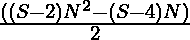
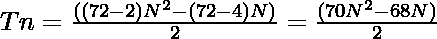

# 七加龙编号

> 原文:[https://www.geeksforgeeks.org/heptacontadigon-number/](https://www.geeksforgeeks.org/heptacontadigon-number/)

给定一个数字 **N** ，任务是找到**N<sup>th</sup>T5[七加空号](https://en.wikipedia.org/wiki/List_of_polygons)。** 

> 一个**七点数**是一类图形数。它有一个 72 边的多边形，叫做七边形。第 N 个七点计数是 72 个点的数量，所有其他点都被一个公共的共享角包围并形成一个图案。前几个庚酸二甘醇数字是 **1，72，213，424，…**T4】

**例:**

> **输入:** N = 2
> **输出:** 72
> **说明:**
> 第二个庚酸内酯数为 72。
> **输入:** N = 3
> **输出:** 213

**方法:****第 N 个七齿兽编号**由公式给出:

*   S 边多边形的第 n 项= 
*   因此，72 边多边形的第 N 项由下式给出:

> 

以下是上述方法的实现:

## C++

```
// C++ program for the above approach
#include <bits/stdc++.h>
using namespace std;

// Function to find the N-th
// Heptacontadigon Number
int HeptacontadigonNum(int N)
{
    return (70 * N * N - 68 * N)
           / 2;
}

// Driver Code
int main()
{
    // Given number N
    int N = 3;

    // Function Call
    cout << HeptacontadigonNum(N);

    return 0;
}
```

## Java 语言(一种计算机语言，尤用于创建网站)

```
// Java program for the above approach
class GFG{

// Function to find the N-th
// Heptacontadigon Number
static int HeptacontadigonNum(int N)
{
    return (70 * N * N - 68 * N) / 2;
}

// Driver code
public static void main(String[] args)
{
    int N = 3;

    System.out.println(HeptacontadigonNum(N));
}
}

// This code is contributed by Pratima Pandey
```

## 蟒蛇 3

```
# Python3 program for the above approach

# Function to find the N-th
# Heptacontadigon Number
def HeptacontadigonNum(N):

    return (70 * N * N - 68 * N) // 2;

# Driver Code

# Given number N
N = 3;

# Function Call
print(HeptacontadigonNum(N));

# This code is contributed by Code_Mech
```

## C#

```
// C# program for the above approach
using System;
class GFG{

// Function to find the N-th
// Heptacontadigon Number
static int HeptacontadigonNum(int N)
{
    return (70 * N * N - 68 * N) / 2;
}

// Driver code
public static void Main()
{
    int N = 3;

    Console.Write(HeptacontadigonNum(N));
}
}

// This code is contributed by Code_Mech
```

## java 描述语言

```
<script>

    // JavaScript program for the above approach

    // Function to find the N-th
    // Heptacontadigon Number
    function HeptacontadigonNum(N)
    {
        return parseInt((70 * N * N - 68 * N) / 2, 10);
    }

    // Given number N
    let N = 3;

    // Function Call
    document.write(HeptacontadigonNum(N));

</script>
```

**Output:** 

```
213
```

**时间复杂度:** *O(1)*