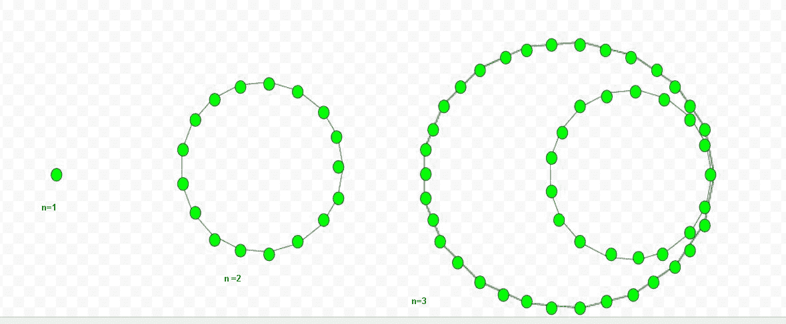

# 七进制数

> 原文:[https://www.geeksforgeeks.org/heptadecagonal-number/](https://www.geeksforgeeks.org/heptadecagonal-number/)

给定一个数 n，任务是找到第 n 个七进制数。
七进制数是一类图形数。它有一个十七边的多边形，叫做十七边形。第 n 个七进制数是 17 个数的点，所有其他的点都被一个共同的角包围并形成一个图案。

**示例:**

> 输入:5
> 输出:155
> 输入:9
> 输出:549



计算第 n 个七进制数的公式:

## C++

```
// C++ program to find Nth
// heptadecagonal number
#include <iostream>
using namespace std;

// Function to calculate heptadecagonal
// number
int heptadecagonalNum(long int n)
{
    return ((15 * n * n) - 13 * n) / 2;
}

// Driver Code
int main()
{
    long int n = 3;
    cout << n << "th Heptadecagonal number : ";
    cout << heptadecagonalNum(n);
    cout << endl;
    n = 8;
    cout << n << "th Heptadecagonal number : ";
    cout << heptadecagonalNum(n);

    return 0;
}
```

## Java 语言(一种计算机语言，尤用于创建网站)

```
// Java program to find Nth heptadecagonal number
import java.io.*;

class GFG {

    // Function to calculate heptadecagonal
    // number
    static long heptadecagonalNum(long n)
    {
        return ((15 * n * n) - 13 * n) / 2;
    }

    // Driver Code
    public static void main (String[] args)
    {
        long n = 3;
        System.out.print( n + "th Heptadecagonal"
                                 + " number : ");
        System.out.println( heptadecagonalNum(n));

        n = 8;
        System.out.print( n + "th Heptadecagonal"
                                 + " number : ");
        System.out.print( heptadecagonalNum(n));
    }
}

// This code is contributed by anuj_67.
```

## 蟒蛇 3

```
# Python program to find Nth
# heptadecagonal number

# Function to calculate
# heptadecagonal number
def heptadecagonalNum(n):

    # Formula to calculate nth
    # heptadecagonal number
    return ((15 * n * n) - 13 * n) // 2

# Driver Code
n = 3
print("%sth Heptadecagonal number : " %n,
                    heptadecagonalNum(n))
n = 8
print("%sth Heptadecagonal number: " %n,
                    heptadecagonalNum(n))

# This code is contributed by ajit                
```

## C#

```
// C# program to find Nth
// heptadecagonal number
using System;
class GFG {

    // Function to calculate
    // heptadecagonal number
    static long heptadecagonalNum(long n)
    {
        return ((15 * n * n) -
                  13 * n) / 2;
    }

    // Driver Code
    public static void Main ()
    {
        long n = 3;
        Console.Write( n + "th Heptadecagonal"
                                + " number : ");
        Console.WriteLine( heptadecagonalNum(n));

        n = 8;
        Console.Write( n + "th Heptadecagonal"
                                + " number : ");
        Console.WriteLine( heptadecagonalNum(n));
    }
}

// This code is contributed by anuj_67.
```

## 服务器端编程语言（Professional Hypertext Preprocessor 的缩写）

```
<?php
// PHP program to find Nth
// heptadecagonal number

// Function to calculate heptadecagonal
// number
function heptadecagonalNum( $n)
{
    return ((15 * $n * $n) -
               13 * $n) / 2;
}

    // Driver Code
    $n = 3;
    echo $n , "th Heptadecagonal number : ";
    echo heptadecagonalNum($n);
    echo "\n";
    $n = 8;
    echo $n , "th Heptadecagonal number : ";
    echo heptadecagonalNum($n);

// This code is contributed by anuj_67.
?>
```

## java 描述语言

```
<script>
    // Javascript program to find Nth heptadecagonal number

    // Function to calculate
    // heptadecagonal number
    function heptadecagonalNum(n)
    {
        return ((15 * n * n) - 13 * n) / 2;
    }

    let n = 3;
    document.write( n + "th Heptadecagonal" + " number : ");
    document.write( heptadecagonalNum(n) + "</br>");

    n = 8;
    document.write( n + "th Heptadecagonal" + " number : ");
    document.write( heptadecagonalNum(n));

</script>
```

**输出**T2】

```
3th Heptadecagonal number : 48
8th Heptadecagonal number : 428
```

**时间复杂度:**O(1)
T3】辅助空间: O(1)