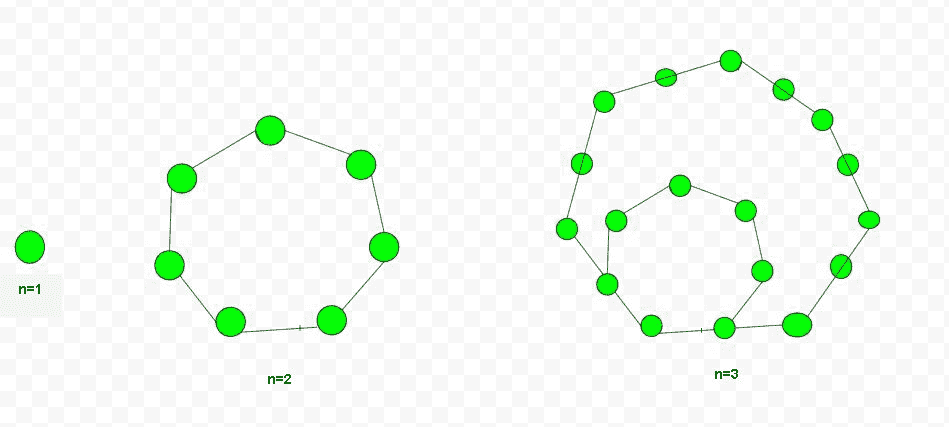

# 七边数

> 原文:[https://www.geeksforgeeks.org/heptagonal-number/](https://www.geeksforgeeks.org/heptagonal-number/)

给定一个数 n，任务是找到第 n 个七边数。七边形数代表七边形，属于一个具象数。七边形有七个角、七个顶点和七条边的多边形。
**例:**

> 输入:2
> 输出:7
> 输入:15
> 输出:540



几个**七边形数字**是:
1，7，18，34，55，81，112，148，189，235……..
计算第 n 个七边数的公式:

## C++

```
// C++ program to find the
// nth Heptagonal number
#include <iostream>
using namespace std;

// Function to return Nth Heptagonal
// number
int heptagonalNumber(int n)
{
    return ((5 * n * n) - (3 * n)) / 2;
}

// Drivers Code
int main()
{

    int n = 2;
    cout << heptagonalNumber(n) << endl;
    n = 15;
    cout << heptagonalNumber(n) << endl;

    return 0;
}
```

## Java 语言(一种计算机语言，尤用于创建网站)

```
// Java program to find the
// nth Heptagonal number
import java.io.*;

class GFG
{
// Function to return
// Nth Heptagonal number
static int heptagonalNumber(int n)
{
    return ((5 * n * n) - (3 * n)) / 2;
}

// Driver Code
public static void main (String[] args)
{
    int n = 2;
    System.out.println(heptagonalNumber(n));
    n = 15;
    System.out.println(heptagonalNumber(n));
}
}

// This code is contributed by anuj_67.
```

## 蟒蛇 3

```
# Program to find nth
# Heptagonal number

# Function to find
# nth Heptagonal number
def heptagonalNumber(n) :

    # Formula to calculate
    # nth Heptagonal number
    return ((5 * n * n) -
            (3 * n)) // 2

# Driver Code
if __name__ == '__main__' :
    n = 2
    print(heptagonalNumber(n))
    n = 15
    print(heptagonalNumber(n))

# This code is contributed
# by ajit
```

## C#

```
// C# program to find the
// nth Heptagonal number
using System;

class GFG
{
// Function to return
// Nth Heptagonal number
static int heptagonalNumber(int n)
{
    return ((5 * n * n) -
            (3 * n)) / 2;
}

// Driver Code
public static void Main ()
{
    int n = 2;
    Console.WriteLine(heptagonalNumber(n));
    n = 15;
    Console.WriteLine(heptagonalNumber(n));
}
}

// This code is contributed by anuj_67.
```

## 服务器端编程语言（Professional Hypertext Preprocessor 的缩写）

```
<?php
// PHP program to find the
// nth Heptagonal number

// Function to return Nth
// Heptagonal number
function heptagonalNumber($n)
{
    return ((5 * $n * $n) -
            (3 * $n)) / 2;
}

// Driver Code
$n = 2;
echo heptagonalNumber($n), "\n";
$n = 15;
echo heptagonalNumber($n);

// This code is contributed
// by anuj_67.
?>
```

## java 描述语言

```
<script>
// Javascript program to find the
// nth Heptagonal number

// Function to return Nth Heptagonal
// number
function heptagonalNumber(n)
{
    return parseInt(((5 * n * n) - (3 * n)) / 2);
}

// Drivers Code
let n = 2;
document.write(heptagonalNumber(n) + "<br>");
n = 15;
document.write(heptagonalNumber(n) + "<br>");

// This code is contributed by rishavmahato348.
</script>
```

**Output :** 

```
7
540
```

**时间复杂度:**O(1)
T3】辅助空间: O(1)

**参考资料:**[https://en . Wikipedia . org/wiki/hep tagalt _ number](https://en.wikipedia.org/wiki/Heptagonal_number)