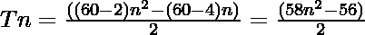

# 六角数字

> 原文:[https://www.geeksforgeeks.org/hexacontagon-number/](https://www.geeksforgeeks.org/hexacontagon-number/)

给定一个数字 **N** ，任务是找到**N<sup>th</sup>T5[六角数字](https://en.wikipedia.org/wiki/Hexacontagon)。** 

> 一个[六角数](https://en.wikipedia.org/wiki/Hexacontagon)是一类图形数。它有 60 边的多边形，叫做六边形。第 N 个六角点计数是 60 个点，所有其他点都被一个公共的共享角包围并形成一个图案。前几个十六进制数字是 **1，60，177，352……**

**例:**

> **输入:** N = 2
> **输出:** 60
> **说明:**
> 第二个六连字符数是 60。
> **输入:** N = 3
> **输出:** 177

**方法:**第 N 个六价数由公式给出:

*   s 边多边形的第 n 项= 

*   因此 60 边多边形的第 n 项是

> 

以下是上述方法的实现:

## C++

```
// C++ program for above approach
#include <iostream>
using namespace std;

// Finding the nth hexacontagon number
int hexacontagonNum(int n)
{
    return (58 * n * n - 56 * n) / 2;
}

// Driver code
int main()
{
    int n = 3;
    cout << "3rd hexacontagon Number is = "
         << hexacontagonNum(n);

    return 0;
}

// This code is contributed by shubhamsingh10
```

## C

```
// C program for above approach
#include <stdio.h>
#include <stdlib.h>

// Finding the nth hexacontagon Number
int hexacontagonNum(int n)
{
    return (58 * n * n - 56 * n) / 2;
}

// Driver program to test above function
int main()
{
    int n = 3;
    printf("3rd hexacontagon Number is = %d",
           hexacontagonNum(n));

    return 0;
}
```

## Java 语言(一种计算机语言，尤用于创建网站)

```
// Java program for above approach
class GFG{

// Finding the nth hexacontagon number
public static int hexacontagonNum(int n)
{
    return (58 * n * n - 56 * n) / 2;
}

// Driver code
public static void main(String[] args)
{
    int n = 3;
    System.out.println("3rd hexacontagon Number is = " +
                                    hexacontagonNum(n));
}
}

// This code is contributed by divyeshrabadiya07   
```

## 蟒蛇 3

```
# Python3 program for above approach

# Finding the nth hexacontagon Number
def hexacontagonNum(n):

    return (58 * n * n - 56 * n) // 2

# Driver Code
n = 3
print("3rd hexacontagon Number is = ",
                  hexacontagonNum(n));

# This code is contributed by divyamohan123
```

## C#

```
// C# program for above approach
using System;

class GFG{

// Finding the nth hexacontagon number
public static int hexacontagonNum(int n)
{
    return (58 * n * n - 56 * n) / 2;
}

// Driver code
public static void Main()
{
    int n = 3;
    Console.Write("3rd hexacontagon Number is = " +
                               hexacontagonNum(n));
}
}

// This code is contributed by Code_Mech
```

## java 描述语言

```
<script>

// Javascript program for above approach

// Finding the nth hexacontagon number
function hexacontagonNum(n)
{
    return (58 * n * n - 56 * n) / 2;
}

// Driver code
var n = 3;
document.write("3rd hexacontagon Number is = " +hexacontagonNum(n));

</script>
```

**Output:** 

```
3rd hexacontagon Number is = 177
```

***时间复杂度:** O(1)*

***辅助空间:** O(1)*

**参考资料:**[https://en . Wikipedia . org/wiki/hexagon](https://en.wikipedia.org/wiki/Hexacontagon)