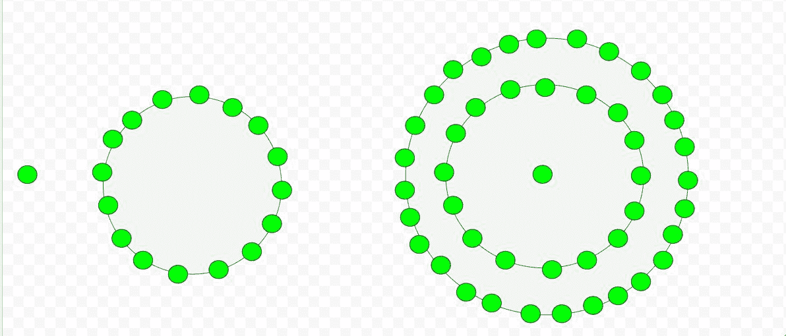

# 十六边形数

> 原文:[https://www.geeksforgeeks.org/hexadecagonal-number/](https://www.geeksforgeeks.org/hexadecagonal-number/)

给定一个数 n，任务是找到第 n 个十六进制数。
十六进制数是一类图形数和一个完美的正方形。它有十六边形，称为十六边形或六边形。第 n 个十六进制数是十六个数的点，所有其他点都围绕着它的连续层。
**例:**

> 输入:2
> 输出:16
> 输入:7
> 输出:301



计算十六进制数的公式:

## C++

```
// C++ program to find Nth
// hexadecagon number
#include <bits/stdc++.h>
using namespace std;

// Function to calculate hexadecagonal number
int hexadecagonalNum(long int n)
{
    return ((14 * n * n) - 12 * n) / 2;
}

// Drivers Code
int main()
{
    long int n = 5;
    cout << n << "th Hexadecagonal number : ";
    cout << hexadecagonalNum(n);
    cout << endl;
    n = 9;
    cout << n << "th Hexadecagonal number : ";
    cout << hexadecagonalNum(n);

    return 0;
}
```

## Java 语言(一种计算机语言，尤用于创建网站)

```
// Java program to find Nth hexadecagon
// number
import java.io.*;

class GFG {

    // Function to calculate hexadecagonal
    // number
    static long hexadecagonalNum(long n)
    {
        return ((14 * n * n) - 12 * n) / 2;
    }

    // Drivers Code
    public static void main (String[] args)
    {
        long n = 5;
        System.out.println( n + "th "
          + "Hexadecagonal number : "
              + hexadecagonalNum(n));

        n = 9;
        System.out.println( n + "th "
          + "Hexadecagonal number : "
              + hexadecagonalNum(n));
    }
}

// This code contributed by anuj_67.
```

## 蟒蛇 3

```
# Python program to find Nth
# hexadecagon number

# Function to calculate
# hexadecagonal number
def hexadecagonalNum(n):

    # Formula to calculate nth
    # Centered hexadecagonal number
    return ((14 * n * n) - 12 * n) // 2

# Driver Code
n = 5
print("%sth Hexadecagonal number : " %n,
                    hexadecagonalNum(n))
n = 9
print("%sth Hexadecagonal number : " %n,
                    hexadecagonalNum(n))

# This code is contributed by ajit                 
```

## C#

```
// C# program to find Nth hexadecagon
// number
using System;
class GFG {

    // Function to calculate hexadecagonal
    // number
    static long hexadecagonalNum(long n)
    {
        return ((14 * n * n) - 12 * n) / 2;
    }

    // Drivers Code
    public static void Main ()
    {
        long n = 5;
        Console.WriteLine( n + "th "
        + "Hexadecagonal number : "
            + hexadecagonalNum(n));

        n = 9;
        Console.WriteLine( n + "th "
        + "Hexadecagonal number : "
            + hexadecagonalNum(n));
    }
}

// This code contributed by anuj_67.
```

## 服务器端编程语言（Professional Hypertext Preprocessor 的缩写）

```
<?php
// PHP program to find Nth
// hexadecagon number

// Function to calculate 
// hexadecagonal number

function hexadecagonalNum($n)
{
    return ((14 * $n * $n) - 12 * $n) / 2;
}

// Driver Code
$n = 5;
echo $n , "th Hexadecagonal number : ";
echo hexadecagonalNum($n);
echo "\n";

$n = 9;
echo $n , "th Hexadecagonal number : ";
echo hexadecagonalNum($n);

// This code is contributed bu m_kit
?>
```

## java 描述语言

```
<script>

// Javascript program to find Nth hexadecagon
// number

// Function to calculate hexadecagonal
// number
function hexadecagonalNum(n)
{
    return ((14 * n * n) - 12 * n) / 2;
}

// Driver code
var n = 5;
document.write(n + "th " + 
               "Hexadecagonal number : " +
               hexadecagonalNum(n) + "<br>");

n = 9;
document.write(n + "th " + 
               "Hexadecagonal number : " + 
               hexadecagonalNum(n));

// This code is contributed by Khushboogoyal499

</script>
```

**输出:**

```
5th Hexadecagonal number : 145
9th Hexadecagonal number : 513
```

**时间复杂度:**O(1)
T3】辅助空间: O(1)
参考:[https://en.wikipedia.org/wiki/Polygonal_number](https://en.wikipedia.org/wiki/Polygonal_number)T8】