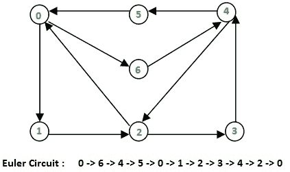
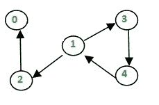

# 有向图的海尔霍尔泽算法

> 原文:[https://www . geeksforgeeks . org/hierholzers-算法-有向图/](https://www.geeksforgeeks.org/hierholzers-algorithm-directed-graph/)

给定一个有向欧拉图，打印一个[欧拉回路](https://www.geeksforgeeks.org/eulerian-path-and-circuit/)。欧拉回路是一条遍历图的每条边的路径，该路径在起始顶点结束。

**示例:**

```
Input : Adjacency list for the below graph

Output : 0 -> 1 -> 2 -> 0 

Input : Adjacency list for the below graph

Output : 0 -> 6 -> 4 -> 5 -> 0 -> 1 
         -> 2 -> 3 -> 4 -> 2 -> 0 
Explanation:
In both the cases, we can trace the Euler circuit 
by following the edges as indicated in the output.

```

我们已经讨论了找出一个给定的图是否是欧拉的[问题](https://www.geeksforgeeks.org/eulerian-path-and-circuit/)。在这篇文章中，讨论了一种打印欧拉轨迹或电路的算法。同样的问题可以用[弗勒里算法](https://www.geeksforgeeks.org/fleurys-algorithm-for-printing-eulerian-path/)来解决，但是，它的复杂度是 O(E*E)。利用海尔霍尔泽算法，我们可以找到 O(E)中的电路/路径，即线性时间。

下面是算法:参考( [wiki](https://en.wikipedia.org/wiki/Eulerian_path#Hierholzer.27s_algorithm) )。请记住，如果下列条件成立，有向图具有欧拉圈:(1)所有非零度数的顶点都属于一个强连通分支。(2)每个顶点的入度和出度相同。该算法假设给定的图具有欧拉回路。

*   选择任意一个起始顶点 v，从该顶点开始沿着一条边的轨迹，直到返回到 v，不可能卡在 v 以外的任何一个顶点，因为每个顶点的度数和外倾角必须相同，当轨迹进入另一个顶点 w 时，必须有一条未使用的边离开 w。
    以这种方式形成的路线是一个封闭的路线，但可能不会覆盖初始图形的所有顶点和边。
*   只要存在属于当前游览的顶点 u，但其相邻的边不是游览的一部分，就从 u 开始另一条步道，跟随未使用的边直到返回 u，并将以这种方式形成的游览加入到前一个游览中。

因此，这个想法是继续跟踪未使用的边，并删除它们，直到我们陷入困境。一旦我们陷入困境，我们回溯到当前路径中最近的顶点，它有未使用的边，我们重复这个过程，直到所有的边都被使用。我们可以使用另一个容器来维护最终路径。

让我们举个例子:

```
Let the initial directed graph be as below


Let's start our path from 0.
Thus, curr_path = {0} and circuit = {}
Now let's use the edge 0->1 

Now, curr_path = {0,1} and circuit = {}
similarly we reach up to 2 and then to 0 again as

Now, curr_path = {0,1,2} and circuit = {}
Then we go to 0, now since 0 haven't got any unused
edge we put 0 in circuit and back track till we find
an edge

We then have curr_path = {0,1,2} and circuit = {0}
Similarly, when we backtrack to 2, we don't find any 
unused edge. Hence put 2 in the circuit and backtrack 
again.

curr_path = {0,1} and circuit = {0,2}

After reaching 1 we go to through unused edge 1->3 and 
then 3->4, 4->1 until all edges have been traversed.

The contents of the two containers look as:
curr_path = {0,1,3,4,1} and circuit = {0,2} 

now as all edges have been used, the curr_path is 
popped one by one into the circuit.
Finally, we've circuit = {0,2,1,4,3,1,0}

We print the circuit in reverse to obtain the path followed.
i.e., 0->1->3->4->1->1->2->0

```

以下是上述方法的实现:

## C++

```
// A C++ program to print Eulerian circuit in given
// directed graph using Hierholzer algorithm
#include <bits/stdc++.h>
using namespace std;

void printCircuit(vector< vector<int> > adj)
{
    // adj represents the adjacency list of
    // the directed graph
    // edge_count represents the number of edges
    // emerging from a vertex
    unordered_map<int,int> edge_count;

    for (int i=0; i<adj.size(); i++)
    {
        //find the count of edges to keep track
        //of unused edges
        edge_count[i] = adj[i].size();
    }

    if (!adj.size())
        return; //empty graph

    // Maintain a stack to keep vertices
    stack<int> curr_path;

    // vector to store final circuit
    vector<int> circuit;

    // start from any vertex
    curr_path.push(0);
    int curr_v = 0; // Current vertex

    while (!curr_path.empty())
    {
        // If there's remaining edge
        if (edge_count[curr_v])
        {
            // Push the vertex
            curr_path.push(curr_v);

            // Find the next vertex using an edge
            int next_v = adj[curr_v].back();

            // and remove that edge
            edge_count[curr_v]--;
            adj[curr_v].pop_back();

            // Move to next vertex
            curr_v = next_v;
        }

        // back-track to find remaining circuit
        else
        {
            circuit.push_back(curr_v);

            // Back-tracking
            curr_v = curr_path.top();
            curr_path.pop();
        }
    }

    // we've got the circuit, now print it in reverse
    for (int i=circuit.size()-1; i>=0; i--)
    {
        cout << circuit[i];
        if (i)
           cout<<" -> ";
    }
}

// Driver program to check the above function
int main()
{
    vector< vector<int> > adj1, adj2;

    // Input Graph 1
    adj1.resize(3);

    // Build the edges
    adj1[0].push_back(1);
    adj1[1].push_back(2);
    adj1[2].push_back(0);
    printCircuit(adj1);
    cout << endl;

    // Input Graph 2
    adj2.resize(7);
    adj2[0].push_back(1);
    adj2[0].push_back(6);
    adj2[1].push_back(2);
    adj2[2].push_back(0);
    adj2[2].push_back(3);
    adj2[3].push_back(4);
    adj2[4].push_back(2);
    adj2[4].push_back(5);
    adj2[5].push_back(0);
    adj2[6].push_back(4);
    printCircuit(adj2);

    return 0;
}
```

## 蟒蛇 3

```
# Python3 program to print Eulerian circuit in given
# directed graph using Hierholzer algorithm
def printCircuit(adj):

    # adj represents the adjacency list of
    # the directed graph
    # edge_count represents the number of edges
    # emerging from a vertex
    edge_count = dict()

    for i in range(len(adj)):

        # find the count of edges to keep track
        # of unused edges
        edge_count[i] = len(adj[i])

    if len(adj) == 0:
        return # empty graph

    # Maintain a stack to keep vertices
    curr_path = []

    # vector to store final circuit
    circuit = []

    # start from any vertex
    curr_path.append(0)
    curr_v = 0 # Current vertex

    while len(curr_path):

        # If there's remaining edge
        if edge_count[curr_v]:

            # Push the vertex
            curr_path.append(curr_v)

            # Find the next vertex using an edge
            next_v = adj[curr_v][-1]

            # and remove that edge
            edge_count[curr_v] -= 1
            adj[curr_v].pop()

            # Move to next vertex
            curr_v = next_v

        # back-track to find remaining circuit
        else:
            circuit.append(curr_v)

            # Back-tracking
            curr_v = curr_path[-1]
            curr_path.pop()

    # we've got the circuit, now print it in reverse
    for i in range(len(circuit) - 1, -1, -1):
        print(circuit[i], end = "")
        if i:
            print(" -> ", end = "")

# Driver Code
if __name__ == "__main__":

    # Input Graph 1
    adj1 = [0] * 3
    for i in range(3):
        adj1[i] = []

    # Build the edges
    adj1[0].append(1)
    adj1[1].append(2)
    adj1[2].append(0)
    printCircuit(adj1)
    print()

    # Input Graph 2
    adj2 = [0] * 7
    for i in range(7):
        adj2[i] = []

    adj2[0].append(1)
    adj2[0].append(6)
    adj2[1].append(2)
    adj2[2].append(0)
    adj2[2].append(3)
    adj2[3].append(4)
    adj2[4].append(2)
    adj2[4].append(5)
    adj2[5].append(0)
    adj2[6].append(4)
    printCircuit(adj2)
    print()

# This code is contributed by
# sanjeev2552
```

**Output:**

```
0 -> 1 -> 2 -> 0
0 -> 6 -> 4 -> 5 -> 0 -> 1 -> 2 -> 3 -> 4 -> 2 -> 0

```

**替代实现:**
以下是对上面代码
的改进*上面的代码记录了每个顶点的边数。这是不必要的，因为我们已经在维护邻接表。我们只是删除了 edge_count 数组的创建。在算法中，我们将‘if _ edge _ count[current _ v]’替换为‘if adj[current _ v]`
*上面的代码将初始节点推送到堆栈中两次。尽管他对结果进行编码的方式是正确的，但这种方法令人困惑且效率低下。我们通过将下一个顶点附加到堆栈上来消除这个问题，而不是当前的顶点。
*在作者测试算法的主要部分，邻接表‘adj 1’和‘adj 2’的初始化有点怪异。那药水也是改良过的。

## 蟒蛇 3

```
# Python3 program to print Eulerian circuit in given
# directed graph using Hierholzer algorithm
def printCircuit(adj):

    # adj represents the adjacency list of
    # the directed graph

    if len(adj) == 0:
        return # empty graph

    # Maintain a stack to keep vertices
    # We can start from any vertex, here we start with 0
    curr_path = [0]

    # list to store final circuit
    circuit = []

    while curr_path:

        curr_v = curr_path[-1]

        # If there's remaining edge in adjacency list  
        # of the current vertex 
        if adj[curr_v]:

            # Find and remove the next vertex that is  
            # adjacent to the current vertex
            next_v = adj[curr_v].pop()

            # Push the new vertex to the stack
            curr_path.append(next_v)

        # back-track to find remaining circuit
        else:
            # Remove the current vertex and 
            # put it in the curcuit
            circuit.append(curr_path.pop())

    # we've got the circuit, now print it in reverse
    for i in range(len(circuit) - 1, -1, -1):
        print(circuit[i], end = "")
        if i:
            print(" -> ", end = "")

# Driver Code
if __name__ == "__main__":

    # Input Graph 1
    adj1 = [[] for _ in range(3)]

    # Build the edges
    adj1[0].append(1)
    adj1[1].append(2)
    adj1[2].append(0)
    printCircuit(adj1)
    print()

    # Input Graph 2
    adj2 = [[] for _ in range(7)]

    adj2[0].append(1)
    adj2[0].append(6)
    adj2[1].append(2)
    adj2[2].append(0)
    adj2[2].append(3)
    adj2[3].append(4)
    adj2[4].append(2)
    adj2[4].append(5)
    adj2[5].append(0)
    adj2[6].append(4)
    printCircuit(adj2)
    print()
```

**Output:**

```
0 -> 1 -> 2 -> 0
0 -> 6 -> 4 -> 5 -> 0 -> 1 -> 2 -> 3 -> 4 -> 2 -> 0

```

**时间复杂度:** O(V+E)。

本文由 **[阿舒托什·库马尔](https://in.linkedin.com/in/ashutosh-kumar-9527a7105)** 供稿。文章还包含来自**尼提什·库马尔**的输入。如果你喜欢 GeeksforGeeks 并想投稿，你也可以使用[contribute.geeksforgeeks.org](http://www.contribute.geeksforgeeks.org)写一篇文章或者把你的文章邮寄到 contribute@geeksforgeeks.org。看到你的文章出现在极客博客主页上，帮助其他极客。

如果你发现任何不正确的地方，或者你想分享更多关于上面讨论的话题的信息，请写评论。