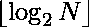

# 除以前 N 个自然数的 LCM 的 2 的最高幂。

> 原文:[https://www . geeksforgeeks . org/除以第一个 n 个自然数 lcm 的 2 的最高幂/](https://www.geeksforgeeks.org/highest-power-of-2-that-divides-the-lcm-of-first-n-natural-numbers/)

给定一个数 **N** ，任务是找出第一个 **N** 自然数的 LCM 除以 2 的最大幂。

**示例:**

> **输入:** N = 5
> **输出:** 2
> **解释:**
> LCM 的{1，2，3，4，5} = 60
> 60 可被 2 <sup>2</sup> 整除
> 
> **输入:** N = 15
> **输出:** 3
> **解释:**
> LCM 的{1，2，3…..14，15} = 360360
> 360360 可被 2 <sup>3</sup> 整除

**天真法:**思路是求前 N 个自然数的最小公倍数。然后从 i = 1 开始循环，检查 2 <sup>i</sup> 是否划分 LCM，并跟踪划分 LCM 的最大 I。

下面是上述方法的实现:

## C++

```
// C++ implementation of the approach

#include <bits/stdc++.h>
using namespace std;

// Function to find LCM of
// first N natural numbers
int findlcm(int n)
{
    // Initialize result
    int ans = 1;

    // Ans contains LCM of 1, 2, 3, ..i
    // after i'th iteration
    for (int i = 1; i <= n; i++)
        ans = (((i * ans)) / (__gcd(i, ans)));
    return ans;
}

// Function to find the
// highest power of 2
// which divides LCM of
// first n natural numbers
int highestPower(int n)
{
    // Find lcm of first
    // N natural numbers
    int lcm = findlcm(n);

    // To store the highest
    // required power of 2
    int ans = 0;

    // Counting number of consecutive zeros
    // from the end in the given binary string
    for (int i = 1;; i++) {
        int x = pow(2, i);
        if (lcm % x == 0) {
            ans = i;
        }
        if (x > n)
            break;
    }
    return ans;
}

// Driver code
int main()
{
    int n = 15;
    cout << highestPower(n);
    return 0;
}
```

## Java 语言(一种计算机语言，尤用于创建网站)

```
// Java implementation of the approach
import java.util.*;

class GFG{

// Function to find LCM of
// first N natural numbers
static int findlcm(int n)
{

    // Initialize result
    int ans = 1;

    // Ans contains LCM of 1, 2, 3, ..i
    // after i'th iteration
    for(int i = 1; i <= n; i++)
        ans = (((i * ans)) / (__gcd(i, ans)));

    return ans;
}

// Function to find the
// highest power of 2
// which divides LCM of
// first n natural numbers
static int highestPower(int n)
{

    // Find lcm of first
    // N natural numbers
    int lcm = findlcm(n);

    // To store the highest
    // required power of 2
    int ans = 0;

    // Counting number of consecutive zeros
    // from the end in the given binary String
    for(int i = 1;; i++)
    {
        int x = (int) Math.pow(2, i);
        if (lcm % x == 0)
        {
            ans = i;
        }
        if (x > n)
            break;
    }
    return ans;
}

static int __gcd(int a, int b)
{
    return b == 0 ? a : __gcd(b, a % b);    
}

// Driver code
public static void main(String[] args)
{
    int n = 15;

    System.out.print(highestPower(n));
}
}

// This code is contributed by 29AjayKumar
```

## 蟒蛇 3

```
# Python3 implementation of the approach

# Function to find LCM of
# first N natural numbers
def findlcm(n):

    # Initialize result
    ans = 1;

    # Ans contains LCM of 1, 2, 3, ..i
    # after i'th iteration
    for i in range(1, n + 1):
        ans = (((i * ans)) //
          (__gcd(i, ans)));

    return ans;

# Function to find the highest power
# of 2 which divides LCM of first n
# natural numbers
def highestPower(n):

    # Find lcm of first
    # N natural numbers
    lcm = findlcm(n);

    # To store the highest
    # required power of 2
    ans = 0;

    # Counting number of consecutive zeros
    # from the end in the given binary String
    for i in range(1, n):
        x = int(pow(2, i));

        if (lcm % x == 0):
            ans = i;
        if (x > n):
            break;

    return ans;

def __gcd(a, b):

    if (b == 0):
        return a;
    else:
        return __gcd(b, a % b);

# Driver code
if __name__ == '__main__':

    n = 15;

    print(highestPower(n));

# This code is contributed by 29AjayKumar
```

## C#

```
// C# implementation of the approach
using System;
class GFG{

// Function to find LCM of
// first N natural numbers
static int findlcm(int n)
{   
    // Initialize result
    int ans = 1;

    // Ans contains LCM of 1, 2, 3, ..i
    // after i'th iteration
    for(int i = 1; i <= n; i++)
        ans = (((i * ans)) /
               (__gcd(i, ans)));

    return ans;
}

// Function to find the
// highest power of 2
// which divides LCM of
// first n natural numbers
static int highestPower(int n)
{   
    // Find lcm of first
    // N natural numbers
    int lcm = findlcm(n);

    // To store the highest
    // required power of 2
    int ans = 0;

    // Counting number of consecutive zeros
    // from the end in the given binary String
    for(int i = 1;; i++)
    {
        int x = (int) Math.Pow(2, i);
        if (lcm % x == 0)
        {
            ans = i;
        }
        if (x > n)
            break;
    }
    return ans;
}

static int __gcd(int a, int b)
{
    return b == 0 ? a : __gcd(b, a % b);    
}

// Driver code
public static void Main(String[] args)
{
    int n = 15;   
    Console.Write(highestPower(n));
}
}

// This code is contributed by 29AjayKumar
```

## java 描述语言

```
<script>
// JavaScript program for the
// above approach

// Function to find LCM of
// first N natural numbers
function findlcm(n)
{

    // Initialize result
    let ans = 1;

    // Ans contains LCM of 1, 2, 3, ..i
    // after i'th iteration
    for(let i = 1; i <= n; i++)
        ans = (((i * ans)) / (__gcd(i, ans)));

    return ans;
}

// Function to find the
// highest power of 2
// which divides LCM of
// first n natural numbers
function highestPower(n)
{

    // Find lcm of first
    // N natural numbers
    let lcm = findlcm(n);

    // To store the highest
    // required power of 2
    let ans = 0;

    // Counting number of consecutive zeros
    // from the end in the given binary String
    for(let i = 1;; i++)
    {
        let x =  Math.pow(2, i);
        if (lcm % x == 0)
        {
            ans = i;
        }
        if (x > n)
            break;
    }
    return ans;
}

function __gcd(a, b)
{
    return b == 0 ? a : __gcd(b, a % b);   
}

// Driver Code

    let n = 15;

    document.write(highestPower(n));

</script>
```

**Output**

```
3
```

**时间复杂度:** O(N)

**辅助空间:** O(1)

**有效方法:**前 N 个自然数的 LCM 总是可被 2 的幂整除，并且由于前 N 个自然数的 LCM 包含 2 * 4 * 8 * 16 ……N 的乘积，因此，除以第一个 **N** 自然数 LCM 的最大 2 的幂将总是


下面是上述方法的实现:

## C++

```
// C++ implementation of the approach

#include <bits/stdc++.h>
using namespace std;

// Function to find the
// highest power of 2
// which divides LCM of
// first n natural numbers
int highestPower(int n)
{
    return log(n) / log(2);
}

// Driver code
int main()
{
    int n = 15;
    cout << highestPower(n);
    return 0;
}
```

## Java 语言(一种计算机语言，尤用于创建网站)

```
// Java implementation of the approach
class GFG{

// Function to find the highest
// power of 2 which divides LCM of
// first n natural numbers
static int highestPower(int n)
{
    return (int)(Math.log(n) / Math.log(2));
}

// Driver code
public static void main(String[] args)
{
    int n = 15;
    System.out.println(highestPower(n));
}
}

// This code is contributed by dewantipandeydp
```

## 蟒蛇 3

```
# Python3 implementation of the approach
import math

# Function to find the highest
# power of 2 which divides LCM of
# first n natural numbers
def highestPower(n):

    return int((math.log(n) // math.log(2)));

# Driver code
if __name__ == '__main__':

    n = 15;
    print(highestPower(n));

# This code is contributed by Rajput-Ji
```

## C#

```
// C# implementation of the approach
using System;

class GFG{

// Function to find the highest
// power of 2 which divides LCM of
// first n natural numbers
static int highestPower(int n)
{
    return (int)(Math.Log(n) / Math.Log(2));
}

// Driver code
public static void Main(String[] args)
{
    int n = 15;

    Console.WriteLine(highestPower(n));
}
}

// This code is contributed by sapnasingh4991
```

## java 描述语言

```
<script>

// Javascript implementation of the approach

// Function to find the
// highest power of 2
// which divides LCM of
// first n natural numbers
function highestPower(n)
{
    return parseInt(Math.log(n) / Math.log(2));
}

// Driver code
var n = 15;
document.write( highestPower(n));

</script>
```

**Output**

```
3
```

**时间复杂度:** O(1)

**辅助空间:** O(1)