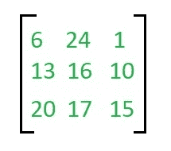
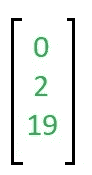
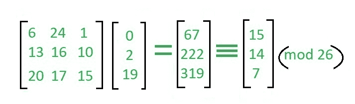
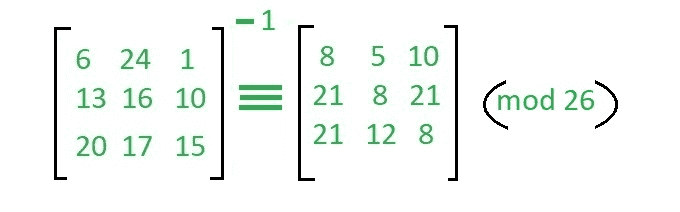
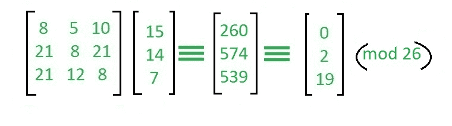

# 希尔密码

> 原文:[https://www.geeksforgeeks.org/hill-cipher/](https://www.geeksforgeeks.org/hill-cipher/)

希尔密码是一种基于线性代数的多边形替代密码。每个字母由一个模 26 的数字表示。通常使用简单的方案 A = 0，B = 1，…，Z = 25，但这不是密码的基本特征。为了加密消息，n 个字母的每个块(被认为是一个 n 分量向量)乘以一个可逆的 n × n 矩阵，与模数 26 相对。为了解密消息，每个块乘以用于加密的矩阵的倒数。
用于加密的矩阵是密钥，应从可逆的 n × n 矩阵集合中随机选择(模 26)。
**例:**

```
Input  : Plaintext: ACT
         Key: GYBNQKURP
Output : Ciphertext: POH
```

```
Input  : Plaintext: GFG
         Key: HILLMAGIC 
Output : Ciphertext: SWK
```

**加密**

我们必须对消息“ACT”(n = 3)进行加密。关键是‘GYBNQKURP’，可以写成 nxn 矩阵:



消息“ACT”被写成向量:



加密向量如下所示:



其对应于‘POH’
的密文

**解密**

为了解密消息，我们将密文变回向量，然后简单地乘以密钥矩阵的逆矩阵(字母中的 IFKVIVVMI)。上例使用的矩阵求逆为:



对于之前的密文“POH”:



这让我们回到了“行动”。
假设所有字母都是大写。
下面是上述想法对于 n=3 的实现。

## C++

```
// C++ code to implement Hill Cipher
#include <iostream>
using namespace std;

// Following function generates the
//  key matrix for the key string
void getKeyMatrix(string key, int keyMatrix[][3])
{
    int k = 0;
    for (int i = 0; i < 3; i++)
    {
        for (int j = 0; j < 3; j++)
        {
            keyMatrix[i][j] = (key[k]) % 65;
            k++;
        }
    }
}

// Following function encrypts the message
void encrypt(int cipherMatrix[][1],
             int keyMatrix[][3],
             int messageVector[][1])
{
    int x, i, j;
    for (i = 0; i < 3; i++)
    {
        for (j = 0; j < 1; j++)
        {
            cipherMatrix[i][j] = 0;

             for (x = 0; x < 3; x++)
            {
                cipherMatrix[i][j] +=
                     keyMatrix[i][x] * messageVector[x][j];
            }

            cipherMatrix[i][j] = cipherMatrix[i][j] % 26;
        }
    }
}

// Function to implement Hill Cipher
void HillCipher(string message, string key)
{
    // Get key matrix from the key string
    int keyMatrix[3][3];
    getKeyMatrix(key, keyMatrix);

    int messageVector[3][1];

    // Generate vector for the message
    for (int i = 0; i < 3; i++)
        messageVector[i][0] = (message[i]) % 65;

    int cipherMatrix[3][1];

    // Following function generates
    // the encrypted vector
    encrypt(cipherMatrix, keyMatrix, messageVector);

    string CipherText;

    // Generate the encrypted text from
    // the encrypted vector
    for (int i = 0; i < 3; i++)
        CipherText += cipherMatrix[i][0] + 65;

    // Finally print the ciphertext
    cout << " Ciphertext:" << CipherText;
}

// Driver function for above code
int main()
{
    // Get the message to be encrypted
    string message = "ACT";

    // Get the key
    string key = "GYBNQKURP";

    HillCipher(message, key);

    return 0;
}
```

## Java 语言(一种计算机语言，尤用于创建网站)

```
// Java code to implement Hill Cipher
class GFG
{

// Following function generates the
// key matrix for the key string
static void getKeyMatrix(String key, int keyMatrix[][])
{
    int k = 0;
    for (int i = 0; i < 3; i++)
    {
        for (int j = 0; j < 3; j++)
        {
            keyMatrix[i][j] = (key.charAt(k)) % 65;
            k++;
        }
    }
}

// Following function encrypts the message
static void encrypt(int cipherMatrix[][],
            int keyMatrix[][],
            int messageVector[][])
{
    int x, i, j;
    for (i = 0; i < 3; i++)
    {
        for (j = 0; j < 1; j++)
        {
            cipherMatrix[i][j] = 0;

            for (x = 0; x < 3; x++)
            {
                cipherMatrix[i][j] +=
                    keyMatrix[i][x] * messageVector[x][j];
            }

            cipherMatrix[i][j] = cipherMatrix[i][j] % 26;
        }
    }
}

// Function to implement Hill Cipher
static void HillCipher(String message, String key)
{
    // Get key matrix from the key string
    int [][]keyMatrix = new int[3][3];
    getKeyMatrix(key, keyMatrix);

    int [][]messageVector = new int[3][1];

    // Generate vector for the message
    for (int i = 0; i < 3; i++)
        messageVector[i][0] = (message.charAt(i)) % 65;

    int [][]cipherMatrix = new int[3][1];

    // Following function generates
    // the encrypted vector
    encrypt(cipherMatrix, keyMatrix, messageVector);

    String CipherText="";

    // Generate the encrypted text from
    // the encrypted vector
    for (int i = 0; i < 3; i++)
        CipherText += (char)(cipherMatrix[i][0] + 65);

    // Finally print the ciphertext
    System.out.print(" Ciphertext:" + CipherText);
}

// Driver code
public static void main(String[] args)
{
    // Get the message to be encrypted
    String message = "ACT";

    // Get the key
    String key = "GYBNQKURP";

    HillCipher(message, key);
    }
}

// This code has been contributed by 29AjayKumar
```

## 蟒蛇 3

```
# Python3 code to implement Hill Cipher

keyMatrix = [[0] * 3 for i in range(3)]

# Generate vector for the message
messageVector = [[0] for i in range(3)]

# Generate vector for the cipher
cipherMatrix = [[0] for i in range(3)]

# Following function generates the
# key matrix for the key string
def getKeyMatrix(key):
    k = 0
    for i in range(3):
        for j in range(3):
            keyMatrix[i][j] = ord(key[k]) % 65
            k += 1

# Following function encrypts the message
def encrypt(messageVector):
    for i in range(3):
        for j in range(1):
            cipherMatrix[i][j] = 0
            for x in range(3):
                cipherMatrix[i][j] += (keyMatrix[i][x] *
                                       messageVector[x][j])
            cipherMatrix[i][j] = cipherMatrix[i][j] % 26

def HillCipher(message, key):

    # Get key matrix from the key string
    getKeyMatrix(key)

    # Generate vector for the message
    for i in range(3):
        messageVector[i][0] = ord(message[i]) % 65

    # Following function generates
    # the encrypted vector
    encrypt(messageVector)

    # Generate the encrypted text
    # from the encrypted vector
    CipherText = []
    for i in range(3):
        CipherText.append(chr(cipherMatrix[i][0] + 65))

    # Finally print the ciphertext
    print("Ciphertext: ", "".join(CipherText))

# Driver Code
def main():

    # Get the message to
    # be encrypted
    message = "ACT"

    # Get the key
    key = "GYBNQKURP"

    HillCipher(message, key)

if __name__ == "__main__":
    main()

# This code is contributed
# by Pratik Somwanshi
```

## C#

```
// C# code to implement Hill Cipher
using System;

class GFG
{

// Following function generates the
// key matrix for the key string
static void getKeyMatrix(String key,
                         int [,]keyMatrix)
{
    int k = 0;
    for (int i = 0; i < 3; i++)
    {
        for (int j = 0; j < 3; j++)
        {
            keyMatrix[i, j] = (key[k]) % 65;
            k++;
        }
    }
}

// Following function encrypts the message
static void encrypt(int [,]cipherMatrix,
                    int [,]keyMatrix,
                    int [,]messageVector)
{
    int x, i, j;
    for (i = 0; i < 3; i++)
    {
        for (j = 0; j < 1; j++)
        {
            cipherMatrix[i, j] = 0;

            for (x = 0; x < 3; x++)
            {
                cipherMatrix[i, j] += keyMatrix[i, x] *
                                      messageVector[x, j];
            }

            cipherMatrix[i, j] = cipherMatrix[i, j] % 26;
        }
    }
}

// Function to implement Hill Cipher
static void HillCipher(String message, String key)
{

    // Get key matrix from the key string
    int [,]keyMatrix = new int[3, 3];
    getKeyMatrix(key, keyMatrix);

    int [,]messageVector = new int[3, 1];

    // Generate vector for the message
    for (int i = 0; i < 3; i++)
        messageVector[i, 0] = (message[i]) % 65;

    int [,]cipherMatrix = new int[3, 1];

    // Following function generates
    // the encrypted vector
    encrypt(cipherMatrix, keyMatrix, messageVector);

    String CipherText = "";

    // Generate the encrypted text from
    // the encrypted vector
    for (int i = 0; i < 3; i++)
        CipherText += (char)(cipherMatrix[i, 0] + 65);

    // Finally print the ciphertext
    Console.Write("Ciphertext: " + CipherText);
}

// Driver code
public static void Main(String[] args)
{
    // Get the message to be encrypted
    String message = "ACT";

    // Get the key
    String key = "GYBNQKURP";

    HillCipher(message, key);
}
}

// This code is contributed by Rajput-Ji
```

## java 描述语言

```
<script>
// Javascript code to implement Hill Cipher

// Following function generates the
// key matrix for the key string
function getKeyMatrix(key,keyMatrix)
{
    let  k = 0;
    for (let i = 0; i < 3; i++)
    {
        for (let j = 0; j < 3; j++)
        {
            keyMatrix[i][j] = (key[k]).charCodeAt(0) % 65;
            k++;
        }
    }
}

// Following function encrypts the message
function encrypt(cipherMatrix,keyMatrix,messageVector)
{
    let x, i, j;
    for (i = 0; i < 3; i++)
    {
        for (j = 0; j < 1; j++)
        {
            cipherMatrix[i][j] = 0;

            for (x = 0; x < 3; x++)
            {
                cipherMatrix[i][j] +=
                    keyMatrix[i][x] * messageVector[x][j];
            }

            cipherMatrix[i][j] = cipherMatrix[i][j] % 26;
        }
    }
}

// Function to implement Hill Cipher
function HillCipher(message, key)
{
    // Get key matrix from the key string
    let keyMatrix = new Array(3);
    for(let i=0;i<3;i++)
    {
        keyMatrix[i]=new Array(3);
        for(let j=0;j<3;j++)
            keyMatrix[i][j]=0;
    }
    getKeyMatrix(key, keyMatrix);

    let messageVector = new Array(3);
    for(let i=0;i<3;i++)
    {
        messageVector[i]=new Array(1);
        messageVector[i][0]=0;
    }

    // Generate vector for the message
    for (let i = 0; i < 3; i++)
        messageVector[i][0] = (message[i]).charCodeAt(0) % 65;

    let cipherMatrix = new Array(3);
    for(let i=0;i<3;i++)
    {
        cipherMatrix[i]=new Array(1);
        cipherMatrix[i][0]=0;
    }

    // Following function generates
    // the encrypted vector
    encrypt(cipherMatrix, keyMatrix, messageVector);

    let CipherText="";

    // Generate the encrypted text from
    // the encrypted vector
    for (let i = 0; i < 3; i++)
        CipherText += String.fromCharCode(cipherMatrix[i][0] + 65);

    // Finally print the ciphertext
    document.write(" Ciphertext: " + CipherText);
}

// Driver code
// Get the message to be encrypted
let message = "ACT";

// Get the key
let key = "GYBNQKURP";

HillCipher(message, key);

// This code is contributed by rag2127
</script>
```

**输出:**

```
Ciphertext: POH
```

类似地，您可以按照上面解释的步骤编写用于解密加密消息的代码。
**参考:**T3】https://en.wikipedia.org/wiki/Hill_cipherT5】