# 直方图重建

> 原文:[https://www.geeksforgeeks.org/histogram-reconstruction/](https://www.geeksforgeeks.org/histogram-reconstruction/)

在本文中，我们将讨论“**图到直方图”**也称为**“区间查找”**。在处理统计数据时，图表用像星星一样的单点(或相应的数字)来表示，这应该是一个具有一定宽度的直方图，如下图所示。

[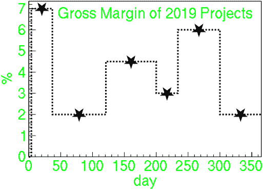](https://media.geeksforgeeks.org/wp-content/uploads/20210224192924/histwithpoints.png)

**<u>分析问题</u> :**

在这个问题陈述中，假设所有间隔无缝地粘在一起，即没有间隙和重叠。箱的右边缘与下一个箱的左边缘相同。给定 **N 个点**，从而 **N 个仓**，任务是找到 **(N + 1)** 个仓边。每个给定点都位于其 **X** 区间的精确中心。这给出了 **(N + 1)** 未知量的 **N** 方程，因此系统欠定。有两个建议:

*   垃圾箱应保持一致。从数学上讲，它们的料箱宽度的[方差](https://www.geeksforgeeks.org/mathematics-mean-variance-and-standard-deviation/)应该最小化。
*   一个直接为箱边提供一个固定值，只有其他值是从该值派生出来的。

**<u>计算</u> :**

以下是一些假设:

*   让 **x <sub>i</sub>** 作为该点的坐标(他们的 *y* 值与我们完全无关)。
*   **w <sub>i</sub>** 各自的料仓宽度。
*   **e<sub>I</sub>T3【垃圾箱边缘的坐标。**
*   假设**x<sub>I</sub>T3 按升序排序。**

下图说明了上述概念:

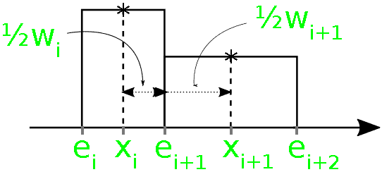

从上面的表示中，可以容易地验证两个简单的关系:

> 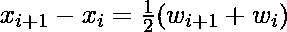

> 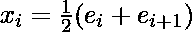

上述公式简化了计算，尤其是对于偶数 **N** 的计算，这也是为什么对于奇数和偶数 **N** 的值会得到不同结果的原因。后者直接是需要填入数组**e【】**(直方图 X 轴上的点)的[递归](https://www.geeksforgeeks.org/recursion/)公式。

**<u>如何最小化方差</u>？**

这个想法类似于所有的最小化问题，即检查导数 **0** 。问题是把它的公式简化成只有一个未知变量，然后我们可以用它来求最小值。

*   方差由下式给出:

> 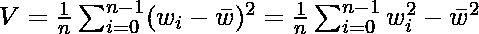

*   上式中的平均值由下式给出:

> 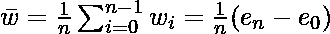

*   根据任意量 z 推导出上述方程，如下所示:

> 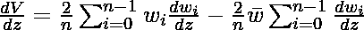

*   通过将 w <sub>i</sub> 替换为 **(z = e <sub>0</sub> )** 来迭代应用上面导出的第一个等式。例如:

> 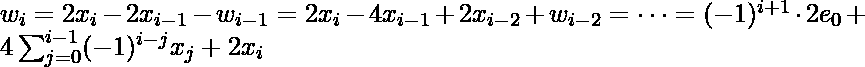

*   将以上得到的所有值放在一起求 e <sub>0</sub> 的值:

> 当 N 是奇数时，那么
> 
> 
> 
> 当 N 为偶数时，那么
> 
> 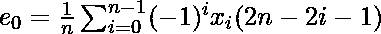

*   或者，使用 z = e <sub>N</sub> 的值，给出更简单的公式如下:

> 当 N 是奇数时，那么
> 
> 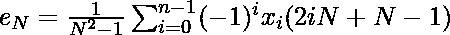
> 
> 当 N 为偶数时，那么
> 
> 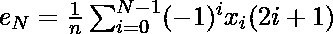

**方法:**解决给定问题的思路是迭代两个嵌套循环，一个循环用于根据推导公式求**e<sub>0</sub>T5】或**e<sub>N</sub>T9】的值，另一个循环用于求[数组](https://www.geeksforgeeks.org/introduction-to-arrays/)**e【】**的元素。因此，所有变体的时间复杂度将为 ***O(N)*** 。两个循环都递归工作，第二个循环根据上面给出的第二个等式，从前面找到数组的元素 **e[]** 。****

**注:**

*   [整数除法](https://www.geeksforgeeks.org/restoring-division-algorithm-unsigned-integer/)的舍入效果用于处理 **N** 的奇数和偶数情况。
*   如果在下面的实现中省略了[关键字寄存器](https://www.geeksforgeeks.org/understanding-register-keyword/)，那么 C 函数也将在 [C++中工作。](https://www.geeksforgeeks.org/c-plus-plus/)
*   该程序将分别需要标准的 **C99** 的 [C 编译器](https://www.geeksforgeeks.org/compiling-a-c-program-behind-the-scenes/)和标准的 [C++编译器](https://www.geeksforgeeks.org/write-c-program-wont-compiler-c/)[T7】c++ 14T9 的](https://www.geeksforgeeks.org/generalized-lambda-expressions-c14/)。

下面是上述方法的实现:

## C

```
// C program for the above approach
#include <stdio.h>
#include <stdlib.h>
#define N 6

// Function to fill the array elements
// e[] from the end
double* pointsToIntervalsN(
    int n, const double* x,
    double* e)
{
    // Check for array overlap
    if (n < 2 || !x || e < x && e + n >= x)
        return NULL;

    // If e is a NULL pointer, then
    // allocate the array
    if (e
        || (e
            = (double*)malloc(
                (n + 1) * sizeof(double)))) {

        // Find the value of m on the
        // basis of odd or even value of N
        const int m = n & 1 ? n : 2;
        const int j = m * n;
        register double sum = 0.;

        // Count i and x downwards
        for (int i = m / 2; i < j; i += m) {
            sum = i * *x++ - sum;
        }
        sum /= j / 2;

        // Note: m/2 and j/2 above are
        // integer divisions!
        for (e[n] = sum; n--; e[n] = sum)
            sum = 2 * *--x - sum;
    }

    // Including e==NULL for the case
    // of malloc error
    return e;
}

// Function to fill the output array
// from the front
double* pointsToIntervals0(const int n,
                           const double* x,
                           double* e)
{
    // Check for overlaps
    if (n < 2 || !x || e >= x && e < x + n)
        return NULL;

    if (e
        || (e
            = (double*)malloc(
                (n + 1) * sizeof(double)))) {

        const int m = n & 1 ? n : 2;
        const int j = m * n;
        register double sum = 0.;

        // Count i down and x
        // from the front
        x += n;

        for (int i = m / 2; i < j;
             i += m) {
            sum = i * *--x - sum;
        }

        // Update the value of sum
        sum /= j / 2;

        *e = sum;
        for (int i = 0; i < n;
             e[++i] = sum)
            sum = 2 * x[i] - sum;
    }

    // Return the updated e
    return e;
}

// Function to find thefixed single
// e value from which all other e's
// are derived
double* pointsToIntervalsFix(const int n,
                             const double* x,
                             double e_base,
                             double* e)
{
    // Base Case
    if (n < 1 || !x)
        return NULL;

    int k = 0;

    // Perform Binary Search for e_base
    for (int l = n; l > 1; l /= 2)
        if (e_base > x[k + l / 2])
            k += (l + 1) / 2;

    // The e_base is either the left
    // or the right edge of the bin
    // around x[k]
    if (e_base > x[k])
        ++k;

    // Now it's the left.

    // Assume e is filled the left side
    // first, the right side of e can
    // overlap with x
    if (e + k >= x && e < x + n)
        return NULL;

    // If the right side is filled
    // first, so that the left side
    // of e can overlap with x
    if (e || (e = (double*)malloc(
                  (n + 1) * sizeof(double)))) {
        e[k] = e_base;

        // Fill in both sides of array
        // e[] starting from k
        for (int i = k; i--; e[i] = e_base)
            e_base = 2 * x[i] - e_base;

        for (e_base = e[k]; k < n;
             e[++k] = e_base)
            e_base = 2 * x[k] - e_base;
    }

    return e;
}

// Driver Code
int main()
{
    double e_orig[N + 1]
        = { 4, 37, 121, 200, 234, 300, 365 };
    double x[N], e_recN[N + 1], e_rec0[N + 1];
    double e_base = 235.4, e_fix[N + 1];

    // Make x the mean values of the
    // neighbouring e_orig values:
    for (int i = N; i--;
         x[i] = (e_orig[i + 1] + e_orig[i]) / 2)
        ;

    // Function Call
    pointsToIntervalsN(N, x, e_recN);
    pointsToIntervals0(N, x, e_rec0);
    pointsToIntervalsFix(N, x, e_base, e_fix);

    printf("Example for n = %d:", N);
    printf("\nx     ");
    for (int i = 0; i < N; ++i)
        printf("% .3f", x[i]);

    printf("\ne_orig ");

    for (int i = 0; i <= N; ++i)
        printf("% .3f", e_orig[i]);

    printf("\ne_recN ");

    for (int i = 0; i <= N; ++i)
        printf("% .3f", e_recN[i]);

    printf("\ne_rec0 ");

    for (int i = 0; i <= N; ++i)
        printf("% .3f", e_rec0[i]);

    printf("\ne_fix  ");

    for (int i = 0; i <= N; ++i)
        printf("% .3f", e_fix[i]);

    return 0;
}
```

**Output:**

```
Example for n = 6:
x      20.500 79.000 160.500 217.000 267.000 332.500
e_orig  4.000 37.000 121.000 200.000 234.000 300.000 365.000
e_recN  3.583 37.417 120.583 200.417 233.583 300.417 364.583
e_rec0  3.583 37.417 120.583 200.417 233.583 300.417 364.583
e_fix   5.400 35.600 122.400 198.600 235.400 298.600 366.400

```

**<u>警告和前景</u> :**

*   最小方差和固定边这两种方法偶尔会失败，从而获得一个或多个负宽度的直方图仓，即有一些**e<sub>I</sub>>e<sub>(I+1</sub>**<sub>)</sub>看似没有正确排序。当任何随机的 **X** 值作为输入时，总是会发生这种情况。
*   试着用**“最负”**的宽度来固定箱子，希望所有其他的也能看起来合理。
*   这给我们带来了前景，因为上面举例说明的两种方法并不是制定额外条件的唯一可能性。取而代之的是**“可能相等”**仓宽，假设一个趋势，如**w<sub>I</sub>T5】的线性增加或所有**w<sub>I</sub>T9】的绝对最小值。****