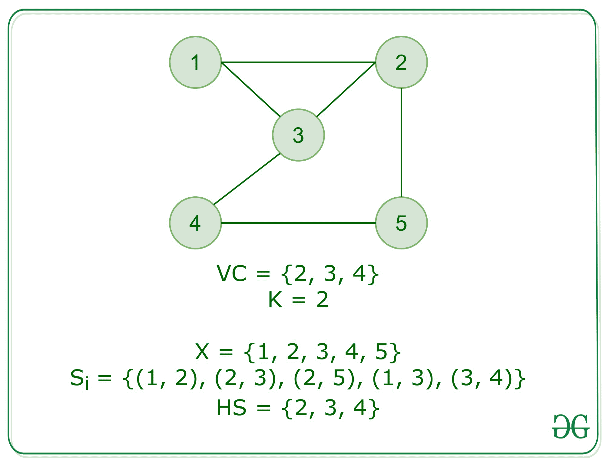

# 命中集问题为 NP 完全

> 原文:[https://www . geesforgeks . org/hit-set-problem-is-NP-complete/](https://www.geeksforgeeks.org/hitting-set-problem-is-np-complete/)

**先决条件:**T2【NP 完成】T3

**<u>问题</u>** :给定元素的基本集合 X 以及 **X** 中可用子集的分组集合 **C** 和整数 **k** ，任务是找到 **X** 的最小子集，使得最小子集 **H** 命中包含在 **C** 中的每个集合。这意味着 **H 和 S** 的交集对于属于 **C** 的每一组 **S** 都是空的，**尺寸≤ k** 。

**<u>证明:</u>** 问题的一个实例是指定给问题的输入。命中集的一个实例是子集 C、X 中的 S 和 k 的集合。由于 NP-完全问题，顾名思义，是一个既是 [NP 又是 NP-Hard](https://www.geeksforgeeks.org/difference-between-np-hard-and-np-complete-problem/) 的问题，所以问题是[NP-完全](https://www.geeksforgeeks.org/algorithms-gq/np-complete-gq/)的证明或陈述由两部分组成:

1.  问题本身是 NP 完全的。
2.  NP 类中的所有其他问题都可以在多项式时间内简化为这个问题。(乙是多时间可还原为丙)。

如果满足唯一的第二个条件，这个问题就叫做 NP-Hard。
但不可能把每一个 NP 问题都化为另一个 NP 问题来一直展示它的 NP-完全性。这就是为什么要证明一个问题是 NP 完全的，证明这个问题是 NP 完全的，并且任何 NP 完全问题都可以简化为 NP 完全问题，那么我们就完成了。因此，可以使用以下命题来验证命中集问题是 NP-完全的:

1.  **<u>hiting Set 在 NP 中:</u>** 它任何问题都在 NP 中，那么给定一个‘证书’，这是问题的一个解和问题的一个实例(一个地面集 X，一个集合，C 的子集，S)，我们就能在多项式时间内验证(检查解是否正确)这个证书。这可以通过:
    提供大小为 k 的命中集 HS，验证它至少覆盖 x 的每个集合 Si 中的一个元素。
    这需要多项式时间，因此在 NP 中
2.  **<u>打击集是 NP-Hard:</u>** 为了证明打击集是 NP-Hard，我们将进行一个约简，由此顶点覆盖问题可以约简为打击集问题。

在[顶点覆盖问题](https://www.geeksforgeeks.org/vertex-cover-problem-set-1-introduction-approximate-algorithm-2/)中，我们有一个图 **G = (V，E)**
现在，设 X，即地集合= G 的顶点，即 X = V(G)，X 中子集 Si 的集合 C 为 **S i = {u，v}** 是图 G 中的一条边

现在，以下属性保持不变:

*   如果 VC 是**大小为 k** 的图 G 的顶点覆盖，这意味着对于每条边 **{u，v}** ，u 或 v 都属于 VC。因此，虚电路形成命中集，因为所有子集将与虚电路中的顶点形成交集。
*   如果 HS 击中一组尺寸为 **k** 的 **X** 。既然 HS 与 X 的每个子集相交，那么每个边的至少一个端点 **{u，v}** 必须属于该解。因此，它为每条边跨越至少一个顶点，从而形成虚电路。

**<u>结论:</u>**

命中集问题是 **NP 和 NP-Hard** 。因此，**命中集合问题** **是 NP-Complete** 。