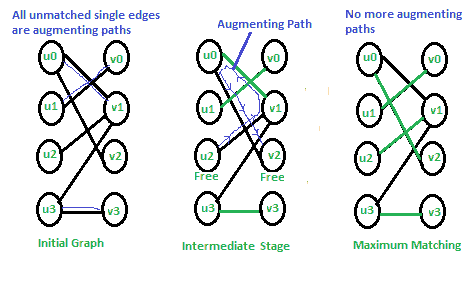

# 最大匹配的 Hopcroft–Karp 算法|集合 1(简介)

> 原文:[https://www . geeksforgeeks . org/hopcroft-Karp-算法-最大匹配-集合-1-简介/](https://www.geeksforgeeks.org/hopcroft-karp-algorithm-for-maximum-matching-set-1-introduction/)

[二分图](https://www.geeksforgeeks.org/bipartite-graph)中的匹配是一组选择的边，使得没有两条边共享一个端点。最大匹配是最大尺寸(最大边数)的匹配。在最大匹配中，如果添加了任何边，则不再匹配。给定的二部图可以有多个最大匹配。

在[之前的文章](https://www.geeksforgeeks.org/maximum-bipartite-matching/)中，我们已经讨论了最大匹配的重要性和基于福特富尔克森的最大二部匹配方法。基于福特富尔克森算法的时间复杂度为 O(V x E)。

Hopcroft Karp 算法是在 O(√V x E)时间内运行的改进。在讨论算法之前，让我们先定义几个术语

***自由节点或顶点:*** 给定一个匹配的 M，不属于匹配的节点称为自由节点。最初所有顶点都是自由的(见下图的第一个图)。在第二张图中，u2 和 v2 是自由的。在第三个图中，没有一个顶点是自由的。

***匹配边和不匹配边:*** 给定一个匹配的 M，属于匹配的边称为匹配边，不属于 M(或连接自由节点)的边称为不匹配边。在第一个图中，所有的边都是不匹配的。在第二个图中，(u0，v1)，(u1，v0)和(u3，v3)匹配，其他不匹配。

***交替路径:*** 给定一个匹配的 M，交替路径就是边交替属于匹配和不匹配的路径。所有单边路径都是交替路径。中间图中交替路径的例子是 u0-v1-u2 和 u2-v1-u0-v2。

***增广路径:*** 给定匹配的 M，增广路径是从自由顶点开始并在自由顶点结束的交替路径。所有以自由顶点开始和结束的单条边路径都是增广路径。在下图中，增强路径用蓝色突出显示。请注意，扩充路径总是有一个额外的匹配边。

霍普克罗夫特卡普算法基于以下概念。

*如果存在增广路径，匹配 M 不是最大值。另一方面也是如此，即如果不存在扩充路径*，匹配最大

所以这个想法是一个接一个地寻找增加路径。并将找到的路径添加到当前匹配中。

**霍普克罗夫特卡普算法**

```
1) Initialize Maximal Matching M as empty.
2) While there exists an Augmenting Path p
     Remove matching edges of p from M and add not-matching edges of p to M
     (This increases size of M by 1 as p starts and ends with a free vertex)
3) Return M. 
```

下图显示了算法的工作原理。

[](https://media.geeksforgeeks.org/wp-content/cdn-uploads/HopcroftKarp1.png)

在初始图中，所有单条边都是增广路径，我们可以按任意顺序选取。在中间阶段，只有一条扩充路径。我们从 M 中移除该路径的匹配边，并添加不匹配的边。在最终匹配中，没有增加路径，因此匹配是最大的。

第二集讨论了霍普克罗夫特卡普算法的实现。

[最大匹配的霍普克罗夫特-卡普算法|集合 2(实现)](https://www.geeksforgeeks.org/hopcroft-karp-algorithm-for-maximum-matching-set-2-implementation/)

 **参考文献:**
[https://en . Wikipedia . org/wiki/Hopcroft % E2 % 80% 93Karp _ algorithm](https://en.wikipedia.org/wiki/Hopcroft%E2%80%93Karp_algorithm)
[http://www.dis.uniroma1.it/~leon/tcs/lecture2.pdf](http://www.dis.uniroma1.it/~leon/tcs/lecture2.pdf)

如果您发现任何不正确的地方，或者您想分享更多关于上面讨论的主题的信息，请写评论