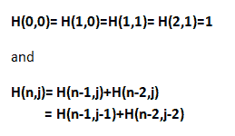
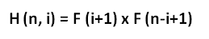

# Hosoya 三角

> 原文:[https://www.geeksforgeeks.org/hosoyas-triangle/](https://www.geeksforgeeks.org/hosoyas-triangle/)

[**斐波那契三角形**](https://en.wikipedia.org/wiki/Hosoya%27s_triangle) 或 [**Hosoya 三角形**](https://en.wikipedia.org/wiki/Hosoya%27s_triangle) 是基于斐波那契数的三角形排列。每一个数字都是上面两个数字在左对角线或右对角线上的总和。前几行是:


这个三角形中的数字遵循循环关系



**与斐波那契数的关系**
三角形中的条目满足等式



因此，最外面的两条对角线是斐波那契数，而中间垂直线上的数字是斐波那契数的平方。三角形中的所有其他数字都是两个不同的大于 1 的斐波那契数的乘积。行和是第一个[卷积的斐波那契数](https://en.wikipedia.org/wiki/Generalizations_of_Fibonacci_numbers#Convolved_Fibonacci_sequences)。
来源: [Stackoverflow](https://stackoverflow.com/questions/36275039/create-a-hosoyas-triangle-in-java) ，[维基百科](https://en.wikipedia.org/wiki/Hosoya%27s_triangle)
给定一个正整数 **n** 。任务是打印大小为 n 的 Hosoya 三角形
**示例:**

```
Input : n = 4
Output :
1
1 1
2 1 2
3 2 2 3

Input : n = 5
Output :
1
1 1
2 1 2
3 2 2 3
5 3 4 3 5
```

下面是打印 Hosoya 的高度为 n 的三角形的实现:

## C++

```
// CPP Program to print Hosoya's
// triangle of height n.
#include <bits/stdc++.h>
using namespace std;

int Hosoya(int n, int m)
{
    // Base case
    if ((n == 0 && m == 0) ||
        (n == 1 && m == 0) ||
        (n == 1 && m == 1) ||
        (n == 2 && m == 1))
        return 1;

    // Recursive step
    if (n > m)
        return Hosoya(n - 1, m)
               + Hosoya(n - 2, m);

    else if (m == n)
        return Hosoya(n - 1, m - 1)
               + Hosoya(n - 2, m - 2);

    else
        return 0;
}

// Print the Hosoya triangle of height n.
void printHosoya(int n)
{
    for (int i = 0; i < n; i++) {
        for (int j = 0; j <= i; j++)
            cout << Hosoya(i, j) << " ";    

        cout << endl;
    }
}

// Driven Program
int main()
{
    int n = 5;
    printHosoya(n);
    return 0;
}
```

## Java 语言(一种计算机语言，尤用于创建网站)

```
// Java Program to print Hosoya's
// triangle of height n.
import java.util.*;

class GFG {

    static int Hosoya(int n, int m)
    {
        // Base case
        if ((n == 0 && m == 0) ||
            (n == 1 && m == 0) ||
            (n == 1 && m == 1) ||
            (n == 2 && m == 1))
            return 1;

        // Recursive step
        if (n > m)
            return Hosoya(n - 1, m)
                   + Hosoya(n - 2, m);

        else if (m == n)
            return Hosoya(n - 1, m - 1)
                    + Hosoya(n - 2, m - 2);

        else
            return 0;
    }

    // Print the Hosoya triangle of height n.
    static void printHosoya(int n)
    {
        for (int i = 0; i < n; i++)
        {
            for (int j = 0; j <= i; j++)
                System.out.print(Hosoya(i, j)
                                        + " ");      

            System.out.println("");
        }
    }

    /* Driver program to test above function */
    public static void main(String[] args)
    {
        int n = 5;
        printHosoya(n);

    }
}

// This code is contributed by  Arnav Kr. Mandal.
```

## 蟒蛇 3

```
# Python3 code to print Hosoya's
# triangle of height n.

def Hosoya( n , m ):

    # Base case
    if ((n == 0 and m == 0) or
        (n == 1 and m == 0) or
        (n == 1 and m == 1) or
        (n == 2 and m == 1)):
                return 1

    # Recursive step
    if n > m:
        return Hosoya(n - 1, m)
                    + Hosoya(n - 2, m)

    elif m == n:
        return Hosoya(n - 1, m - 1)
                        + Hosoya(n - 2,    m - 2)

    else:
        return 0

# Print the Hosoya triangle of height n.
def printHosoya( n ):
    for i in range(n):
        for j in range(i + 1):
            print(Hosoya(i, j) , end = " ")
        print("\n", end = "")

# Driven Code
n = 5
printHosoya(n)

# This code is contributed by Sharad_Bhardwaj
```

## C#

```
// C# Program to print Hosoya's
// triangle of height n.
using System;

class GFG {

    static int Hosoya(int n, int m)
    {
        // Base case
        if ((n == 0 && m == 0) ||
            (n == 1 && m == 0) ||
            (n == 1 && m == 1) ||
            (n == 2 && m == 1))
            return 1;

        // Recursive step
        if (n > m)
            return Hosoya(n - 1, m)
                 + Hosoya(n - 2, m);

        else if (m == n)
            return Hosoya(n - 1, m - 1)
                 + Hosoya(n - 2, m - 2);

        else
            return 0;
    }

    // Print the Hosoya triangle of height n.
    static void printHosoya(int n)
    {
        for (int i = 0; i < n; i++)
        {
            for (int j = 0; j <= i; j++)
                Console.Write(Hosoya(i, j)
                                        + " ");

            Console.WriteLine("");
        }
    }

    /* Driver program to test above function */
    public static void Main()
    {
        int n = 5;

        printHosoya(n);

    }
}

// This code is contributed by vt_m.
```

## 服务器端编程语言（Professional Hypertext Preprocessor 的缩写）

```
<?php
// PHP Program to print Hosoya's
// triangle of height n.

function Hosoya(int $n, int $m)
{
    // Base case
    if (($n == 0 && $m == 0) ||
        ($n == 1 && $m == 0) ||
        ($n == 1 && $m == 1) ||
        ($n == 2 && $m == 1))
        return 1;

    // Recursive step
    if ($n > $m)
        return Hosoya($n - 1,$m) +
               Hosoya($n - 2, $m);

    else if ($m == $n)
        return Hosoya($n - 1, $m - 1) +
               Hosoya($n - 2, $m - 2);

    else
        return 0;
}

// Print the Hosoya
// triangle of height n.
function printHosoya( $n)
{
    for ( $i = 0; $i < $n; $i++)
    {
        for ( $j = 0; $j <= $i; $j++)
            echo Hosoya($i, $j) , " ";
            echo "\n";
    }
}

// Driven Code
$n = 5;
printHosoya($n);

// This code is contributed by anuj_67.
?>
```

## java 描述语言

```
<script>

// JavaScript program to implement
// the above approach

    function Hosoya(n, m)
    {
        // Base case
        if ((n == 0 && m == 0) ||
            (n == 1 && m == 0) ||
            (n == 1 && m == 1) ||
            (n == 2 && m == 1))
            return 1;

        // Recursive step
        if (n > m)
            return Hosoya(n - 1, m)
                   + Hosoya(n - 2, m);

        else if (m == n)
            return Hosoya(n - 1, m - 1)
                    + Hosoya(n - 2, m - 2);

        else
            return 0;
    }

    // Print the Hosoya triangle of height n.
    function printHosoya(n)
    {
        for (let i = 0; i < n; i++)
        {
            for (let j = 0; j <= i; j++)
                document.write(Hosoya(i, j)
                                        + " ");      

            document.write("<br/>");
        }
    }

// Driver code
        let n = 5;
        printHosoya(n);

         // This code is contributed by sanjoy_62.
</script>
```

**输出:**

```
1 
1 1 
2 1 2 
3 2 2 3 
5 3 4 3 5 
```

下面是使用动态编程打印 Hosoya 高度为 n 的三角形的实现:

## C++

```
// CPP Program to print Hosoya's triangle of height n.
#include <bits/stdc++.h>
#define N 5
using namespace std;

// Print the Hosoya triangle of height n.
void printHosoya(int n)
{
    int dp[N][N];
    memset(dp, 0, sizeof(dp));

    // base case.
    dp[0][0] = dp[1][0] = dp[1][1] = 1;

    // For each row.
    for (int i = 2; i < n; i++) {

        // for each column;
        for (int j = 0; j < n; j++) {

            // recursive steps.
            if (i > j)
                dp[i][j] = dp[i - 1][j] + dp[i - 2][j];

            else
                dp[i][j] = dp[i - 1][j - 1] + dp[i - 2][j - 2];
        }
    }

    // printing the solution
    for (int i = 0; i < n; i++) {
        for (int j = 0; j <= i; j++)
            cout << dp[i][j] << " ";       

        cout << endl;
    }
}

// Driven Program
int main()
{
    int n = 5;
    printHosoya(n);
    return 0;
}
```

## Java 语言(一种计算机语言，尤用于创建网站)

```
// JAVA Code for Hosoya Triangle
import java.util.*;

class GFG {

    static int N = 5;

    // Print the Hosoya triangle
    // of height n.
    static void printHosoya(int n)
    {
        int dp[][] = new int[N][N];

        // base case.
        dp[0][0] = dp[1][0] = 1;
        dp[1][1] = 1;

        // For each row.
        for (int i = 2; i < n; i++)
        {
            // for each column;
            for (int j = 0; j < n; j++)
            {
                 // recursive steps.
                if (i > j)
                    dp[i][j] = dp[i - 1][j] +
                                        dp[i - 2][j];

                else
                    dp[i][j] = dp[i - 1][j - 1] +
                                    dp[i - 2][j - 2];
            }
        }

        // printing the solution
        for (int i = 0; i < n; i++)
        {
            for (int j = 0; j <= i; j++)
                System.out.print(dp[i][j] + " ");       

            System.out.println("");
        }
    }

    /* Driver program*/
    public static void main(String[] args)
    {
        int n = 5;
        printHosoya(n);
    }
}

// This code is contributed by Arnav Kr. Mandal.
```

## 蟒蛇 3

```
# Python3 Program to print
# Hosoya's triangle of height n.
N = 5

# Print the Hosoya triangle
# of height n.
def printHosoya(n):
    dp = [[0 for i in range(N)]
             for i in range(N)]

    # base case.
    dp[0][0] = dp[1][0] = dp[1][1] = 1

    # For each row.
    for i in range(2, n):

        # for each column
        for j in range(n):

            # recursive steps.
            if (i > j):
                dp[i][j] = (dp[i - 1][j] +
                            dp[i - 2][j])
            else:
                dp[i][j] = (dp[i - 1][j - 1] +
                            dp[i - 2][j - 2])

    # printing the solution
    for i in range(n):
        for j in range(i + 1):
            print(dp[i][j], end = ' ')
        print()

# Driver Code
n = 5
printHosoya(n)

# This code is contributed
# by sahilshelangia
```

## C#

```
// C# Code for Hosoya Triangle
using System;

class GFG {

    static int N = 5;

    // Print the Hosoya triangle
    // of height n.
    static void printHosoya(int n)
    {
        int [,]dp = new int[N,N];

        // base case.
        dp[0,0] = dp[1,0] = 1;
        dp[1,1] = 1;

        // For each row.
        for (int i = 2; i < n; i++)
        {
            // for each column;
            for (int j = 0; j < n; j++)
            {
                // recursive steps.
                if (i > j)
                    dp[i,j] = dp[i - 1,j] +
                              dp[i - 2,j];

                else
                    dp[i,j] = dp[i - 1,j - 1]
                           + dp[i - 2,j - 2];
            }
        }

        // printing the solution
        for (int i = 0; i < n; i++)
        {
            for (int j = 0; j <= i; j++)
                Console.Write(dp[i,j] + " ");

            Console.WriteLine("");
        }
    }

    /* Driver program*/
    public static void Main()
    {
        int n = 5;

        printHosoya(n);
    }
}

// This code is contributed by Vt_m.
```

## 服务器端编程语言（Professional Hypertext Preprocessor 的缩写）

```
<?php
// PHP Program to print Hosoya's triangle of height n.
$N=5;

// Print the Hosoya triangle of height n.
function printHosoya($n)
{
    global $N;
    $dp=array_fill(0,$N,array_fill(0,$N,0));

    // base case.
    $dp[0][0] = $dp[1][0] = $dp[1][1] = 1;

    // For each row.
    for ($i = 2; $i < $n; $i++) {

        // for each column;
        for ($j = 0; $j < $n; $j++) {

            // recursive steps.
            if ($i > $j)
                $dp[$i][$j] = $dp[$i - 1][$j]
                            + $dp[$i - 2][$j];

            else
                $dp[$i][$j] = $dp[$i - 1][$j - 1]
                            + $dp[$i - 2][$j - 2];
        }
    }

    // printing the solution
    for ($i = 0; $i < $n; $i++) {
        for ($j = 0; $j <= $i; $j++)
            echo $dp[$i][$j]." ";

        echo "\n";
    }
}

// Driven Program

    $n = 5;
    printHosoya($n);

// This code is contributed by mits
?>
```

## java 描述语言

```
<script>

// Javascript Program to print Hosoya's
// triangle of height n.
var N = 5

// Print the Hosoya triangle of height n.
function printHosoya(n)
{
    var dp = Array.from(Array(N),
    ()=> Array(N).fill(0));

    // base case.
    dp[0][0] = dp[1][0] = dp[1][1] = 1;

    // For each row.
    for (var i = 2; i < n; i++) {

        // for each column;
        for (var j = 0; j < n; j++) {

            // recursive steps.
            if (i > j)
                dp[i][j] = dp[i - 1][j] +
                           dp[i - 2][j];

            else
                dp[i][j] = dp[i - 1][j - 1] +
                           dp[i - 2][j - 2];
        }
    }

    // printing the solution
    for (var i = 0; i < n; i++) {
        for (var j = 0; j <= i; j++)
            document.write( dp[i][j] + " ");       

        document.write("<br>");
    }
}

// Driven Program
var n = 5;
printHosoya(n);

</script>   
```

**输出:**

```
1 
1 1 
2 1 2 
3 2 2 3 
5 3 4 3 5 
```