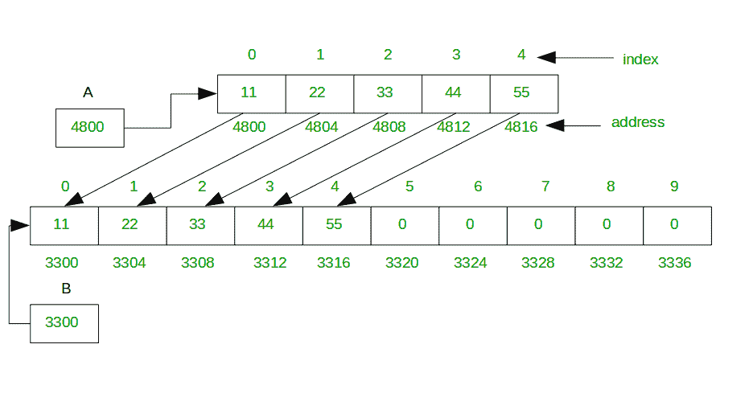
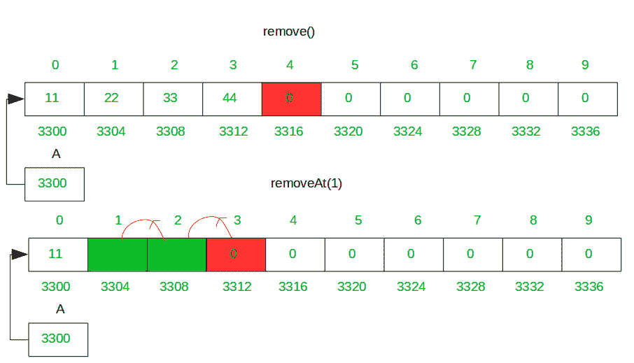
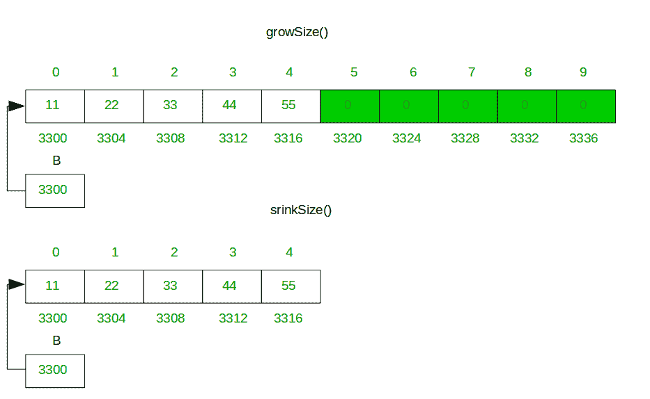

# 动态数组是如何工作的？

> 原文:[https://www.geeksforgeeks.org/how-do-dynamic-arrays-work/](https://www.geeksforgeeks.org/how-do-dynamic-arrays-work/)

当我们试图进行插入并且没有更多空间留给新项目时，动态数组(C++中的[向量、](https://www.geeksforgeeks.org/vector-in-cpp-stl/)[Java 中的](https://www.geeksforgeeks.org/arraylist-in-java/)数组列表)会自动增长。通常面积会翻倍。

一个简单的动态数组可以通过分配一个固定大小的数组来构造，这个数组通常比直接需要的元素数量要多。动态数组的元素连续存储在基础数组的开头，而基础数组末尾的剩余位置被保留或未使用。通过使用保留空间，可以在恒定时间内在动态数组的末尾添加元素，直到该空间被完全消耗。

当所有空间都被占用，并且要添加一个额外的元素时，底层固定大小的阵列需要增加大小。通常调整大小是很昂贵的，因为你必须分配一个更大的数组，并且在我们最终可以追加我们的项目之前，复制你已经扩展的数组中的所有元素。

**方法:**当我们在数组中输入一个元素，但是数组已经满了，那么你创建一个函数，这个函数创建一个新的双倍大小的数组，或者按照你的意愿，将之前数组中的所有元素复制到一个新的数组中，然后返回这个新的数组。此外，我们可以减小阵列的大小。并在给定的位置添加一个元素，同时在默认的结束位置和该位置移除该元素。

### 动态数组的关键特性

**添加元素:**在末尾添加元素如果数组大小不够，那么扩展数组的大小，在原始数组的末尾以及给定的索引处添加一个元素。做所有这些复制需要 O(n)个时间，其中 n 是我们数组中的元素数量。那是追加的昂贵费用。在固定长度的数组中，追加只需要 O(1)个时间。

但是只有当我们插入一个完整的数组时，追加才会占用 O(n)个时间。这种情况非常罕见，尤其是当我们每次用完空间时，阵列的大小都会翻倍。所以在大多数情况下追加仍然是 O(1)时间，有时是 O(n)时间。

在动态数组中，你可以在需要时创建固定大小的数组，在数组中增加一些元素，然后使用这种方法:


**删除元素:**从数组中删除元素，默认 remove()方法从末尾删除元素，只需在最后一个索引处存储零，您也可以通过调用 removeAt(i)方法在特定索引处删除元素，其中 I 是索引。removeAt(i)方法从给定的索引向左移动所有右边的元素。



**调整数组大小的大小:**当数组右侧有空/零数据(不包括您添加的)时，方法 srinkSize()会释放额外的内存。当所有空间都被占用，并且要添加一个额外的元素时，底层的固定大小数组需要增加大小。通常调整大小是很昂贵的，因为你必须分配一个更大的数组，并且在我们最终可以追加我们的项目之前，复制你已经扩展的数组中的所有元素。



**动态数组的简单代码。在下面的代码中，数组将变得满满的，我们将所有元素复制到新的双大小数组(可变大小数组)中。示例代码如下**

## Java 语言(一种计算机语言，尤用于创建网站)

```
// Java program deals with all operation of a dynamic array
// add, remove, resize memory of array is the main feature
public class DynamicArray {

    // create three variable array[] is a array,
    // count will deal with no of element add by you and
    // size will with size of array[]
    private int array[];
    private int count;
    private int size;
    // constructor initialize value to variable

    public DynamicArray()
    {
        array = new int[1];
        count = 0;
        size = 1;
    }
    // function add an element at the end of array

    public void add(int data)
    {

        // check no of element is equql to size of array
        if (count == size) {
            growSize(); // make array size double
        } // insert element at end of array
        array[count] = data;
        count++;
    }

    // function makes size double of array
    public void growSize()
    {

        int temp[] = null;
        if (count == size) {

            // temp is a double size array of array
            // and store array elements
            temp = new int[size * 2];
            {
                for (int i = 0; i < size; i++) {
                    // copy all array value into temp
                    temp[i] = array[i];
                }
            }
        }

        // double size array temp initialize
        // into variable array again
        array = temp;

        // and make size is double also of array
        size = size * 2;
    }

    // function shrink size of array
    // which block unnecessary remove them
    public void shrinkSize()
    {
        int temp[] = null;
        if (count > 0) {

            // temp is a count size array
            // and store array elements
            temp = new int[count];
            for (int i = 0; i < count; i++) {

                // copy all array value into temp
                temp[i] = array[i];
            }

            size = count;

            // count size array temp initialize 
            // into variable array again
            array = temp;
        }
    }
    // function add an element at given index

    public void addAt(int index, int data)
    {
        // if size is not enough make size double
        if (count == size) {
            growSize();
        }

        for (int i = count - 1; i >= index; i--) {

            // shift all element right 
            // from given index
            array[i + 1] = array[i];
        }

        // insert data at given index
        array[index] = data;
        count++;
    }

    // function remove last element or put
    // zero at last index
    public void remove()
    {
        if (count > 0) {
            array[count - 1] = 0;
            count--;
        }
    }

    // function shift all element of right
    // side from given index in left
    public void removeAt(int index)
    {
        if (count > 0) {
            for (int i = index; i < count - 1; i++) {

                // shift all element of right 
                // side from given index in left
                array[i] = array[i + 1];
            }
            array[count - 1] = 0;
            count--;
        }
    }

    public static void main(String[] args)
    {
        DynamicArray da = new DynamicArray();

        // add 9 elements in array
        da.add(1);
        da.add(2);
        da.add(3);
        da.add(4);
        da.add(5);
        da.add(6);
        da.add(7);
        da.add(8);
        da.add(9);

        // print all array elements after add 9 elements
        System.out.println("Elements of array:");
        for (int i = 0; i < da.size; i++) {
            System.out.print(da.array[i] + " ");
        }

        System.out.println();

        // print size of array and no of element
        System.out.println("Size of array: " + da.size);
        System.out.println("No of elements in array: " +
                                              da.count);

        // shrinkSize of array
        da.shrinkSize();

        // print all array elements
        System.out.println("Elements of array "+ 
                   "after shrinkSize of array:");
        for (int i = 0; i < da.size; i++) {
            System.out.print(da.array[i] + " ");
        }
        System.out.println();

        // print size of array and no of element
        System.out.println("Size of array: " + da.size);
        System.out.println("No of elements in array: " + 
                                               da.count);

        // add an element at index 1
        da.addAt(1, 22);

        // print Elements of array after adding an
        // element at index 1
        System.out.println("Elements of array after" + 
                      " add an element at index 1:");
        for (int i = 0; i < da.size; i++) {
            System.out.print(da.array[i] + " ");
        }

        System.out.println();

        // print size of array and no of element
        System.out.println("Size of array: " + da.size);
        System.out.println("No of elements in array: " + 
                                               da.count);

        // delete last element
        da.remove();

        // print Elements of array after delete last 
        // element
        System.out.println("Elements of array after" + 
                              " delete last element:");
        for (int i = 0; i < da.size; i++) {
            System.out.print(da.array[i] + " ");
        }

        System.out.println();

        // print size of array and no of element
        System.out.println("Size of array: " + da.size);
        System.out.println("No of elements in array: " + 
                                              da.count);

        // delete element at index 1
        da.removeAt(1);

        // print Elements of array after delete
        // an element index 1
        System.out.println("Elements of array after"+ 
                      " delete element at index 1:");
        for (int i = 0; i < da.size; i++) {
            System.out.print(da.array[i] + " ");
        }
        System.out.println();

        // print size of array and no of element
        System.out.println("Size of array: " + da.size);
        System.out.println("No of elements in array: " +
                                               da.count);
    }
}
```

## C#

```
// C# program deals with all operation 
// of dynamic array add, remove, resize 
// memory of array is the main feature
using System;

public class DynamicArray 
{

    // create three variable array[] is 
    // a array, count will deal with no 
    // of element add by you and
    // size will with size of array[]
    private int []array;
    private int count;
    private int size;

    // constructor initialize value to variable
    public DynamicArray()
    {
        array = new int[1];
        count = 0;
        size = 1;
    }

    // function add an element at the end of array
    public void add(int data)
    {

        // check no of element is equql to size of array
        if (count == size) 
        {
            growSize(); // make array size double
        } 

        // insert element at end of array
        array[count] = data;
        count++;
    }

    // function makes size double of array
    public void growSize()
    {

        int []temp = null;
        if (count == size) 
        {

            // temp is a double size array of array
            // and store array elements
            temp = new int[size * 2];
            {
                for (int i = 0; i < size; i++) 
                {
                    // copy all array value into temp
                    temp[i] = array[i];
                }
            }
        }

        // double size array temp initialize
        // into variable array again
        array = temp;

        // and make size is double also of array
        size = size * 2;
    }

    // function shrink size of array
    // which block unnecessary remove them
    public void shrinkSize()
    {
        int []temp = null;
        if (count > 0) 
        {

            // temp is a count size array
            // and store array elements
            temp = new int[count];
            for (int i = 0; i < count; i++) 
            {

                // copy all array value into temp
                temp[i] = array[i];
            }

            size = count;

            // count size array temp initialize 
            // into variable array again
            array = temp;
        }
    }

    // function add an element at given index
    public void addAt(int index, int data)
    {
        // if size is not enough make size double
        if (count == size)
        {
            growSize();
        }

        for (int i = count - 1; i >= index; i--)
        {

            // shift all element right 
            // from given index
            array[i + 1] = array[i];
        }

        // insert data at given index
        array[index] = data;
        count++;
    }

    // function remove last element or put
    // zero at last index
    public void remove()
    {
        if (count > 0) 
        {
            array[count - 1] = 0;
            count--;
        }
    }

    // function shift all element of right
    // side from given index in left
    public void removeAt(int index)
    {
        if (count > 0)
        {
            for (int i = index; i < count - 1; i++) 
            {

                // shift all element of right 
                // side from given index in left
                array[i] = array[i + 1];
            }
            array[count - 1] = 0;
            count--;
        }
    }

    // Driver code
    public static void Main()
    {
        DynamicArray da = new DynamicArray();

        // add 9 elements in array
        da.add(1);
        da.add(2);
        da.add(3);
        da.add(4);
        da.add(5);
        da.add(6);
        da.add(7);
        da.add(8);
        da.add(9);

        // print all array elements after add 9 elements
        Console.WriteLine("Elements of array:");
        for (int i = 0; i < da.size; i++) 
        {
            Console.Write(da.array[i] + " ");
        }

        Console.WriteLine();

        // print size of array and no of element
        Console.WriteLine("Size of array: " + da.size);
        Console.WriteLine("No of elements in array: " +
                                            da.count);

        // shrinkSize of array
        da.shrinkSize();

        // print all array elements
        Console.WriteLine("Elements of array "+ 
                "after shrinkSize of array:");
        for (int i = 0; i < da.size; i++) 
        {
            Console.Write(da.array[i] + " ");
        }
        Console.WriteLine();

        // print size of array and no of element
        Console.WriteLine("Size of array: " + da.size);
        Console.WriteLine("No of elements in array: " + 
                                            da.count);

        // add an element at index 1
        da.addAt(1, 22);

        // print Elements of array after adding an
        // element at index 1
        Console.WriteLine("Elements of array after" + 
                    " add an element at index 1:");
        for (int i = 0; i < da.size; i++) 
        {
            Console.Write(da.array[i] + " ");
        }

        Console.WriteLine();

        // print size of array and no of element
        Console.WriteLine("Size of array: " + da.size);
        Console.WriteLine("No of elements in array: " + 
                                            da.count);

        // delete last element
        da.remove();

        // print Elements of array after delete last 
        // element
        Console.WriteLine("Elements of array after" + 
                            " delete last element:");
        for (int i = 0; i < da.size; i++) 
        {
            Console.Write(da.array[i] + " ");
        }

        Console.WriteLine();

        // print size of array and no of element
        Console.WriteLine("Size of array: " + da.size);
        Console.WriteLine("No of elements in array: " + 
                                            da.count);

        // delete element at index 1
        da.removeAt(1);

        // print Elements of array after delete
        // an element index 1
        Console.WriteLine("Elements of array after"+ 
                    " delete element at index 1:");
        for (int i = 0; i < da.size; i++) 
        {
            Console.Write(da.array[i] + " ");
        }
        Console.WriteLine();

        // print size of array and no of element
        Console.WriteLine("Size of array: " + da.size);
        Console.WriteLine("No of elements in array: " +
                                            da.count);
    }
}

/* This code contributed by PrinciRaj1992 */
```

**Output:**

```
Elements of array:
1 2 3 4 5 6 7 8 9 0 0 0 0 0 0 0 
Size of array: 16
No of elements in array: 9
Elements of array after shrinkSize of array:
1 2 3 4 5 6 7 8 9 
Size of array: 9
No of elements in array: 9
Elements of array after add an element at index 1:
1 22 2 3 4 5 6 7 8 9 0 0 0 0 0 0 0 0 
Size of array: 18
No of elements in array: 10
Elements of array after delete last element:
1 22 2 3 4 5 6 7 8 0 0 0 0 0 0 0 0 0 
Size of array: 18
No of elements in array: 9
Elements of array after delete element at index 1:
1 2 3 4 5 6 7 8 0 0 0 0 0 0 0 0 0 0 
Size of array: 18
No of elements in array: 8

```