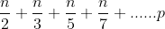
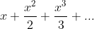
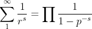
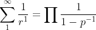
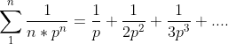
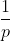

# 厄拉多塞筛的时间复杂度如何是 n*log(log(n))？

> 原文:[https://www . geeksforgeeks . org/exhaust-is-nloglogn/](https://www.geeksforgeeks.org/how-is-the-time-complexity-of-sieve-of-eratosthenes-is-nloglogn/)

**先决条件:** [筛厄拉多塞](https://www.geeksforgeeks.org/sieve-of-eratosthenes/)

**什么是厄拉多塞算法的[筛？](https://www.geeksforgeeks.org/sieve-of-eratosthenes/)**
为了分析一下，我们取一个数字 **n** ，任务是打印小于 n 的素数，所以根据厄拉多塞筛的定义，对于每个素数，都要检查素数的倍数，并标记为复合。这个过程一直持续到最高质数的值 **p** 小于 **n** 。

**了解厄拉多塞的[筛的 n*log(log n)时间复杂度](https://www.geeksforgeeks.org/sieve-of-eratosthenes/)**

1.  If it is assumed that the time taken to mark a number as composite is constant, then the number of times the loop runs is equal to:

    

2.  从上式中取 n 个公，上式可改写为:
    [")](https://www.codecogs.com/eqnedit.php?latex=n*(\frac{1}{2}&space;+&space;\frac{1}{3}&space;+&space;\frac{1}{5}&space;+&space;\frac{1}{7}&space;+&space;......&space;p))
3.  It can be proved as below with the help of **Harmonic Progression of the sum of primes**:
    [)")](https://www.codecogs.com/eqnedit.php?latex=\frac{1}{2}&space;+&space;\frac{1}{3}&space;+&space;\frac{1}{5}&space;+&space;\frac{1}{7}&space;+&space;.....&space;=&space;log(log(n)))

    **素数和的调和级数证明:**
    为了理解证明，前提是[调和级数](https://www.geeksforgeeks.org/program-to-find-sum-of-harmonic-series/)和**泰勒级数展开**。

    *   让我们举一个等式:
        [")](https://www.codecogs.com/eqnedit.php?latex=log(\frac{1}{1-x}))
    *   上述方程的泰勒级数展开式由下式给出:
        
    *   Putting **x = 1** in the above equation, we get the relation:

        [")](https://www.codecogs.com/eqnedit.php?latex=\sum_{1}^{n}&space;\frac{1}{r}&space;=&space;log(n&space;))

        让我们把上面的等式标记为 **1** 。

    *   From [Euler’s product formula](https://en.wikipedia.org/wiki/Euler_product),

        

    *   On substituting **s = 1** in the above equation, we get

        

    *   将**原木**应用于两侧:
        ul
        [T5](https://www.codecogs.com/eqnedit.php?latex=log(\sum_{1}^\infty&space;{\frac{1}{r^{1}}})&space;=&space;log(\prod&space;\frac{1}{1&space;-&space;p^{-1}}))
    *   On **simplifying** the above equation, it becomes:

        [ = \sum log( \frac{1}{1 - p^{-1}})")](https://www.codecogs.com/eqnedit.php?latex=log(\sum_{1}^\infty&space;{\frac{1}{r^{1}}})&space;=&space;\sum&space;log(&space;\frac{1}{1&space;-&space;p^{-1}}))

    *   在上式中， **1 > p -1 > -1**
    *   因此，我们可以对上述方程的右侧使用泰勒级数展开。
        [ = \sum_{1}^{\infty} \frac{1}{n*p^{n}}")](https://www.codecogs.com/eqnedit.php?latex=log(\frac{1}{1-x})&space;=&space;\sum_{1}^{\infty}&space;\frac{1}{n*p^{n}})
    *   On substituting this in the above equation, we get:

        [ = \sum \sum_{1}^{n} \frac{1}{n*p^{n}}")](https://www.codecogs.com/eqnedit.php?latex=log(\sum_{1}^{n}\frac{1}{r})&space;=&space;\sum&space;\sum_{1}^{n}&space;\frac{1}{n*p^{n}})

        其中 p 是素数。

    *   On expanding the inner summation;

        

    *   以上级数是收敛的。所以，以上级数可以近似为:
        
    *   Therefore, on substituting and rewriting the equation; we get

        [ = \sum \frac{1}{p}")](https://www.codecogs.com/eqnedit.php?latex=log(\sum_{1}^{\infty&space;}\frac{1}{n})&space;=&space;\sum&space;\frac{1}{p})

        其中 p 是质数。

    *   **从初始方程 **1** 中，我们最终可以得出:
        [)")](https://www.codecogs.com/eqnedit.php?latex=\sum&space;\frac{1}{p}&space;=&space;log(log(n))) 
        其中 p 为素数之和。**
4.  在等式中代入这个，我们得到时间复杂度为:
    [)))")](https://www.codecogs.com/eqnedit.php?latex=O(n*(log(log(n)))))

**因此厄拉多塞筛的时间复杂度为 n*log(log(n))**

**参考:** [素数倒数之和的散度](https://en.wikipedia.org/wiki/Divergence_of_the_sum_of_the_reciprocals_of_the_primes#Proof_that_the_series_exhibits_log-log_growth)