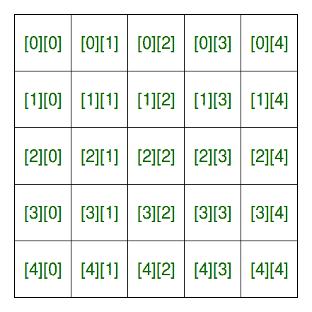
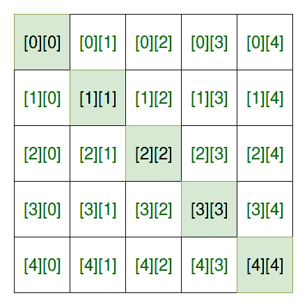
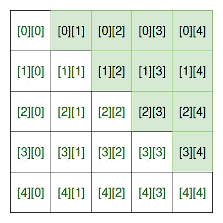
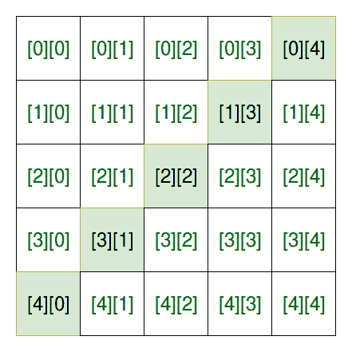
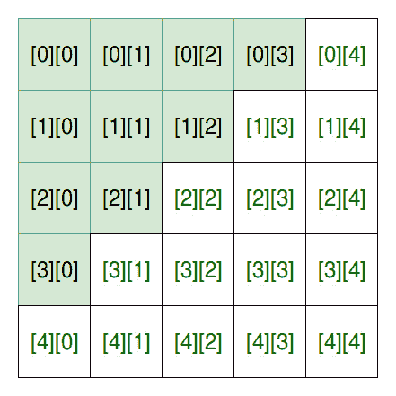

# 如何访问正方形矩阵的元素

> 原文:[https://www . geeksforgeeks . org/如何访问方阵元素/](https://www.geeksforgeeks.org/how-to-access-elements-of-a-square-matrix/)

方形矩阵是包含行和列形式的元素的矩阵。下面是一个 5×5 矩阵的例子。



一个 5×5 的正方形矩阵

访问矩阵的方法是:**矩阵名称[行索引][列索引]**
以下是访问不同形式的方形矩阵的各种方法:

**1。主对角线上的元素**:



**进场:**

```
row_index == column_index
```

## C++

```
// C++ Program to read a square matrix
// and print the main diagonal elements
#include <iostream>
using namespace std;

int main()
{

    int matrix[5][5], row_index, column_index, x = 0, size = 5;

    // Get the square matrix
    for (row_index = 0; row_index < size; row_index++) {
        for (column_index = 0; column_index < size; column_index++) {

            matrix[row_index][column_index] = ++x;
        }
    }

    // Display the matrix
    cout << "The matrix is" << endl;
    for (row_index = 0; row_index < size; row_index++) {
        for (column_index = 0; column_index < size; column_index++) {

            cout << matrix[row_index][column_index] << " ";
        }

        cout << endl;
    }

    // Print the main diagonal elements
    cout << "\nMain diagonal elements are:\n";

    for (row_index = 0; row_index < size; row_index++) {
        for (column_index = 0; column_index < size; column_index++) {

            // check for main diagonal elements
            if (row_index == column_index)
                cout << matrix[row_index][column_index] << ", ";
        }
    }

    return 0;
}

// This code is contributed by SHUBHAMSINGH10
```

## C

```
// C Program to read a square matrix
// and print the main diagonal elements

#include <stdio.h>

int main()
{

    int matrix[5][5], row_index, column_index, x = 0, size = 5;

    // Get the square matrix
    for (row_index = 0; row_index < size; row_index++) {
        for (column_index = 0; column_index < size; column_index++) {

            matrix[row_index][column_index] = ++x;
        }
    }

    // Display the matrix
    printf("The matrix is\n");
    for (row_index = 0; row_index < size; row_index++) {
        for (column_index = 0; column_index < size; column_index++) {

            printf("%d\t", matrix[row_index][column_index]);
        }

        printf("\n");
    }

    // Print the main diagonal elements
    printf("\nMain diagonal elements are:\n");

    for (row_index = 0; row_index < size; row_index++) {
        for (column_index = 0; column_index < size; column_index++) {

            // check for main diagonal elements
            if (row_index == column_index)
                printf("%d, ", matrix[row_index][column_index]);
        }
    }

    return 0;
}
```

## Java 语言(一种计算机语言，尤用于创建网站)

```
// Java Program to read a square matrix
// and print the main diagonal elements
class GFG
{

    public static void main(String[] args)
    {

        int matrix[][] = new int[5][5], row_index,
                    column_index, x = 0, size = 5;

        // Get the square matrix
        for (row_index = 0; row_index < size; row_index++)
        {
            for (column_index = 0; column_index < size; column_index++)
            {

                matrix[row_index][column_index] = ++x;
            }
        }

        // Display the matrix
        System.out.printf("The matrix is\n");
        for (row_index = 0; row_index < size; row_index++)
        {
            for (column_index = 0; column_index < size; column_index++)
            {

                System.out.printf("%d\t", matrix[row_index][column_index]);
            }

            System.out.printf("\n");
        }

        // Print the main diagonal elements
        System.out.printf("\nMain diagonal elements are:\n");

        for (row_index = 0; row_index < size; row_index++)
        {
            for (column_index = 0; column_index < size; column_index++)
            {

                // check for main diagonal elements
                if (row_index == column_index)
                {
                    System.out.printf("%d, ", matrix[row_index][column_index]);
                }
            }
        }

    }
}

// This code is contributed by 29AjayKumar
```

## 蟒蛇 3

```
# Python Program to read a square matrix
# and print the main diagonal elements

if __name__ == '__main__':

    matrix = [[0 for i in range(5)] for j in range(5)]
    x, size = 0, 5;

    # Get the square matrix
    for row_index in range(size):
        for column_index in range(size):
            x += 1;
            matrix[row_index][column_index] = x;

    # Display the matrix
    print("The matrix is");
    for row_index in range(size):
        for column_index in range(size):
            print( matrix[row_index][column_index],end = "\t");

        print("");

    # Print the main diagonal elements
    print("\nMain diagonal elements are:");

    for row_index in range(size):
        for column_index in range(size):

            # check for main diagonal elements
            if (row_index == column_index):
                print(matrix[row_index][column_index], end="\t");

# This code is contributed by 29AjayKumar
```

## C#

```
//C# Program to read a square matrix
// and print the main diagonal elements
using System;
public class GFG{

    public static void Main() {

        int [,]matrix = new int[5,5];
        int row_index, column_index, x = 0, size = 5;

        // Get the square matrix
        for (row_index = 0; row_index < size; row_index++) {
            for (column_index = 0; column_index < size; column_index++) {

                matrix[row_index,column_index] = ++x;
            }
        }

        // Display the matrix
        Console.WriteLine("The matrix is");
        for (row_index = 0; row_index < size; row_index++) {
            for (column_index = 0; column_index < size; column_index++) {

                Console.Write(matrix[row_index,column_index]+"\t");
            }

            Console.WriteLine();
        }

        // Print the main diagonal elements
        Console.Write("\nMain diagonal elements are:\n");

        for (row_index = 0; row_index < size; row_index++) {
            for (column_index = 0; column_index < size; column_index++) {

                // check for main diagonal elements
                if (row_index == column_index) {
                    Console.Write(matrix[row_index,column_index]+",");
                }
            }
        }

    }
}

// This code is contributed by 29AjayKumar
```

## java 描述语言

```
<script>
// Javascript Program to read a square matrix
// and print the main diagonal elements

    let matrix = new Array(5), row_index,
                    column_index, x = 0, size = 5;

        // Get the square matrix
        for (row_index = 0; row_index < size; row_index++)
        {
            matrix[row_index]=new Array(5);
            for (column_index = 0; column_index < size;
                 column_index++)
            {

                matrix[row_index][column_index] = ++x;
            }
        }

        // Display the matrix
        document.write("The matrix is<br>");
        for (row_index = 0; row_index < size; row_index++)
        {
            for (column_index = 0; column_index < size; column_index++)
            {

                document.write( matrix[row_index][column_index]+
                               "   ");
            }

            document.write("<br>");
        }

        // Print the main diagonal elements
        document.write("<br>Main diagonal elements are:<br>");

        for (row_index = 0; row_index < size; row_index++)
        {
            for (column_index = 0; column_index < size; column_index++)
            {

                // check for main diagonal elements
                if (row_index == column_index)
                {
                    document.write( matrix[row_index][column_index]
                                   +", ");
                }
            }
        }

// This code is contributed by rag2127
</script>
```

**Output:** 

```
The matrix is
1    2    3    4    5    
6    7    8    9    10    
11    12    13    14    15    
16    17    18    19    20    
21    22    23    24    25    

Main diagonal elements are:
1, 7, 13, 19, 25, 
```

**2。主对角线上方的元素** :



**进场:**

```
row_index < column_index
```

## C++

```
// C++ Program to read a square matrix
// and print the elements above main diagonal

#include <iostream>
using namespace std;

int main()
{

    int matrix[5][5], row_index, column_index, x = 0, size = 5;

    // Get the square matrix
    for (row_index = 0; row_index < size; row_index++) {
        for (column_index = 0; column_index < size; column_index++) {

            matrix[row_index][column_index] = ++x;
        }
    }

    // Display the matrix
    cout  << "The matrix is\n";
    for (row_index = 0; row_index < size; row_index++) {
        for (column_index = 0; column_index < size; column_index++) {

            cout << matrix[row_index][column_index] << " ";
        }

        cout << endl;
    }

    // Print the elements above main diagonal
    cout<<"\nElements above Main diagonal elements are:\n";

    for (row_index = 0; row_index < size; row_index++) {
        for (column_index = 0; column_index < size; column_index++) {

            // check for elements above main diagonal
            if (row_index < column_index)
            cout << matrix[row_index][column_index] << ", ";

        }
    }

    return 0;
}

//This code is contributed by shubhamsingh10
```

## C

```
// C Program to read a square matrix
// and print the elements above the main diagonal

#include <stdio.h>

int main()
{

    int matrix[5][5], row_index, column_index, x = 0, size = 5;

    // Get the square matrix
    for (row_index = 0; row_index < size; row_index++) {
        for (column_index = 0; column_index < size; column_index++) {

            matrix[row_index][column_index] = ++x;
        }
    }

    // Display the matrix
    printf("The matrix is\n");
    for (row_index = 0; row_index < size; row_index++) {
        for (column_index = 0; column_index < size; column_index++) {

            printf("%d\t", matrix[row_index][column_index]);
        }

        printf("\n");
    }

    // Print the elements above main diagonal
    printf("\nElements above Main diagonal elements are:\n");

    for (row_index = 0; row_index < size; row_index++) {
        for (column_index = 0; column_index < size; column_index++) {

            // check for elements above main diagonal
            if (row_index < column_index)
                printf("%d, ", matrix[row_index][column_index]);
        }
    }

    return 0;
}
```

## Java 语言(一种计算机语言，尤用于创建网站)

```
// Java Program to read a square matrix
// and print the elements above the main diagonal

class GFG {

    public static void main(String args[]) {
        int matrix[][] = new int[5][5], row_index, column_index, x = 0, size = 5;

        // Get the square matrix
        for (row_index = 0; row_index < size; row_index++) {
            for (column_index = 0; column_index < size; column_index++) {

                matrix[row_index][column_index] = ++x;
            }
        }

        // Display the matrix
        System.out.printf("The matrix is\n");
        for (row_index = 0; row_index < size; row_index++) {
            for (column_index = 0; column_index < size; column_index++) {

                System.out.printf("%d\t", matrix[row_index][column_index]);
            }

            System.out.printf("\n");
        }

        // Print the elements above the main diagonal
        System.out.printf("\nElements above Main diagonal elements are:\n");

        for (row_index = 0; row_index < size; row_index++) {
            for (column_index = 0; column_index < size; column_index++) {

                // check for elements above main diagonal
                if (row_index < column_index) {
                    System.out.printf("%d, ", matrix[row_index][column_index]);
                }
            }
        }
    }

}
// This code is contributed by PrinciRaj19992
```

## 蟒蛇 3

```
# Python3 Program to read a square matrix
# and print the elements above main diagonal
if __name__ == '__main__':
    matrix = [[0 for i in range(5)] for j in range(5)];
    row_index, column_index, x, size = 0, 0, 0, 5;

    # Get the square matrix
    for row_index in range(size):
        for column_index in range(size):
            x += 1;
            matrix[row_index][column_index] = x;

    # Display the matrix
    print("The matrix is");
    for row_index in range(size):
        for column_index in range(size):
            print( matrix[row_index][column_index], end = "\t");

        print("");

    # Print the elements above main diagonal
    print("\nElements above Main diagonal elements are:");

    for row_index in range(size):
        for column_index in range(size):

            # check for elements above main diagonal
            if (row_index < column_index):
                print(matrix[row_index][column_index], end=" ");

# This code is contributed by 29AjayKumar
```

## C#

```

// C# Program to read a square matrix
// and print the elements above main diagonal
 using System;
public class GFG {

    public static void Main() {
        int [,] matrix= new int[5,5];
        int row_index, column_index, x = 0, size = 5;

        // Get the square matrix
        for (row_index = 0; row_index < size; row_index++) {
            for (column_index = 0; column_index < size; column_index++) {

                matrix[row_index,column_index] = ++x;
            }
        }

        // Display the matrix
        Console.Write("The matrix is\n");
        for (row_index = 0; row_index < size; row_index++) {
            for (column_index = 0; column_index < size; column_index++) {

                Console.Write(matrix[row_index,column_index]+"\t");
            }

            Console.Write("\n");
        }

        // Print the elements above the main diagonal
        Console.Write("\nElements above Main diagonal elements are:\n");

        for (row_index = 0; row_index < size; row_index++) {
            for (column_index = 0; column_index < size; column_index++) {

                // check for elements above main diagonal
                if (row_index < column_index) {
                    Console.Write(matrix[row_index,column_index]+", ");
                }
            }
        }
    }

}
// This code is contributed by PrinciRaj19992
```

## java 描述语言

```
<script>

// JavaScript Program to read a square matrix
// and print the elements above the main diagonal

    let matrix = new Array(5), row_index, column_index,
    x = 0, size = 5;

        // Get the square matrix
        for (row_index = 0; row_index < size; row_index++)
        {
            matrix[row_index]=new Array(5);
            for (column_index = 0; column_index < size;
            column_index++)
            {

                matrix[row_index][column_index] = ++x;
            }
        }

        // Display the matrix
        document.write("The matrix is<br>");
        for (row_index = 0; row_index < size; row_index++)
        {
            for (column_index = 0; column_index < size;
            column_index++)
            {

                document.write( matrix[row_index]
                [column_index]+"   ");
            }

            document.write("<br>");
        }

        // Print the elements above the main diagonal
        document.write(
        "<br>Elements above Main diagonal elements are:<br>"
        );

        for (row_index = 0; row_index < size; row_index++)
        {
            for (column_index = 0; column_index < size;
            column_index++)
            {

                // check for elements above main diagonal
                if (row_index < column_index) {
                    document.write( matrix[row_index]
                    [column_index]+ ", ");
                }
            }
        }

// This code is contributed by avanitrachhadiya2155

</script>
```

**Output:** 

```
The matrix is
1    2    3    4    5    
6    7    8    9    10    
11    12    13    14    15    
16    17    18    19    20    
21    22    23    24    25    

Elements above Main diagonal elements are:
2, 3, 4, 5, 8, 9, 10, 14, 15, 20,
```

**3。主对角线下方的元素** :


**进场:**

```
row_index > column_index
```

## C++

```
// C++ Program to read a square matrix
// and print the elements below main diagonal

#include <iostream>
using namespace std;

int main()
{

    int matrix[5][5], row_index, column_index, x = 0, size = 5;

    // Get the square matrix
    for (row_index = 0; row_index < size; row_index++) {
        for (column_index = 0; column_index < size; column_index++) {

            matrix[row_index][column_index] = ++x;
        }
    }

    // Display the matrix
    cout << "The matrix is\n";
    for (row_index = 0; row_index < size; row_index++) {
        for (column_index = 0; column_index < size; column_index++) {

            cout << matrix[row_index][column_index] <<"  ";
        }

        cout << endl;
    }

    // Print the elements below main diagonal
    cout << "\nElements below Main diagonal elements are:\n";

    for (row_index = 0; row_index < size; row_index++) {
        for (column_index = 0; column_index < size; column_index++) {

            // check for elements below main diagonal
            if (row_index > column_index)
                cout << matrix[row_index][column_index]<< ", ";
        }
    }

    return 0;
}

//This code is contributed by shubhamsingh10
```

## C

```
// C Program to read a square matrix
// and print the elements below the main diagonal

#include <stdio.h>

int main()
{

    int matrix[5][5], row_index, column_index, x = 0, size = 5;

    // Get the square matrix
    for (row_index = 0; row_index < size; row_index++) {
        for (column_index = 0; column_index < size; column_index++) {

            matrix[row_index][column_index] = ++x;
        }
    }

    // Display the matrix
    printf("The matrix is\n");
    for (row_index = 0; row_index < size; row_index++) {
        for (column_index = 0; column_index < size; column_index++) {

            printf("%d\t", matrix[row_index][column_index]);
        }

        printf("\n");
    }

    // Print the elements below main diagonal
    printf("\nElements below Main diagonal elements are:\n");

    for (row_index = 0; row_index < size; row_index++) {
        for (column_index = 0; column_index < size; column_index++) {

            // check for elements below main diagonal
            if (row_index > column_index)
                printf("%d, ", matrix[row_index][column_index]);
        }
    }

    return 0;
}
```

## Java 语言(一种计算机语言，尤用于创建网站)

```
class GFG {

// Java Program to read a square matrix
// and print the elements below the main diagonal
    public static void main(String[] args) {

        int matrix[][] = new int[5][5], row_index, column_index, x = 0, size = 5;

        // Get the square matrix
        for (row_index = 0; row_index < size; row_index++) {
            for (column_index = 0; column_index < size; column_index++) {

                matrix[row_index][column_index] = ++x;
            }
        }

        // Display the matrix
        System.out.printf("The matrix is\n");
        for (row_index = 0; row_index < size; row_index++) {
            for (column_index = 0; column_index < size; column_index++) {

                System.out.printf("%d\t", matrix[row_index][column_index]);
            }

            System.out.printf("\n");
        }

        // Print the elements below main diagonal
        System.out.printf("\nElements below Main diagonal elements are:\n");

        for (row_index = 0; row_index < size; row_index++) {
            for (column_index = 0; column_index < size; column_index++) {

                // check for elements below main diagonal
                if (row_index > column_index) {
                    System.out.printf("%d, ", matrix[row_index][column_index]);
                }
            }
        }
    }

}
// This code is contributed by PrinciRaj1992
```

## 蟒蛇 3

```
# python Program to read a square matrix
# and print the elements below main diagonal

if __name__ == "__main__":

    matrix = [[0 for x in range(5)]for y in range(5)]
    x = 0
    size = 5

    # Get the square matrix
    for row_index in range(0, size):
        for column_index in range(0, size):
            x += 1
            matrix[row_index][column_index] = x

    # Display the matrix
    print("The matrix is")
    for row_index in range(0, size):
        for column_index in range(0, size):

            print(matrix[row_index][column_index], end="  ")

        print()
    # Print the elements below main diagonal
    print()
    print("Elements below Main diagonal elements are:")

    for row_index in range(0, size):
        for column_index in range(0, size):

            # check for elements below main diagonal
            if (row_index > column_index):
                print(matrix[row_index][column_index], end=", ")
```

## C#

```
// C# program of above approach
using System;
public class GFG {

// Java Program to read a square matrix
// and print the elements below main diagonal
    public static void Main() {

        int [,]matrix = new int[5,5]; int row_index, column_index, x = 0, size = 5;

        // Get the square matrix
        for (row_index = 0; row_index < size; row_index++) {
            for (column_index = 0; column_index < size; column_index++) {

                matrix[row_index,column_index] = ++x;
            }
        }

        // Display the matrix
        Console.Write("The matrix is\n");
        for (row_index = 0; row_index < size; row_index++) {
            for (column_index = 0; column_index < size; column_index++) {

                Console.Write("{0}\t", matrix[row_index,column_index]);
            }

            Console.Write("\n");
        }

        // Print the elements below main diagonal
        Console.Write("\nElements below Main diagonal elements are:\n");

        for (row_index = 0; row_index < size; row_index++) {
            for (column_index = 0; column_index < size; column_index++) {

                // check for elements below main diagonal
                if (row_index > column_index) {
                    Console.Write("{0}, ", matrix[row_index,column_index]);
                }
            }
        }
    }

}
// This code is contributed by Rajput-Ji
```

## java 描述语言

```
<script>
// Javascript Program to read a square matrix
// and print the elements below the main diagonal

    let matrix = new Array(5);
    for(let i = 0; i < 5; i++)
    {
        matrix[i] = new Array(5);
        for(let j = 0; j < 5; j++)
        {
            matrix[i][j] = 0;
        }
    }

    let row_index, column_index, x = 0, size = 5;
    // Get the square matrix
        for (row_index = 0; row_index < size; row_index++) {
            for (column_index = 0; column_index < size; column_index++) {

                matrix[row_index][column_index] = ++x;
            }
        }

    // Display the matrix
    document.write("The matrix is<br>");
    for (row_index = 0; row_index < size; row_index++) {
            for (column_index = 0; column_index < size; column_index++) {

                document.write( matrix[row_index][column_index]+"   ");
            }

            document.write("<br>");
        }

        // Print the elements below main diagonal
        document.write("<br>Elements below Main diagonal elements are:<br>");

        for (row_index = 0; row_index < size; row_index++) {
            for (column_index = 0; column_index < size; column_index++) {

                // check for elements below main diagonal
                if (row_index > column_index) {
                    document.write( matrix[row_index][column_index]+", ");
                }
            }
        }

// This code is contributed by patel2127
</script>
```

**Output:** 

```
The matrix is
1    2    3    4    5    
6    7    8    9    10    
11    12    13    14    15    
16    17    18    19    20    
21    22    23    24    25    

Elements below Main diagonal elements are:
6, 11, 12, 16, 17, 18, 21, 22, 23, 24,
```

**4。次对角线上的元素** :



**进场:**

```
(row_index + column_index) == size-1
```

## C++

```
// C++ Program to read a square matrix
// and print the elements on secondary diagonal

#include <bits/stdc++.h>
using namespace std;

int main()
{

    int matrix[5][5], row_index, column_index, x = 0, size = 5;

    // Get the square matrix
    for (row_index = 0; row_index < size; row_index++) {
        for (column_index = 0; column_index < size; column_index++) {

            matrix[row_index][column_index] = ++x;
        }
    }

    // Display the matrix
    cout << "The matrix is\n";
    for (row_index = 0; row_index < size; row_index++) {
        for (column_index = 0; column_index < size; column_index++) {

            cout <<  matrix[row_index][column_index] << " ";
        }

        cout << endl;
    }

    // Print the elements on secondary diagonal
    cout << "\nElements on Secondary diagonal:\n";

    for (row_index = 0; row_index < size; row_index++) {
        for (column_index = 0; column_index < size; column_index++) {

            // check for elements on secondary diagonal
            if ((row_index + column_index) == size - 1)
                cout << matrix[row_index][column_index]<< ", ";
        }
    }

    return 0;
}

//This code is contributed by shubhamsingh10
```

## C

```
// C Program to read a square matrix
// and print the elements on secondary diagonal

#include <stdio.h>

int main()
{

    int matrix[5][5], row_index, column_index, x = 0, size = 5;

    // Get the square matrix
    for (row_index = 0; row_index < size; row_index++) {
        for (column_index = 0; column_index < size; column_index++) {

            matrix[row_index][column_index] = ++x;
        }
    }

    // Display the matrix
    printf("The matrix is\n");
    for (row_index = 0; row_index < size; row_index++) {
        for (column_index = 0; column_index < size; column_index++) {

            printf("%d\t", matrix[row_index][column_index]);
        }

        printf("\n");
    }

    // Print the elements on secondary diagonal
    printf("\nElements on Secondary diagonal:\n");

    for (row_index = 0; row_index < size; row_index++) {
        for (column_index = 0; column_index < size; column_index++) {

            // check for elements on secondary    diagonal
            if ((row_index + column_index) == size - 1)
                printf("%d, ", matrix[row_index][column_index]);
        }
    }

    return 0;
}
```

## Java 语言(一种计算机语言，尤用于创建网站)

```
// Java  Program to read a square matrix
// and print the elements on secondary diagonal

import java.io.*;

class GFG {
    public static void main (String[] args) {

    int matrix[][]=new int[5][5], row_index, column_index, x = 0, size = 5;

    // Get the square matrix
    for (row_index = 0; row_index < size; row_index++) {
        for (column_index = 0; column_index < size; column_index++) {

            matrix[row_index][column_index] = ++x;
        }
    }

    // Display the matrix
        System.out.printf("The matrix is\n");
    for (row_index = 0; row_index < size; row_index++) {
        for (column_index = 0; column_index < size; column_index++) {

                System.out.printf("%d\t", matrix[row_index][column_index]);
        }

        System.out.printf("\n");
    }

    // Print the elements on secondary diagonal
        System.out.printf("\nElements on Secondary diagonal:\n");

    for (row_index = 0; row_index < size; row_index++) {
        for (column_index = 0; column_index < size; column_index++) {

            // check for elements on secondary diagonal
            if ((row_index + column_index) == size - 1)
                    System.out.printf("%d, ", matrix[row_index][column_index]);
        }
    }
    }
}
//This code is contributed by ajit.
```

## C#

```
// C# Program to read a square matrix
// and print the elements on secondary diagonal
using System;

class GFG
{
public static void Main (String[] args)
{
    int [,]matrix = new int[5, 5];
    int row_index, column_index, x = 0, size = 5;

    // Get the square matrix
    for (row_index = 0;
         row_index < size; row_index++)
    {
        for (column_index = 0;
             column_index < size; column_index++)
        {
            matrix[row_index, column_index] = ++x;
        }
    }

    // Display the matrix
    Console.Write("The matrix is\n");

    for (row_index = 0;
         row_index < size; row_index++)
    {
        for (column_index = 0;
             column_index < size; column_index++)
        {
            Console.Write("{0}\t", matrix[row_index,
                                          column_index]);
        }
        Console.Write("\n");
    }

    // Print the elements on secondary diagonal
    Console.Write("\nElements on Secondary diagonal:\n");

    for (row_index = 0;
         row_index < size; row_index++)
    {
        for (column_index = 0;
             column_index < size; column_index++)
        {

            // check for elements on secondary diagonal
            if ((row_index + column_index) == size - 1)
                    Console.Write("{0}, ", matrix[row_index,
                                                  column_index]);
        }
    }
    }
}

// This code is contributed by 29AjayKumar
```

## java 描述语言

```
<script>

// Javascript  Program to read a square matrix
// and print the elements on secondary diagonal
let matrix = new Array(5);
for(let i = 0; i < 5; i++)
{
    matrix[i] = new Array(5);
    for(let j = 0; j < 5; j++)
    {
        matrix[i][j] = 0;
    }
}

let row_index, column_index, x = 0, size = 5;

// Get the square matrix
for(row_index = 0;
    row_index < size;
    row_index++)
{
    for(column_index = 0;
        column_index < size;
        column_index++)
    {

        matrix[row_index][column_index] = ++x;
    }
}

// Display the matrix
document.write("The matrix is<br>");
for(row_index = 0;
    row_index < size;
    row_index++)
{
    for(column_index = 0;
        column_index < size;
        column_index++)
    {
        document.write(matrix[row_index][column_index] +
                      "  ");
    }
    document.write("<br>");
}

// Print the elements on secondary diagonal
document.write("<br>Elements on Secondary diagonal:<br>");

for(row_index = 0; row_index < size; row_index++)
{
    for(column_index = 0;
        column_index < size;
        column_index++)
    {

        // Check for elements on secondary diagonal
        if ((row_index + column_index) == size - 1)
                document.write(
                    matrix[row_index][column_index] + ", ");
    }
}

// This code is contributed by unknown2108

</script>
```

**Output:** 

```
The matrix is
1    2    3    4    5    
6    7    8    9    10    
11    12    13    14    15    
16    17    18    19    20    
21    22    23    24    25    

Elements on Secondary diagonal:
5, 9, 13, 17, 21,
```

**5。第二对角线上方元素的地址** :



**进场:**

```
(row_index + column_index) < size-1
```

## C++

```
// C++ Program to read a square matrix
// and print the elements above secondary diagonal

#include <bits/stdc++.h>
using namespace std;

int main()
{

    int matrix[5][5], row_index, column_index, x = 0, size = 5;

    // Get the square matrix
    for (row_index = 0; row_index < size; row_index++) {
        for (column_index = 0; column_index < size; column_index++) {

            matrix[row_index][column_index] = ++x;
        }
    }

    // Display the matrix
    cout << "The matrix is\n";
    for (row_index = 0; row_index < size; row_index++) {
        for (column_index = 0; column_index < size; column_index++) {

            cout << matrix[row_index][column_index] << " ";
        }

        cout << endl;
    }

    // Print the elements above secondary diagonal
    cout << "\nElements above Secondary diagonal are:\n";

    for (row_index = 0; row_index < size; row_index++) {
        for (column_index = 0; column_index < size; column_index++) {

            // check for elements above secondary diagonal
            if ((row_index + column_index) < size - 1)
                cout << matrix[row_index][column_index]<< ", ";
        }
    }

    return 0;
}

// This code is contributed by shivanisinghss2110
```

## C

```
// C Program to read a square matrix
// and print the elements above secondary diagonal

#include <stdio.h>

int main()
{

    int matrix[5][5], row_index, column_index, x = 0, size = 5;

    // Get the square matrix
    for (row_index = 0; row_index < size; row_index++) {
        for (column_index = 0; column_index < size; column_index++) {

            matrix[row_index][column_index] = ++x;
        }
    }

    // Display the matrix
    printf("The matrix is\n");
    for (row_index = 0; row_index < size; row_index++) {
        for (column_index = 0; column_index < size; column_index++) {

            printf("%d\t", matrix[row_index][column_index]);
        }

        printf("\n");
    }

    // Print the elements above secondary diagonal
    printf("\nElements above Secondary diagonal are:\n");

    for (row_index = 0; row_index < size; row_index++) {
        for (column_index = 0; column_index < size; column_index++) {

            // check for elements above secondary diagonal
            if ((row_index + column_index) < size - 1)
                printf("%d, ", matrix[row_index][column_index]);
        }
    }

    return 0;
}
```

## Java 语言(一种计算机语言，尤用于创建网站)

```
// Java Program to read a square matrix
// and print the elements above secondary diagonal
class GFG
{
    public static void main(String[] args)
    {
        int[][] matrix = new int[5][5];
        int row_index, column_index, x = 0, size = 5;

        // Get the square matrix
        for (row_index = 0;
             row_index < size; row_index++)
        {
            for (column_index = 0;
                 column_index < size; column_index++)
            {
                matrix[row_index][column_index] = ++x;
            }
        }

        // Display the matrix
        System.out.printf("The matrix is\n");
        for (row_index = 0;
             row_index < size; row_index++)
        {
            for (column_index = 0;
                 column_index < size; column_index++)
            {
                System.out.printf("%d\t",
                           matrix[row_index][column_index]);
            }

            System.out.printf("\n");
        }

        // Print the elements above secondary diagonal
        System.out.printf("\nElements above Secondary" +
                                    " diagonal are:\n");

        for (row_index = 0; row_index < size; row_index++)
        {
            for (column_index = 0;
                 column_index < size; column_index++)
            {

                // check for elements above secondary diagonal
                if ((row_index + column_index) < size - 1)
                    System.out.printf("%d, ",
                               matrix[row_index][column_index]);
            }
        }

    }
}

// This code is contributed by Rajput-Ji
```

## 蟒蛇 3

```
# Python3 Program to read a square matrix
# and print the elements above secondary diagonal

if __name__ == '__main__':
    matrix = [[0 for i in range(5)] for j in range(5)];
    row_index, column_index, x, size = 0, 0, 0, 5;

    # Get the square matrix
    for row_index in range(size):
        for column_index in range(size):
            x += 1;
            matrix[row_index][column_index] += x;

    # Display the matrix
    print("The matrix is");
    for row_index in range(size):
        for column_index in range(size):
            print( matrix[row_index][column_index], end = "\t");
        print("");

    # Print the elements above secondary diagonal
    print("\nElements above Secondary diagonal are:");

    for row_index in range(size):
        for column_index in range(size):

            # check for elements above secondary diagonal
            if ((row_index + column_index) < size - 1):
                print(matrix[row_index][column_index], end=" ");

# This code is contributed by 29AjayKumar
```

## C#

```
// C# Program to read a square matrix
// and print the elements above
// secondary diagonal
using System;

class GFG
{
    public static void Main(String[] args)
    {
        int[,] matrix = new int[5, 5];
        int row_index, column_index,
                    x = 0, size = 5;

        // Get the square matrix
        for (row_index = 0;
              row_index < size; row_index++)
        {
            for (column_index = 0;
                 column_index < size;
                 column_index++)
            {
                matrix[row_index,
                       column_index] = ++x;
            }
        }

        // Display the matrix
        Console.Write("The matrix is\n");
        for (row_index = 0;
            row_index < size; row_index++)
        {
            for (column_index = 0;
                 column_index < size;
                 column_index++)
            {
                Console.Write("{0}\t",
                        matrix[row_index,
                               column_index]);
            }
            Console.Write("\n");
        }

        // Print the elements above
        // secondary diagonal
        Console.Write("\nElements above Secondary" +
                                " diagonal are:\n");

        for (row_index = 0;
             row_index < size; row_index++)
        {
            for (column_index = 0;
                 column_index < size; column_index++)
            {

                // check for elements above
                // secondary diagonal
                if ((row_index + column_index) < size - 1)
                    Console.Write("{0}, ",
                            matrix[row_index,
                                   column_index]);
            }
        }

    }
}

// This code is contributed by Rajput-Ji
```

## java 描述语言

```
<script>

// JavaScript Program to read a square matrix
// and print the elements above secondary diagonal

        let matrix = new Array(5);
        for(let i=0;i<5;i++)
        {
            matrix[i]=new Array(5);

        }
        let row_index, column_index, x = 0, size = 5;

        // Get the square matrix
        for (row_index = 0;
             row_index < size; row_index++)
        {
            for (column_index = 0;
                 column_index < size; column_index++)
            {
                matrix[row_index][column_index] = ++x;
            }
        }

        // Display the matrix
        document.write("The matrix is<br>");
        for (row_index = 0;
             row_index < size; row_index++)
        {
            for (column_index = 0;
                 column_index < size; column_index++)
            {
                document.write("   ",
                           matrix[row_index][column_index]);
            }

            document.write("<br>");
        }

        // Print the elements above secondary diagonal
        document.write("<br>Elements above Secondary" +
                                    " diagonal are:<br>");

        for (row_index = 0; row_index < size; row_index++)
        {
            for (column_index = 0;
                 column_index < size; column_index++)
            {

                // check for elements above secondary diagonal
                if ((row_index + column_index) < size - 1)
                 document.write(matrix[row_index][column_index]+", ");
            }
        }

// This code is contributed by ab2127

</script>
```

**Output:** 

```
The matrix is
1    2    3    4    5    
6    7    8    9    10    
11    12    13    14    15    
16    17    18    19    20    
21    22    23    24    25    

Elements above Secondary diagonal are:
1, 2, 3, 4, 6, 7, 8, 11, 12, 16,
```