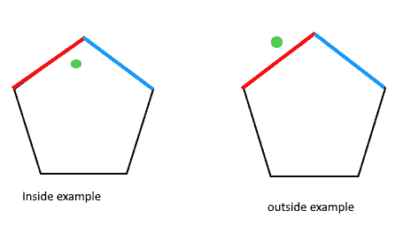
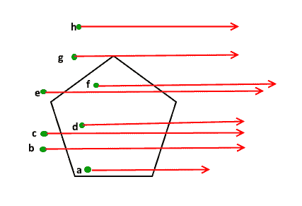

# 如何检查给定点是位于多边形内部还是外部？

> 原文:[https://www . geeksforgeeks . org/如何检查给定点是否位于多边形内/](https://www.geeksforgeeks.org/how-to-check-if-a-given-point-lies-inside-a-polygon/)

给定一个多边形和一个点“p”，找出“p”是否位于多边形内。位于边界上的点被认为是内部的。



我们强烈建议先看看下面的帖子。
[如何检查给定的两条线段是否相交？](https://www.geeksforgeeks.org/check-if-two-given-line-segments-intersect/)

下面是一个检查点是在内部还是外部的简单想法。

```
1) Draw a horizontal line to the right of each point and extend it to infinity

1) Count the number of times the line intersects with polygon edges.

2) A point is inside the polygon if either count of intersections is odd or
   point lies on an edge of polygon.  If none of the conditions is true, then 
   point lies outside.
```



**如何处理上图中的点‘g’？**
请注意，如果点位于给定多边形的一个顶点所在的线上或与其相同，则我们应该返回 true。为了处理这个问题，在检查从“p”到极值的线是否相交之后，我们检查“p”是否与多边形的当前线的顶点共线。如果它是共线的，那么我们检查点“p”是否位于多边形的当前边，如果它位于，我们返回真，否则返回假。

以下是上述想法的实现。

## C++

```
// A C++ program to check if a given point lies inside a given polygon 
// Refer https://www.geeksforgeeks.org/check-if-two-given-line-segments-intersect/ 
// for explanation of functions onSegment(), orientation() and doIntersect() 
#include <iostream> 
using namespace std; 

// Define Infinite (Using INT_MAX caused overflow problems) 
#define INF 10000 

struct Point 
{ 
    int x; 
    int y; 
}; 

// Given three collinear points p, q, r, the function checks if 
// point q lies on line segment 'pr' 
bool onSegment(Point p, Point q, Point r) 
{ 
    if (q.x <= max(p.x, r.x) && q.x >= min(p.x, r.x) && 
            q.y <= max(p.y, r.y) && q.y >= min(p.y, r.y)) 
        return true; 
    return false; 
} 

// To find orientation of ordered triplet (p, q, r). 
// The function returns following values 
// 0 --> p, q and r are collinear 
// 1 --> Clockwise 
// 2 --> Counterclockwise 
int orientation(Point p, Point q, Point r) 
{ 
    int val = (q.y - p.y) * (r.x - q.x) - 
            (q.x - p.x) * (r.y - q.y); 

    if (val == 0) return 0; // collinear 
    return (val > 0)? 1: 2; // clock or counterclock wise 
} 

// The function that returns true if line segment 'p1q1' 
// and 'p2q2' intersect. 
bool doIntersect(Point p1, Point q1, Point p2, Point q2) 
{ 
    // Find the four orientations needed for general and 
    // special cases 
    int o1 = orientation(p1, q1, p2); 
    int o2 = orientation(p1, q1, q2); 
    int o3 = orientation(p2, q2, p1); 
    int o4 = orientation(p2, q2, q1); 

    // General case 
    if (o1 != o2 && o3 != o4) 
        return true; 

    // Special Cases 
    // p1, q1 and p2 are collinear and p2 lies on segment p1q1 
    if (o1 == 0 && onSegment(p1, p2, q1)) return true; 

    // p1, q1 and p2 are collinear and q2 lies on segment p1q1 
    if (o2 == 0 && onSegment(p1, q2, q1)) return true; 

    // p2, q2 and p1 are collinear and p1 lies on segment p2q2 
    if (o3 == 0 && onSegment(p2, p1, q2)) return true; 

    // p2, q2 and q1 are collinear and q1 lies on segment p2q2 
    if (o4 == 0 && onSegment(p2, q1, q2)) return true; 

    return false; // Doesn't fall in any of the above cases 
} 

// Returns true if the point p lies inside the polygon[] with n vertices 
bool isInside(Point polygon[], int n, Point p) 
{ 
    // There must be at least 3 vertices in polygon[] 
    if (n < 3) return false; 

    // Create a point for line segment from p to infinite 
    Point extreme = {INF, p.y}; 

    // Count intersections of the above line with sides of polygon 
    int count = 0, i = 0; 
    do
    { 
        int next = (i+1)%n; 

        // Check if the line segment from 'p' to 'extreme' intersects 
        // with the line segment from 'polygon[i]' to 'polygon[next]' 
        if (doIntersect(polygon[i], polygon[next], p, extreme)) 
        { 
            // If the point 'p' is collinear with line segment 'i-next', 
            // then check if it lies on segment. If it lies, return true, 
            // otherwise false 
            if (orientation(polygon[i], p, polygon[next]) == 0) 
            return onSegment(polygon[i], p, polygon[next]); 

            count++; 
        } 
        i = next; 
    } while (i != 0); 

    // Return true if count is odd, false otherwise 
    return count&1; // Same as (count%2 == 1) 
} 

// Driver program to test above functions 
int main() 
{ 
    Point polygon1[] = {{0, 0}, {10, 0}, {10, 10}, {0, 10}}; 
    int n = sizeof(polygon1)/sizeof(polygon1[0]); 
    Point p = {20, 20}; 
    isInside(polygon1, n, p)? cout << "Yes \n": cout << "No \n"; 

    p = {5, 5}; 
    isInside(polygon1, n, p)? cout << "Yes \n": cout << "No \n"; 

    Point polygon2[] = {{0, 0}, {5, 5}, {5, 0}}; 
    p = {3, 3}; 
    n = sizeof(polygon2)/sizeof(polygon2[0]); 
    isInside(polygon2, n, p)? cout << "Yes \n": cout << "No \n"; 

    p = {5, 1}; 
    isInside(polygon2, n, p)? cout << "Yes \n": cout << "No \n"; 

    p = {8, 1}; 
    isInside(polygon2, n, p)? cout << "Yes \n": cout << "No \n"; 

    Point polygon3[] = {{0, 0}, {10, 0}, {10, 10}, {0, 10}}; 
    p = {-1,10}; 
    n = sizeof(polygon3)/sizeof(polygon3[0]); 
    isInside(polygon3, n, p)? cout << "Yes \n": cout << "No \n"; 

    return 0; 
}
```

## Java 语言(一种计算机语言，尤用于创建网站)

```
// A Java program to check if a given point 
// lies inside a given polygon 
// Refer https://www.geeksforgeeks.org/check-if-two-given-line-segments-intersect/ 
// for explanation of functions onSegment(), 
// orientation() and doIntersect() 
class GFG 
{ 

    // Define Infinite (Using INT_MAX 
    // caused overflow problems) 
    static int INF = 10000; 

    static class Point 
    { 
        int x; 
        int y; 

        public Point(int x, int y) 
        { 
            this.x = x; 
            this.y = y; 
        } 
    }; 

    // Given three collinear points p, q, r, 
    // the function checks if point q lies 
    // on line segment 'pr' 
    static boolean onSegment(Point p, Point q, Point r) 
    { 
        if (q.x <= Math.max(p.x, r.x) && 
            q.x >= Math.min(p.x, r.x) && 
            q.y <= Math.max(p.y, r.y) && 
            q.y >= Math.min(p.y, r.y)) 
        { 
            return true; 
        } 
        return false; 
    } 

    // To find orientation of ordered triplet (p, q, r). 
    // The function returns following values 
    // 0 --> p, q and r are collinear 
    // 1 --> Clockwise 
    // 2 --> Counterclockwise 
    static int orientation(Point p, Point q, Point r) 
    { 
        int val = (q.y - p.y) * (r.x - q.x) 
                - (q.x - p.x) * (r.y - q.y); 

        if (val == 0) 
        { 
            return 0; // collinear 
        } 
        return (val > 0) ? 1 : 2; // clock or counterclock wise 
    } 

    // The function that returns true if 
    // line segment 'p1q1' and 'p2q2' intersect. 
    static boolean doIntersect(Point p1, Point q1, 
                            Point p2, Point q2) 
    { 
        // Find the four orientations needed for 
        // general and special cases 
        int o1 = orientation(p1, q1, p2); 
        int o2 = orientation(p1, q1, q2); 
        int o3 = orientation(p2, q2, p1); 
        int o4 = orientation(p2, q2, q1); 

        // General case 
        if (o1 != o2 && o3 != o4) 
        { 
            return true; 
        } 

        // Special Cases 
        // p1, q1 and p2 are collinear and 
        // p2 lies on segment p1q1 
        if (o1 == 0 && onSegment(p1, p2, q1)) 
        { 
            return true; 
        } 

        // p1, q1 and p2 are collinear and 
        // q2 lies on segment p1q1 
        if (o2 == 0 && onSegment(p1, q2, q1)) 
        { 
            return true; 
        } 

        // p2, q2 and p1 are collinear and 
        // p1 lies on segment p2q2 
        if (o3 == 0 && onSegment(p2, p1, q2)) 
        { 
            return true; 
        } 

        // p2, q2 and q1 are collinear and 
        // q1 lies on segment p2q2 
        if (o4 == 0 && onSegment(p2, q1, q2)) 
        { 
            return true; 
        } 

        // Doesn't fall in any of the above cases 
        return false; 
    } 

    // Returns true if the point p lies 
    // inside the polygon[] with n vertices 
    static boolean isInside(Point polygon[], int n, Point p) 
    { 
        // There must be at least 3 vertices in polygon[] 
        if (n < 3) 
        { 
            return false; 
        } 

        // Create a point for line segment from p to infinite 
        Point extreme = new Point(INF, p.y); 

        // Count intersections of the above line 
        // with sides of polygon 
        int count = 0, i = 0; 
        do
        { 
            int next = (i + 1) % n; 

            // Check if the line segment from 'p' to 
            // 'extreme' intersects with the line 
            // segment from 'polygon[i]' to 'polygon[next]' 
            if (doIntersect(polygon[i], polygon[next], p, extreme)) 
            { 
                // If the point 'p' is collinear with line 
                // segment 'i-next', then check if it lies 
                // on segment. If it lies, return true, otherwise false 
                if (orientation(polygon[i], p, polygon[next]) == 0) 
                { 
                    return onSegment(polygon[i], p, 
                                    polygon[next]); 
                } 

                count++; 
            } 
            i = next; 
        } while (i != 0); 

        // Return true if count is odd, false otherwise 
        return (count % 2 == 1); // Same as (count%2 == 1) 
    } 

    // Driver Code 
    public static void main(String[] args) 
    { 
        Point polygon1[] = {new Point(0, 0), 
                            new Point(10, 0), 
                            new Point(10, 10), 
                            new Point(0, 10)}; 
        int n = polygon1.length; 
        Point p = new Point(20, 20); 
        if (isInside(polygon1, n, p)) 
        { 
            System.out.println("Yes"); 
        } 
        else
        { 
            System.out.println("No"); 
        } 
        p = new Point(5, 5); 
        if (isInside(polygon1, n, p)) 
        { 
            System.out.println("Yes"); 
        } 
        else
        { 
            System.out.println("No"); 
        } 
        Point polygon2[] = {new Point(0, 0), 
            new Point(5, 5), new Point(5, 0)}; 
        p = new Point(3, 3); 
        n = polygon2.length; 
        if (isInside(polygon2, n, p)) 
        { 
            System.out.println("Yes"); 
        } 
        else
        { 
            System.out.println("No"); 
        } 
        p = new Point(5, 1); 
        if (isInside(polygon2, n, p)) 
        { 
            System.out.println("Yes"); 
        } 
        else
        { 
            System.out.println("No"); 
        } 
        p = new Point(8, 1); 
        if (isInside(polygon2, n, p)) 
        { 
            System.out.println("Yes"); 
        } 
        else
        { 
            System.out.println("No"); 
        } 
        Point polygon3[] = {new Point(0, 0), 
                            new Point(10, 0), 
                            new Point(10, 10), 
                            new Point(0, 10)}; 
        p = new Point(-1, 10); 
        n = polygon3.length; 
        if (isInside(polygon3, n, p)) 
        { 
            System.out.println("Yes"); 
        } 
        else
        { 
            System.out.println("No"); 
        } 
    } 
} 

// This code is contributed by 29AjayKumar 
```

## 蟒蛇 3

```
# A Python3 program to check if a given point  
# lies inside a given polygon 
# Refer https://www.geeksforgeeks.org/check-if-two-given-line-segments-intersect/ 
# for explanation of functions onSegment(), 
# orientation() and doIntersect()  

# Define Infinite (Using INT_MAX  
# caused overflow problems)
INT_MAX = 10000

# Given three collinear points p, q, r,  
# the function checks if point q lies 
# on line segment 'pr' 
def onSegment(p:tuple, q:tuple, r:tuple) -> bool:

    if ((q[0] <= max(p[0], r[0])) &
        (q[0] >= min(p[0], r[0])) &
        (q[1] <= max(p[1], r[1])) &
        (q[1] >= min(p[1], r[1]))):
        return True

    return False

# To find orientation of ordered triplet (p, q, r). 
# The function returns following values 
# 0 --> p, q and r are collinear 
# 1 --> Clockwise 
# 2 --> Counterclockwise 
def orientation(p:tuple, q:tuple, r:tuple) -> int:

    val = (((q[1] - p[1]) * 
            (r[0] - q[0])) - 
           ((q[0] - p[0]) * 
            (r[1] - q[1])))

    if val == 0:
        return 0
    if val > 0:
        return 1 # Collinear
    else:
        return 2 # Clock or counterclock

def doIntersect(p1, q1, p2, q2):

    # Find the four orientations needed for  
    # general and special cases 
    o1 = orientation(p1, q1, p2)
    o2 = orientation(p1, q1, q2)
    o3 = orientation(p2, q2, p1)
    o4 = orientation(p2, q2, q1)

    # General case
    if (o1 != o2) and (o3 != o4):
        return True

    # Special Cases 
    # p1, q1 and p2 are collinear and 
    # p2 lies on segment p1q1 
    if (o1 == 0) and (onSegment(p1, p2, q1)):
        return True

    # p1, q1 and p2 are collinear and 
    # q2 lies on segment p1q1 
    if (o2 == 0) and (onSegment(p1, q2, q1)):
        return True

    # p2, q2 and p1 are collinear and 
    # p1 lies on segment p2q2 
    if (o3 == 0) and (onSegment(p2, p1, q2)):
        return True

    # p2, q2 and q1 are collinear and 
    # q1 lies on segment p2q2 
    if (o4 == 0) and (onSegment(p2, q1, q2)):
        return True

    return False

# Returns true if the point p lies  
# inside the polygon[] with n vertices 
def is_inside_polygon(points:list, p:tuple) -> bool:

    n = len(points)

    # There must be at least 3 vertices
    # in polygon
    if n < 3:
        return False

    # Create a point for line segment
    # from p to infinite
    extreme = (INT_MAX, p[1])
    count = i = 0

    while True:
        next = (i + 1) % n

        # Check if the line segment from 'p' to  
        # 'extreme' intersects with the line  
        # segment from 'polygon[i]' to 'polygon[next]' 
        if (doIntersect(points[i],
                        points[next], 
                        p, extreme)):

            # If the point 'p' is collinear with line  
            # segment 'i-next', then check if it lies  
            # on segment. If it lies, return true, otherwise false 
            if orientation(points[i], p, 
                           points[next]) == 0:
                return onSegment(points[i], p, 
                                 points[next])

            count += 1

        i = next

        if (i == 0):
            break

    # Return true if count is odd, false otherwise 
    return (count % 2 == 1)

# Driver code
if __name__ == '__main__':

    polygon1 = [ (0, 0), (10, 0), (10, 10), (0, 10) ]

    p = (20, 20)
    if (is_inside_polygon(points = polygon1, p = p)):
      print ('Yes')
    else:
      print ('No')

    p = (5, 5)
    if (is_inside_polygon(points = polygon1, p = p)):
      print ('Yes')
    else:
      print ('No')

    polygon2 = [ (0, 0), (5, 0), (5, 5), (3, 3) ]

    p = (3, 3)
    if (is_inside_polygon(points = polygon2, p = p)):
      print ('Yes')
    else:
      print ('No')

    p = (5, 1)
    if (is_inside_polygon(points = polygon2, p = p)):
      print ('Yes')
    else:
      print ('No')

    p = (8, 1)
    if (is_inside_polygon(points = polygon2, p = p)):
      print ('Yes')
    else:
      print ('No')

    polygon3 = [ (0, 0), (10, 0), (10, 10), (0, 10) ] 

    p = (-1, 10)
    if (is_inside_polygon(points = polygon3, p = p)):
      print ('Yes')
    else:
      print ('No')

# This code is contributed by Vikas Chitturi
```

## C#

```
// A C# program to check if a given point 
// lies inside a given polygon 
// Refer https://www.geeksforgeeks.org/check-if-two-given-line-segments-intersect/ 
// for explanation of functions onSegment(), 
// orientation() and doIntersect() 
using System; 

class GFG 
{ 

    // Define Infinite (Using INT_MAX 
    // caused overflow problems) 
    static int INF = 10000; 

    class Point 
    { 
        public int x; 
        public int y; 

        public Point(int x, int y) 
        { 
            this.x = x; 
            this.y = y; 
        } 
    }; 

    // Given three collinear points p, q, r, 
    // the function checks if point q lies 
    // on line segment 'pr' 
    static bool onSegment(Point p, Point q, Point r) 
    { 
        if (q.x <= Math.Max(p.x, r.x) && 
            q.x >= Math.Min(p.x, r.x) && 
            q.y <= Math.Max(p.y, r.y) && 
            q.y >= Math.Min(p.y, r.y)) 
        { 
            return true; 
        } 
        return false; 
    } 

    // To find orientation of ordered triplet (p, q, r). 
    // The function returns following values 
    // 0 --> p, q and r are collinear 
    // 1 --> Clockwise 
    // 2 --> Counterclockwise 
    static int orientation(Point p, Point q, Point r) 
    { 
        int val = (q.y - p.y) * (r.x - q.x) - 
                (q.x - p.x) * (r.y - q.y); 

        if (val == 0) 
        { 
            return 0; // collinear 
        } 
        return (val > 0) ? 1 : 2; // clock or counterclock wise 
    } 

    // The function that returns true if 
    // line segment 'p1q1' and 'p2q2' intersect. 
    static bool doIntersect(Point p1, Point q1, 
                            Point p2, Point q2) 
    { 
        // Find the four orientations needed for 
        // general and special cases 
        int o1 = orientation(p1, q1, p2); 
        int o2 = orientation(p1, q1, q2); 
        int o3 = orientation(p2, q2, p1); 
        int o4 = orientation(p2, q2, q1); 

        // General case 
        if (o1 != o2 && o3 != o4) 
        { 
            return true; 
        } 

        // Special Cases 
        // p1, q1 and p2 are collinear and 
        // p2 lies on segment p1q1 
        if (o1 == 0 && onSegment(p1, p2, q1)) 
        { 
            return true; 
        } 

        // p1, q1 and p2 are collinear and 
        // q2 lies on segment p1q1 
        if (o2 == 0 && onSegment(p1, q2, q1)) 
        { 
            return true; 
        } 

        // p2, q2 and p1 are collinear and 
        // p1 lies on segment p2q2 
        if (o3 == 0 && onSegment(p2, p1, q2)) 
        { 
            return true; 
        } 

        // p2, q2 and q1 are collinear and 
        // q1 lies on segment p2q2 
        if (o4 == 0 && onSegment(p2, q1, q2)) 
        { 
            return true; 
        } 

        // Doesn't fall in any of the above cases 
        return false; 
    } 

    // Returns true if the point p lies 
    // inside the polygon[] with n vertices 
    static bool isInside(Point []polygon, int n, Point p) 
    { 
        // There must be at least 3 vertices in polygon[] 
        if (n < 3) 
        { 
            return false; 
        } 

        // Create a point for line segment from p to infinite 
        Point extreme = new Point(INF, p.y); 

        // Count intersections of the above line 
        // with sides of polygon 
        int count = 0, i = 0; 
        do
        { 
            int next = (i + 1) % n; 

            // Check if the line segment from 'p' to 
            // 'extreme' intersects with the line 
            // segment from 'polygon[i]' to 'polygon[next]' 
            if (doIntersect(polygon[i], 
                            polygon[next], p, extreme)) 
            { 
                // If the point 'p' is collinear with line 
                // segment 'i-next', then check if it lies 
                // on segment. If it lies, return true, otherwise false 
                if (orientation(polygon[i], p, polygon[next]) == 0) 
                { 
                    return onSegment(polygon[i], p, 
                                    polygon[next]); 
                } 
                count++; 
            } 
            i = next; 
        } while (i != 0); 

        // Return true if count is odd, false otherwise 
        return (count % 2 == 1); // Same as (count%2 == 1) 
    } 

    // Driver Code 
    public static void Main(String[] args) 
    { 
        Point []polygon1 = {new Point(0, 0), 
                            new Point(10, 0), 
                            new Point(10, 10), 
                            new Point(0, 10)}; 
        int n = polygon1.Length; 
        Point p = new Point(20, 20); 
        if (isInside(polygon1, n, p)) 
        { 
            Console.WriteLine("Yes"); 
        } 
        else
        { 
            Console.WriteLine("No"); 
        } 
        p = new Point(5, 5); 
        if (isInside(polygon1, n, p)) 
        { 
            Console.WriteLine("Yes"); 
        } 
        else
        { 
            Console.WriteLine("No"); 
        } 
        Point []polygon2 = {new Point(0, 0), 
                            new Point(5, 5), 
                            new Point(5, 0)}; 
        p = new Point(3, 3); 
        n = polygon2.Length; 
        if (isInside(polygon2, n, p)) 
        { 
            Console.WriteLine("Yes"); 
        } 
        else
        { 
            Console.WriteLine("No"); 
        } 
        p = new Point(5, 1); 
        if (isInside(polygon2, n, p)) 
        { 
            Console.WriteLine("Yes"); 
        } 
        else
        { 
            Console.WriteLine("No"); 
        } 
        p = new Point(8, 1); 
        if (isInside(polygon2, n, p)) 
        { 
            Console.WriteLine("Yes"); 
        } 
        else
        { 
            Console.WriteLine("No"); 
        } 
        Point []polygon3 = {new Point(0, 0), 
                            new Point(10, 0), 
                            new Point(10, 10), 
                            new Point(0, 10)}; 
        p = new Point(-1, 10); 
        n = polygon3.Length; 
        if (isInside(polygon3, n, p)) 
        { 
            Console.WriteLine("Yes"); 
        } 
        else
        { 
            Console.WriteLine("No"); 
        } 
    } 
} 

// This code is contributed by 29AjayKumar 
```

## java 描述语言

```
<script>
// A Javascript program to check if a given point
// lies inside a given polygon
// Refer https://www.geeksforgeeks.org/check-if-two-given-line-segments-intersect/
// for explanation of functions onSegment(),
// orientation() and doIntersect()

// Define Infinite (Using INT_MAX
    // caused overflow problems)
let INF = 10000;

class Point
{
    constructor(x,y)
    {
        this.x = x;
        this.y = y;
    }
}

// Given three collinear points p, q, r,
    // the function checks if point q lies
    // on line segment 'pr'
function onSegment(p,q,r)
{
     if (q.x <= Math.max(p.x, r.x) &&
            q.x >= Math.min(p.x, r.x) &&
            q.y <= Math.max(p.y, r.y) &&
            q.y >= Math.min(p.y, r.y))
        {
            return true;
        }
        return false;
}

// To find orientation of ordered triplet (p, q, r).
    // The function returns following values
    // 0 --> p, q and r are collinear
    // 1 --> Clockwise
    // 2 --> Counterclockwise
function orientation(p,q,r)
{
    let val = (q.y - p.y) * (r.x - q.x)
                - (q.x - p.x) * (r.y - q.y);

        if (val == 0)
        {
            return 0; // collinear
        }
        return (val > 0) ? 1 : 2; // clock or counterclock wise
}

// The function that returns true if
    // line segment 'p1q1' and 'p2q2' intersect.
function  doIntersect(p1,q1,p2,q2)
{
    // Find the four orientations needed for
        // general and special cases
        let o1 = orientation(p1, q1, p2);
        let o2 = orientation(p1, q1, q2);
        let o3 = orientation(p2, q2, p1);
        let o4 = orientation(p2, q2, q1);

        // General case
        if (o1 != o2 && o3 != o4)
        {
            return true;
        }

        // Special Cases
        // p1, q1 and p2 are collinear and
        // p2 lies on segment p1q1
        if (o1 == 0 && onSegment(p1, p2, q1))
        {
            return true;
        }

        // p1, q1 and p2 are collinear and
        // q2 lies on segment p1q1
        if (o2 == 0 && onSegment(p1, q2, q1))
        {
            return true;
        }

        // p2, q2 and p1 are collinear and
        // p1 lies on segment p2q2
        if (o3 == 0 && onSegment(p2, p1, q2))
        {
            return true;
        }

        // p2, q2 and q1 are collinear and
        // q1 lies on segment p2q2
        if (o4 == 0 && onSegment(p2, q1, q2))
        {
            return true;
        }

        // Doesn't fall in any of the above cases
        return false;
}

// Returns true if the point p lies
    // inside the polygon[] with n vertices
function  isInside(polygon,n,p)
{
    // There must be at least 3 vertices in polygon[]
        if (n < 3)
        {
            return false;
        }

        // Create a point for line segment from p to infinite
        let extreme = new Point(INF, p.y);

        // Count intersections of the above line
        // with sides of polygon
        let count = 0, i = 0;
        do
        {
            let next = (i + 1) % n;

            // Check if the line segment from 'p' to
            // 'extreme' intersects with the line
            // segment from 'polygon[i]' to 'polygon[next]'
            if (doIntersect(polygon[i], polygon[next], p, extreme))
            {
                // If the point 'p' is colinear with line
                // segment 'i-next', then check if it lies
                // on segment. If it lies, return true, otherwise false
                if (orientation(polygon[i], p, polygon[next]) == 0)
                {
                    return onSegment(polygon[i], p,
                                    polygon[next]);
                }

                count++;
            }
            i = next;
        } while (i != 0);

        // Return true if count is odd, false otherwise
        return (count % 2 == 1); // Same as (count%2 == 1)
}

// Driver Code
polygon1 = [new Point(0, 0),
                            new Point(10, 0),
                            new Point(10, 10),
                            new Point(0, 10)];

let n = polygon1.length;
        let p = new Point(20, 20);
        if (isInside(polygon1, n, p))
        {
            document.write("Yes<br>");
        }
        else
        {
            document.write("No<br>");
        }
        p = new Point(5, 5);
        if (isInside(polygon1, n, p))
        {
            document.write("Yes<br>");
        }
        else
        {
            document.write("No<br>");
        }
        let polygon2 = [new Point(0, 0),
            new Point(5, 5), new Point(5, 0)];
        p = new Point(3, 3);
        n = polygon2.length;
        if (isInside(polygon2, n, p))
        {
            document.write("Yes<br>");
        }
        else
        {
            document.write("No<br>");
        }
        p = new Point(5, 1);
        if (isInside(polygon2, n, p))
        {
            document.write("Yes<br>");
        }
        else
        {
            document.write("No<br>");
        }
        p = new Point(8, 1);
        if (isInside(polygon2, n, p))
        {
            document.write("Yes<br>");
        }
        else
        {
            document.write("No<br>");
        }
        let polygon3 = [new Point(0, 0),
                            new Point(10, 0),
                            new Point(10, 10),
                            new Point(0, 10)];
        p = new Point(-1, 10);
        n = polygon3.length;
        if (isInside(polygon3, n, p))
        {
            document.write("Yes<br>");
        }
        else
        {
            document.write("No<br>");
        }                            

// This code is contributed by rag2127
</script>
```

**输出:**

```
No
Yes
Yes
Yes
No
No
```

**时间复杂度:** O(n)，其中 n 是给定多边形的顶点数。

**来源:**T2[http://www.dcs.gla.ac.uk/~pat/52233/slides/Geometry1x1.pdf](http://www.dcs.gla.ac.uk/~pat/52233/slides/Geometry1x1.pdf)

如果发现有不正确的地方，请写评论，或者想分享更多关于以上讨论话题的信息